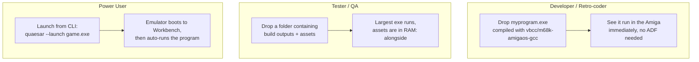
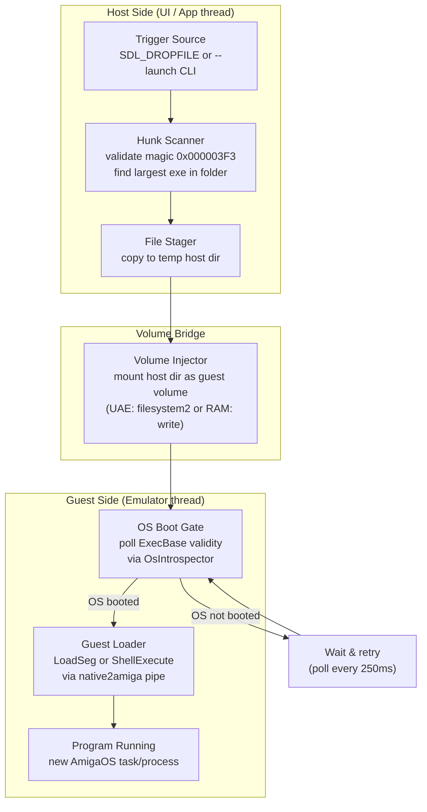
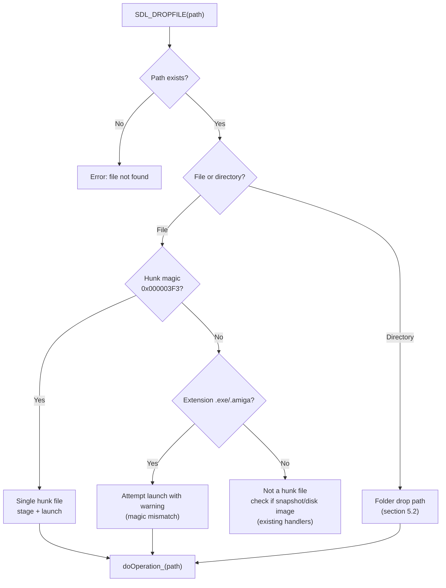
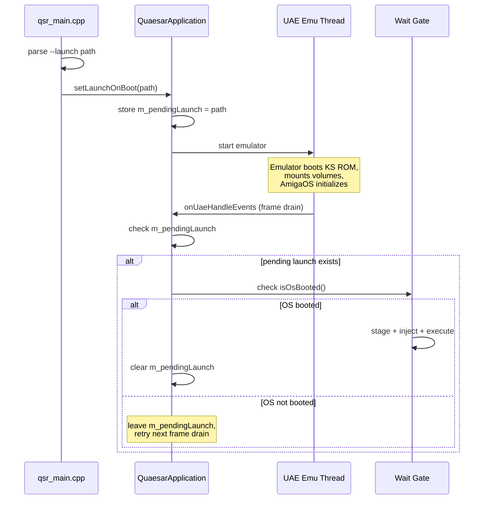
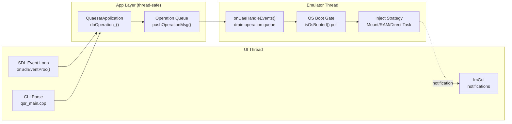
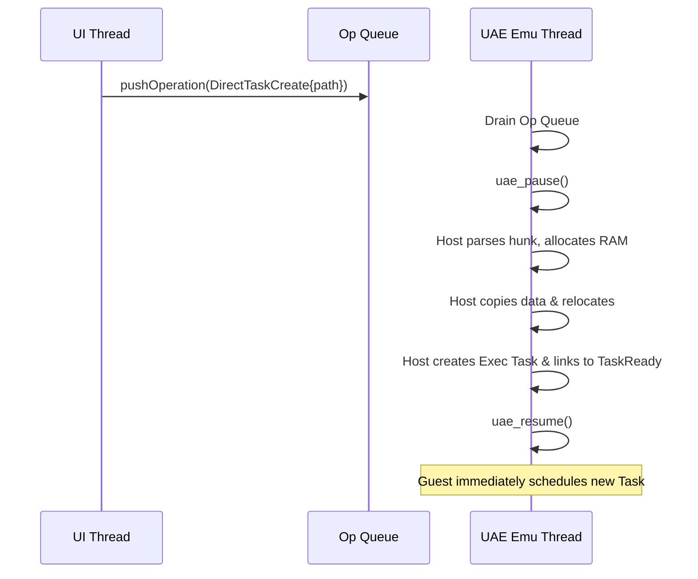
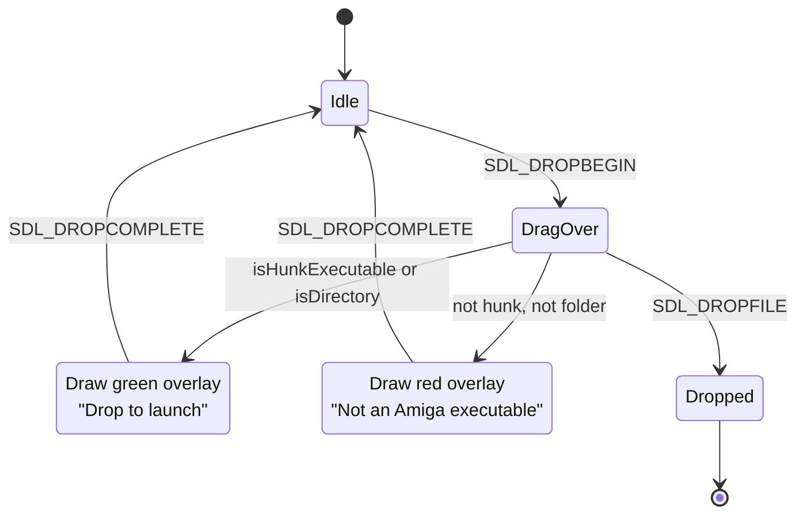
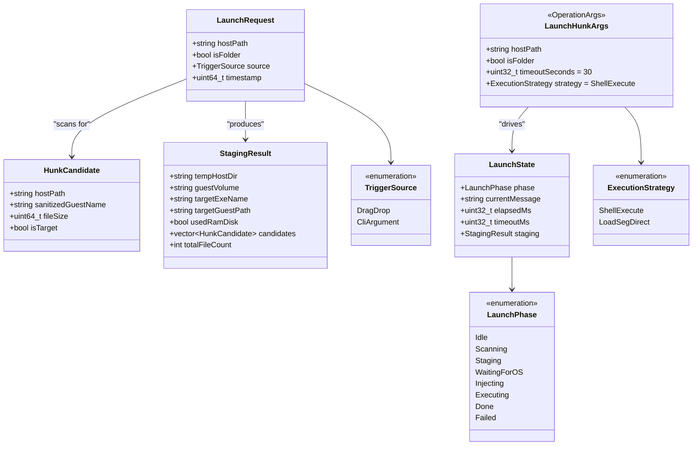
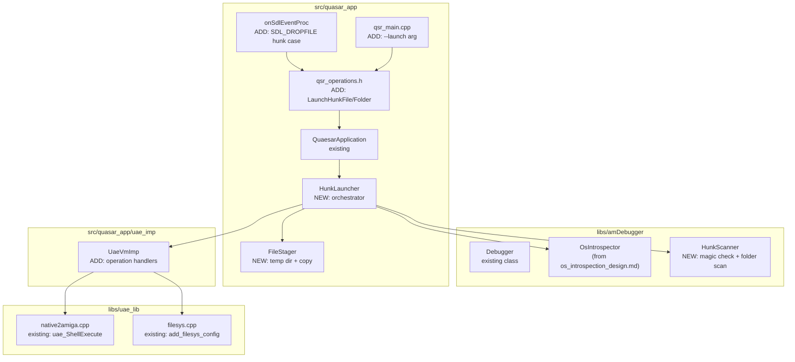
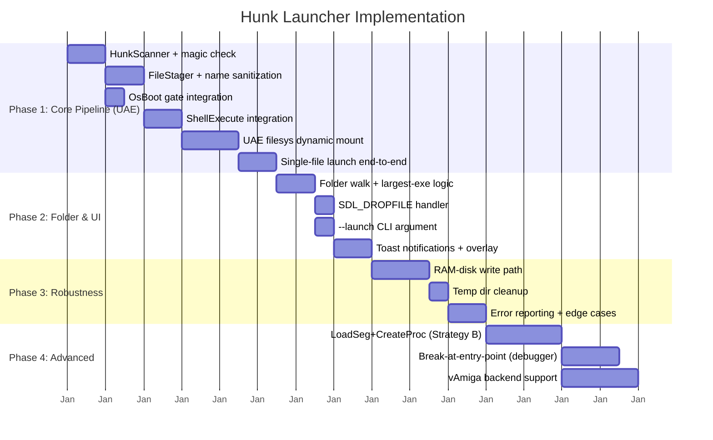

# Amiga Hunk Executable Launcher Design

Design for a feature that loads and runs native AmigaOS hunk executables (`.exe`, `.amiga` or extensionless Hunk files) from the host side — either at emulator startup (via a CLI argument) or at runtime (via drag-and-drop onto the main window).

The launcher bridges the host filesystem and the guest AmigaOS: it stages the executable (and any accompanying files) in a temporary host directory, injects that directory into the emulator as a mountable volume, waits for AmigaOS to boot, then calls the exec.library / dos.library loader to load and start the program.

When a **folder** is dropped, the launcher identifies the largest executable by file size and runs it, while keeping all sibling files accessible to the guest as well.

---

## Table of Contents

- [1. Amiga Hunk Format Background](#1-amiga-hunk-format-background)
- [2. Requirements & Use Cases](#2-requirements--use-cases)
- [3. Architecture Overview](#3-architecture-overview)
- [4. Executable Detection & Selection](#4-executable-detection--selection)
  - [4.1 Hunk Format Validation](#41-hunk-format-validation)
  - [4.2 Folder Drop: Largest-Executable Heuristic](#42-folder-drop-largest-executable-heuristic)
- [5. Host-Side File Stager Component](#5-host-side-file-stager-component)
  - [5.1 Staging Directory Layout & Sanitization](#51-staging-directory-layout--sanitization)
  - [5.2 Protection Bits & Stack Scripts](#52-protection-bits--stack-scripts)
- [6. Guest Injection & Execution Strategies](#6-guest-injection--execution-strategies)
  - [6.1 The "Pause, Inject, Unpause" Mechanic](#61-the-pause-inject-unpause-mechanic)
  - [6.2 Strategy 1: UAE Staging Mount + ShellExecute](#62-strategy-1-uae-staging-mount--shellexecute)
  - [6.3 Strategy 2: Direct RAM Disk Injection](#63-strategy-2-direct-ram-disk-injection)
  - [6.4 Strategy 3: Direct Task Creation (Host-Side Loader)](#64-strategy-3-direct-task-creation-host-side-loader)
- [7. OS Boot Detection & Wait Gate](#7-os-boot-detection--wait-gate)
- [8. Trigger Sources](#8-trigger-sources)
  - [8.1 Drag-and-Drop Integration](#81-drag-and-drop-integration)
  - [8.2 Startup Auto-Launch (CLI Argument)](#82-startup-auto-launch-cli-argument)
- [9. Threading, Pause & Resume Model](#9-threading-pause--resume-model)
- [10. UI Feedback & Error Reporting](#10-ui-feedback--error-reporting)
- [11. Edge Cases & Failure Modes](#11-edge-cases--failure-modes)
- [12. Data Model](#12-data-model)
- [13. Module Placement & VM Binding](#13-module-placement--vm-binding)
- [14. Implementation Phases](#14-implementation-phases)

---

## 1. Amiga Hunk Format Background

AmigaOS executables use the **Hunk** file format, the standard loadable-file format for AmigaOS since Kickstart 1.2. Unlike ELF or PE, a Hunk file is a sequential stream of typed blocks ("hunks") containing code, data, BSS, relocation tables, and symbol/debug information.

### Hunk Block Types

| Type ID | Constant | Meaning |
|---|---|---|
| `0x000003F3` | `HUNK_HEADER` | File header: resident library names, segment count, sizes |
| `0x000003E9` | `HUNK_CODE` | Executable code segment |
| `0x000003EA` | `HUNK_DATA` | Initialized data segment |
| `0x000003EB` | `HUNK_BSS` | Uninitialized data (size only, no contents) |
| `0x000003EC` | `HUNK_RELOC32` | 32-bit relocation entries |
| `0x000003ED` | `HUNK_RELOC16` | 16-bit relocations (rare) |
| `0x000003F0` | `HUNK_SYMBOL` | Symbol/debug info (can be stripped) |
| `0x000003F2` | `HUNK_END` | End of current hunk unit |
| `0x000003F7` | `HUNK_DEBUG` | Debug/Hunk-Debug info (line numbers, source maps) |
| `0x000003F1` | `HUNK_HEADER` (alt) | Extended header variant |

### File Structure

```
┌──────────────────────┐
│ HUNK_HEADER          │  magic=0x000003F3
│  Resident lib names  │  null-terminated list, 0 = end
│  Num hunks           │  e.g. 2 (code + data)
│  First/Last hunk     │  usually 0,0
│  Hunk sizes[]        │  in longs, bit 30 = HUNKF_ADVISORY
├──────────────────────┤
│ HUNK_CODE  (hunk 0)  │  size in longs + data
│ HUNK_RELOC32         │  relocation fixups
│ HUNK_SYMBOL          │  (optional, stripped)
│ HUNK_END             │
├──────────────────────┤
│ HUNK_DATA  (hunk 1)  │  size in longs + data
│ HUNK_END             │
├──────────────────────┤
│ HUNK_BSS   (hunk 2)  │  size only (no data in file)
│ HUNK_END             │
├──────────────────────┤
│ HUNK_END             │  end of file
└──────────────────────┘
```

### Loading on AmigaOS

AmigaOS loads hunk files via `dos.library/LoadSeg(name)`. This function:
1. Opens the file.
2. Parses `HUNK_HEADER`, counts segments.
3. Allocates memory for each segment.
4. Reads code/data, applies relocations (`HUNK_RELOC32`).
5. Builds a **segment list** (`BPTR`-linked chain) — the return value.
6. Returns a `BPTR` to the seglist (or `NULL` / `DOSFALSE` on failure).

The seglist is then executed via:
- **`dos.library/InternalLoadSeg()`** — lower-level loader if we want to provide our own memory allocator.
- **`dos.library/CreateProc(name, pri, seglist, stack)`** — creates an exec task from the seglist.
- **`dos.library/SystemTagList(command, tags)`** — high-level: runs a command line via the Shell, which itself calls LoadSeg internally.
- **`dos.library/RunCommand(seglist, stack, argptr, argsize)`** — runs the seglist in the current process.

> **Key insight:** We do NOT need to parse or understand the hunk format ourselves. We delegate to `dos.library/LoadSeg()` which already handles all hunk types, relocations, and segment-list construction. Our job is only to **get the file into guest-visible storage** and **call LoadSeg** (directly or via Shell).

### Magic Bytes

A valid hunk file always begins with `0x000003F3` in **big-endian** — i.e., the raw bytes are `00 00 03 F3`. This is the reliable detection signature.

---

## 2. Requirements & Use Cases

### 2.1 Functional Requirements

| # | Requirement |
|---|---|
| R1 | **Single-file drop:** Dragging a hunk executable onto the window must stage it, make it available to AmigaOS, and run it. |
| R2 | **Folder drop:** Dragging a folder must stage all files, identify the largest executable by file size, and run it — with sibling files accessible from the guest. |
| R3 | **Startup launch:** A CLI argument (`--launch <path>`) must queue the executable for launch after AmigaOS finishes booting. |
| R4 | **RAM-disk staging:** Staged files should be placed in the guest `RAM:` disk so they do not require a persistent host directory and are cleaned up automatically. |
| R5 | **OS-gated execution:** The loader must wait until AmigaOS is booted and `dos.library` is available before attempting to load or run. |
| R6 | **Non-AmigaOS safety:** If the guest is running a bare-metal game or non-AmigaOS environment, the feature must detect this, refuse to inject, and notify the user. |
| R7 | **Error reporting:** Load failures (corrupt hunk, out of memory, missing dos.library) must be surfaced to the user with a specific message. |

### 2.2 Use Cases



### 2.3 Non-Goals

- **NOT** a disk-image loader: ADF/HDF/ISO drops are handled separately (see [snapshot_design.md](snapshot_design.md) section 10.9).
- **NOT** an AREXX script executor or CLI-command runner.
- **NOT** a debugger launcher (no auto-breakpoint before entry point — that's a future enhancement).
- **NOT** a persistent Workbench installation mechanism (no `C:`/`L:`/`Devs:` writing to DH0:).

---

## 3. Architecture Overview

The launcher is a **pipeline** that flows from a host-side trigger (drop or CLI) through file staging, OS-boot detection, guest-side loading, and program start. Each stage is decoupled and can fail independently.



### Component Responsibilities

| Component | Location | Responsibility |
|---|---|---|
| **Trigger Handler** | `qsr_main_wnd_client_app.cpp` / `qsr_main.cpp` | Receive drop or CLI arg, kick off the pipeline |
| **Hunk Scanner** | New: `hunk_scanner.h/cpp` (in `amDebugger` or `quasar_app`) | Validate hunk magic bytes, select largest exe in folder |
| **File Stager** | New: `file_stager.h/cpp` | Copy files to a temporary host directory |
| **Volume Injector** | New operation in `qsr_operations.h` | Mount the temp dir as a guest volume (UAE `filesystem2`) or write to `RAM:` |
| **OS Boot Gate** | Reuses `OsIntrospector::isOsBooted()` from [os_introspection_design.md](os_introspection_design.md) | Wait for AmigaOS to be active before loading |
| **Guest Loader** | `uae_vm_imp.cpp` (UAE backend) | Call `LoadSeg` / `ShellExecute` via the `native2amiga` pipe on the emulator thread |

### Design Principles

1. **Delegate loading to the guest OS.** We never parse hunk relocations ourselves — `dos.library/LoadSeg()` already does this perfectly. Our job is file delivery + function call.
2. **No guest-side code injection.** We use the existing `native2amiga` trap pipe (case 5: `uae_ShellExecute`) or `CallLib()` traps to call guest functions. No Amiga-side helper program or resident library is needed.
3. **Backend-specific execution.** UAE and vAmiga differ in how guest functions are called. The shared layer defines the operation; each backend implements the actual `LoadSeg`/`Shell` call.
4. **OS safety first.** No execution is attempted until the OS is confirmed booted via ExecBase signature validation (section 7).

---

## 4. Executable Detection & Selection

### 4.1 Hunk Format Validation

Before staging or running anything, we must confirm that a file is a valid AmigaOS hunk executable. The check is simple and reliable: **read the first 4 bytes and compare to the big-endian magic `0x000003F3` (`HUNK_HEADER`)**.

```cpp
bool isHunkExecutable(const std::string& hostPath) {
    FILE* f = fopen(hostPath.c_str(), "rb");
    if (!f) return false;
    uint8_t magic[4];
    size_t n = fread(magic, 1, 4, f);
    fclose(f);
    if (n != 4) return false;
    // HUNK_HEADER = 0x000003F3, big-endian
    return magic[0] == 0x00 && magic[1] == 0x00 &&
           magic[2] == 0x03 && magic[3] == 0xF3;
}
```

> **ELF vs Hunk:** AmigaOS `ELF` executables start with `0x7F454C46` (`\x7FELF`). These are NOT loadable by `dos.library/LoadSeg` on classic m68k AmigaOS and should be rejected with a clear error message.

### 4.2 Folder Drop: Largest-Executable Heuristic

When a folder is dropped, we use a **size-based heuristic** to pick the target. AmigaOS hunk executables from C compilers are typically the largest compiled binary in a project folder. 

1. Walk folder recursively.
2. Filter for valid `0x000003F3` magic.
3. Sort by file size descending.
4. Target is the largest. Tie-break alphabetically.

---

## 5. Host-Side File Stager Component

Once the target executable is identified, the **File Stager** prepares the payload on the host side. It isolates the emulator's guest environment from raw host paths and ensures the files are Amiga-ready.

### 5.1 Staging Directory Layout & Sanitization

The stager creates a temporary directory on the host and copies files there with sanitized AmigaDOS-safe names.

```
$TMPDIR/quaesar_hunk_<timestamp>/
├── myprogram          ← the executable to run (largest if folder drop)
├── data.dat           ← sibling files (folder drop)
└── launch.bat         ← generated script to ensure proper stack size
```

**Name sanitization rules:**
- Characters invalid on AmigaDOS (`*`, `"`, `/`, `?`, `:`) are replaced with `_`.
- Long path components must be truncated safely, **preserving the file extension** to avoid breaking assets (e.g., `very_long_data_file..._1.dat`).

### 5.2 Protection Bits & Stack Scripts

The stager is responsible for ensuring the file is ready for execution on AmigaOS:
1. **Protection Bits:** It explicitly sets the host-side executable permissions (`chmod +x` or equivalent) on the staged target file. Without this, `dos.library` will refuse to execute it, throwing a "File is not executable" error.
2. **Stack Size Management:** The default Amiga shell stack (4096 bytes) is too small for modern compiled C programs, often leading to Guru Meditations. The stager generates a `launch.bat` script in the staging directory:
   ```bash
   Stack 32768
   QHUNK:myprogram
   ```
3. **Temp Icons (Optional):** Generates `.info` files if graphical Workbench launching is desired.

---

## 6. Guest Injection & Execution Strategies

Once files are staged on the host, we must inject them into the guest and start execution.

### 6.1 The "Pause, Inject, Unpause" Mechanic

Traditional methods rely on asynchronous guest cooperation (e.g. asking a running AmigaOS Shell to do work). However, because we control the emulator, we can utilize a much more powerful synchronous mechanic: **Pause the emulation, directly access/mutate guest memory, and then unpause.**

This unlocks injection vectors that require zero guest-side cooperative code and execute instantly. 

We support three primary strategies for injection and execution:

### 6.2 Strategy 1: UAE Staging Mount + ShellExecute

This is the traditional, OS-cooperative approach.
- **Injection:** Mount the staging folder as an AmigaOS volume (`QHUNK:`). To avoid hot-plugging limitations, `QHUNK:` is ideally mounted persistently at emulator boot, pointing to a static staging directory that the File Stager clears and populates.
- **Execution:** Push a command to the `native2amiga` pipe: `uae_ShellExecute("Execute QHUNK:launch.bat")`.
- **Pros:** Full OS integration (stdin/stdout hooked to `CON:`).
- **Cons:** Transient Shell process overhead; relies on AmigaOS being fully responsive.

### 6.3 Strategy 2: Direct RAM Disk Injection

Instead of mounting a host directory, files are injected directly into the AmigaOS `RAM:` drive.
- **Injection:** We pause the emulator. Using direct memory access (`vm->mem->setU8()`, etc.), we allocate guest RAM, construct AmigaOS `FileSysRes` and `ram-handler` nodes manually, link the file's data segments into the `RAM:` linked list, and update the handler's size counters.
- **Execution:** Once the file exists in `RAM:`, we can execute it via `CallLib(LoadSeg)` traps or `uae_ShellExecute("RAM:myprogram")`.
- **Pros:** Ultra-fast, no host directory cleanup, zero disk I/O simulated in the guest. Works across all backends (UAE/vAmiga).
- **Cons:** Requires deep knowledge of the `ram-handler` internal data structures to manually construct valid file entries.

### 6.4 Strategy 3: Direct Task Creation (Host-Side Loader)

This is the ultimate, fastest, and most invasive approach, completely bypassing `dos.library/LoadSeg` and the Shell.
- **Injection & Loading:** 
  1. Pause the emulator.
  2. The host-side File Stager parses the Hunk format directly.
  3. The host calls `uae_AllocMem()` to grab guest memory for the code/data/BSS segments.
  4. The host copies the hunks into guest RAM and applies all 32-bit/16-bit relocations itself.
- **Execution:**
  1. The host constructs an AmigaOS Exec `Process` or `Task` structure in guest memory.
  2. Sets the initial registers (PC to the relocated code entry point, SP to a newly allocated guest stack).
  3. Inserts the Task into the `ExecBase->TaskReady` queue.
  4. Unpause the emulator.
- **Pros:** Instantaneous execution. No dos.library parsing. Gives the host 100% control over the seglist, making it trivial to insert breakpoints right at the entry point for debugging.
- **Cons:** Host must implement a complete Hunk relocator and AmigaOS Task constructor. Lacks default console streams (`pr_CIS`/`pr_COS`) unless manually mapped to a `CON:` window.

**Recommendation:** Strategy 1 is the easiest path for general usage. Strategy 3 is the ultimate goal for the debugger, allowing instant breakpoint-at-entry capabilities.

---

## 7. OS Boot Detection & Wait Gate

Before calling `LoadSeg` or `ShellExecute`, we must confirm that AmigaOS is booted and `dos.library` is available. Calling guest functions before the OS is initialized will crash the emulator or corrupt guest state.

### 7.1 Detection Method

The detection reuses the **`OsIntrospector`** class from [os_introspection_design.md](os_introspection_design.md) section 1.2:

```cpp
bool isOsBooted(IVm::VM* vm) {
    // Read ExecBase pointer from address 4
    uint32_t execBase = vm->mem->getU32(0x00000004);
    if (execBase == 0) return false;

    // Validate ExecBase is in a plausible region
    if (!(execBase >= 0x00001000 && execBase <= 0x01000000))
        return false;

    // Signature check: ln_Type must be NT_LIBRARY (3)
    uint16_t lnType = vm->mem->getU16(execBase + 8); // lib_Node.ln_Type offset
    if (lnType != 3) return false;

    // Strong check: ln_Name must point to "exec.library"
    uint32_t namePtr = vm->mem->getU32(execBase + 10); // ln_Name offset
    if (namePtr == 0) return false;
    std::string name = vmReadCString(vm, namePtr, 16);
    if (name != "exec.library") return false;

    return true;
}
```

This is identical to `OsIntrospector::isOsBooted()` — we don't need to duplicate it. The launcher depends on the introspection layer being available.

### 7.2 Wait Gate State Machine

The wait gate is a **polling state machine** that runs on the emulator thread (via a deferred operation). It checks `isOsBooted()` periodically and only proceeds to execution once the OS is ready.

```mermaid
stateDiagram-v2
    [*] --> Idle
    Idle --> Waiting : launch requested

    Waiting : Poll isOsBooted() every 250ms
    Waiting --> Waiting : OS not booted yet
    Waiting --> Injecting : OS booted

    Injecting : Mount QHUNK: / write RAM:
    Injecting --> Executing : injection OK
    Injecting --> Failed : injection error

    Executing : ShellExecute or LoadSeg+CreateProc
    Executing --> Done : success
    Executing --> Failed : load error

    Done --> [*]
    Failed --> [*]

    Waiting --> Timeout : 30s elapsed, OS never booted
    Timeout --> [*]
```

**Timeout:** If the OS does not boot within 30 seconds (configurable), the launch is abandoned with a timeout error. This covers cases like a game floppy in DF0: that takes over the machine before AmigaOS starts, or a corrupt Kickstart ROM.

**Polling interval:** 250ms is chosen as a balance — fast enough to feel responsive (the user drops a file and sees it run within ~1 frame of the OS being ready), slow enough to not waste CPU reading guest memory.

### 7.3 Startup vs Runtime Difference

| Scenario | OS state at trigger time | Gate behavior |
|---|---|---|
| **Runtime drop** (OS already booted) | `isOsBooted()` returns true immediately | Skip to injection/execution within one poll cycle (~250ms) |
| **Startup CLI** (`--launch`) | OS is still booting | Poll every 250ms until booted, then execute |
| **Bare-metal game running** | `isOsBooted()` returns false (no AmigaOS) | Poll until timeout, then show "Non-AmigaOS environment — cannot launch" |

> **Important:** For the startup CLI case, the launch operation must be queued **before** the emulator starts running (or at least before the OS boots). The operation sits in the queue and is re-checked on each `onUaeHandleEvents()` drain cycle. The polling happens within the operation handler itself — it re-queues itself if the OS is not ready yet, rather than blocking the emulator thread.

---

## 8. Trigger Sources

### 8.1 Drag-and-Drop Integration

The main window's SDL event handler ([`QsrMainClientWndApp::onSdlEventProc()`](file:///Volumes/TB4-4Tb/Projects/emulators/github/quaesar-ng/src/quasar_app/qsr_main_wnd_client_app.cpp)) already needs `SDL_DROPFILE` handling for snapshots (see [snapshot_design.md](snapshot_design.md) section 10). The hunk launcher extends this to handle `.exe`, `.amiga`, extensionless files, and folders.

**Drop type classification:**



**Event handler code pattern** (extends the snapshot drop handler):

```cpp
case SDL_DROPFILE: {
    if (event.drop.windowID != uaeWndId)
        break;

    char* droppedPath = event.drop.file;
    std::string path(droppedPath);
    SDL_free(droppedPath);

    // 1. Check if this is a snapshot (existing handler)
    if (isSnapshotFile(path)) {
        // ... existing snapshot validation + load path ...
        break;
    }

    // 2. Check if this is a disk image (existing handler)
    if (isDiskImage(path)) {
        // ... existing ADF/HDF/ISO insertion path ...
        break;
    }

    // 3. Check if this is a hunk executable or folder
    if (qd::fs::isDirectory(path)) {
        // Folder drop → largest-exe heuristic
        doOperation_<qsr::operations::LaunchHunkFolder>(path);
        return qd::EFlow::STOP;
    }

    if (isHunkExecutable(path)) {
        // Single file drop
        doOperation_<qsr::operations::LaunchHunkFile>(path);
        return qd::EFlow::STOP;
    }

    // 4. Unknown file type
    m_pendingError = "Unrecognized file type: " + path;
    return qd::EFlow::STOP;
} break;
```

> **Note:** SDL2's `SDL_DROPFILE` provides a single file path. Folders are handled by the host OS — on macOS, dragging a folder from Finder generates a `SDL_DROPFILE` with the folder path. On some platforms, folder drops may require `SDL_DROPTEXT` or platform-specific handling. The handler checks `qd::fs::isDirectory()` to distinguish.

### 8.2 Startup Auto-Launch (CLI Argument)

A new CLI argument `--launch <path>` queues an executable (or folder) for auto-launch after OS boot.

**Usage examples:**

```bash
# Launch a single executable after Workbench boots
quaesar -k kickstart.rom -s hardfile2=rw,DH0:OS-3.2.3.vhd,0,0,0,512,0,,ide0 --launch myprogram

# Launch the largest exe in a folder
quaesar -k kickstart.rom --launch /path/to/project/folder/

# Combined: boot OS, wait for Workbench, auto-run the program
quaesar -f os23.adf --launch /home/dev/builds/game.exe
```

**CLI parsing** (extends the existing CLI11 setup in `qsr_main.cpp`):

```cpp
// In qsr_main.cpp or qsr_config.h
std::string g_launchPath;
cli.add_option("--launch", g_launchPath,
    "Amiga hunk executable or folder to auto-launch after OS boot")
    ->check(CLI::ExistingPath);
```

**Startup flow:**



The pending launch is checked on **every frame drain** (each `onUaeHandleEvents()` call). Once the OS boots, the launch fires immediately — no artificial delay. If the OS was already booted (e.g., launching into a running emulator via a second window or IPC), the launch fires on the next frame drain.

**Cleanup on reset:** If the emulator is reset (hard reset, snapshot restore) while a launch is pending, the pending launch is cleared — the user must re-trigger it. This prevents stale launches after a state change that might invalidate the staged files.

---

## 9. Threading, Pause & Resume Model

The hunk launcher spans two threads: the **UI thread** (where SDL events arrive and operations are dispatched) and the **emulator thread** (where guest memory and AmigaOS state live). 

### 9.1 Thread Responsibilities



### 9.2 The "Pause -> Inject -> Unpause" Flow

As introduced in Strategy 2 and 3, manipulating guest state directly (writing to RAM, constructing OS structures) must happen safely. The safest and most robust way to perform complex guest manipulation is:

1. **Pause Emulation:** Halt the 68k execution loop. This guarantees guest memory and OS structures (like `TaskReady` or `ram-handler` lists) will not mutate while we work.
2. **Inject:** Read/Write guest memory directly from the emulator thread's operation handler. Perform allocations, relocations, and struct linkage.
3. **Unpause Emulation:** Resume the 68k loop. The guest OS immediately picks up the new state (e.g., executing the newly inserted Task).



**Exception — Strategy 1 (ShellExecute):** If using `uae_ShellExecute()`, pausing is NOT required. The shell execute pipe (`native2amiga`) is designed to be written to concurrently, and the UAE core processes it safely during an `EXTER` interrupt.

### 9.3 Resume / Continue After Launch

If the emulator **was paused** by the user (e.g., stepping through code in the debugger), the UI should automatically unpause or ask the user to resume so the new program can execute.

---

## 10. UI Feedback & Error Reporting

The launcher must communicate its state to the user at every stage. Since the pipeline is asynchronous (staging → injection → OS gate → execution), the feedback must reflect the current phase.

### 10.1 Notification States

| State | Trigger | UI Element | Message |
|---|---|---|---|
| **Scanning** | Drop received or CLI parsed | Toast notification (bottom of screen) | "Scanning for Amiga executables..." |
| **Staging** | Valid hunk(s) found | Toast update | "Staging N files to QHUNK:..." |
| **Waiting for OS** | Staged, OS not booted | Toast update | "Waiting for AmigaOS to boot..." |
| **Launching** | OS booted, executing | Toast update | "Launching MYPROGRAM..." |
| **Success** | ShellExecute returned | Toast (auto-dismiss after 3s) | "Launched MYPROGRAM (largest of 3 executables)" |
| **Error** | Any failure | Modal dialog | See error table below |

### 10.2 Error Reporting Table

| Error Condition | Source | Message to User |
|---|---|---|
| File not found | Hunk scanner | "File 'X' not found" |
| Not a hunk file (magic mismatch) | Hunk scanner | "'X' is not a valid AmigaOS executable (bad magic bytes)" |
| ELF detected | Hunk scanner | "'X' is an ELF executable. m68k AmigaOS requires Hunk format. Use 'm68k-amigaos-objcopy -O amiga' to convert." |
| No executables in folder | Folder scan | "No AmigaOS executables found in 'X/'" |
| OS boot timeout | Wait gate | "AmigaOS did not boot within 30 seconds. Is a Kickstart ROM configured? Is DF0: empty or bootable?" |
| Non-AmigaOS environment | Wait gate | "Cannot launch: AmigaOS is not running (bare-metal game or unknown environment detected)" |
| Volume mount failure | UAE filesys | "Failed to mount QHUNK: volume. Check host path permissions." |
| RAM: write failure | Trap calls | "Failed to write file to RAM: disk. Out of memory?" |
| LoadSeg failure | dos.library | "LoadSeg failed: [IoErr code N]. The executable may be corrupt or require libraries not installed." |
| dos.library not available | Wait gate | "dos.library not found. Is this Kickstart 1.2+?" |
| Emulator paused | Shell pipe | "Program queued, but emulator is paused. Resume to start." |

### 10.3 Visual Drop Feedback

During drag-over (before drop), the window should indicate whether the dragged file is droppable:



SDL provides `SDL_DROPBEGIN` and `SDL_DROPCOMPLETE` events bracketing each drag operation. The `SDL_DROPFILE` itself carries the path. For per-frame overlay rendering during drag, we track a `m_isDragOver` flag set by `SDL_DROPBEGIN` and cleared by `SDL_DROPCOMPLETE`.

> **Implementation note:** SDL's drag-enter feedback requires `SDL_EventState(SDL_DROPBEGIN, SDL_ENABLE)` to be called during initialization. The overlay is drawn as an ImGui fullscreen modal with `ImGuiCol_ModalWindowDimBg` set to a semi-transparent green or red.

### 10.4 OSD Toast Pattern

The existing project uses ImGui for all UI. A lightweight **toast notification** system (non-blocking, auto-dismiss) should be used for progress messages. The toast is rendered in `drawContentImp()` of the main window client:

```cpp
// In QsrMainClientWndApp::drawContentImp()
if (m_toastVisible && m_toastTimer > 0) {
    ImGui::SetNextWindowPos(ImVec2(width / 2 - 150, height - 60));
    ImGui::Begin("##toast", nullptr,
        ImGuiWindowFlags_NoTitleBar | ImGuiWindowFlags_NoResize |
        ImGuiWindowFlags_NoMove | ImGuiWindowFlags_NoScrollbar);
    ImGui::TextUnformatted(m_toastMessage.c_str());
    ImGui::End();
    m_toastTimer -= io.DeltaTime;
}
```

The toast is updated from the UI thread when it receives notifications from the emulator thread (via the existing `MsgQueue` or callback mechanism).

---

## 11. Edge Cases & Failure Modes

### 11.1 Program requires libraries not installed

Many Amiga programs depend on `intuition.library`, `graphics.library`, `mathieeedoubbas.library`, `reqtools.library`, `MUI`, etc. If the program calls `OpenLibrary()` for a library not in `LIBS:` (Kickstart ROM or DH0:Libs), it will fail.

**Our handling:** This is a **guest-side runtime failure** — `LoadSeg` succeeds, but the program immediately exits when it fails to open a required library. The Shell will print a DOS error. We detect this only if the program exits within a few seconds of launch. No special host-side handling is needed; the error message appears in the Amiga console window (for Strategy A).

### 11.2 Program takes over the machine (bare-metal)

Some Amiga programs (especially games and demos) immediately disable the OS, take over the display, and run their own event loop. After `uae_ShellExecute()`, the OS may be killed by the program.

**Impact on launcher:** No impact. The `uae_ShellExecute` call has already returned; the Shell process and the launched program are now purely guest-side. The `native2amiga` pipe remains functional (it's interrupt-driven, not OS-dependent), but further shell commands would need to re-initialize the OS — which won't happen since the OS is gone.

**Impact on introspection:** `OsIntrospector::isOsBooted()` will return false after the program kills the OS. This is expected behavior — the debugger panels will show "Non-AmigaOS environment detected."

### 11.3 Multiple drops in quick succession

If the user drops multiple files/folders rapidly, each drop generates a separate `SDL_DROPFILE` event and operation. The operations queue sequentially.

**Behavior:**
- Each launch creates its own staging directory (unique timestamp suffix).
- Each launch calls `uae_ShellExecute()` independently — multiple programs run concurrently as separate AmigaOS processes.
- The `QHUNK:` volume is remounted for each launch (the previous mount is unmounted or the volume is updated). This could cause file-access races. **Mitigation:** Use a unique volume name per drop (`QHUNK1:`, `QHUNK2:`, ...) or always write to `RAM:` for the second+ drops.

### 11.4 File with special characters in name

AmigaDOS filenames have strict limitations (max 30 chars, no wildcards, case-insensitive). Host filenames may contain Unicode, spaces, or invalid characters.

**Mitigation:** The stager sanitizes all filenames (section 4.1). Unicode characters are transliterated to ASCII (e.g., `é` → `e`) or replaced with `_`. Long names are truncated to 30 characters with a uniqueness suffix if collision occurs.

### 11.5 Very large executables (>8MB)

If a single executable exceeds available guest RAM, `LoadSeg` will fail with an out-of-memory error.

**Detection:** Before staging, check if `file_size > available_fast_ram`. If so, warn the user and abort.

**For host-dir mount:** The file is visible but `LoadSeg` still needs to allocate guest RAM for the segment. No workaround — the program genuinely won't fit.

### 11.6 Dropping a file while OS is booting (startup race)

The user drops a file before the OS has booted. This is the normal case for `--launch` CLI usage.

**Handling:** The wait gate (section 7) polls `isOsBooted()` every 250ms. The launch proceeds once the OS is ready. The staging and hunk validation happen immediately on the UI thread (before queuing), so the user sees "Scanning..." → "Staging..." → "Waiting for OS..." → "Launching...".

### 11.7 Snapshot restore while a program is running

If the user loads a snapshot while a previously-launched program is running, the snapshot restore replaces the entire guest state. The running program is gone; the staged files in `RAM:` are gone; the `QHUNK:` volume mount is gone.

**Handling:** No explicit cleanup needed — the snapshot replaces everything. If a new launch is triggered after restore, it starts fresh. The temp host directory for the previous staging is cleaned up on application exit (or on next reset).

### 11.8 Temp directory cleanup

Staging creates host-side temp directories (`quaesar_hunk_<timestamp>/`). These must be cleaned up:

| Trigger | Action |
|---|---|
| Application exit | Delete all `quaesar_hunk_*` temp directories |
| Emulator hard reset | Delete current staging dir (files no longer needed) |
| New drop (before staging) | Optionally clean previous staging dir if still present |

**Failure to clean:** If the application crashes, temp dirs may remain. A startup cleanup pass can scan `$TMPDIR` for stale `quaesar_hunk_*` directories older than 24 hours and remove them.

---

## 12. Data Model



### Operation Declarations

Following the existing pattern in [qsr_operations.h](file:///Volumes/TB4-4Tb/Projects/emulators/github/quaesar-ng/src/quasar_app/qsr_operations.h):

```cpp
// qsr_operations.h — new operations

struct LaunchHunkFile : public amD::operation::OperationArgs {
    DECLARE_OPERATION_1(qsr::operations::LaunchHunkFile);
    qtd::string hostPath;        // host path to the executable

    static void setup(qd::operation::OpDesc& d) {
        d.m_name = "Launch Hunk Executable";
    }
};

struct LaunchHunkFolder : public amD::operation::OperationArgs {
    DECLARE_OPERATION_1(qsr::operations::LaunchHunkFolder);
    qtd::string hostPath;        // host path to the folder

    static void setup(qd::operation::OpDesc& d) {
        d.m_name = "Launch Hunk Folder";
    }
};
```

These operations carry the host path to the emulator thread, where the full pipeline (scan → stage → wait → inject → execute) runs.

---

## 13. Module Placement & VM Binding

### 13.1 Design Constraints

Following the same patterns documented in [os_introspection_design.md](os_introspection_design.md) "Module Placement & VM Binding":

1. **The hunk scanner** (magic check, folder walk) is pure host-side logic — no VM dependency. It can live anywhere.
2. **The file stager** (temp dir management, name sanitization) is also pure host-side.
3. **The execution layer** (ShellExecute, LoadSeg, RAM: write) is backend-specific — UAE uses `native2amiga` pipe and `CallLib` traps; vAmiga has its own API.
4. **The OS boot gate** reuses `OsIntrospector` which lives in `libs/amDebugger`.

### 13.2 File Layout

```
libs/amDebugger/src/amDebugger/
├── os/
│   ├── hunk_scanner.h           ← NEW: magic check + folder scan (host-only)
│   ├── hunk_scanner.cpp
│   └── os_introspector.h         ← existing (from os_introspection_design.md)

src/quasar_app/
├── hunk/
│   ├── hunk_launcher.h           ← NEW: orchestrates scan → stage → gate → execute
│   ├── hunk_launcher.cpp
│   ├── file_stager.h             ← NEW: temp dir + name sanitization
│   └── file_stager.cpp
├── qsr_operations.h              ← ADD: LaunchHunkFile, LaunchHunkFolder operations
├── qsr_main_wnd_client_app.cpp   ← ADD: SDL_DROPFILE handler for hunk files
├── qsr_main.cpp                  ← ADD: --launch CLI argument
└── uae_imp/
    └── uae_vm_imp.cpp            ← ADD: operation handler (ShellExecute + filesys mount)
```

### 13.3 Why hunk_scanner in amDebugger

The hunk scanner depends on `OsIntrospector::isOsBooted()` for the wait gate, and the scanner needs to be accessible from the debugger if we later add "break at entry point" (Strategy B). Placing it alongside `os_introspector` in `libs/amDebugger/os/` keeps the OS-aware tooling together and avoids coupling to UAE internals.

### 13.4 Why file_stager in quasar_app

The file stager creates host-side temp directories and copies files. This is application-layer logic (filesystem interaction, temp management), not debugger logic. It belongs in `src/quasar_app/hunk/`.

### 13.5 Binding Architecture



### 13.6 UAE Backend Handler (uae_vm_imp.cpp)

The operation handler in `applyOperationMsgProcImp()` runs on the emulator thread:

```cpp
// uae_vm_imp.cpp — in applyOperationMsgProcImp()

} else if (args->cast_<qsr::operations::LaunchHunkFile>() ||
           args->cast_<qsr::operations::LaunchHunkFolder>()) {
    r = true;
    bool isFolder = args->cast_<qsr::operations::LaunchHunkFolder>() != nullptr;
    auto* op = isFolder
        ? (qsr::operations::LaunchHunkFolder*)args->data()
        : (qsr::operations::LaunchHunkFile*)args->data();
    std::string hostPath = op->hostPath.c_str();

    // 1. Scan & stage (host-side, safe on this thread)
    HunkLauncher launcher(m_pVm, getDebugger()->getOsIntro());
    auto result = launcher.launch(hostPath, isFolder);

    if (!result.success) {
        // Send error notification to UI thread
        postErrorToUi(result.errorMessage);
    }
}
```

### 13.7 vAmiga Backend

vAmiga does not have a `native2amiga` pipe equivalent. The vAmiga C++ API provides direct function-call mechanisms:

```cpp
// va_vm_imp.cpp — future implementation
} else if (args->cast_<qsr::operations::LaunchHunkFile>()) {
    // vAmiga has no ShellExecute equivalent.
    // Option 1: Write file to RAM: via vAmiga's memPut + API calls
    // Option 2: Use vAmiga's osDebugger component (if it exposes a LoadSeg API)
    // For Phase 1, vAmiga backend shows: "Hunk launch not yet supported on vAmiga"
}
```

vAmiga support is **Phase 2** — the UAE backend is the priority since it has the `native2amiga` infrastructure.

---

## 14. Implementation Phases



### Phase Summary

| Phase | Scope | Key Deliverable |
|---|---|---|
| **1: Core Pipeline** | HunkScanner, FileStager, OsBoot gate, ShellExecute, UAE filesys mount | Single executable can be launched end-to-end |
| **2: Folder & UI** | Folder heuristic, drag-drop, CLI arg, notifications | User can drop a folder/file or use `--launch` |
| **3: Robustness** | RAM-disk path, cleanup, error handling, edge cases | Production-quality error reporting |
| **4: Advanced** | Strategy B (LoadSeg), break-at-entry, vAmiga | Debugger integration + cross-backend |

### Key Implementation Files Touched

| File | Phase | Change |
|---|---|---|
| `libs/amDebugger/src/amDebugger/os/hunk_scanner.h/cpp` | 1 | NEW — hunk magic check, folder scan |
| `src/quasar_app/hunk/file_stager.h/cpp` | 1 | NEW — temp dir, name sanitization, copy |
| `src/quasar_app/hunk/hunk_launcher.h/cpp` | 1 | NEW — orchestrator (gate + inject + execute) |
| `src/quasar_app/qsr_operations.h` | 1 | ADD — `LaunchHunkFile`, `LaunchHunkFolder` ops |
| `src/quasar_app/uae_imp/uae_vm_imp.cpp` | 1 | ADD — operation handler calling `uae_ShellExecute` |
| `src/quasar_app/qsr_main_wnd_client_app.cpp` | 2 | ADD — `SDL_DROPFILE` case for hunk files |
| `src/quasar_app/qsr_main.cpp` | 2 | ADD — `--launch` CLI argument |
| `src/quasar_app/qsr_config.h` | 2 | ADD — launch config storage |

### Dependencies on Other Design Documents

| Document | Dependency |
|---|---|
| [os_introspection_design.md](os_introspection_design.md) | **Hard dependency** — provides `OsIntrospector::isOsBooted()` used by the wait gate. Must be implemented first (or at minimum, the ExecBase detection portion). |
| [snapshot_design.md](snapshot_design.md) | **Soft dependency** — both add `SDL_DROPFILE` handlers to the same event loop. Must coordinate the drop-type classification (snapshots vs hunk files vs disk images). |
| [bsdsocket_integration_plan.md](bsdsocket_integration_plan.md) | **No dependency** — independent feature, but shares the pattern of enabling UAE core functionality via config flags. |

---

> **Summary:** The hunk launcher is a pipeline that bridges host files to guest AmigaOS execution. It reuses three existing pieces of infrastructure: (1) UAE's `native2amiga` pipe for calling guest functions, (2) UAE's `filesys` for volume mounting, and (3) the `OsIntrospector` from the introspection design for OS-booted detection. The primary execution strategy (ShellExecute) requires minimal new trap code. Folder drops use a size-based heuristic to pick the target executable. All files are staged to a temporary host directory and mounted as `QHUNK:`, with `RAM:` as a fast-path alternative for small files.
