# AmigaOS Introspection & Debugger Panels Design

Design for two debugger features built on live memory reads via the VM interface:

1. **OS Modules Panel** — Kickstart version detection, ROM tag enumeration, exec.library + all AmigaOS library discovery with load/base addresses and LVO offsets.
2. **External Task Manager** — All AmigaOS tasks/processes, their loaded modules, memory allocations, and file handlers.

Both panels read target memory through the existing `IVm` interface (zero guest-side code injection — fully external introspection).

---

## Table of Contents

- [Part 1: OS Modules Panel](#part-1-os-modules-panel)
  - [1.1 AmigaOS Memory Layout](#11-amigaos-memory-layout)
  - [1.2 Kickstart ROM Detection](#12-kickstart-rom-detection)
  - [1.3 ROM Tag Scanning](#13-rom-tag-scanning)
  - [1.4 ExecBase & Library Discovery](#14-execbase--library-discovery)
  - [1.5 Library Vector Offsets (LVO) & FD Tables](#15-library-vector-offsets-lvo--fd-tables)
  - [1.6 Data Model](#16-data-model)
  - [1.7 Debugger Integration](#17-debugger-integration)
  - [1.8 UI Layout](#18-ui-layout)
  - [1.9 Signature Analysis (Optional)](#19-signature-analysis-optional)
- [Part 2: External Task Manager](#part-2-external-task-manager)
  - [2.1 Task vs Process](#21-task-vs-process)
  - [2.2 Task Discovery](#22-task-discovery)
  - [2.3 Per-Process Module Tracking](#23-per-process-module-tracking)
  - [2.4 Memory Allocation Tracking](#24-memory-allocation-tracking)
  - [2.5 File Handler Tracking](#25-file-handler-tracking)
  - [2.6 Data Model](#26-data-model)
  - [2.7 Debugger Integration](#27-debugger-integration)
  - [2.8 UI Layout](#28-ui-layout)
- [Cross-Cutting Concerns](#cross-cutting-concerns)
  - [Reusable SignatureManager](#reusable-signaturemanager)
- [Implementation Phases](#implementation-phases)

---

# Part 1: OS Modules Panel

## 1.1 AmigaOS Memory Layout

The AmigaOS address space has a predictable high-level structure. Understanding it is essential for external introspection.

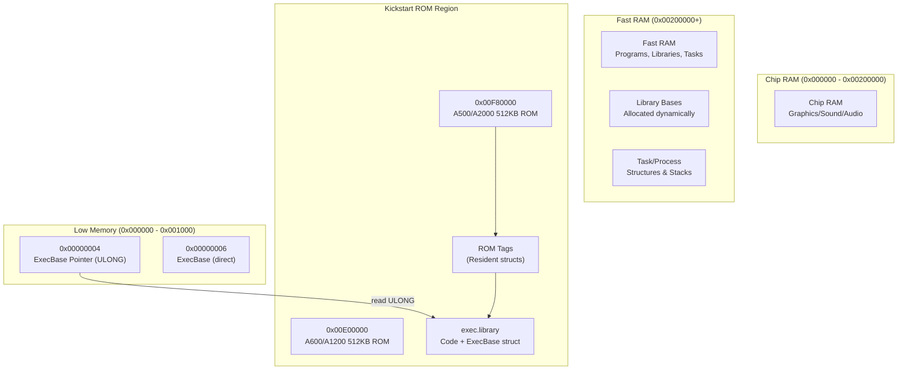
```mermaid
graph TB
    subgraph "Low Memory (0x000000 - 0x001000)"
        V4["0x00000004<br/>ExecBase Pointer (ULONG)"]
        V6["0x00000006<br/>ExecBase (direct)"]
    end

    subgraph "Chip RAM (0x000000 - 0x00200000)"
        CHIP["Chip RAM<br/>Graphics/Sound/Audio"]
    end

    subgraph "Fast RAM (0x00200000+)"
        FAST["Fast RAM<br/>Programs, Libraries, Tasks"]
        LIBS["Library Bases<br/>Allocated dynamically"]
        TASKS["Task/Process<br/>Structures & Stacks"]
    end

    subgraph "Kickstart ROM Region"
        ROM1["0x00F80000<br/>A500/A2000 512KB ROM"]
        ROM2["0x00E00000<br/>A600/A1200 512KB ROM"]
        ROMTAGS["ROM Tags<br/>(Resident structs)"]
        EXEC["exec.library<br/>Code + ExecBase struct"]
    end

    V4 -->|"read ULONG"| EXEC
    ROM1 --> ROMTAGS
    ROMTAGS --> EXEC
```

**Key addresses:**
| Address | Contents | Notes |
|---|---|---|
| `0x00000004` | `ULONG ExecBasePtr` | Canonical way to find exec.library base. `*(ULONG*)4` |
| `0x00F80000` | Kickstart ROM start (512KB) | A500/A1000/A2000, KS 1.x-3.x |
| `0x00E00000` | Kickstart ROM start (512KB) | A600/A1200/A4000, KS 3.x |
| ExecBase + offsets | Library/device/task lists | Struct offsets vary by KS version |

## 1.2 Kickstart ROM Detection

### Locating the ROM and Validating the OS

The emulator already knows the ROM path (from `-k` argument). For runtime introspection, we must first determine if AmigaOS is actually running (as opposed to a bare-metal floppy game, Linux, or NetBSD). 

> [!IMPORTANT]
> **Alien OS / Bare Metal Detection**: A trackloader game or alternative OS may overwrite RAM, including address 4, or leave it pointing to a stale ExecBase while killing the OS lists. We must strictly validate the `ExecBase` signature.

The reliable method to detect and validate AmigaOS:

1. Read the `ULONG` at address `0x00000004` → this is `ExecBase`.
2. Verify `ExecBase` falls within a plausible memory region (e.g., `[0x00E00000, 0x01000000]`, `[0x00F80000, 0x01000000]`, or valid Fast RAM if ROM is mapped).
3. **Signature Check**: Read `ExecBase->lib_Node.ln_Type`. It MUST equal `NT_LIBRARY` (3).
4. **Strong Signature Check**: Read the string pointed to by `ExecBase->lib_Node.ln_Name`. It MUST exactly match `"exec.library"`.
5. If all checks pass, AmigaOS is active. The ROM base is `ExecBase` aligned down to a known boundary (512KB: `& 0xFFF80000`).

If the signature checks fail, the debugger should display "Non-AmigaOS environment detected" and disable introspection.

### Kickstart Version

Once we have `ExecBase`, the Kickstart version is at a fixed offset in the `ExecBase` structure:

```c
struct ExecBase {      // simplified
    // ... header ...
    UWORD LibNode.lib_Version;   // e.g. 45 = KS 3.1, 47 = KS 3.2, 51 = KS 3.2.3
    UWORD LibNode.lib_Revision;
    APTR  LibNode.lib_IdString;  // e.g. "kickstart 3.2.3 (2024)"
};
```

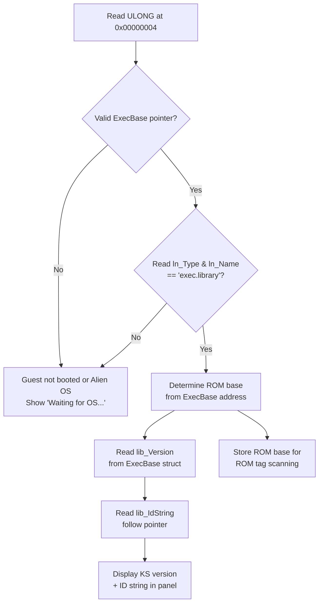
```mermaid
flowchart TD
    A["Read ULONG at 0x00000004"] --> B{Valid ExecBase pointer?}
    B -->|No| C["Guest not booted or Alien OS<br/>Show 'Waiting for OS...'"]
    B -->|Yes| SIGNATURE{"Read ln_Type & ln_Name<br/>== 'exec.library'?"}
    SIGNATURE -->|No| C
    SIGNATURE -->|Yes| D["Determine ROM base<br/>from ExecBase address"]
    D --> E["Read lib_Version<br/>from ExecBase struct"]
    E --> F["Read lib_IdString<br/>follow pointer"]
    F --> G["Display KS version<br/>+ ID string in panel"]
    D --> H["Store ROM base for<br/>ROM tag scanning"]
```

## 1.3 ROM Tag Scanning

ROM tags (`struct Resident`) are the AmigaOS module registration mechanism. Every library/device/resource compiled into the Kickstart has one.

```c
struct Resident {
    UWORD rt_MatchWord;     // Always 0x4AFC
    APTR  rt_MatchTag;      // Points to rt_MatchWord (self-reference for validation)
    APTR  rt_EndSkip;       // Points to byte after the resident structure
    UBYTE rt_Flags;         // RTF_AUTOINIT, RTF_COLDSTART, RTF_SINGLETASK...
    UBYTE rt_Version;
    UBYTE rt_Type;          // NT_LIBRARY, NT_DEVICE, NT_RESOURCE, NT_TASK
    BYTE  rt_Pri;           // Init priority (order of loading)
    STRPTR rt_Name;         // "exec.library", "graphics.library", etc.
    STRPTR rt_IdString;     // "exec 45.2 (8.2.93)"
    APTR  rt_Init;          // Init function or autoinit table
    // ... autoinit fields if RTF_AUTOINIT set ...
};
```

### Scanning Algorithm

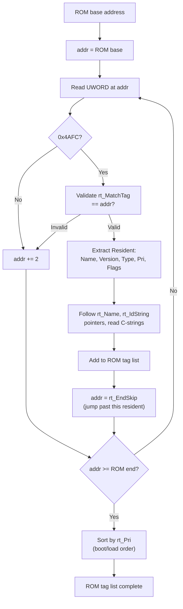
```mermaid
flowchart TD
    START["ROM base address"] --> SCAN["addr = ROM base"]
    SCAN --> READ["Read UWORD at addr"]
    READ --> CHECK{0x4AFC?}
    CHECK -->|No| NEXT["addr += 2"]
    CHECK -->|Yes| VALIDATE["Validate rt_MatchTag<br/>== addr?"]
    VALIDATE -->|Invalid| NEXT
    VALIDATE -->|Valid| EXTRACT["Extract Resident:<br/>Name, Version, Type, Pri, Flags"]
    EXTRACT --> READSTR["Follow rt_Name, rt_IdString<br/>pointers, read C-strings"]
    READSTR --> STORE["Add to ROM tag list"]
    STORE --> ENDCHK["addr = rt_EndSkip<br/>(jump past this resident)"]
    ENDCHK --> DONEROM{addr >= ROM end?}
    NEXT --> DONEROM
    DONEROM -->|No| READ
    DONEROM -->|Yes| SORT["Sort by rt_Pri<br/>(boot/load order)"]
    SORT --> DONE["ROM tag list complete"]
```

**rt_Type mapping:**

| Value | Constant | Description |
|---|---|---|
| 0x03 | `NT_LIBRARY` | Exec, graphics, intuition, etc. |
| 0x04 | `NT_DEVICE` | timer.device, input.device, etc. |
| 0x08 | `NT_RESOURCE` | disk.resource, etc. |
| 0x09 | `NT_TASK` | Built-in tasks |

**rt_Flags bits:**

| Bit | Constant | Meaning |
|---|---|---|
| 0 | `RTF_AUTOINIT` | Uses autoinit data table |
| 1 | `RTF_COLDSTART` | Init on cold boot |
| 2 | `RTF_SINGLETASK` | Single-threaded init |
| 4 | `RTF_AFTERDOS` | Init after DOS |
| 3 | `RTF_BEFOREDOS` | Init before DOS |

## 1.4 ExecBase & Library Discovery

### The ExecBase Structure

`ExecBase` is both the exec.library base AND the system control structure. It contains linked-list heads for all major system object types:

```c
struct ExecBase {
    // ... (library header ~34 bytes) ...
    // ... (system fields: SoftVer, ColdCapture, ...) ...
    struct List TaskReady;      // Ready-to-run tasks
    struct List TaskWait;       // Blocked tasks
    APTR        ThisTask;       // Currently running task
    // ... 
    struct List LibList;        // All open libraries
    struct List DevList;        // All open devices
    struct List ResourceList;   // All resources
    struct List PortList;       // Message ports
    struct List MemList;        // Memory pools
    struct List SemSegList;     // Semaphores
};
```

The **exact offsets** of these lists vary by Kickstart version. The introspection layer must resolve offsets based on the detected KS version. For the common A500/A1200 range:

| KS Version | TaskReady offset | LibList offset | ThisTask offset |
|---|---|---|---|
| 1.2 (33) | ~272 | ~376 | ~276 |
| 1.3 (34) | ~272 | ~376 | ~276 |
| 2.0 (36-37) | ~276 | ~386 | ~280 |
| 3.0 (39) | ~280 | ~392 | ~284 |
| 3.1 (40) | ~280 | ~392 | ~284 |
| 3.2 (45+) | ~288 | ~400 | ~292 |

> **Design decision:** Maintain an offset table keyed by KS version. New KS versions can be added without code changes.

### Walking the Library List

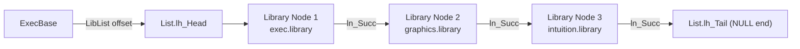
```mermaid
flowchart LR
    EB["ExecBase"] -->|"LibList offset"| HEAD["List.lh_Head"]
    HEAD --> LIB1["Library Node 1<br/>exec.library"]
    LIB1 -->|"ln_Succ"| LIB2["Library Node 2<br/>graphics.library"]
    LIB2 -->|"ln_Succ"| LIB3["Library Node 3<br/>intuition.library"]
    LIB3 -->|"ln_Succ"| TAIL["List.lh_Tail (NULL end)"]
```

For each library node, read the `struct Library` fields:

```c
struct Library {
    struct Node lib_Node;     // Name, Pri, Type
    UBYTE  lib_Flags;
    UBYTE  lib_pad;
    UWORD  lib_NegSize;      // Size of negative (vector) region
    UWORD  lib_PosSize;      // Size of positive (data) region
    UWORD  lib_Version;
    UWORD  lib_Revision;
    APTR   lib_IdString;
    ULONG  lib_Sum;
    UWORD  lib_OpenCnt;
};
```

This gives us everything for the OS Modules Panel:
- **Load/Base address** = the `Library` pointer itself (the node address)
- **Positive region** (base data) = `[base, base + lib_PosSize)`
- **Negative region** (LVO jump table) = `[base - lib_NegSize, base)`
- **Version / Revision / ID string** for display

## 1.5 Library Vector Offsets (LVO) & FD Tables

### What are LVOs?

AmigaOS libraries are called via **Library Vector Offsets** — negative offsets from the library base. Each slot contains a `JMP` instruction to the real function:

```
base - 6:   JMP <func_1>     ; first LVO
base - 12:  JMP <func_2>
base - 18:  JMP <func_3>
...
```

### FD Files (Function Definition)

FD files map LVO offsets to function names and signatures. They live in the Amiga NDK (Native Developer Kit). For example `exec_lib.fd`:

```
##base _ExecBase
##bias 6
Exec(exec.library)
...
AllocMem(d0,d1/a6)*D0/a0
FreeMem(a1,d0/a6)
...
```

Each entry's bias = `(entry_index + 1) * 6`. So `AllocMem` at bias 6 is the first, `FreeMem` at bias 12 is second, etc.

### Integrating FD Data

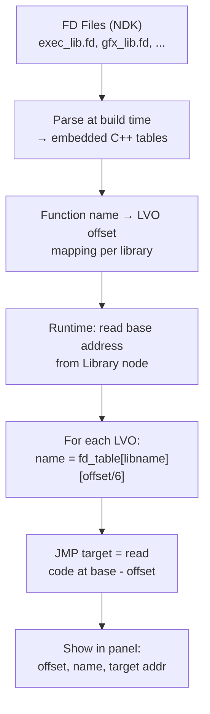
```mermaid
flowchart TD
    FD["FD Files (NDK)<br/>exec_lib.fd, gfx_lib.fd, ..."] --> PARSE["Parse at build time<br/>→ embedded C++ tables"]
    PARSE --> DB["Function name → LVO offset<br/>mapping per library"]
    DB --> RUNTIME["Runtime: read base address<br/>from Library node"]
    RUNTIME --> RESOLVE["For each LVO:<br/>name = fd_table[libname][offset/6]"]
    RESOLVE --> TARGET["JMP target = read<br/>code at base - offset"]
    TARGET --> DISPLAY["Show in panel:<br/>offset, name, target addr"]
```

> **Design decision:** Embed parsed FD tables at build time (static data). No runtime parsing needed. FD files are public domain from the NDK. Ship a curated set covering KS 3.x (covers 1.x-3.x since LVOs are backward compatible for standard functions).

## 1.6 Data Model

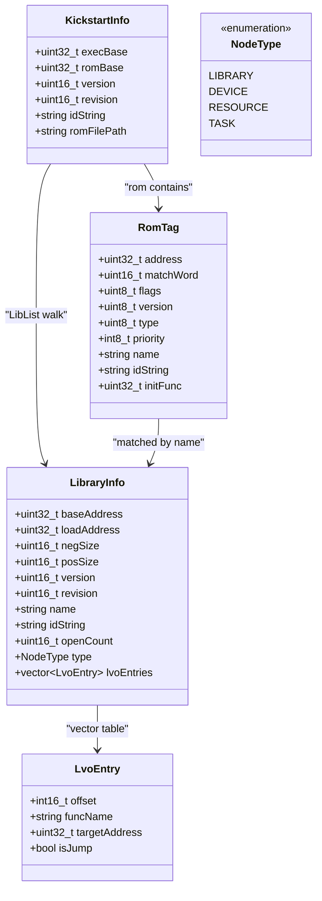
```mermaid
classDiagram
    class KickstartInfo {
        +uint32_t execBase
        +uint32_t romBase
        +uint16_t version
        +uint16_t revision
        +string idString
        +string romFilePath
    }

    class RomTag {
        +uint32_t address
        +uint16_t matchWord
        +uint8_t flags
        +uint8_t version
        +uint8_t type
        +int8_t priority
        +string name
        +string idString
        +uint32_t initFunc
    }

    class LibraryInfo {
        +uint32_t baseAddress
        +uint32_t loadAddress
        +uint16_t negSize
        +uint16_t posSize
        +uint16_t version
        +uint16_t revision
        +string name
        +string idString
        +uint16_t openCount
        +NodeType type
        +vector~LvoEntry~ lvoEntries
    }

    class LvoEntry {
        +int16_t offset
        +string funcName
        +uint32_t targetAddress
        +bool isJump
    }

    class NodeType {
        <<enumeration>>
        LIBRARY
        DEVICE
        RESOURCE
        TASK
    }

    KickstartInfo --> RomTag : "rom contains"
    KickstartInfo --> LibraryInfo : "LibList walk"
    LibraryInfo --> LvoEntry : "vector table"
    RomTag --> LibraryInfo : "matched by name"
```

## 1.7 Debugger Integration

### Refresh Strategy

The OS Modules Panel refreshes on two triggers:

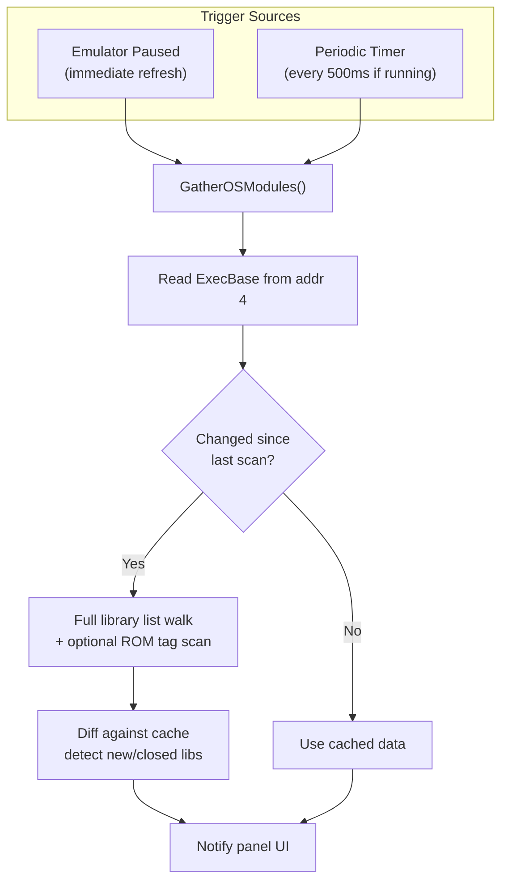
```mermaid
flowchart TD
    subgraph "Trigger Sources"
        T1["Emulator Paused<br/>(immediate refresh)"]
        T2["Periodic Timer<br/>(every 500ms if running)"]
    end

    T1 --> GATHER["GatherOSModules()"]
    T2 --> GATHER

    GATHER --> READ1["Read ExecBase from addr 4"]
    READ1 --> CHECK{Changed since<br/>last scan?}
    CHECK -->|No| CACHE["Use cached data"]
    CHECK -->|Yes| FULLSCAN["Full library list walk<br/>+ optional ROM tag scan"]
    FULLSCAN --> DIFF["Diff against cache<br/>detect new/closed libs"]
    DIFF --> NOTIFY["Notify panel UI"]
    CACHE --> NOTIFY
```

### IVm Interface Additions

The introspection code needs only the existing memory read primitives (`memory_get_word`, `memory_get_long`) plus a helper to read C-strings:

```cpp
// New helper in the VM interface or a utility layer:
// Read a null-terminated string from guest memory at [ptr, ptr+maxLen)
std::string vmReadCString(IVm* vm, uint32_t ptr, size_t maxLen = 256);
```

No new virtual methods strictly required — this can be built on top of existing byte/word reads. The introspection logic lives in a new `OsIntrospector` class.

### Where it plugs in

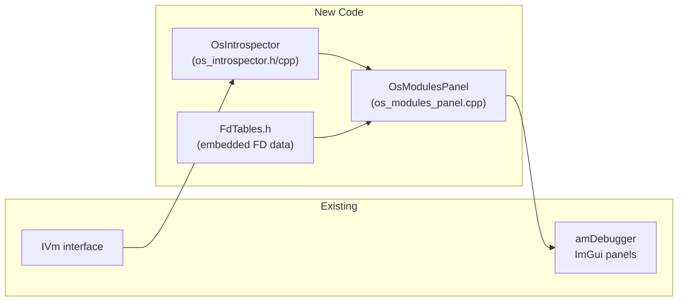
```mermaid
graph LR
    subgraph "Existing"
        VM["IVm interface"]
        DBG["amDebugger<br/>ImGui panels"]
    end

    subgraph "New Code"
        INTRO["OsIntrospector<br/>(os_introspector.h/cpp)"]
        PANEL["OsModulesPanel<br/>(os_modules_panel.cpp)"]
        FDDATA["FdTables.h<br/>(embedded FD data)"]
    end

    VM --> INTRO
    INTRO --> PANEL
    PANEL --> DBG
    FDDATA --> PANEL
```

## 1.8 UI Layout

The OS Modules Panel is an ImGui panel with two tabs:

```
┌─ OS Modules ──────────────────────────────────────┐
│ Kickstart: 3.2.3 (51.9)  ExecBase: $00F01234      │
│ ROM: 0x00E00000 (512KB)  ROM Tags: 24 found       │
├───────────────────────────────────────────────────┤
│ [Libraries] [ROM Tags] [LVO Browser]              │
├───────────────────────────────────────────────────┤
│ Name            Base      Version  OpenCnt  Size  │
│────────────────────────────────────────────────── │
│ exec.library    $00F01234 51.9     --       0x2K  │
│ graphics.lib    $00F56780 51.9     4        0x8K  │
│ intuition.lib   $00F89AB0 51.9     2        0x6K  │
│ dos.library     $00FBCD00 51.9     3        0x4K  │
│ ...                                               │
│                                                   │
│ Selected: graphics.library                        │
│   Negative area: $00F56780 - $00F56180 (0x600)    │
│   Positive area: $00F56780 - $00F56F80 (0x800)    │
│   ┌─ LVO Table ───────────────────────────┐       │
│   │ -6   OpenLibrary     → $00F2A100      │       │
│   │ -12  CloseLibrary    → $00F2A150      │       │
│   │ -30  AllocMem        → $00F2B200      │       │
│   │ ...                                   │       │
│   └───────────────────────────────────────┘       │
└───────────────────────────────────────────────────┘
```

**ROM Tags tab** shows the boot-time resident structures sorted by priority:

```
│ Name            Type      Pri  Ver   Init Addr  │
│─────────────────────────────────────────────────│
│ exec.library    LIBRARY   105  51.9  $00F01000  │
│ exec_Internal   RESOURCE  100  51.9  $00F02000  │
│ ...                                             │
│ dos.library     LIBRARY   -5   51.9  $00F40000  │
│ filesystem      DEVICE    -10  51.9  $00F45000  │
```

## 1.9 Signature Analysis (Optional)

To enhance forensic capabilities, the UI can optionally perform **Signature Analysis** on discovered libraries.

When a library is discovered via `ExecBase->LibList`, its positive region (code and data) and negative region (LVO jump table) can be hashed or scanned for known byte sequences. 

The panel can visually indicate:
- **Verified Standard**: Matches known, standard AmigaOS components (e.g., standard `dos.library` from KS 3.2.3).
- **Custom / Modified**: The library has been patched, hooked, or completely replaced (e.g., a trojan, a system patch like `SetPatch`, or a custom accelerator driver).

This analysis is driven by a shared, reusable `SignatureManager` (detailed in [Cross-Cutting Concerns](#reusable-signaturemanager)).

---

# Part 2: External Task Manager

## 2.1 Task vs Process

AmigaOS has two related execution units:

- **Task** (`struct Task`): The base scheduling unit. Has a stack, registers, and a state (ready/waiting/running). Managed by exec.
- **Process** (`struct Process`): Extends `Task` with DOS-level resources — a CLI window, file handles, seglist, environment, current directory, etc. Every process is a task, but not every task is a process.

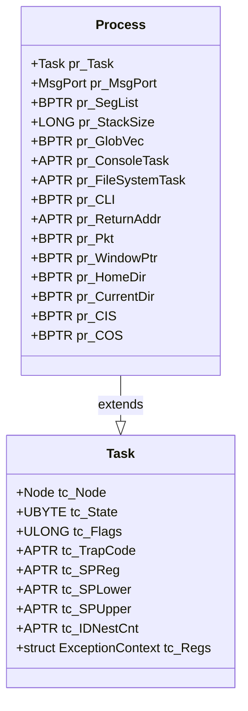
```mermaid
classDiagram
    class Task {
        +Node tc_Node
        +UBYTE tc_State
        +ULONG tc_Flags
        +APTR tc_TrapCode
        +APTR tc_SPReg
        +APTR tc_SPLower
        +APTR tc_SPUpper
        +APTR tc_IDNestCnt
        +struct ExceptionContext tc_Regs
    }

    class Process {
        +Task pr_Task
        +MsgPort pr_MsgPort
        +BPTR pr_SegList
        +LONG pr_StackSize
        +BPTR pr_GlobVec
        +APTR pr_ConsoleTask
        +APTR pr_FileSystemTask
        +BPTR pr_CLI
        +APTR pr_ReturnAddr
        +BPTR pr_Pkt
        +BPTR pr_WindowPtr
        +BPTR pr_HomeDir
        +BPTR pr_CurrentDir
        +BPTR pr_CIS
        +BPTR pr_COS
    }

    Process --|> Task : extends
```

**Task states:**

| Value | Constant | Meaning |
|---|---|---|
| 0 | `TS_INVALID` | Not initialized |
| 1 | `TS_ADDED` | Added but never run |
| 2 | `TS_RUN` | Currently executing |
| 3 | `TS_READY` | Ready to run |
| 4 | `TS_WAIT` | Blocked waiting |
| 5 | `TS_EXCEPT` | Exception pending |
| 6 | `TS_REMOVED` | Being removed |

## 2.2 Task Discovery

ExecBase maintains three linked lists for task management:

- **`ThisTask`**: Pointer to the currently running task's `Task` struct.
- **`TaskReady`**: List of tasks ready to run (state `TS_READY`).
- **`TaskWait`**: List of blocked tasks (state `TS_WAIT`).

> [!NOTE]
> Tasks in states `TS_ADDED`, `TS_EXCEPT`, or `TS_REMOVED` are typically not on any of these three lists. While these states are usually transient, they will be entirely invisible to the Task Manager. This is acceptable for a high-level overview, but worth noting if a crashing task "disappears" before being fully cleaned up.

The running task is not on either list — it's only reachable via `ThisTask`.

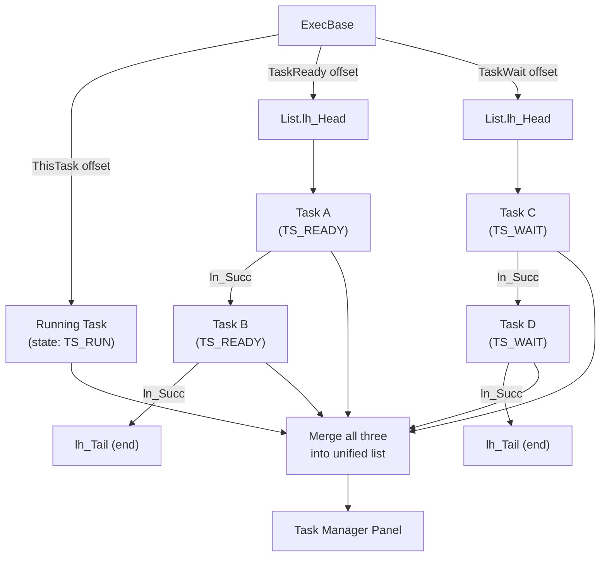
```mermaid
flowchart TD
    EB["ExecBase"]

    EB -->|"ThisTask offset"| THIS["Running Task<br/>(state: TS_RUN)"]

    EB -->|"TaskReady offset"| RHEAD["List.lh_Head"]
    RHEAD --> R1["Task A<br/>(TS_READY)"]
    R1 -->|"ln_Succ"| R2["Task B<br/>(TS_READY)"]
    R2 -->|"ln_Succ"| RTAIL["lh_Tail (end)"]

    EB -->|"TaskWait offset"| WHEAD["List.lh_Head"]
    WHEAD --> W1["Task C<br/>(TS_WAIT)"]
    W1 -->|"ln_Succ"| W2["Task D<br/>(TS_WAIT)"]
    W2 -->|"ln_Succ"| WTAIL["lh_Tail (end)"]

    THIS --> COMBINE["Merge all three<br/>into unified list"]
    R1 --> COMBINE
    R2 --> COMBINE
    W1 --> COMBINE
    W2 --> COMBINE

    COMBINE --> DISPLAY["Task Manager Panel"]
```

### Reading a Task Structure

For each node in the lists, read the `Task` struct fields:

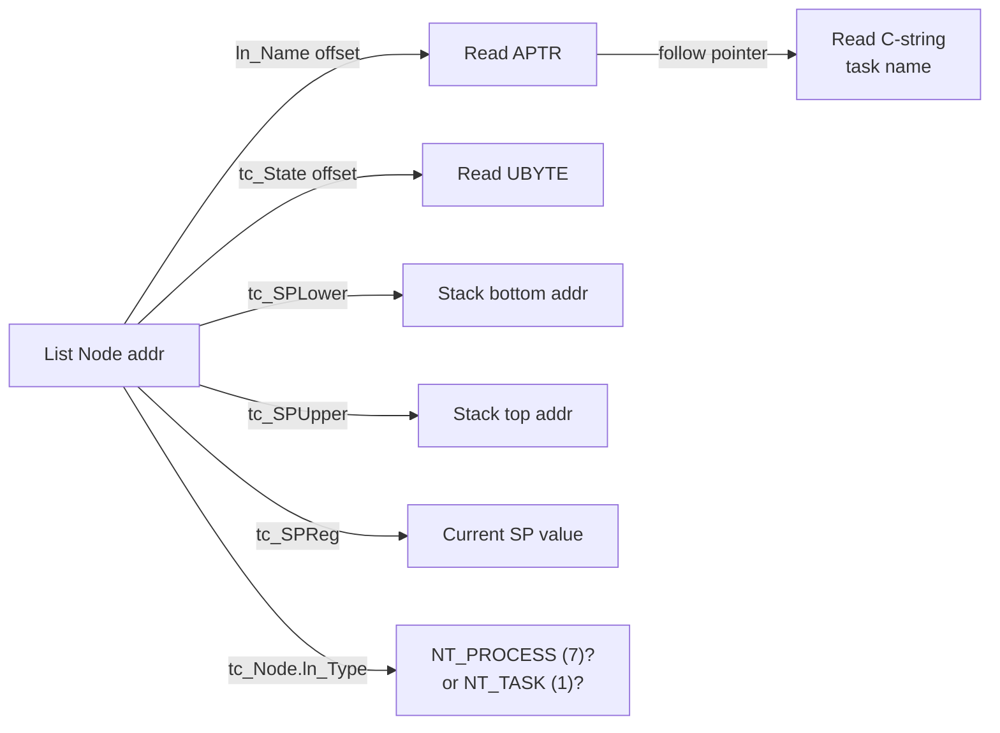
```mermaid
flowchart LR
    NODE["List Node addr"] -->|"ln_Name offset"| NAMEPTR["Read APTR"]
    NAMEPTR -->|"follow pointer"| NAMESTR["Read C-string<br/>task name"]

    NODE -->|"tc_State offset"| STATE["Read UBYTE"]

    NODE -->|"tc_SPLower"| STACK_LO["Stack bottom addr"]
    NODE -->|"tc_SPUpper"| STACK_HI["Stack top addr"]

    NODE -->|"tc_SPReg"| SP["Current SP value"]

    NODE -->|"tc_Node.ln_Type"| TYPE["NT_PROCESS (7)?<br/>or NT_TASK (1)?"]
```

If `ln_Type == NT_PROCESS (7)`, the task is actually a `Process` struct and we can read the extended DOS fields (section 2.5).

## 2.3 Per-Process Module Tracking

AmigaOS executables are loaded as **segment lists** (`BPTR pr_SegList`). Each process's `pr_SegList` is a linked list of segments (code, data, BSS) loaded into RAM.

### Segment List Structure

A BPTR (BCPL pointer) is `address << 2`. To get the real address, shift right by 2.

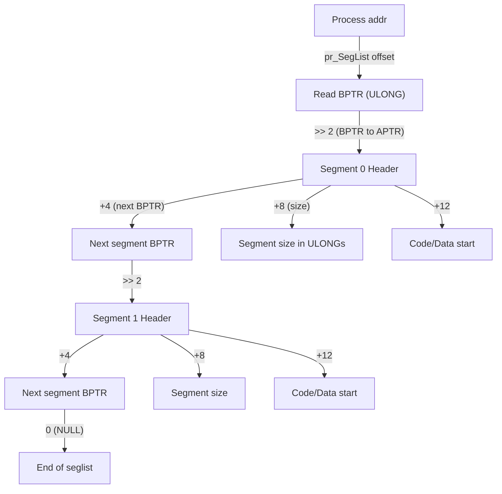
```mermaid
flowchart TD
    PROC["Process addr"] -->|"pr_SegList offset"| SEGBPTR["Read BPTR (ULONG)"]
    SEGBPTR -->|">> 2 (BPTR to APTR)"| SEG0["Segment 0 Header"]

    SEG0 -->|"+4 (next BPTR)"| NEXT0["Next segment BPTR"]
    SEG0 -->|"+8 (size)"| SIZE0["Segment size in ULONGs"]
    SEG0 -->|"+12"| CODE0["Code/Data start"]

    NEXT0 -->|">> 2"| SEG1["Segment 1 Header"]
    SEG1 -->|"+4"| NEXT1["Next segment BPTR"]
    SEG1 -->|"+8"| SIZE1["Segment size"]
    SEG1 -->|"+12"| CODE1["Code/Data start"]

    NEXT1 -->|"0 (NULL)"| END["End of seglist"]
```

### Walking a Seglist

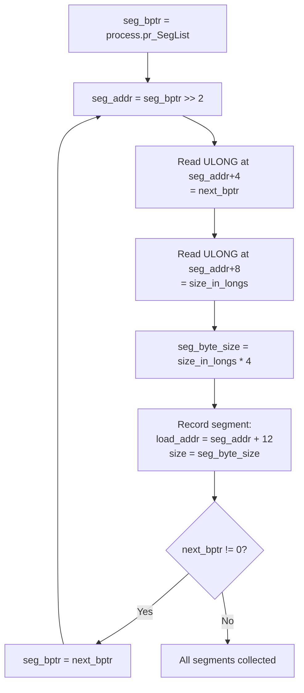
```mermaid
flowchart TD
    START["seg_bptr = process.pr_SegList"] --> LOOP["seg_addr = seg_bptr >> 2"]
    LOOP --> READNEXT["Read ULONG at seg_addr+4<br/>= next_bptr"]
    READNEXT --> READSIZE["Read ULONG at seg_addr+8<br/>= size_in_longs"]
    READSIZE --> CALC["seg_byte_size = size_in_longs * 4"]
    CALC --> STORE["Record segment:<br/>load_addr = seg_addr + 12<br/>size = seg_byte_size"]
    STORE --> CHECK{next_bptr != 0?}
    CHECK -->|Yes| SETNEXT["seg_bptr = next_bptr"] --> LOOP
    CHECK -->|No| DONE["All segments collected"]
```

### Module Identification

For loaded programs (not ROM libraries), we don't have explicit names in the seglist itself. We can cross-reference with:

- **CLI command name**: If process has `pr_CLI`, read the `CommandLineInterface` struct → `cli_CommandName` (the program name like "c:dir").
- **dos.library `MaxLoc`**: The highest seglist number allocated.
- **Segment cache**: KS 2.0+ maintains an internal seglist-to-path cache accessible via `dosextr.c` internals (requires knowing DOS base version-specific offsets).

For practical purposes, the process name from `tc_Node.ln_Name` plus the CLI command name provide enough identification.

## 2.4 Memory Allocation Tracking

ExecBase maintains a `MemList` linked list of all memory pools/allocation groups. Individual `AllocMem` calls don't register here — instead, `MemList` tracks **named memory pools** (e.g., chip RAM reservations, library allocations).

For a per-process memory view, we need a different approach:

### Approach: Heap Region Scan

Since AmigaOS has no per-process heap isolation, we estimate per-process memory by scanning the segment list (section 2.3) for code/data size, and optionally scan the `MemList` for entries tagged to this process.

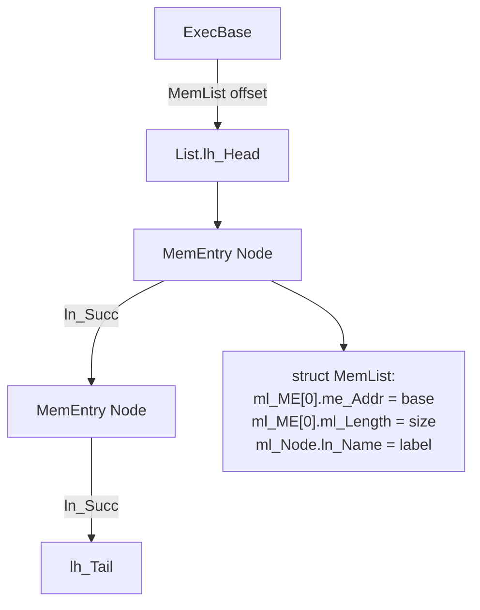
```mermaid
flowchart TD
    EB["ExecBase"] -->|"MemList offset"| MLHEAD["List.lh_Head"]
    MLHEAD --> ML1["MemEntry Node"]
    ML1 -->|"ln_Succ"| ML2["MemEntry Node"]
    ML2 -->|"ln_Succ"| MLTAIL["lh_Tail"]

    ML1 --> DETAIL1["struct MemList:<br/>ml_ME[0].me_Addr = base<br/>ml_ME[0].ml_Length = size<br/>ml_Node.ln_Name = label"]
```

### System-wide Memory Summary

For the system overview, we read the memory allocation from `ExecBase`:

```c
struct ExecBase {
    // ...
    struct MemHeader *MemList[3];  // chip, fast, any
    // On KS 3.x, a region list is maintained
};

struct MemHeader {
    struct Node mh_Node;
    ULONG mh_Attributes;     // MEMF_CHIP, MEMF_FAST, MEMF_KICK
    APTR  mh_Lower;         // Region start
    APTR  mh_Upper;         // Region end
    ULONG mh_Free;          // Total free bytes in region
    // ...
};
```

Walking the `MemHeader` chain gives total/used/free for each memory region:

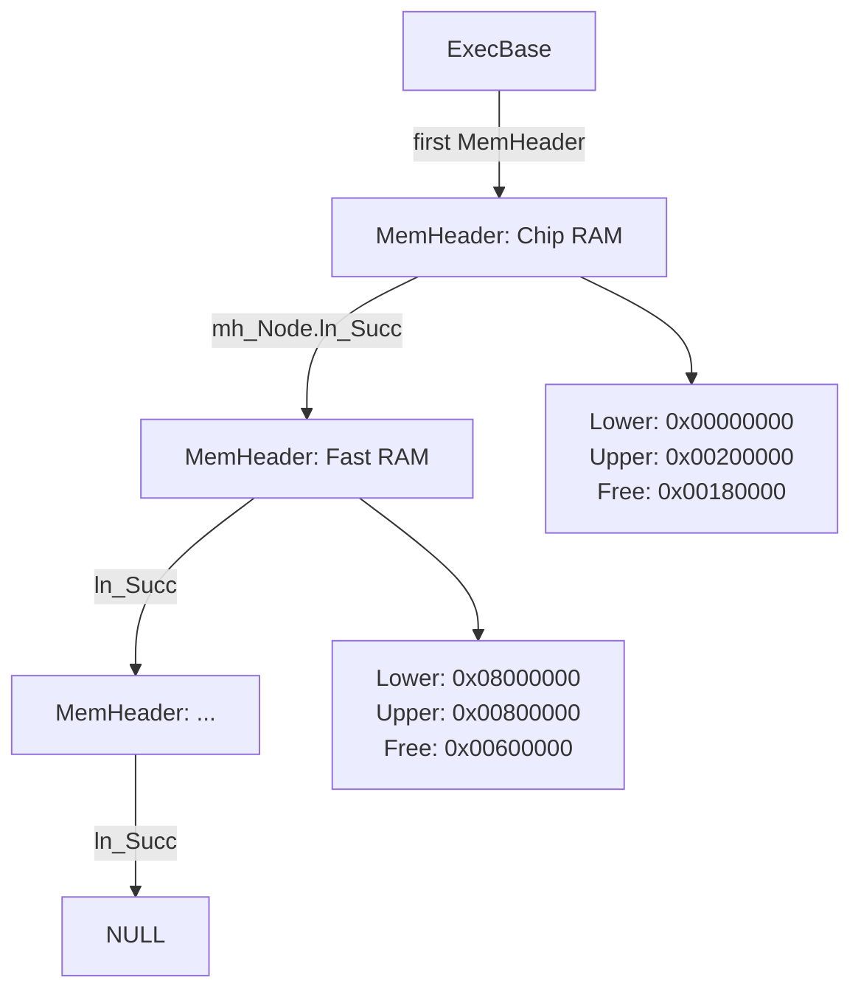
```mermaid
flowchart TD
    EB["ExecBase"] -->|"first MemHeader"| MH1["MemHeader: Chip RAM"]
    MH1 -->|"mh_Node.ln_Succ"| MH2["MemHeader: Fast RAM"]
    MH2 -->|"ln_Succ"| MH3["MemHeader: ..."]
    MH3 -->|"ln_Succ"| END["NULL"]

    MH1 --> INFO1["Lower: 0x00000000<br/>Upper: 0x00200000<br/>Free: 0x00180000"]
    MH2 --> INFO2["Lower: 0x08000000<br/>Upper: 0x00800000<br/>Free: 0x00600000"]
```

## 2.5 File Handler Tracking

AmigaOS processes access files through **file handles** (BPTRs to `struct FileHandle`). Each `Process` struct tracks its open files via the DOS packet-based file system layer.

### Process File Handles

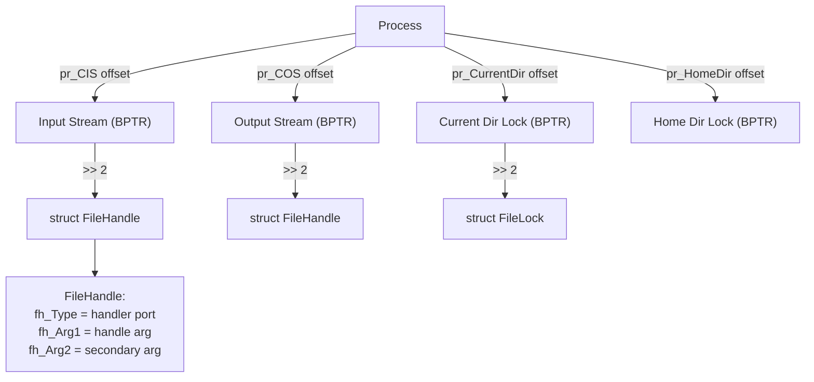
```mermaid
flowchart TD
    PROC["Process"] -->|"pr_CIS offset"| CIS["Input Stream (BPTR)"]
    PROC -->|"pr_COS offset"| COS["Output Stream (BPTR)"]
    PROC -->|"pr_CurrentDir offset"| CURDIR["Current Dir Lock (BPTR)"]
    PROC -->|"pr_HomeDir offset"| HOMEDIR["Home Dir Lock (BPTR)"]

    CIS -->|">> 2"| FH_IN["struct FileHandle"]
    COS -->|">> 2"| FH_OUT["struct FileHandle"]
    CURDIR -->|">> 2"| LOCK_CD["struct FileLock"]

    FH_IN --> FHDETAIL["FileHandle:<br/>fh_Type = handler port<br/>fh_Arg1 = handle arg<br/>fh_Arg2 = secondary arg"]
```

### File Handle Structure

```c
struct FileHandle {
    ULONG fh_Link;       // Next in chain (for multi-handle lists)
    BPTR  fh_Type;       // File system handler message port
    ULONG fh_Arg1;       // Handler-specific arg (often internal handle)
    ULONG fh_Arg2;       // Secondary arg
    // ... KS-version dependent fields ...
};
```

### DOS Handler / Device Table

> [!IMPORTANT]
> To access the `dos.library` base (required for traversing the DosList), the Task Manager must either depend on the library scan results from Part 1, or perform its own targeted search of the `LibList` to find the `dos.library` node.

The system-wide file handler table is in `struct DosLibrary` (dosbase). It tracks:

- **DeviceNodes**: Entries in `devinfo` list (DH0:, DH1:, etc.)
- **FileLocks**: Active locks across all processes (on the `DosList`, `LDF_LOCKS`)

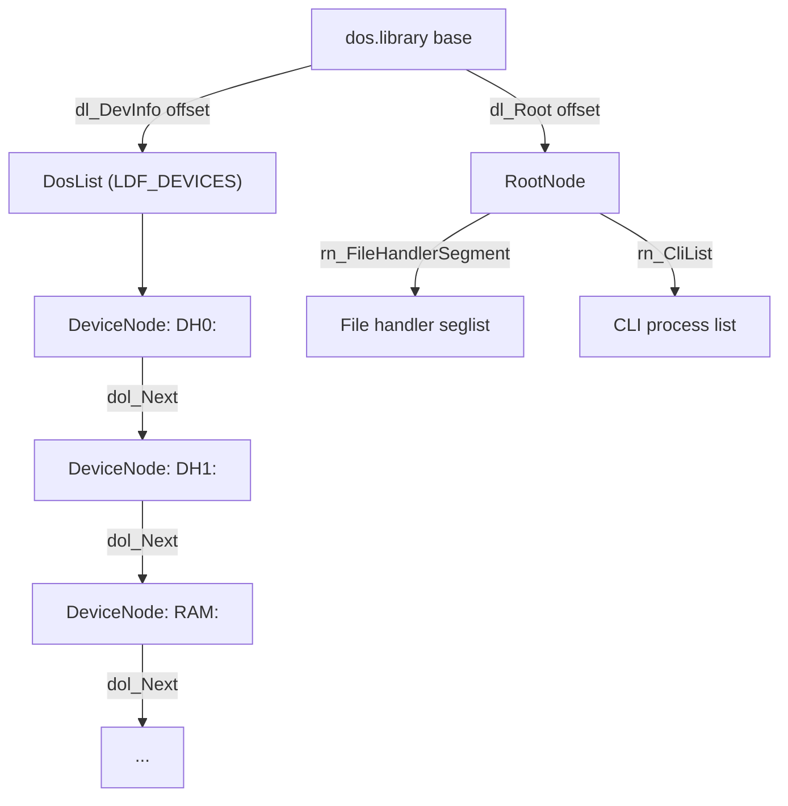
```mermaid
flowchart TD
    DOS["dos.library base"] -->|"dl_DevInfo offset"| DILIST["DosList (LDF_DEVICES)"]
    DILIST --> DEV1["DeviceNode: DH0:"]
    DEV1 -->|"dol_Next"| DEV2["DeviceNode: DH1:"]
    DEV2 -->|"dol_Next"| DEV3["DeviceNode: RAM:"]
    DEV3 -->|"dol_Next"| END1["..."]

    DOS -->|"dl_Root offset"| ROOT["RootNode"]
    ROOT -->|"rn_FileHandlerSegment"| FHS["File handler seglist"]
    ROOT -->|"rn_CliList"| CLILIST["CLI process list"]
```

### Walking the DosList

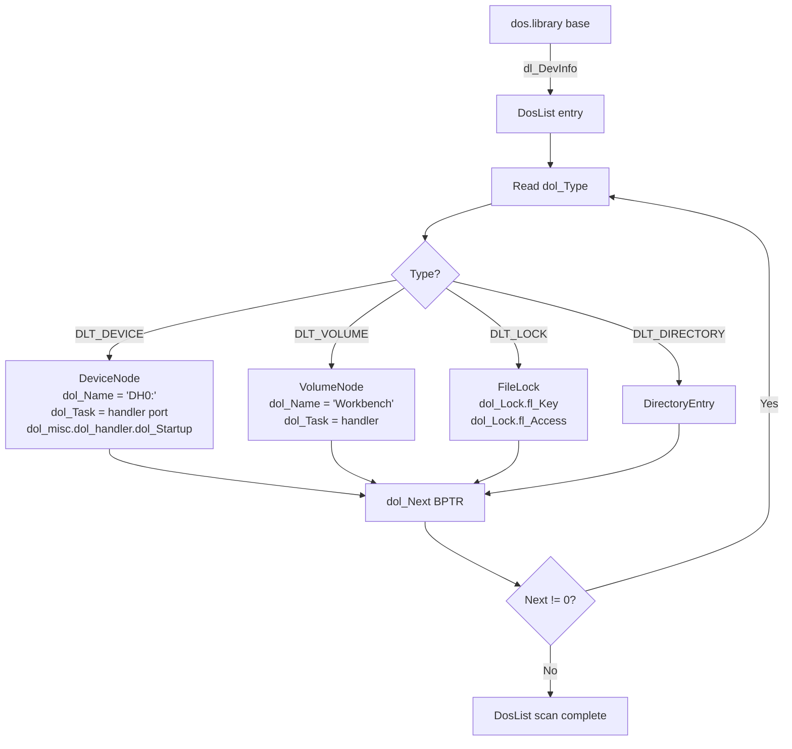
```mermaid
flowchart TD
    DOS["dos.library base"] -->|"dl_DevInfo"| DLHEAD["DosList entry"]
    DLHEAD --> LOOP["Read dol_Type"]
    LOOP --> TYP{Type?}
    TYP -->|DLT_DEVICE| DEV["DeviceNode<br/>dol_Name = 'DH0:'<br/>dol_Task = handler port<br/>dol_misc.dol_handler.dol_Startup"]
    TYP -->|DLT_VOLUME| VOL["VolumeNode<br/>dol_Name = 'Workbench'<br/>dol_Task = handler"]
    TYP -->|DLT_LOCK| LOCK["FileLock<br/>dol_Lock.fl_Key<br/>dol_Lock.fl_Access"]
    TYP -->|DLT_DIRECTORY| DIR["DirectoryEntry"]
    DEV --> NEXT["dol_Next BPTR"]
    VOL --> NEXT
    LOCK --> NEXT
    DIR --> NEXT
    NEXT --> DONE{Next != 0?}
    DONE -->|Yes| LOOP
    DONE -->|No| COMPLETE["DosList scan complete"]
```

## 2.6 Data Model

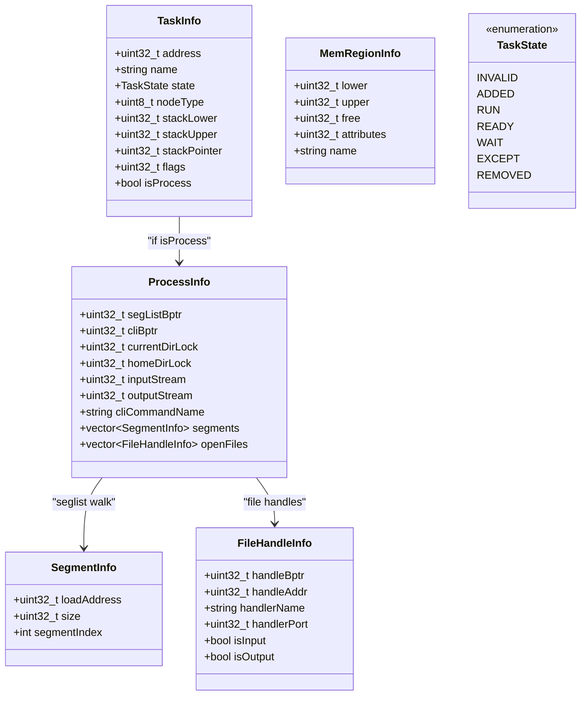
```mermaid
classDiagram
    class TaskInfo {
        +uint32_t address
        +string name
        +TaskState state
        +uint8_t nodeType
        +uint32_t stackLower
        +uint32_t stackUpper
        +uint32_t stackPointer
        +uint32_t flags
        +bool isProcess
    }

    class ProcessInfo {
        +uint32_t segListBptr
        +uint32_t cliBptr
        +uint32_t currentDirLock
        +uint32_t homeDirLock
        +uint32_t inputStream
        +uint32_t outputStream
        +string cliCommandName
        +vector~SegmentInfo~ segments
        +vector~FileHandleInfo~ openFiles
    }

    class SegmentInfo {
        +uint32_t loadAddress
        +uint32_t size
        +int segmentIndex
    }

    class FileHandleInfo {
        +uint32_t handleBptr
        +uint32_t handleAddr
        +string handlerName
        +uint32_t handlerPort
        +bool isInput
        +bool isOutput
    }

    class MemRegionInfo {
        +uint32_t lower
        +uint32_t upper
        +uint32_t free
        +uint32_t attributes
        +string name
    }

    class TaskState {
        <<enumeration>>
        INVALID
        ADDED
        RUN
        READY
        WAIT
        EXCEPT
        REMOVED
    }

    TaskInfo --> ProcessInfo : "if isProcess"
    ProcessInfo --> SegmentInfo : "seglist walk"
    ProcessInfo --> FileHandleInfo : "file handles"
```

## 2.7 Debugger Integration

### Refresh Strategy

The Task Manager refreshes on the same triggers as the OS Modules Panel, but since task lists change more frequently, a periodic timer is the primary trigger:

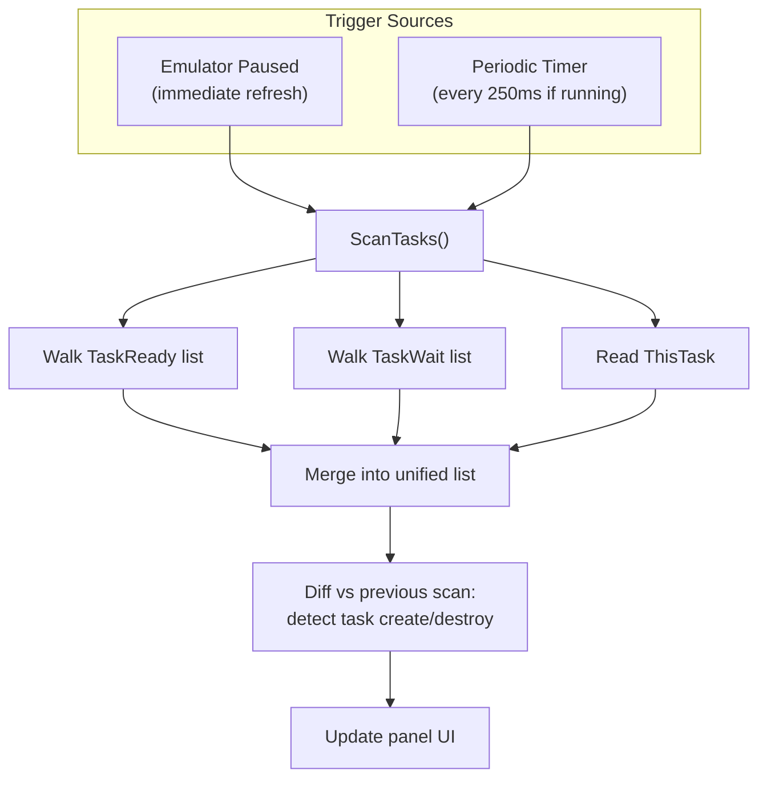
```mermaid
flowchart TD
    subgraph "Trigger Sources"
        T1["Emulator Paused<br/>(immediate refresh)"]
        T2["Periodic Timer<br/>(every 250ms if running)"]
    end

    T1 --> SCAN["ScanTasks()"]
    T2 --> SCAN

    SCAN --> S1["Walk TaskReady list"]
    SCAN --> S2["Walk TaskWait list"]
    SCAN --> S3["Read ThisTask"]

    S1 --> MERGE["Merge into unified list"]
    S2 --> MERGE
    S3 --> MERGE

    MERGE --> DIFF["Diff vs previous scan:<br/>detect task create/destroy"]
    DIFF --> NOTIFY["Update panel UI"]
```

### Architecture

```mermaid
graph LR
    subgraph "Existing"
        VM["IVm interface"]
        DBG["amDebugger<br/>ImGui panels"]
    end

    subgraph "New Code"
        INTRO["OsIntrospector<br/>(shared with Modules Panel)"]
        PANEL["TaskManagerPanel<br/>(task_manager_panel.cpp)"]
    end

    VM --> INTRO
    INTRO --> PANEL
    PANEL --> DBG
```

### Shared Introspection Layer

The `OsIntrospector` class (shared between OS Modules Panel and Task Manager) provides cached, version-aware reads:

```cpp
class OsIntrospector {
public:
    explicit OsIntrospector(IVm* vm);

    // Kickstart detection (Part 1)
    KickstartInfo getKickstartInfo();
    vector<RomTag> scanRomTags();
    vector<LibraryInfo> scanLibraries();

    // Task management (Part 2)
    vector<TaskInfo> scanTasks();
    ProcessInfo getProcessInfo(uint32_t processAddr);
    vector<MemRegionInfo> scanMemoryRegions();
    DosListInfo scanDosList();

private:
    IVm* m_vm;
    KsOffsetTable m_offsets;  // resolved on first scan
    KickstartInfo m_cachedKs;
};
```

## 2.8 UI Layout

The Task Manager has three views, selected via tabs:

```
┌─ Task Manager ───────────────────────────────────────────────────┐
│ Tasks: 12   Ready: 4   Wait: 7   Run: 1   │ Chip Free: 1.5MB     │
│                                            │ Fast Free: 5.8MB    │
├──────────────────────────────────────────────────────────────────┤
│ [Task List] [Memory Map] [File Handlers]                         │
├──────────────────────────────────────────────────────────────────┤
│ Name            State    Type     Stack         SP          CPU% │
│──────────────────────────────────────────────────────────────────│
│ ▸ Workbench     RUN      PROCESS  0x00120000   0x00120700   --   │
│   Border        WAIT     PROCESS  0x00150000   0x00150800   --   │
│   input.device  WAIT     TASK     0x000F0000   0x000F0400   --   │
│   CLI 1         READY    PROCESS  0x00180000   0x00180500   --   │
│   ...                                                            │
│                                                                  │
│ Selected: Workbench (PROCESS, addr $00DB0000)                    │
│   ┌─ Segments ──────────────────────────────────────────────┐    │
│   │ #0  Code   $00DB0120  size: 0x4200  (16.5KB)            │    │
│   │ #1  Data   $00DB4320  size: 0x0800  (2.0KB)             │    │
│   │ #2  BSS    $00DB4B20  size: 0x0200  (512B)              │    │
│   │ Total: 19.0KB                                           │    │
│   └─────────────────────────────────────────────────────────┘    │
│   ┌─ File Handles ──────────────────────────────────────────┐    │
│   │ Input  (*): CON: handler port $00F00050                 │    │
│   │ Output (*): CON: handler port $00F00050                 │    │
│   │ Current Dir: Lock $00DC1234 (DH0:Workbench)             │    │
│   └─────────────────────────────────────────────────────────┘    │
└──────────────────────────────────────────────────────────────────┘
```

**Memory Map tab:**

```
│ Region    Lower      Upper      Total    Free     Used    Attr   │
│──────────────────────────────────────────────────────────────────│
│ Chip RAM  0x00000000  0x00200000  2.0MB    1.5MB    512KB   CHIP │
│ Fast RAM  0x08000000  0x00880000  8.0MB    5.8MB    2.2MB   FAST │
│ ROM       0x00E00000  0x00E80000  512KB    --       --      R    │
```

**File Handlers tab:**

```
│ Device    Type     Handler        Volume     Mounted   Status    │
│──────────────────────────────────────────────────────────────────│
│ DH0:      DEVICE   trackdisk      OS-3.2.3   yes       active    │
│ DH1:      DEVICE   uaehf.device   HostDir    yes       active    │
│ RAM:      DEVICE   ram-handler    RAM Disk   yes       active    │
│ CON:      DEVICE   console-handler --         --       active    │
```

---

# Cross-Cutting Concerns

## Reusable SignatureManager

To support the Optional Signature Analysis in the OS Modules Panel, we introduce a `SignatureManager` class. This component MUST be shared and reusable across the emulator, not just tied to OS Introspection. 

**Architecture**:
- **Agnostic**: It does not know about `ExecBase` or Amiga OS structures. It only knows about memory ranges, byte sequences, and hashes (e.g., CRC32 or SHA-1).
- **Rule-Based**: It loads signature definitions from external data files (JSON/XML) or embedded tables.
- **Future-Proof**: While initially used for checking `Library` integrity, this exact same component will later be used to:
  - Recognize specific Kickstart ROM versions by hashing the ROM image.
  - Detect known game binaries or drivers in memory.
  - Identify known malware or trojan patterns.

**Interface Concept**:
```cpp
class SignatureManager {
public:
    // Load rules from an external source or embedded database
    void loadSignatures(const std::string& databasePath);

    // Identify a block of memory based on known hashes/patterns
    std::string identifyBlock(const uint8_t* buffer, size_t size);
    
    // Check if a specific block matches a known "standard" component
    bool verifyIntegrity(const std::string& componentName, const uint8_t* buffer, size_t size);
};
```
The `OsIntrospector` will utilize the `SignatureManager` by feeding it the memory regions of discovered libraries, and then passing the result (Standard vs Modified) to the `OsModulesPanel` for display.

## Memory Read Caching

Both panels read many guest memory addresses per refresh. To avoid overwhelming the VM with individual byte/word reads, batch reads should be used where possible:

```mermaid
flowchart TD
    INTRO["OsIntrospector"] --> REQ["Need to read Task struct<br/>at addr $00DB0000"]
    REQ --> BATCH["Read 92 bytes (sizeof Task)<br/>in one call"]
    BATCH --> VM["IVm::memoryGetBlock()<br/>or emulate via word reads"]
    VM --> PARSE["Parse struct fields<br/>from local buffer"]
```

If `IVm` lacks a block-read method, add one:

```cpp
// Proposed addition to IVm:
virtual void memoryReadBlock(uint32_t addr, uint32_t size, uint8_t* dest) = 0;
```

## KS Version Offset Table

The offset table is the central risk area. Wrong offsets produce garbage data or crash the guest. Strategy:

1. **Source from official NDK headers** (`exec/execbase.h`, `dos/dos.h`) for each KS version.
2. **Validate at runtime**: After reading ExecBase, sanity-check that `TaskReady.lh_Head` is a plausible RAM address, `ThisTask` points to a valid struct, etc.
3. **Fallback**: If validation fails, show "Unknown KS version — introspection disabled" rather than corrupt reads.

```mermaid
flowchart TD
    KS["Detect KS version"] --> LOOKUP["Lookup offset table"]
    LOOKUP --> READ["Read ExecBase fields"]
    READ --> VALIDATE{Sanity check:<br/>TaskReady.lh_Head<br/>in valid RAM?}
    VALIDATE -->|Pass| ENABLE["Enable introspection"]
    VALIDATE -->|Fail| FALLBACK["Show 'Unknown KS'<br/>disable introspection"]
```

## Thread Safety & Infinite Loop Hazards

The introspection reads happen on the debugger/UI thread (paused emulator) or periodic timer (running emulator). The VM memory is not thread-safe for concurrent writes, so:

- When emulator is **paused**: safe to read at any time (guest is frozen).
- When emulator is **running**: reads may see inconsistent data (task list mid-mutation). Acceptable for display purposes — worst case is a stale or corrupted row that self-corrects on next scan.

> [!WARNING]
> **Infinite Loop Hazard**: When walking linked lists (Exec `LibList`, `TaskReady`, `TaskWait`, `DosList`) while the emulator is running, a pointer read mid-mutation could create a circular reference. 
> 
> **Mitigation**: All list traversal loops in `OsIntrospector` MUST have a hard iteration cap (e.g., `MAX_LIST_NODES = 1000`). If the loop hits this cap, abort the scan and return the data gathered up to that point to prevent the UI thread from hanging.

## Endianness & Memory Access

AmigaOS uses a Big-Endian (m68k) memory layout, while the host running the debugger is likely Little-Endian (x86_64, ARM64).

> [!IMPORTANT]
> If using a block read (`memoryReadBlock`), casting the resulting buffer directly to a C++ struct will result in backward 16-bit and 32-bit values on Little-Endian hosts.
> 
> **Mitigation**: 
> - Either use the existing `IVm::Memory::getU32(addr)` and `getU16(addr)` methods which already handle byte-swapping.
> - Or, if block reads are implemented for performance, explicitly use `ntohl()`/`ntohs()` (or C++20 `std::byteswap`) on every extracted multi-byte field.

Additionally, reading C-strings (`vmReadCString`) requires reading byte-by-byte. `IVm::Memory` will need a `getU8(addr)` method. The string reader must also implement memory boundary checks to ensure it doesn't read past mapped guest memory while searching for a missing null terminator, which could crash the emulator.

---

# Implementation Phases

```mermaid
gantt
    title OS Introspection Implementation
    dateFormat YYYY-MM-DD
    axisFormat %b

    section Phase 1: Foundation
    OsIntrospector + KsOffsetTable      :p1a, 2025-01-01, 3d
    ExecBase detection + validation     :p1b, after p1a, 2d
    memoryReadBlock on IVm              :p1c, after p1a, 1d

    section Phase 2: OS Modules Panel
    ROM tag scanner                     :p2a, after p1b, 2d
    Library list walk                   :p2b, after p2a, 2d
    FD table embedding                  :p2c, after p2a, 3d
    OsModulesPanel ImGui UI             :p2d, after p2b p2c, 3d

    section Phase 3: Task Manager
    Task list walk (Ready + Wait)       :p3a, after p1b, 2d
    Process info + seglist walk         :p3b, after p3a, 3d
    Memory region scan                  :p3c, after p3a, 1d
    DosList / file handler scan         :p3d, after p3b, 2d
    TaskManagerPanel ImGui UI           :p3e, after p3b p3c p3d, 4d

    section Phase 4: Polish
    Cross-panel linking                 :p4a, after p2d p3e, 2d
    Real-time diff indicators           :p4b, after p4a, 2d
```

### Phase Summary

| Phase | Scope | Key Deliverable |
|---|---|---|
| **1: Foundation** | `OsIntrospector`, KS offset table, `memoryReadBlock` | ExecBase detection working |
| **2: OS Modules** | ROM tags, library walk, FD tables, UI | Libraries panel with LVO browser |
| **3: Task Manager** | Task lists, seglists, memory, DosList, UI | Full task manager with file handlers |
| **4: Polish** | Click-to-inspect cross-panel navigation | Click a task → see its segments + libraries |

---

# Module Placement & VM Binding

## Design Constraints

The existing codebase has three relevant patterns:

1. **Window registration**: All debugger windows extend `amD::AmDbgWindow`, register via `QDB_WINDOW_REGISTER(WndId::..., ClassName, amD::AmDbgWindow)`, and are auto-instantiated by `DebuggerDesktop::createAllUiWndows()` through the type registry.

2. **VM access**: Windows get the VM through `getVm()` → `getDbg()->getVm()` → `IVm::VM*`. Memory reads go through `vm->mem->getU32(addr)`, `getU16(addr)`, `getRealAddr(addr)`.

3. **IModule pattern**: For things needing UAE-backend-specific overrides (`Memory`, `Cpu`, `CustomRegs`, etc.) — concrete impl in `UaeVmImp` in `src/quasar_app/uae_imp/`.

## Why NOT IVm::IModule

The existing modules (`Memory`, `Cpu`, `CustomRegs`) are abstract because they need UAE-backend-specific implementations — `UaeVmImp` overrides their virtuals to bridge to UAE internals (`memory_get_long`, `regs.*`, custom chip registers).

The `OsIntrospector` is a **pure consumer** of the `IVm::Memory` interface. It only calls `getU32()`, `getU16()`, and `getRealAddr()` — all already available on the abstract `IVm::Memory` module. Making it an `IModule` would force:

- A virtual interface in `libs/amDebugger`
- A no-op or passthrough override in `UaeVmImp` in `src/quasar_app/uae_imp/`
- Unnecessary coupling to UAE internals

Since vAmiga or any other backend would expose the same `IVm::Memory`, the introspector works unchanged across all backends.

## Why libs/amDebugger, not src/quasar_app

The introspection logic is debugger-only. It has zero dependency on UAE internals — only on `IVm::VM*` and `IVm::Memory*`. Placing it in `amDebugger` keeps the debugger library self-contained: any future VM backend gets the panels for free without additional wiring.

## File Layout

```
libs/amDebugger/src/amDebugger/
├── os/                              ← NEW directory
│   ├── os_introspector.h            ← OsIntrospector class (header)
│   ├── os_introspector.cpp          ← OsIntrospector implementation
│   ├── ks_offsets.h                 ← KS version → struct offset table
│   └── fd_tables.h                  ← Embedded FD data (library LVO names)
├── window/
│   ├── os_modules_wnd.h             ← NEW window (same pattern as others)
│   ├── os_modules_wnd.cpp
│   ├── task_manager_wnd.h           ← NEW window
│   └── task_manager_wnd.cpp
├── ui/uiDefs.h                      ← ADD WndId entries
```

## Binding Architecture

```mermaid
graph TB
    subgraph "libs/amDebugger"
        DBG["Debugger<br/>existing class"]
        INTRO["OsIntrospector<br/>NEW: owned by Debugger"]
        W1["OsModulesWnd<br/>NEW: AmDbgWindow subclass"]
        W2["TaskManagerWnd<br/>NEW: AmDbgWindow subclass"]
        VM_IF["IVm::VM / IVm::Memory<br/>existing abstract interface"]
    end

    subgraph "src/quasar_app/uae_imp"
        UAEVM["UaeVmImp::Memory<br/>existing: overrides getU32/getRealAddr"]
    end

    subgraph "Type Registry (auto-create)"
        REG["QDB_WINDOW_REGISTER"]
        DESKTOP["DebuggerDesktop::createAllUiWndows"]
    end

    DBG -->|"m_pOsIntro"| INTRO
    INTRO -->|"reads via"| VM_IF
    VM_IF -.->|"implemented by"| UAEVM

    W1 -->|"getDbg()->getOsIntro()"| INTRO
    W2 -->|"getDbg()->getOsIntro()"| INTRO

    REG --> W1
    REG --> W2
    DESKTOP -->|"findAllDerivedFrom AmDbgWindow"| W1
    DESKTOP --> W2
```

## Code Skeleton

### Debugger integration (minimal change)

```cpp
// debugger.h — add one member
class Debugger : public qd::RefCounted, public qd::IOperationEnvironment {
    // ... existing ...
    std::unique_ptr<OsIntrospector> m_pOsIntro;  // NEW

public:
    OsIntrospector* getOsIntro() const { return m_pOsIntro.get(); }
};

// debugger.cpp — initialize on VM connection
void Debugger::setDbgServiceBridge(ref_ptr<IVmDbgServiceBridge> pCon) {
    // ... existing VM binding code ...
    if (m_pVm)
        m_pOsIntro = std::make_unique<OsIntrospector>(m_pVm.get());
    else
        m_pOsIntro.reset();
}
```

### OsIntrospector (standalone, no IModule)

```cpp
// os_introspector.h
class OsIntrospector {
public:
    explicit OsIntrospector(IVm::VM* vm);

    // Part 1: OS Modules
    bool isOsBooted() const;
    KickstartInfo getKickstartInfo();
    std::vector<RomTag> scanRomTags();
    std::vector<LibraryInfo> scanLibraries();

    // Part 2: Task Manager
    std::vector<TaskInfo> scanTasks();
    ProcessInfo getProcessInfo(uint32_t processAddr);
    std::vector<MemRegionInfo> scanMemoryRegions();

private:
    IVm::VM* m_vm;
    const KsOffsets* m_offsets = nullptr;     // resolved on first scan
    KickstartInfo m_cachedKs;
    bool m_validated = false;

    // Internal helpers using only IVm::Memory
    uint32_t readU32(uint32_t addr);
    uint16_t readU16(uint32_t addr);
    std::string readCString(uint32_t addr, size_t maxLen = 256);
};
```

### Window (auto-registered)

```cpp
// os_modules_wnd.h
namespace amD::window {

class OsModulesWnd : public AmDbgWindow {
    QDB_WINDOW_REGISTER(WndId::OsModules, amD::window::OsModulesWnd, amD::AmDbgWindow);

public:
    virtual void onCreate(UiViewCreateCtx* cp) override {
        AmDbgWindow::onCreate(cp);
        m_title = "OS Modules";
    }

    virtual void drawContentImp() override;
};

} // namespace amD::window

// task_manager_wnd.h — identical pattern
```

### WndId additions

```cpp
// uiDefs.h — add two entries
enum class WndId {
    // ... existing ...
    OsModules,        // NEW
    TaskManager,      // NEW
    ImGuiDemo,
    MostCommonCount,
};
```

### Window drawImp (consumes introspector)

```cpp
// os_modules_wnd.cpp
void amD::window::OsModulesWnd::drawContentImp() {
    Debugger* dbg = getDbg();
    OsIntrospector* intro = dbg->getOsIntro();
    if (!intro || !intro->isOsBooted()) {
        ImGui::TextUnformatted("Waiting for OS to boot...");
        return;
    }

    KickstartInfo ks = intro->getKickstartInfo();
    ImGui::Text("Kickstart: %d.%d (%s)  ExecBase: $%08X",
        ks.version, ks.revision, ks.idString.c_str(), ks.execBase);

    // ... library list table ...
}
```

## Dock Layout

Add the new windows to `_buildDefaultDockLayout()` in `debuggerDesktop.cpp`:

```cpp
// New tab group in the right-bottom area
ImGui::DockBuilderDockWindow("OS Modules", idRightBottom);
ImGui::DockBuilderDockWindow("Task Manager", idRightBottom);
```

This places them in the same dock area as Console/Memory — the user can tab between them.