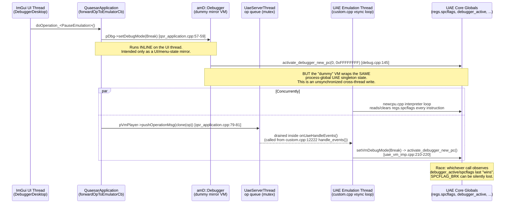
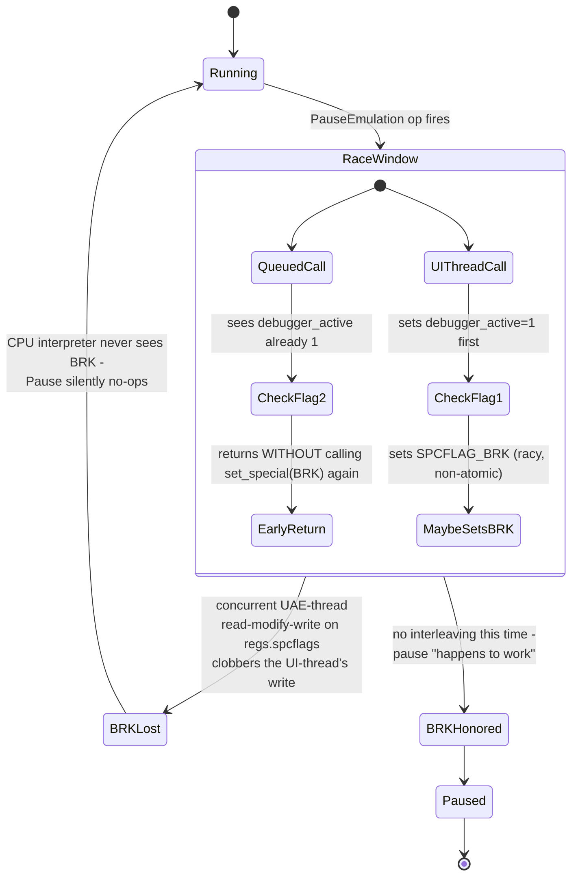
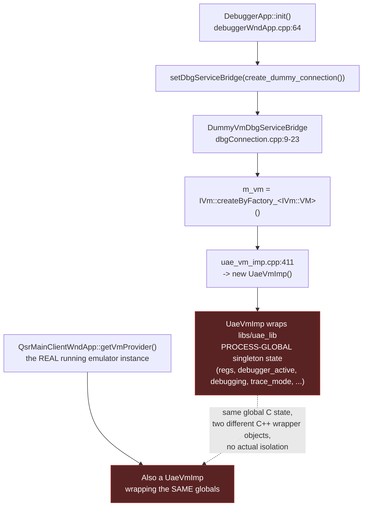
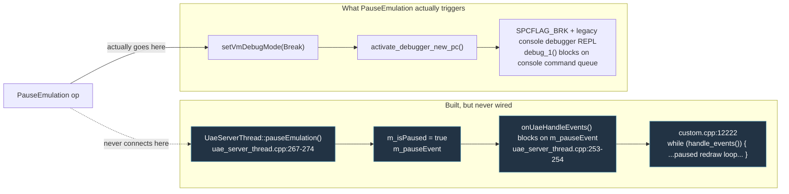
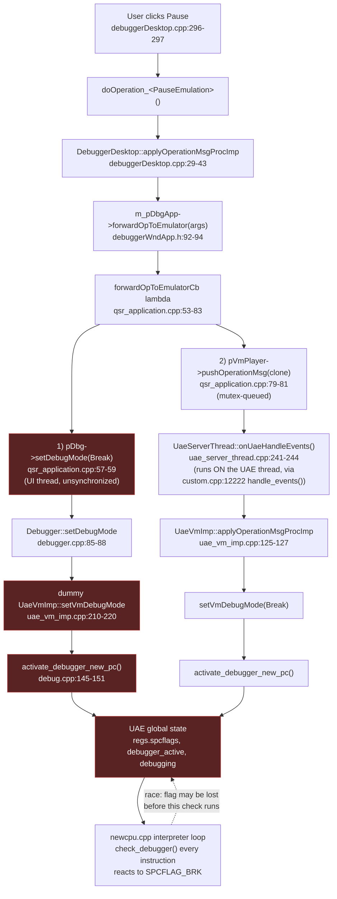
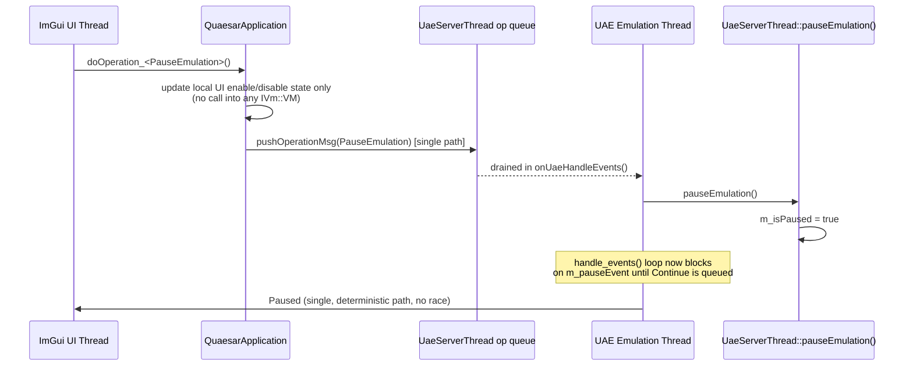

# Debugger Pause Bug: Root Cause Analysis & Fix Proposal

**Status:** Analysis complete, fix not yet implemented
**Branch:** `dbg-render-fix`
**Symptom:** Clicking Pause (or `Ctrl+F8`, or the Pause menu item) in the ImGui debugger window does not reliably stop UAE instance execution. The emulation keeps running (or the effect is inconsistent/timing-dependent) even though the UI reflects a "paused" state.

---

## 1. Summary

The Pause operation is delivered to the emulator **twice**, through two different code paths, from two different threads:

1. An **immediate, unsynchronized, UI-thread call** into UAE's core (intended only to update a menu-mirroring "dummy" VM).
2. A **correctly queued call**, drained later on the UAE emulation thread.

Because UAE's core (`libs/uae_lib`) is legacy C code with **process-global singleton state** (`regs.spcflags`, `debugger_active`, `debugging`, `trace_mode`, etc. — not per-instance), path (1) is not actually isolated to a "dummy" object as intended. It reaches into and mutates the *same* global engine state that the real UAE thread is concurrently reading and writing. This is an unsynchronized cross-thread race on non-atomic global flags, and it can silently prevent `SPCFLAG_BRK` from ever being observed by the CPU interpreter loop — making Pause appear to do nothing.

A second, unrelated defect was also found: a fully-implemented, purpose-built pause mechanism (`UaeServerThread::pauseEmulation()` / `m_isPaused` / `m_pauseEvent`) exists but is **never called from anywhere** — it is dead code that the `PauseEmulation` operation was apparently intended to use, but never got wired to.

---

## 2. How Pause is *supposed* to work today



---

## 3. Why the race breaks Pause

`activate_debugger()` (`libs/uae_lib/debug.cpp:114-137`) contains an early-return guard:

```c
void activate_debugger (void)
{
    disasm_init();
    if (isfullscreen() > 0)
        return;

    debugger_load_libraries();

    debugger_used = 1;
    inside_debugger = 1;
    debug_pc = 0xffffffff;
    trace_mode = 0;
    if (debugger_active) {
        // already in debugger but some break point triggered
        // during disassembly etc..
        return;                      // <-- can return BEFORE set_special(SPCFLAG_BRK)
    }
    debug_cycles(1);
    debugger_active = 1;
    set_special (SPCFLAG_BRK);       // <-- the actual "stop the CPU" signal
    debugging = 1;
    mmu_triggered = 0;
    debugmem_disable();
}
```



Key points:

- `regs.spcflags` is a **plain, non-atomic `int`**, read and read-modify-written by the UAE interpreter loop (`libs/uae_lib/newcpu.cpp`) on essentially every instruction.
- The UI-thread call to `activate_debugger_new_pc()` is **not synchronized** with any of that — no mutex, no memory barrier, no queue.
- `activate_debugger()`'s own reentrancy guard (`if (debugger_active) return;`) means whichever of the two calls (UI-thread or UAE-thread-queued) runs second is short-circuited and never reaches `set_special(SPCFLAG_BRK)` at all — so only one of the two calls ever has a chance to actually raise the flag, and *that* one is racing non-atomically against the interpreter's own flag manipulation.
- Additionally, `activate_debugger()` calls `disasm_init()` and `debugger_load_libraries()` — file I/O and buffer setup — from whichever thread invokes it, which is itself unsafe to run concurrently with the UAE thread's own use of that state.

---

## 4. Why the "dummy" VM isn't actually a dummy



The comment at `qsr_application.cpp:54` (*"Mirror debug mode to the Debugger's dummy VM for menu enable/disable state"*) reveals the original intent: this call was meant to update UI-only state so the Pause/Continue menu items enable/disable correctly, with zero effect on the actual emulator. That assumption is false for the UAE backend, because UAE has no notion of "instances" — there is one interpreter, one set of globals, and *any* `UaeVmImp` object (dummy or real) commands the same engine.

(Note: for the vAmiga backend this is not a problem, since vAmiga's `VAmiga::pause()`/`run()` go through a proper per-instance command queue rather than global C state — see `libs/vAmiga_imp_lib/src/qvAmigaImp/va_vm_imp.cpp:238-244`. This bug is UAE-backend-specific.)

---

## 5. The dead, purpose-built pause mechanism

A cleaner pause mechanism already exists in `UaeServerThread` but is never invoked:



`onUaeHandleEvents()` always returns `false` (`uae_server_thread.cpp:264`), so the `while (handle_events())` paused-redraw loop in `custom.cpp:12222-12234` never executes its body — confirming `pauseEmulation()` has no live callers today.

---

## 6. Full current call graph (as-is)



---

## 7. Distinct pause-related state (reference)

| State | Set at | Read at |
|---|---|---|
| `regs.spcflags & SPCFLAG_BRK` | `set_special()` calls in `debug.cpp` (multiple sites) | `newcpu.cpp` interpreter loop, every instruction |
| `debugger_active` (global int) | `activate_debugger()` / `deactivate_debugger()` (`debug.cpp`) | `qsr_application.cpp:67` routing decision; `UaeVmImp::Emu::isDebugActivated()` |
| `debugging` (global int) | `activate_debugger()` / `deactivate_debugger()` | `newcpu.cpp` BRK handlers |
| `IVm::EVmDebugMode` (Live/Break) | `setVmDebugMode()` in both `UaeVmImp` and `VaVmImp`, and the dummy mirror VM in `debugger.cpp` | UI enable/disable state (`debuggerDesktop.cpp:74,287-288`) |
| `UaeServerThread::m_isPaused` / `m_pauseEvent` | `pauseEmulation()` (never called) | `onUaeHandleEvents()` — dead path |
| vAmiga `Thread::state` (`ExecState`) | `switchState()` (`Thread.cpp`) | `isRunning()`/`isPaused()` — correct, per-instance, unaffected by this bug |

---

## 8. Proposed fix

Two independent problems, two independent fixes. Both are recommended.

### 8.1 Stop the UI thread from touching live UAE engine state

`qsr_application.cpp:53-62` should not call `setVmDebugMode()` on the dummy/mirror VM for backends whose engine is a process-global singleton. Options, in order of preference:

1. **Remove the dummy-VM mutation entirely.** Drive the Pause/Continue menu enable state from the *real* running VM's `EVmDebugMode` (already queryable via `pVmPlayer`/`getVmProvider()`), instead of maintaining a separate shadow VM. This removes the second, racy call path outright.
2. If the dummy-VM indirection must stay (e.g. for cases where no real VM is attached yet), make `Debugger::setDebugMode()` a **pure UI-state setter** (store an enum locally) rather than forwarding into `IVm::VM::setVmDebugMode()`, since for UAE that call is not actually side-effect-free.

### 8.2 Wire Pause to the existing (currently dead) safe mechanism

Reuse `UaeServerThread::pauseEmulation()` / `m_isPaused` / `m_pauseEvent` instead of `activate_debugger_new_pc()` for the plain "Pause" operation:

- It already integrates correctly with the `custom.cpp:12222` `while (handle_events())` paused-redraw loop.
- It avoids the legacy `debug_1()` console-REPL entirely for a simple pause (that path should remain reserved for the actual step/trace/console-debugging operations, which do need it).
- It requires only completing the wiring: route `PauseEmulation`/its resume counterpart through `pauseEmulation()`/`resumeEmulation()` on the UAE thread (already queue-drained on-thread, so no new synchronization is needed) instead of `setVmDebugMode(Break)`.

### 8.3 Suggested corrected flow



---

## 9. Files referenced

- `src/quasar_app/qsr_application.cpp` (op forwarding, the racy inline call)
- `libs/amDebugger/src/amDebugger/debugger.cpp` (`setDebugMode`, `getVm`)
- `libs/amDebugger/src/amDebugger/dbgConnection.cpp` / `.h` (dummy VM construction)
- `libs/amDebugger/src/amDebugger/debuggerWndApp.cpp` (`DebuggerApp::init`)
- `libs/amDebugger/src/amDebugger/ui/debuggerDesktop.cpp` (Pause button/menu/shortcut)
- `src/quasar_app/uae_imp/uae_vm_imp.cpp` (`setVmDebugMode`, `applyOperationMsgProcImp`)
- `src/quasar_app/uae_imp/uae_server_thread.cpp` (op queue, `onUaeHandleEvents`, dead `pauseEmulation`/`m_isPaused`)
- `libs/uae_lib/debug.cpp` (`activate_debugger`, `activate_debugger_new_pc`, `debug_1`)
- `libs/uae_lib/newcpu.cpp` (`check_debugger`, SPCFLAG_BRK checks)
- `libs/uae_lib/custom.cpp:12222` (`handle_events()` vsync loop, paused-redraw loop)
- `libs/vAmiga_imp_lib/src/qvAmigaImp/va_vm_imp.cpp` (unaffected vAmiga backend, for comparison)
