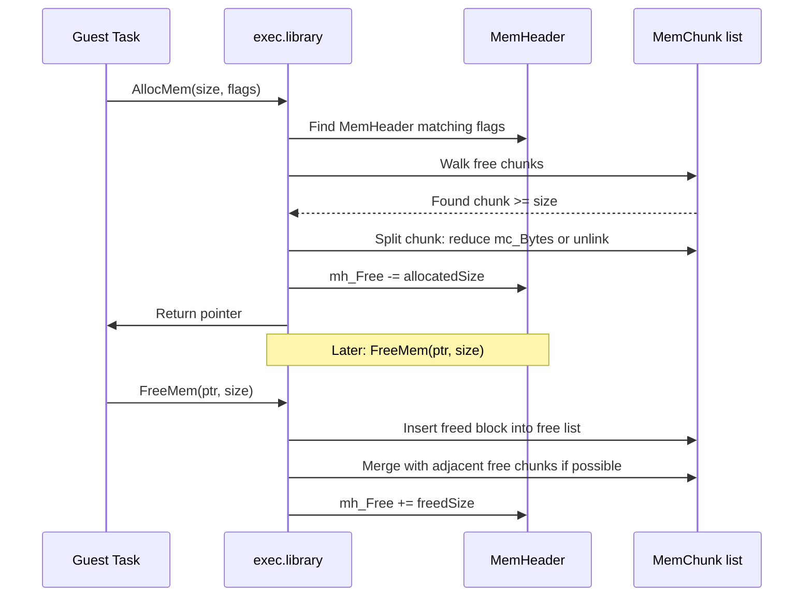
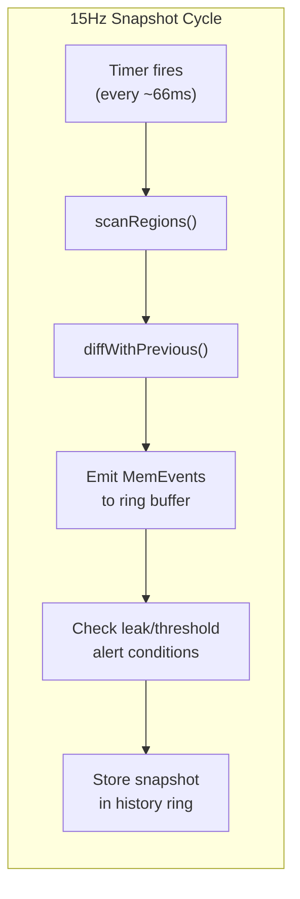
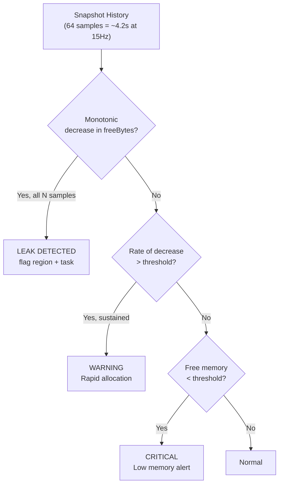
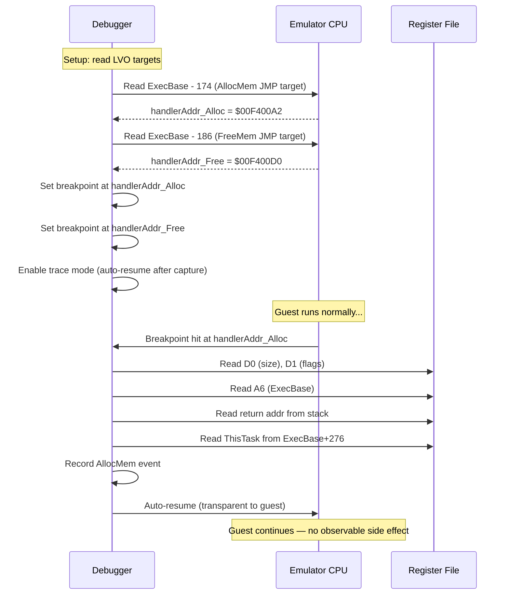
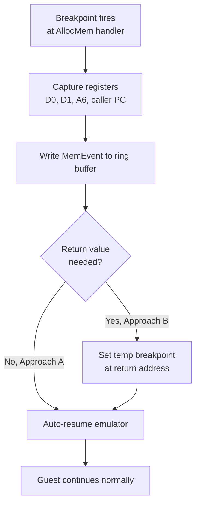
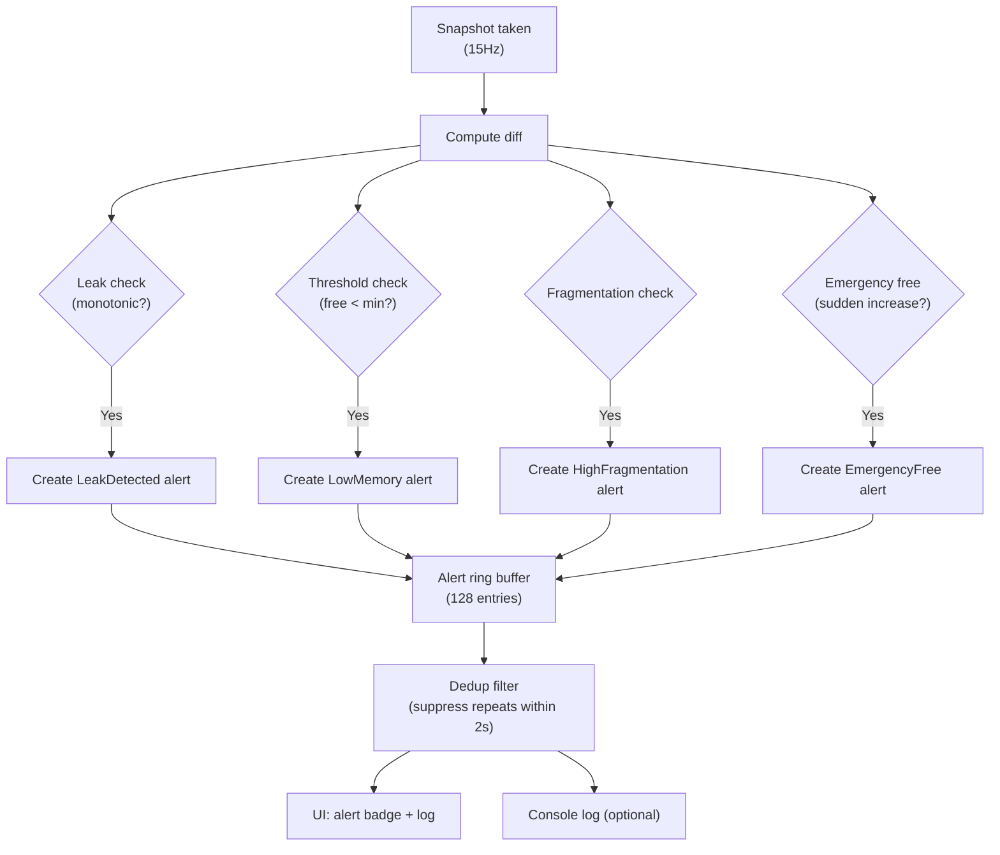
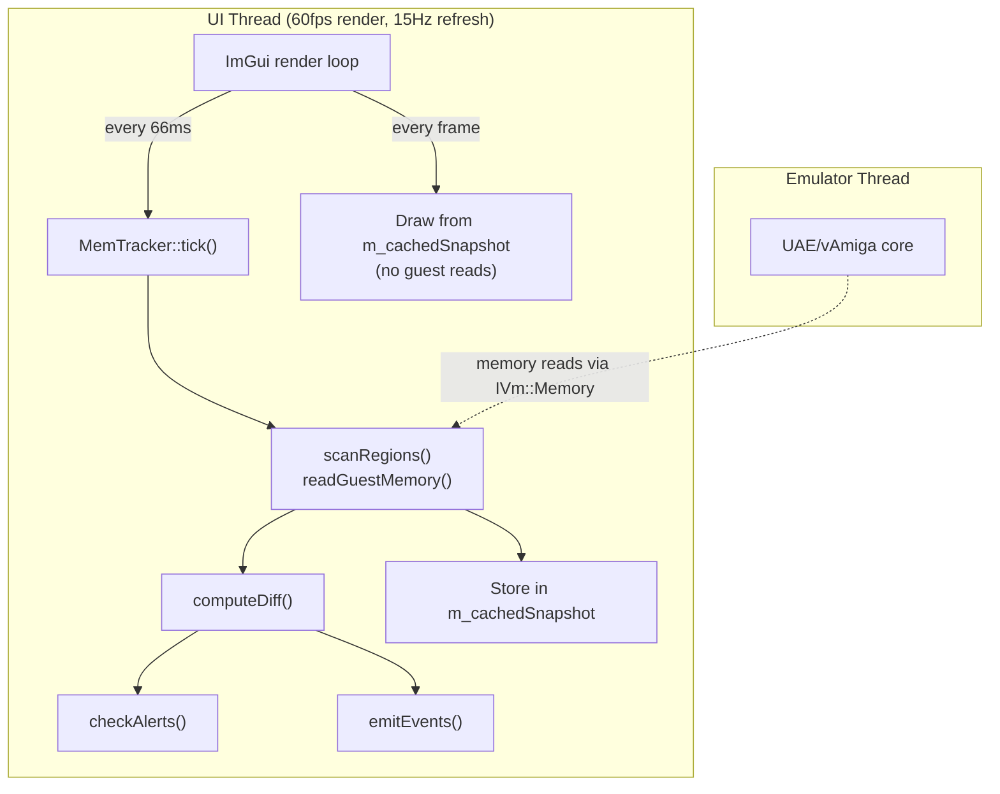
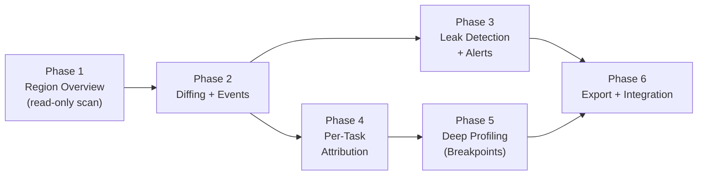

# AmigaOS Memory Tracker Design

Design for a debugger subsystem that tracks AmigaOS-managed memory allocations, computes per-region and per-task usage counters, and detects memory leaks — all with **zero emulator performance overhead** and minimal host-side memory cost.

This extends the existing [OsIntrospector](../libs/amDebugger/src/amDebugger/os/os_introspector.h) into the memory domain. Unlike task control (which writes guest memory), memory tracking is **read-only** — it snapshots guest memory structures at periodic intervals and analyzes diffs on the host side. An optional deep-profiling mode (execution breakpoints) can be toggled for per-allocation accuracy.

---

## Table of Contents

- [1. AmigaOS Memory Management Internals](#1-amigaos-memory-management-internals)
- [2. Requirements & Use Cases](#2-requirements--use-cases)
- [3. Snapshot-Based Memory Scanning (Read Path)](#3-snapshot-based-memory-scanning-read-path)
- [4. Per-Task Memory Tracking](#4-per-task-memory-tracking)
- [5. Leak Detection via Snapshot Diffing](#5-leak-detection-via-snapshot-diffing)
- [6. Deep Profiling Mode: Execution Breakpoints](#6-deep-profiling-mode-execution-breakpoints)
- [7. Alert & Trigger System](#7-alert--trigger-system)
- [8. Threading & Performance Model](#8-threading--performance-model)
- [9. UI Layout](#9-ui-layout)
- [10. Module Placement & Code Skeletons](#10-module-placement--code-skeletons)
- [11. Implementation Phases](#11-implementation-phases)

---

## 1. AmigaOS Memory Management Internals

AmigaOS uses a region-based allocator. Understanding its data structures is essential for tracking memory usage without modifying guest behavior.

### 1.1 Memory Regions (MemHeader)

ExecBase maintains a linked list of `MemHeader` structs, each describing a contiguous physical memory region. The list head is at `ExecBase + 0x0142` (offset 322), confirmed in [ks_offsets.h](../libs/amDebugger/src/amDebugger/os/ks_offsets.h) as `memListOffset`.

```c
struct MemHeader {          // Size: 32 bytes
    struct Node mh_Node;    // +0:  Node (ln_Type = NT_MEMORY = 10)
    ULONG mh_Attributes;   // +14: MEMF_CHIP, MEMF_FAST, MEMF_PUBLIC, ...
    APTR  mh_First;        // +16: Pointer to first MemChunk (free list head)
    APTR  mh_Lower;        // +20: Region start address
    APTR  mh_Upper;        // +24: Region end address
    ULONG mh_Free;          // +28: Total free bytes in this region
};
```

> **Offset verification:** The `filesys.asm` code in [filesys.asm](../libs/uae_lib/filesys.asm#L437) confirms: `lea 322(a6),a0 ; MemHeader`, `move.l 20(a0),d1 ; mh_Lower`, `add.l d0,28(a0) ; mh_Free`, `move.l 16(a0),a0 ; mh_First`. These offsets are identical across KS 1.2–3.2.

### 1.2 Free Chunks (MemChunk)

Within each `MemHeader`, free memory is tracked as a singly-linked list of `MemChunk` nodes:

```c
struct MemChunk {
    APTR  mc_Next;    // +0: Pointer to next free chunk (NULL = end)
    ULONG mc_Bytes;   // +4: Size of this free chunk in bytes
};
```

When `AllocMem()` is called, exec walks the `MemChunk` list to find a suitable block, splits it (or removes it entirely), and updates `mh_Free`. When `FreeMem()` is called, exec inserts the block back into the free list, possibly merging with adjacent free chunks.

### 1.3 Memory Allocation Flow



### 1.4 Task-Level Memory Tracking (tc_MemEntry)

Each Task struct has a `tc_MemEntry` list at offset +74 (confirmed in [OSDebuggerTypes.h](../libs/vAmiga/Core/Misc/OSDebugger/OSDebuggerTypes.h#L325)):

```c
struct Task {
    // ...
    struct List tc_MemEntry;  // +74: Memory entries owned by this task
    // ...
};
```

When a task calls `AllocMem()` with `MEMF_CLEAR` or uses `AddMemList()`, the allocation is linked into `tc_MemEntry`. **This is the key to per-task memory tracking** — we can walk each task's `tc_MemEntry` list to enumerate its allocations.

However, not all allocations go through `tc_MemEntry` — only those that are explicitly associated with a task via `AddMemList()`. Direct `AllocMem()` calls are tracked in the MemHeader free list but not in `tc_MemEntry`. This means:

| Tracking Method | What it catches | What it misses |
|---|---|---|
| **MemHeader scan** | Total free/used per region — always accurate | Per-task attribution |
| **tc_MemEntry scan** | Per-task allocations registered via AddMemList | Direct AllocMem calls (most common) |
| **Snapshot diffing** | Net change between two time points | Individual allocation attribution |

### 1.5 Memory Attribute Flags

```c
#define MEMF_PUBLIC   0x0001   // Public memory (accessible from interrupts)
#define MEMF_CHIP     0x0002   // Chip memory (DMA accessible)
#define MEMF_FAST     0x0004   // Fast memory
#define MEMF_LOCAL    0x0100   // Local memory (not auto-config)
#define MEMF_24BITDMA 0x0200   // 24-bit DMA accessible
#define MEMF_CLEAR    0x10000  // Clear memory on allocation
#define MEMF_LARGEST  0x20000  // Return largest available
#define MEMF_REVERSE  0x40000  // Allocate from top down
#define MEMF_TOTAL    0x80000  // Return total memory
```

### 1.6 Available exec.library LVOs

From [fd_tables.h](../libs/amDebugger/src/amDebugger/os/fd_tables.h):

| LVO | Offset | Function |
|---|---|---|
| AllocMem | -174 | Allocate memory from a region |
| AllocAbs | -180 | Allocate at a specific address |
| FreeMem | -186 | Free previously allocated memory |
| AvailMem | -198 | Query available memory (with flags) |
| AllocEntry | -210 | Allocate a named MemList entry |
| FreeEntry | -216 | Free a MemList entry |

---

## 2. Requirements & Use Cases

### 2.1 Functional Requirements

| # | Requirement |
|---|---|
| R1 | **Region overview:** Display all MemHeader regions with name, attributes (chip/fast/public), address range, total size, free bytes, and used percentage. |
| R2 | **Free chunk listing:** For each region, list individual free MemChunks with address and size — shows fragmentation. |
| R3 | **Per-task memory:** For each task, display allocations from its `tc_MemEntry` list with address, size, and type. |
| R4 | **Total memory counters:** Aggregate counters: total chip, total fast, total free, total used, fragmentation ratio. Updated at 15Hz. |
| R5 | **Allocation/free event log:** A rolling log of detected allocation and free events (address, size, task). Captured via snapshot diffing, not guest hooks. |
| R6 | **Leak detection:** Detect sustained memory growth patterns over a configurable time window. Flag potential leaks when growth is monotonic over N consecutive samples. |
| R7 | **Threshold alerts:** Configurable alerts when free memory drops below an absolute threshold (e.g., < 16KB chip free) or relative threshold (< 10% of region). |
| R8 | **Emergency free tracking:** Detect and log when AmigaOS performs emergency cleanup (e.g., `FreeMem` calls from resource tracking, `RemTask` stack freeing). |
| R9 | **Zero emulator overhead:** Default mode (snapshot scanning) must not modify guest memory or inject any guest-side code. All analysis happens on the debugger thread. |
| R10 | **Bounded host memory:** The event log and snapshot history must use ring buffers with configurable size limits. Host memory cost must be O(buffer_size), not O(allocations). |
| R11 | **Deep profiling mode (optional):** An optional mode uses the emulator's execution breakpoint infrastructure to track individual AllocMem/FreeMem calls with exact caller PC and task attribution. Transparent to the guest — no code modification. Toggled off by default. |

### 2.2 Use Cases

```mermaid
graph TB
    subgraph "Debugging a memory leak"
        L1["Program runs for 10 min<br/>chip RAM slowly decreases"] --> L2["Memory panel shows<br/>monotonic growth pattern"]
        L2 --> L3["Alert: Suspected leak<br/>in task: myprogram"]
        L3 --> L4["Inspect tc_MemEntry<br/>for myprogram"]
        L4 --> L5["Find un-freed AllocMem<br/>at $00234568 (4KB)"]
    end

    subgraph "Fragmentation analysis"
        F1["Program allocates/frees<br/>many small blocks"] --> F2["Total free = 100KB<br/>but largest chunk = 2KB"]
        F2 --> F3["Alert: High fragmentation<br/>largest free chunk < 4KB"]
    end

    subgraph "Emergency resource exhaustion"
        E1["Free chip RAM<br/>drops below 16KB"] --> E2["Threshold alert fires"]
        E2 --> E3["Task panel shows<br/>which task owns most memory"]
        E3 --> E4["Kill offending task<br/>to free memory"]
    end
```



### 2.3 Non-Goals

- **NOT** a replacement for AmigaOS's own memory management — we don't intercept or redirect any allocation.
- **NOT** a heap profiler for a specific allocator (like Enforcer or MuForce) — those use MMU tricks or trap-based patching.
- **NOT** a per-instruction memory access tracker (that's the watchpoint/breakpoint system).
- **NOT** a guest-side tool — everything runs on the host/debugger side.

---

## 3. Snapshot-Based Memory Scanning (Read Path)

The core insight for zero-overhead tracking: **we don't need to intercept allocations**. AmigaOS maintains its memory state in well-defined data structures (MemHeader/MemChunk). We periodically read these structures from guest memory and build a snapshot on the host. All analysis (diffing, leak detection, alerting) happens on the snapshot, never touching the emulator.

### 3.1 Data Model

```cpp
// mem_tracker_info.h

struct MemChunkInfo {
    uint32_t address;   // mc_Next (self-address of the chunk)
    uint32_t bytes;     // mc_Bytes
};

struct MemRegionInfo {
    uint32_t    headerAddr;     // Address of the MemHeader struct
    std::string name;           // mh_Node.ln_Name
    uint16_t    attributes;     // mh_Attributes
    uint32_t    lower;          // mh_Lower
    uint32_t    upper;          // mh_Upper
    uint32_t    totalSize;      // upper - lower
    uint32_t    freeBytes;      // mh_Free (cached from MemHeader)
    uint32_t    usedBytes;      // totalSize - freeBytes
    float       usedPercent;    // usedBytes / totalSize * 100
    uint32_t    largestFreeChunk;// Max mc_Bytes across all free chunks
    uint32_t    freeChunkCount; // Number of MemChunk entries
    std::vector<MemChunkInfo> freeChunks; // Detailed chunk list (only when expanded)
};

struct MemSnapshot {
    double timestamp = 0.0;     // ImGui::GetTime() when taken
    std::vector<MemRegionInfo> regions;

    // Aggregate counters (computed from regions)
    uint32_t totalChip = 0, usedChip = 0, freeChip = 0;
    uint32_t totalFast = 0, usedFast = 0, freeFast = 0;
    uint32_t totalAll  = 0, usedAll  = 0, freeAll  = 0;
    float    fragmentationRatio = 0.0f; // 1.0 - (largestFree / totalFree)
};

struct MemEvent {
    enum class Type : uint8_t { Alloc, Free, EmergencyFree, FragmentationChange };
    Type      type;
    double    timestamp;
    uint32_t  regionAddr;       // Which MemHeader
    uint32_t  address;          // Block address (approximate)
    uint32_t  sizeDelta;        // Bytes allocated/freed (positive = alloc, negative = free)
    uint32_t  taskAddr;         // Owning task (0 if unknown)
};

struct TaskMemEntry {
    uint32_t address;           // me_Addr from MemList entry
    uint32_t length;            // me_Length
    uint32_t attributes;        // me_Reqs
};

struct TaskMemoryInfo {
    uint32_t    taskAddr;
    std::string taskName;
    std::vector<TaskMemEntry> entries;
    uint32_t    totalAllocated; // Sum of all entry lengths
};
```

### 3.2 MemHeader Scan Algorithm

```cpp
std::vector<MemRegionInfo> MemTracker::scanRegions() {
    std::vector<MemRegionInfo> regions;

    uint32_t execBase = m_intro->readU32(0x00000004);
    const auto* off = m_intro->getOffsets();

    // MemList is a List at ExecBase + memListOffset (0x0142)
    uint32_t listAddr = execBase + off->memListOffset;
    uint32_t head = m_intro->readU32(listAddr + 0);     // lh_Head
    uint32_t tailPred = m_intro->readU32(listAddr + 8);  // lh_TailPred

    if (head == 0 || head == (listAddr + 4)) return regions; // Empty

    uint32_t mh = head;
    int maxRegions = 16;  // Safety: AmigaOS typically has 2-6 regions
    while (mh != 0 && mh != (listAddr + 4) && maxRegions-- > 0) {
        MemRegionInfo region = readMemHeader(mh);
        regions.push_back(region);
        mh = m_intro->readU32(mh + 0);  // mh_Node.ln_Succ
    }

    return regions;
}
```

### 3.3 Reading a MemHeader + Free Chunk Walk

```cpp
MemRegionInfo MemTracker::readMemHeader(uint32_t mhAddr) {
    MemRegionInfo r{};
    r.headerAddr = mhAddr;

    // struct Node at +0: ln_Succ(0), ln_Pred(4), ln_Type(8), ln_Pri(9), ln_Name(10)
    uint32_t namePtr = m_intro->readU32(mhAddr + 10);
    r.name = m_intro->readCString(namePtr, 32);

    r.attributes  = m_intro->readU16(mhAddr + 14);
    r.lower       = m_intro->readU32(mhAddr + 20);
    r.upper       = m_intro->readU32(mhAddr + 24);
    r.freeBytes   = m_intro->readU32(mhAddr + 28);
    r.totalSize   = r.upper - r.lower;
    r.usedBytes   = r.totalSize - r.freeBytes;
    r.usedPercent = r.totalSize > 0
        ? (float)r.usedBytes / r.totalSize * 100.0f
        : 0.0f;

    // Walk free chunk list to compute fragmentation
    r.largestFreeChunk = 0;
    r.freeChunkCount   = 0;

    uint32_t mc = m_intro->readU32(mhAddr + 16);  // mh_First
    int maxChunks = 256;  // Safety guard
    while (mc != 0 && maxChunks-- > 0) {
        uint32_t chunkBytes = m_intro->readU32(mc + 4);
        if (chunkBytes > r.largestFreeChunk)
            r.largestFreeChunk = chunkBytes;
        r.freeChunkCount++;
        // Optionally store for detailed view:
        // r.freeChunks.push_back({mc, chunkBytes});
        mc = m_intro->readU32(mc + 0);  // mc_Next
    }

    return r;
}
```

### 3.4 Snapshot Cadence & Ring Buffer



The snapshot history is a ring buffer of configurable depth:

```cpp
class MemTracker {
    static constexpr int kDefaultHistoryDepth = 64;  // ~4.2s at 15Hz
    std::vector<MemSnapshot> m_history;  // Ring buffer
    int m_historyHead = 0;
    int m_historyCount = 0;

    void pushSnapshot(MemSnapshot snap) {
        if (m_historyCount < (int)m_history.size()) {
            m_history[m_historyHead] = snap;
            m_historyCount++;
        } else {
            m_history[m_historyHead] = snap;  // Overwrite oldest
        }
        m_historyHead = (m_historyHead + 1) % m_history.size();
    }
};
```

> **Host memory cost:** Each `MemSnapshot` is ~200 bytes (4-6 regions × ~40 bytes each). At depth 64, the history uses ~12.8KB. The event ring buffer at 1024 events × 24 bytes = ~24KB. Total host cost: **under 40KB**.

### 3.5 Fragmentation Computation

Fragmentation ratio measures how much the free memory is "splintered":

```
fragmentationRatio = 1.0 - (largestFreeChunk / totalFree)
```

- **0.0** = all free memory is one contiguous block (perfect)
- **0.9** = the largest free block is only 10% of total free (heavily fragmented)

This is computed per-region and aggregated across all regions.

---

## 4. Per-Task Memory Tracking

### 4.1 Walking tc_MemEntry

For each task (scanned by the Task Controller from the task control design), we walk its `tc_MemEntry` list:

```cpp
std::vector<TaskMemoryInfo> MemTracker::scanTaskMemory(
        const std::vector<TaskInfo>& tasks) {
    std::vector<TaskMemoryInfo> result;

    for (const auto& task : tasks) {
        TaskMemoryInfo tmi{};
        tmi.taskAddr = task.taskAddr;
        tmi.taskName = task.name;

        // tc_MemEntry is a List at Task + 74
        uint32_t listAddr = task.taskAddr + 74;
        uint32_t head = m_intro->readU32(listAddr + 0);  // lh_Head

        uint32_t node = head;
        int maxEntries = 64;  // Safety guard
        uint32_t total = 0;

        while (node != 0 && node != (listAddr + 4) && maxEntries-- > 0) {
            // struct MemList:
            //   +0:  Node (14 bytes)
            //   +14: UWORD ml_NumEntries
            //   +16: struct MemEntry[] ml_ME
            //
            // struct MemEntry:
            //   +0: ULONG me_Reqs (allocation flags)
            //   +4: APTR  me_Addr (allocated address)
            //   +8: ULONG me_Length (allocated size)

            uint16_t numEntries = m_intro->readU16(node + 14);
            uint32_t meBase = node + 16;

            for (int i = 0; i < numEntries && i < 16; i++) {
                uint32_t entryAddr = meBase + i * 12;
                TaskMemEntry entry{};
                entry.attributes = m_intro->readU32(entryAddr + 0);
                entry.address    = m_intro->readU32(entryAddr + 4);
                entry.length     = m_intro->readU32(entryAddr + 8);
                tmi.entries.push_back(entry);
                total += entry.length;
            }

            tmi.totalAllocated = total;
            node = m_intro->readU32(node + 0);  // ln_Succ
        }

        result.push_back(tmi);
    }

    return result;
}
```

### 4.2 Per-Task Attribution Limitations

The `tc_MemEntry` list only contains allocations explicitly registered via `AddMemList()` / `AllocEntry()`. The vast majority of AmigaOS programs use plain `AllocMem()`, which does **not** register in `tc_MemEntry`.

**Strategy for per-task attribution without hooks:**

| Method | Accuracy | How |
|---|---|---|
| `tc_MemEntry` walk | High for registered entries, misses most | Direct struct read |
| Stack-segment estimation | Approximate | Sum seglist segment sizes for processes |
| Diff attribution | Indirect | When free memory drops by X, attribute to currently-running task (ThisTask) |
| Deep profiling (§6) | Exact | Execution breakpoints capture caller PC + ThisTask per-call |

**Phase 1-2** uses `tc_MemEntry` + seglist estimation for an approximate view. **Phase 4** adds deep profiling for exact attribution.

### 4.3 Snapshot-Diff Attribution Heuristic

When the snapshot shows free memory decreased, and the currently-running task changed between snapshots, we can use a heuristic:

```cpp
// Between snapshot N and N+1, freeChip decreased by 4KB
// ThisTask in snapshot N: "myprogram"
// → Likely allocation event: myprogram allocated ~4KB of chip RAM
//
// This is approximate — multiple allocations/frees can cancel out.
// Only used for the event log display, not for precise accounting.
```

---

## 5. Leak Detection via Snapshot Diffing

### 5.1 Diff Algorithm

Each new snapshot is compared against the previous one to detect changes:

```cpp
struct MemDiff {
    double timestamp;

    // Per-region changes
    struct RegionChange {
        uint32_t regionAddr;
        int32_t  freeDelta;        // Positive = memory freed, negative = allocated
        int32_t  chunkCountDelta;  // Fragmentation change
    };
    std::vector<RegionChange> regions;

    // Aggregate
    int32_t netChipDelta = 0;
    int32_t netFastDelta = 0;
    int32_t netTotalDelta = 0;
    uint32_t thisTaskAddr = 0;    // Who was running during this interval
};

MemDiff MemTracker::computeDiff(const MemSnapshot& prev, const MemSnapshot& curr) {
    MemDiff diff{};
    diff.timestamp = curr.timestamp;

    for (const auto& cr : curr.regions) {
        // Find matching region in previous snapshot
        for (const auto& pr : prev.regions) {
            if (pr.headerAddr == cr.headerAddr) {
                int32_t delta = (int32_t)cr.freeBytes - (int32_t)pr.freeBytes;
                if (delta != 0) {
                    diff.regions.push_back({
                        cr.headerAddr,
                        delta,
                        (int32_t)cr.freeChunkCount - (int32_t)pr.freeChunkCount
                    });

                    if (cr.attributes & MEMF_CHIP)
                        diff.netChipDelta += delta;
                    else
                        diff.netFastDelta += delta;
                    diff.netTotalDelta += delta;
                }
                break;
            }
        }
    }

    return diff;
}
```

### 5.2 Leak Detection Heuristics

Leak detection analyzes the snapshot history ring buffer for patterns:



**Specific detection rules:**

| Rule | Condition | Window | Alert Level |
|---|---|---|---|
| Monotonic leak | `freeBytes[i] < freeBytes[i-1]` for all i in window | N=8 (~0.5s) | **LEAK** — sustained growth detected |
| Rapid allocation | `totalAllocated / interval > rate_threshold` | 4 samples (~0.25s) | **WARNING** — possible runaway |
| Low memory | `freeChip < abs_threshold` (default: 16KB) or `freePercent < rel_threshold` (default: 5%) | Current sample | **CRITICAL** — exhaustion imminent |
| High fragmentation | `fragmentationRatio > 0.85` and `totalFree > 32KB` | Current sample | **WARNING** — defrag needed |
| Emergency free event | `freeBytes` suddenly **increases** by > 1KB | Single sample | **INFO** — system freed resources (RemTask, library expunge, etc.) |

### 5.3 Leak Attribution

When a leak is detected, the tracker attributes it to a task using the heuristic from §4.3:

```cpp
void MemTracker::checkLeak() {
    if (m_historyCount < 8) return;

    // Get last 8 snapshots
    auto samples = getLastSnapshots(8);

    // Check for monotonic decrease
    bool monotonic = true;
    uint32_t totalDecrease = 0;
    for (int i = 1; i < 8; i++) {
        if (samples[i].freeAll >= samples[i-1].freeAll) {
            monotonic = false;
            break;
        }
        totalDecrease += samples[i-1].freeAll - samples[i].freeAll;
    }

    if (monotonic && totalDecrease > 256) {  // > 256 bytes over ~0.5s
        // Attribute to ThisTask from most recent snapshot
        // (requires cross-reference with TaskController)
        MemAlert alert{};
        alert.type = MemAlert::Type::LeakDetected;
        alert.regionAddr = 0;  // System-wide
        alert.rateBytesPerSec = totalDecrease / (8.0 / 15.0);
        alert.taskAddr = m_lastThisTaskAddr;
        alert.taskName = m_lastThisTaskName;
        pushAlert(alert);
    }
}
```

### 5.4 Emergency Free Detection

AmigaOS performs emergency cleanup in several scenarios:
- `RemTask()` frees the task's stack and struct memory
- `CloseLibrary()` with `LIBF_DELEXP` triggers library expunge
- `AvailMem(MEMF_CLEAR)` type operations
- System alert handlers may force-free resources

These appear in our diffs as **sudden increases in freeBytes**:

```cpp
void MemTracker::detectEmergencyFree(const MemDiff& diff) {
    for (const auto& rc : diff.regions) {
        if (rc.freeDelta > 1024) {  // Sudden increase > 1KB
            MemEvent event{};
            event.type = MemEvent::Type::EmergencyFree;
            event.timestamp = diff.timestamp;
            event.regionAddr = rc.regionAddr;
            event.sizeDelta = rc.freeDelta;
            event.taskAddr = diff.thisTaskAddr;
            pushEvent(event);
        }
    }
}
```

---

## 6. Deep Profiling Mode: Execution Breakpoints

When the snapshot-based approach isn't precise enough (e.g., need exact per-call attribution), the optional deep profiling mode uses the **emulator's native breakpoint infrastructure** to intercept `AllocMem`/`FreeMem` calls.

Unlike native-hardware tools (Enforcer, MuForce) that must inject trampolines or patch LVO jump tables, an emulator has full control over CPU execution. We simply set execution breakpoints at the exec.library function handler addresses and read register values directly from the host side when they fire. **Zero guest code modification.**

### 6.1 How It Works

Each exec.library LVO slot at `ExecBase - offset` contains a `JMP <handler>` instruction. We read the handler target address from the LVO, then set an execution breakpoint at that address:



### 6.2 Register Capture Map

When a breakpoint fires at a function handler, the m68k register conventions give us the full call signature:

| Function | Registers on Entry | Return Value |
|---|---|---|
| **AllocMem** | `D0` = byteSize, `D1` = requirements (flags), `A6` = ExecBase | `D0` = allocated memory pointer (0 = failure) |
| **AllocAbs** | `D0` = byteSize, `A1` = location, `A6` = ExecBase | `D0` = success/fail boolean |
| **FreeMem** | `A1` = memoryBase, `D0` = byteSize, `A6` = ExecBase | (void) |
| **AllocEntry** | `A1` = MemList pointer, `A6` = ExecBase | `D0` = MemList pointer (success) / error |
| **FreeEntry** | `A1` = MemList pointer, `A6` = ExecBase | (void) |

Additionally, we capture:
- **Caller PC:** Read the return address from the top of the stack (the value at `(A7)` after the JSR that called the LVO)
- **ThisTask:** Read from `ExecBase + 0x0114` (offset 276) — identifies which task made the call

### 6.3 Capturing Return Values

For `AllocMem`, we want the return value (allocated pointer in `D0`). Two approaches:

**Approach A: Entry-only (simpler)**

Capture input arguments at entry, then correlate with snapshot diffs to determine which block was allocated. No second breakpoint needed — the snapshot naturally shows the memory consumed.

**Approach B: Entry + return breakpoint (exact)**

When the entry breakpoint fires:
1. Read the return address from the stack: `uint32_t retAddr = mem->getU32(regs.A7);`
2. Set a temporary breakpoint at `retAddr`
3. Resume execution
4. When the temporary breakpoint fires, read `D0` — that's the allocated pointer
5. Remove the temporary breakpoint

This gives exact allocation address + size per call, enabling precise leak tracking (match each `AllocMem` with its `FreeMem` by address).

### 6.4 Trace Mode (Transparent Breakpoints)

The key to making breakpoints non-intrusive: the debugger captures registers and **auto-resumes** without stopping. The guest sees no observable side effect. This is conceptually similar to `strace`/`ltrace` on Linux — intercept, log, continue.



> **Performance note:** Each breakpoint hit causes a brief emulator pause (~microseconds to read registers), then immediately resumes. This is fundamentally different from the guest-side trampoline approach which adds ~20 m68k instructions per call. The emulator overhead is a host-side register read + ring buffer write — O(1), negligible.

### 6.5 Trade-offs

| Aspect | Snapshot Mode (default) | Deep Profiling (Breakpoints) |
|---|---|---|
| **Emulator overhead** | **Zero** — reads only | Brief pause per AllocMem/FreeMem call (register read + auto-resume) |
| **Accuracy** | Per-snapshot diffs, approximate | Per-call, exact — every allocation tracked |
| **Guest modification** | **None** | **None** — uses emulator's native breakpoint, no guest code touched |
| **When usable** | Always | When emulator is running (breakpoints need CPU execution to fire) |
| **Attribution** | Heuristic (ThisTask at time of diff) | Exact (caller PC + ThisTask captured per-call) |
| **Return value** | Inferred from diff | Exact (Approach B: return breakpoint reads D0) |
| **Host memory** | ~40KB | +~24KB host event buffer (no guest memory cost) |
| **Interference with user breakpoints** | None | Shares breakpoint slots — may conflict if user sets bp at same address |

### 6.6 Integration with Existing Breakpoint Infrastructure

The codebase already has a full breakpoint system:

- **UAE backend:** `breakpoint_node` array in [debug.h](../libs/uae_lib/include/debug.h), `BREAKPOINT_REG_PC` type with `BREAKPOINT_CMP_EQUAL` for address matching
- **vAmiga backend:** `Breakpoints` class in [MoiraDebugger.h](../libs/vAmiga/Core/Components/CPU/Moira/MoiraDebugger.h), `didReachBreakpoint(u32 addr)` callback
- **Abstracted as:** `amD::Breakpoint` with `addr1`, `addr2`, `enabled`, `reg` fields

The memory tracker's deep profiling mode uses these same mechanisms — it's just another consumer of the breakpoint system with an auto-resume policy:

```cpp
void MemTracker::enableDeepProfiling() {
    uint32_t execBase = m_intro->readU32(0x00000004);

    // Read the actual handler addresses from LVO jump tables
    // Each LVO contains: JMP <handler> = opcode 0x4EF9 + 4-byte address
    uint32_t allocMemHandler = m_intro->readU32(execBase - 174 + 2);  // skip JMP opcode
    uint32_t freeMemHandler  = m_intro->readU32(execBase - 186 + 2);

    // Set execution breakpoints at handler addresses
    m_bpAllocIdx = setTraceBreakpoint(allocMemHandler);
    m_bpFreeIdx  = setTraceBreakpoint(freeMemHandler);

    m_deepProfiling = true;
}

// Called by the breakpoint callback when a trace breakpoint fires
void MemTracker::onBreakpointHit(uint32_t addr) {
    if (addr == m_allocMemHandlerAddr) {
        // AllocMem entry — capture arguments
        auto* regs = m_vm->getRegisters();
        MemEvent event{};
        event.type = MemEvent::Type::Alloc;
        event.timestamp = ImGui::GetTime();
        event.sizeDelta = regs->D[0];           // byteSize
        event.address = regs->A[7];              // stack pointer (for return capture)
        event.taskAddr = m_intro->readU32(
            m_intro->readU32(4) + 276);          // ThisTask
        pushEvent(event);
    }
    // Auto-resume is handled by the debugger's trace mode
}
```

### 6.7 Safety Guarantees

- **Zero guest modification:** No code injection, no LVO patching, no memory writes. The guest is completely untouched.
- **Clean disable:** Removing breakpoints restores the emulator to its exact prior state.
- **No crash recovery needed:** Since nothing was modified in guest memory, there's nothing to restore after a crash or reset.
- **Breakpoint slot management:** Deep profiling uses dedicated breakpoint slots. If the user's breakpoints exhaust the available slots, deep profiling degrades gracefully (logs a warning, falls back to snapshot-only mode).
- **Conflict detection:** Before setting trace breakpoints, check if the user already has a breakpoint at the handler address — if so, don't double-set.

---

## 7. Alert & Trigger System

### 7.1 Alert Data Model

```cpp
struct MemAlert {
    enum class Type : uint8_t {
        LeakDetected,
        RapidAllocation,
        LowMemory,
        HighFragmentation,
        EmergencyFree,
        ThresholdReached,
    };
    enum class Severity : uint8_t { Info, Warning, Critical };

    Type      type;
    Severity  severity = Severity::Warning;
    double    timestamp;
    uint32_t  regionAddr;        // 0 = system-wide
    uint32_t  taskAddr;          // Best-effort attribution
    std::string taskName;
    double    rateBytesPerSec;   // For leak/allocation rate alerts
    uint32_t  currentFree;       // For threshold alerts
    uint32_t  thresholdValue;    // The threshold that was crossed
    std::string message;         // Human-readable description
};
```

### 7.2 Alert Pipeline



### 7.3 Alert Deduplication

To avoid flooding the UI, identical alerts within a 2-second window are suppressed:

```cpp
bool MemTracker::shouldSuppress(const MemAlert& alert) {
    for (const auto& existing : m_recentAlerts) {
        if (existing.type == alert.type &&
            existing.regionAddr == alert.regionAddr &&
            (alert.timestamp - existing.timestamp) < 2.0) {
            return true;  // Suppress — same alert within 2s
        }
    }
    m_recentAlerts.push_back(alert);
    // Trim old entries
    while (!m_recentAlerts.empty() &&
           (alert.timestamp - m_recentAlerts.front().timestamp) > 5.0) {
        m_recentAlerts.pop_front();
    }
    return false;
}
```

### 7.4 Configurable Triggers

Users can configure trigger thresholds from the UI:

| Trigger | Default | Configurable Range |
|---|---|---|
| Low memory (chip) | < 16KB free | 1KB – 512KB |
| Low memory (fast) | < 32KB free | 1KB – 1MB |
| Low memory (relative) | < 5% of region | 1% – 50% |
| Leak detection window | 8 samples (~0.5s) | 4 – 64 samples |
| Leak minimum rate | 256 bytes/window | 64 – 4096 bytes |
| Fragmentation threshold | 0.85 ratio | 0.5 – 0.99 |
| Emergency free threshold | 1KB sudden increase | 256B – 64KB |

Triggers are stored as a simple struct and can be toggled on/off individually:

```cpp
struct MemAlertConfig {
    bool  enableLeakDetection   = true;
    bool  enableLowMemory       = true;
    bool  enableFragmentation   = true;
    bool  enableEmergencyFree   = true;

    uint32_t lowMemChipAbs      = 16 * 1024;
    uint32_t lowMemFastAbs      = 32 * 1024;
    float    lowMemRelative     = 0.05f;  // 5%
    int      leakWindowSamples  = 8;
    uint32_t leakMinRate        = 256;
    float    fragThreshold      = 0.85f;
    uint32_t emergencyFreeMin   = 1024;
};
```

---

## 8. Threading & Performance Model

### 8.1 Thread Safety

All memory scanning runs on the **UI/debugger thread** — the same thread that renders ImGui panels at 60fps and triggers 15Hz state refreshes. This is consistent with how `os_modules_wnd.cpp` and the planned `task_manager_wnd.cpp` operate.



**Key design principle:** Guest memory reads happen only during the 15Hz `tick()`, not during rendering. The ImGui panel draws from the cached snapshot, so rendering is never blocked by memory access latency.

### 8.2 Performance Budget

| Operation | Frequency | Estimated Cost | Impact |
|---|---|---|---|
| `scanRegions()` (4-6 MemHeaders) | 15Hz | ~24-36 `readU32` calls = ~0.1ms | Negligible |
| Free chunk walk (per region) | 15Hz | ~10-50 `readU32` calls per region | Negligible |
| `scanTaskMemory()` (all tasks) | 15Hz | ~20 tasks × ~5 reads = ~0.2ms | Negligible |
| `computeDiff()` | 15Hz | ~6 region comparisons in host memory | < 0.01ms |
| `checkAlerts()` | 15Hz | ~5 rule checks on history array | < 0.01ms |
| **Total per tick** | **15Hz** | **~0.5ms** | **< 1% of 66ms budget** |

> **No emulator thread impact.** All guest memory reads use the existing `IVm::Memory::getU32()` path which is a direct array-index lookup in UAE's memory banks — O(1), no lock contention, no guest interruption.

### 8.3 Host Memory Budget

| Component | Size | Notes |
|---|---|---|
| Snapshot history (ring buffer) | 64 × ~200 bytes = ~12.8KB | Configurable depth |
| Event log (ring buffer) | 1024 × ~24 bytes = ~24KB | Rolling, oldest overwritten |
| Alert ring buffer | 128 × ~64 bytes = ~8KB | Deduped |
| Per-task memory cache | ~20 tasks × ~128 bytes = ~2.6KB | Rebuilt each tick |
| Deep profiling ring (optional) | 256 × 16 bytes = 4KB guest | Only when enabled |
| **Total host memory** | **~48KB** | **O(buffer_size), not O(allocations)** |

### 8.4 Emulator State Lifecycle

| Event | MemTracker Action |
|---|---|
| Emulator paused | Continue scanning (static snapshot — useful for analysis) |
| Emulator running | Continue scanning at 15Hz (live monitoring) |
| Emulator reset | **Clear history + events + alerts** — all guest addresses are invalid |
| Snapshot loaded | **Clear history + events + alerts** — addresses may differ |
| Deep profiling enabled | Trace breakpoints set at AllocMem/FreeMem handler addresses |
| Deep profiling disabled | Trace breakpoints removed — guest completely unaffected |

---

## 9. UI Layout

A new debugger panel, separate from OS Modules and Task Manager, dedicated to memory monitoring and leak detection.

### 9.1 WndId Registration

Add `MemoryTracker` to the [WndId enum](../libs/amDebugger/src/amDebugger/ui/uiDefs.h):

```cpp
enum class WndId {
    MemoryView,
    CopperDbgWnd,
    Disassembly,
    Registers,
    Console,
    Screen,
    Colors,
    MemoryGraph,
    CustomRegsWnd,
    BlitterWnd,
    OsModules,
    TaskManager,
    MemoryTracker,    // <-- NEW
    ImGuiDemo,
    MostCommonCount,
};
```

### 9.2 Panel Layout

```
┌───────────────────────────────────────────────────────────────────┐
│  OS Memory Tracker                                                │
│  ──────────────────────────────────────────────────────────────   │
│                                                                   │
│  ┌─ Summary Bar ────────────────────────────────────────────────┐ │
│  │ Chip: ████████░░ 80% (409KB/512KB)  Free: 103KB              │ │
│  │ Fast: ██████░░░░ 60% (491KB/819KB)  Free: 327KB              │ │
│  │ Total Free: 430KB   Fragmentation: 0.32                      │ │
│  │ ⚠ 2 alerts  [Clear Alerts]  [Alert Settings...]              │ │
│  └──────────────────────────────────────────────────────────────┘ │
│                                                                   │
│  ┌─ Tabs ───────────────────────────────────────────────────────┐ │
│  │ [Regions] [Free Chunks] [Per-Task] [Event Log] [Alerts]      │ │
│  └──────────────────────────────────────────────────────────────┘ │
│                                                                   │
│  ┌─ Regions Tab ────────────────────────────────────────────────┐ │
│  │ Name          Attr     Range              Size   Free  Used% │ │
│  │ ───────────────────────────────────────────────────────────  │ │
│  │ chip memory   CHIP,PUB $000000-$080000    512KB  103K  80%   │ │
│  │ fast memory   FAST     $080000-$100000    512KB  327K  36%   │ │
│  │ ▸ expand region details for free chunk listing               │ │
│  └──────────────────────────────────────────────────────────────┘ │
│                                                                   │
│  ─────────────────────────────────────────────────────────────    │
│  Scanning at 15Hz — 2 regions, 430KB free, 0.32 fragmentation     │
└───────────────────────────────────────────────────────────────────┘
```

### 9.3 Region Detail (Expandable)

When a region row is expanded, free chunks are listed:

```
│ ▼ chip memory   CHIP,PUB $000000-$080000    512KB  103KB 80%    │
│   ┌─ Free Chunks ────────────────────────────────────────────┐  │
│   │ Address      Size     Notes                              │  │
│   │ $0007A000    40960    Largest free chunk                 │  │
│   │ $00085000    16384                                       │  │
│   │ $0008A000     8192                                       │  │
│   │ $0008C200     4096                                       │  │
│   │ $0008D300     2048                                       │  │
│   │ ... (12 more chunks)                                     │  │
│   │ Total free chunks: 17   Largest: 40KB                    │  │
│   └──────────────────────────────────────────────────────────┘  │
```

### 9.4 Per-Task Tab

```
┌─ Per-Task Memory ────────────────────────────────────────────────┐
│ Task            Type      Allocated   Entries   Largest Entry    │
│ ───────────────────────────────────────────────────────────────  │
│ input.device    Task      4KB         1          4KB             │
│ myprogram       Process   64KB        3          48KB            │
│  ▸ $00234568    48KB      CHIP,CLEAR                            │
│  ▸ $00245680    12KB      FAST                                  │
│  ▸ $00248000     4KB      CHIP                                  │
│ Workbench       Process   128KB       5          64KB            │
│ timer.device    Task      0KB         0          —               │
└──────────────────────────────────────────────────────────────────┘
```

> Entries without `tc_MemEntry` registrations (plain `AllocMem` calls) won't appear here. The panel shows a note: *"Direct AllocMem calls not tracked — enable Deep Profiling for complete data."*

### 9.5 Event Log Tab

```
┌─ Memory Events (rolling log) ────────────────────────────────────┐
│ Time     Type           Region          Delta   Task             │
│ ───────────────────────────────────────────────────────────────  │
│ 12:04.3  ALLOC          chip memory     -4KB    myprogram        │
│ 12:04.3  ALLOC          chip memory     -2KB    myprogram        │
│ 12:04.4  FREE           fast memory     +8KB    Workbench        │
│ 12:04.5  EMERGENCY_FREE chip memory     +48KB   exec.library     │
│ 12:04.5  ⚠ LEAK         chip memory     -256B/s myprogram        │
│ 12:04.6  ⚠ LOW_MEMORY   chip memory     14KB    —                │
│                                                                  │
│ [Clear Log]  [Export...]                                         │
└──────────────────────────────────────────────────────────────────┘
```

### 9.6 Alerts Tab

```
┌─ Alerts ─────────────────────────────────────────────────────────┐
│ ⚠ CRITICAL  Low Memory — Chip free: 14KB (threshold: 16KB)      │
│   12:04.6  Region: chip memory    Suggested: kill leaking task   │
│                                                                   │
│ ⚠ WARNING   Leak Detected — Chip memory leaking at 256 B/s      │
│   12:04.5  Attributed to: myprogram ($00123456)                  │
│            Rate: monotonic over 8 samples (~0.5s)                │
│                                                                   │
│ ⓘ INFO      Emergency Free — 48KB freed suddenly                │
│   12:04.5  Region: chip memory   Triggered by: exec.library     │
│                                                                   │
│ [Clear]  [Alert Settings...]                                      │
└──────────────────────────────────────────────────────────────────┘
```

### 9.7 Memory Usage Graph (Mini Chart)

A small inline chart showing free memory over time, rendered from the snapshot history ring buffer:

```
┌─ Free Memory History (last 4.2s) ────────────────────────────────┐
│                                                                   │
│ 512KB ┤                                                           │
│       │                                                           │
│ 256KB ┤────█──█──█──███──████████████──█────────────             │
│       │                                                           │
│  16KB ┤───────────────────────────────────── ⚠ threshold         │
│       │                                                           │
│     0 └─────────────────────────────────────────────────         │
│         -4.2s                              now                   │
│                                                                   │
│  ● Chip Free   ● Fast Free   --- Threshold                       │
└──────────────────────────────────────────────────────────────────┘
```

This is drawn using `ImGui::PlotLines` or a custom `ImDrawList` polyline, reading directly from the `m_history` ring buffer. No additional computation cost — the data is already in memory.

---

## 10. Module Placement & Code Skeletons

### 10.1 File Inventory

| File | Action | Purpose |
|---|---|---|
| `libs/amDebugger/src/amDebugger/os/mem_tracker_info.h` | **New** | `MemRegionInfo`, `MemChunkInfo`, `MemSnapshot`, `MemEvent`, `TaskMemoryInfo`, `MemAlert`, `MemAlertConfig` |
| `libs/amDebugger/src/amDebugger/os/mem_tracker.h` | **New** | `MemTracker` class declaration |
| `libs/amDebugger/src/amDebugger/os/mem_tracker.cpp` | **New** | `MemTracker` implementation (scanning, diffing, alerts, deep profiling) |
| `libs/amDebugger/src/amDebugger/os/os_introspector.h` | **Modify** | Add `scanMemRegions()`, `scanFreeChunks()` methods |
| `libs/amDebugger/src/amDebugger/os/os_introspector.cpp` | **Modify** | Implement MemHeader/MemChunk walking |
| `libs/amDebugger/src/amDebugger/window/mem_tracker_wnd.h` | **New** | `MemTrackerWnd` ImGui window declaration |
| `libs/amDebugger/src/amDebugger/window/mem_tracker_wnd.cpp` | **New** | `MemTrackerWnd` implementation (follows `os_modules_wnd.cpp` pattern) |
| `libs/amDebugger/src/amDebugger/ui/uiDefs.h` | **Modify** | Add `MemoryTracker` to `WndId` enum |
| `libs/amDebugger/src/amDebugger/debugger.h` | **Modify** | Add `m_memTracker` member, getter |
| Window registration (desktop/menu) | **Modify** | Register `MemTrackerWnd` in the debugger desktop factory |

### 10.2 MemTracker Class Skeleton

```cpp
// mem_tracker.h
#pragma once
#include "mem_tracker_info.h"
#include "os_introspector.h"
#include <vector>
#include <deque>
#include <unordered_map>

namespace amD::os {

class MemTracker {
public:
    explicit MemTracker(OsIntrospector* intro);

    // Called at 15Hz from the UI thread
    void tick(const std::vector<TaskInfo>* tasks = nullptr);

    // Accessors for UI (read cached data, no guest reads)
    const MemSnapshot& currentSnapshot() const { return m_cachedSnapshot; }
    const std::vector<MemEvent>& events() const { return m_eventLog; }
    const std::deque<MemAlert>& alerts() const { return m_alerts; }
    const std::vector<TaskMemoryInfo>& taskMemory() const { return m_cachedTaskMem; }

    // History for graphing
    std::vector<MemSnapshot> getHistory() const;

    // Deep profiling
    bool isDeepProfilingActive() const { return m_deepProfiling; }
    void enableDeepProfiling();   // Requires paused emulator
    void disableDeepProfiling();

    // Alert config
    MemAlertConfig& alertConfig() { return m_alertCfg; }

    // Clear all state (on emulator reset)
    void reset();

private:
    OsIntrospector* m_intro;

    // Cached state (updated by tick())
    MemSnapshot m_cachedSnapshot;
    std::vector<TaskMemoryInfo> m_cachedTaskMem;

    // History ring buffer
    std::vector<MemSnapshot> m_history;
    int m_historyHead = 0;
    int m_historyCount = 0;
    static constexpr int kHistoryDepth = 64;

    // Event log ring buffer
    std::vector<MemEvent> m_eventLog;
    int m_eventHead = 0;
    int m_eventCount = 0;
    static constexpr int kEventDepth = 1024;

    // Alerts
    std::deque<MemAlert> m_alerts;
    std::deque<MemAlert> m_recentAlerts;  // For dedup
    MemAlertConfig m_alertCfg;
    static constexpr int kMaxAlerts = 128;

    // Deep profiling state
    bool m_deepProfiling = false;
    int m_bpAllocIdx = -1;          // Breakpoint index for AllocMem handler
    int m_bpFreeIdx = -1;           // Breakpoint index for FreeMem handler
    uint32_t m_allocMemHandlerAddr = 0;  // Resolved AllocMem handler
    uint32_t m_freeMemHandlerAddr = 0;   // Resolved FreeMem handler

    // Internal methods
    void scanRegions();
    void scanTaskMemory(const std::vector<TaskInfo>& tasks);
    void computeDiffAndEmitEvents();
    void checkAlerts();
    void pushAlert(const MemAlert& alert);
    void pushEvent(const MemEvent& event);
    MemSnapshot getLastSnapshot() const;
};

} // namespace amD::os
```

### 10.3 Window Class Skeleton

```cpp
// mem_tracker_wnd.h
#pragma once
#include "amDebugger/window/amDbgWindow.h"

namespace amD::window {

class MemTrackerWnd : public AmDbgWindow {
    TS_REFLECT_CLASS(MemTrackerWnd, AmDbgWindow);
public:
    void onCreate(UiViewCreateCtx* cp) override;
protected:
    void drawContentImp() override;
private:
    void drawSummaryBar();
    void drawRegionsTab();
    void drawFreeChunksTab();
    void drawPerTaskTab();
    void drawEventLogTab();
    void drawAlertsTab();
    void drawMiniChart();

    double m_lastScanTime = 0.0;
    int    m_selectedRegionIdx = -1;
    int    m_activeTab = 0;
};

} // namespace amD::window
```

### 10.4 Integration with Debugger

```cpp
// debugger.h additions
class Debugger {
    // ...
    os::OsIntrospector* getOsIntro() { return m_pOsIntro; }
    os::MemTracker*     getMemTracker() { return m_pMemTracker; }

private:
    os::OsIntrospector* m_pOsIntro = nullptr;
    os::MemTracker*     m_pMemTracker = nullptr;  // NEW
};
```

The `MemTracker` is constructed with the `OsIntrospector` — it uses the introspector's `readU32`/`readU16`/`readU8`/`readCString` methods for all guest memory access, ensuring consistency with the existing introspection infrastructure.

---

## 11. Implementation Phases

### Phase 1: Region Overview (Read-Only Scan)

**Goal:** Display memory regions and free memory counters — no diffing or alerts yet.

| Step | Description |
|---|---|
| 1.1 | Create `mem_tracker_info.h` with data model structs |
| 1.2 | Add `scanMemRegions()` to `OsIntrospector` (walk MemHeader list at `ExecBase + memListOffset`) |
| 1.3 | Implement free chunk walk (walk `mh_First` singly-linked list) |
| 1.4 | Create `mem_tracker.h/.cpp` with `tick()` that calls `scanRegions()` and caches snapshot |
| 1.5 | Create `mem_tracker_wnd.h/.cpp` — Regions tab + Summary bar |
| 1.6 | Register `MemoryTracker` in `WndId` and debugger desktop |
| 1.7 | Test against known AmigaOS states (booted Workbench, running programs) |

**Deliverable:** A memory panel showing all MemHeader regions with name, attributes, range, free/used, and a free-chunk breakdown. Zero emulator overhead.

### Phase 2: Snapshot Diffing + Event Log

**Goal:** Detect allocation/free events by diffing consecutive snapshots.

| Step | Description |
|---|---|
| 2.1 | Implement snapshot history ring buffer (depth 64) |
| 2.2 | Implement `computeDiff()` between consecutive snapshots |
| 2.3 | Emit `MemEvent` entries to the event ring buffer (depth 1024) |
| 2.4 | Add Event Log tab to the UI |
| 2.5 | Implement emergency-free detection (sudden `freeBytes` increase) |
| 2.6 | Add thisTask attribution heuristic (track `ThisTask` address between snapshots) |
| 2.7 | Test: run a program that allocates, verify events appear in log |

### Phase 3: Leak Detection + Alerts

**Goal:** Automated leak detection and threshold alerts.

| Step | Description |
|---|---|
| 3.1 | Implement monotonic-decrease leak detector (8-sample window) |
| 3.2 | Implement low-memory threshold checks (absolute + relative) |
| 3.3 | Implement fragmentation ratio computation and alert |
| 3.4 | Implement alert deduplication (2s suppression window) |
| 3.5 | Add Alerts tab to the UI |
| 3.6 | Add alert badge counter on the panel tab |
| 3.7 | Add `MemAlertConfig` struct with configurable thresholds |
| 3.8 | Add Alert Settings dialog |
| 3.9 | Add mini-chart (free memory history graph from ring buffer) |
| 3.10 | Test: trigger leaks with a test program, verify alerts fire correctly |

### Phase 4: Per-Task Memory Attribution

**Goal:** Per-task memory breakdown via `tc_MemEntry` walk.

| Step | Description |
|---|---|
| 4.1 | Implement `scanTaskMemory()` — walk `tc_MemEntry` for each task |
| 4.2 | Cross-reference with `TaskController` task list (from task control design) |
| 4.3 | Add Per-Task tab to the UI with expandable allocation entries |
| 4.4 | Integrate leak alerts with task attribution (name the suspected task) |
| 4.5 | Test: verify `tc_MemEntry` entries match known allocations |

### Phase 5: Deep Profiling Mode (Execution Breakpoints)

**Goal:** Optional per-call AllocMem/FreeMem tracking via the emulator's native breakpoint infrastructure.

| Step | Description |
|---|---|
| 5.1 | Read AllocMem/FreeMem handler addresses from exec.library LVO jump tables |
| 5.2 | Implement `enableDeepProfiling()` — set execution breakpoints at handler addresses |
| 5.3 | Implement trace-mode callback: capture registers (D0, D1, A6), caller PC, ThisTask on breakpoint hit |
| 5.4 | Implement auto-resume logic (capture + continue, transparent to guest) |
| 5.5 | Implement optional return-value capture (Approach B: temporary breakpoint at return address) |
| 5.6 | Implement `disableDeepProfiling()` — remove trace breakpoints |
| 5.7 | Add Deep Profiling toggle button to the UI |
| 5.8 | Add caller PC attribution to the event log |
| 5.9 | Add conflict detection (don't double-set if user already has a breakpoint at same address) |
| 5.10 | Test: verify exact per-call accuracy matches snapshot diffs |

### Phase 6: Export & Integration

| Step | Description |
|---|---|
| 6.1 | Event log export to file (for offline analysis) |
| 6.2 | Cross-panel integration: click a leaking task in Memory Tracker → switches to Task Manager panel |
| 6.3 | Cross-panel integration: Task Manager "Kill" triggers emergency-free detection in Memory Tracker |
| 6.4 | Comprehensive testing across KS versions (1.3, 2.0, 3.1, 3.2) |

### Phase Summary



Each phase is independently shippable. Phase 1 alone gives immediate value as a memory region monitor. Phases 2-3 add the leak detection that's the core ask. Phase 5's deep profiling is an advanced feature that can be deferred without affecting the default experience.
