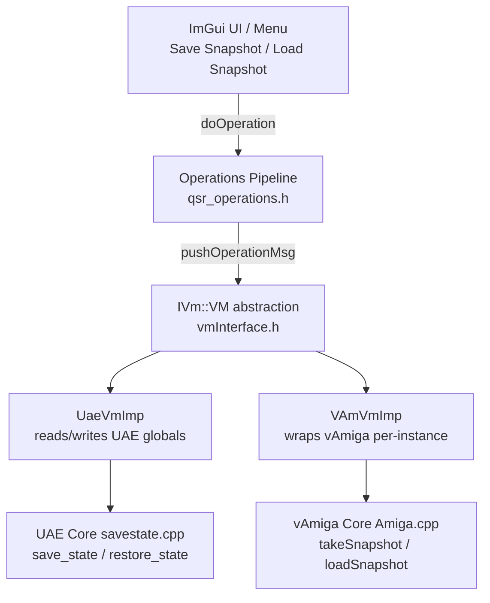
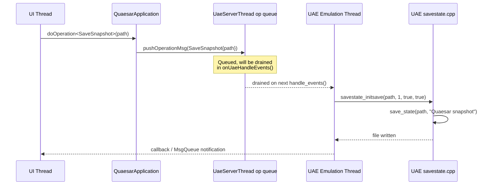
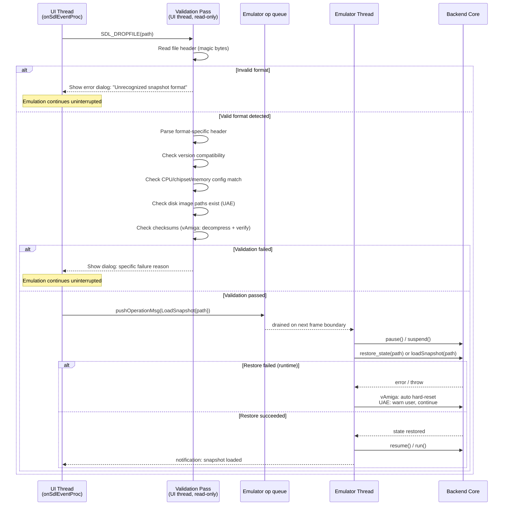

# Full State Snapshot Design: WinUAE and vAmiga Cores

**Status:** Design proposal
**Scope:** Describe what is required to capture and restore the exact emulator state — CPU, memory, custom chips, peripherals — for both the WinUAE (`uae_lib`) and vAmiga backends.

---

## 1. Overview

A **full snapshot** captures every piece of state needed to resume emulation as if it had never been interrupted. This includes:

- CPU registers (all models, 68000–68060)
- FPU state (if present)
- MMU state (if present)
- All RAM banks (Chip, Slow/Bogo, Fast, Zorro III, RTC, etc.)
- ROM contents (Kickstart)
- Custom chipset registers (Agnus/Denise/Paula)
- Blitter state
- Copper state
- Sprite and audio channels
- CIA A/B timers and I/O
- Floppy drive state (motor, track, head position, raw bitstream)
- Hard drive / filesystem state
- Input recording state
- Event scheduler / cycle counters
- Display / screen mode state

Both backends already have mature save/restore infrastructure. The task is to **expose these mechanisms through the `IVm` abstraction** and the Quaesar-NG operations pipeline, respecting the threading model and the process-global vs. per-instance state differences.

---

## 2. Architecture Context

The snapshot feature must work through these layers:



### Key constraints

| Constraint | Impact on snapshot |
|---|---|
| UAE uses **process-global singletons** (`::regs`, `savestate_state`, etc.) | Save/restore must execute **on the UAE thread** to avoid races |
| vAmiga uses **per-instance C++ objects** | Save/restore can be done from the user thread with `suspend()` |
| The `IVm` interface is **backend-agnostic** | New operations must be defined in `qsr_operations.h` or in `amDebugger` |
| Operations are **queued** to the emulator thread | Snapshot save/load ops follow the same path as Pause/Step |


---

## 3. WinUAE Backend (`uae_lib`)

### 3.1 Existing infrastructure

UAE's save/restore system is defined in `libs/uae_lib/include/savestate.h` and implemented in `libs/uae_lib/savestate.cpp`. It is a **chunk-based binary format** where each subsystem serializes itself independently.

**Entry points:**

| Function | Purpose |
|---|---|
| `savestate_initsave(filename, mode, nodialogs, save)` | Initialize a save or restore operation; sets `savestate_fname`, compression mode |
| `save_state(filename, description)` | Serialize all subsystems to a `.uss` file |
| `restore_state(filename)` | Deserialize from a `.uss` file; sets `savestate_state = STATE_RESTORE` |
| `savestate_restore_finish()` | Called after all chunks are loaded; runs post-restore hooks |
| `savestate_quick(slot, save)` | Quick-save/load to a numbered slot |

**State machine flags** (`savestate_state`):

```
STATE_SAVE       = 1    // actively saving
STATE_RESTORE    = 2    // actively restoring
STATE_DOSAVE     = 4    // save requested, pending execution
STATE_DORESTORE  = 8    // restore requested, pending execution
STATE_REWIND     = 16   // rewind (state-capture buffer)
STATE_DOREWIND   = 32   // rewind requested
```

### 3.2 Chunk catalog

Every subsystem writes a named 4-byte chunk. The `save_state_internal()` function orchestrates all chunks in order:

| Chunk | Content | Source |
|---|---|---|
| `ASF ` | Header: emulator name, version, description | `savestate.cpp` |
| `CYCS` | Cycle counters, hsync/vsync counters | `save_cycles()` |
| `CPU ` | D0–D7, A0–A6, PC, USP, ISP, SR, SFC/DFC, VBR, CACR, MSP | `save_cpu()` in `newcpu.cpp` |
| `CPUX` | CPU extra: stopped state, speed, throttle, cpu_freq, fpu_revision | `save_cpu_extra()` |
| `CPUT` | CPU trace / debug state | `save_cpu_trace()` |
| `FPU ` | FPU registers (FP0–FP7, FPCR, FPSR, FPIAR) | `save_fpu()` |
| `MMU ` | MMU descriptor tables (68030/68040) | `save_mmu()` |
| `DSKx` | Floppy x: current track, motor state, head position, disk image path | `save_disk(i)` |
| `DSDx` | Floppy raw disk data (sector bitstream, compressed) | `save_disk2(i)` |
| `DISK` | Disk controller: DMA state, DSKPT, DSKLEN, DSKSYNC, DSKBYTR | `save_floppy()` |
| `CHIP` | Custom chipset registers (INTENA, INTREQ, BPLCONx, DIWSTRT/STOP, etc.) | `save_custom()` |
| `CHPX` | Custom chipset extra (event delay, copper state, scanline counters) | `save_custom_extra()` |
| `CHPD` | Event delay timing state | `save_custom_event_delay()` |
| `BLTX` | Blitter (new format): BLTCONx, BLTAFWM, source/dest addresses, line draw state | `save_blitter_new()` |
| `BLIT` | Blitter (legacy format, for backward compatibility) | `save_blitter()` |
| `CHSL` | Custom register slots (write-queued register values) | `save_custom_slots()` |
| `CINP` | Input state: joystick, mouse, keyboard serial | `save_input()` |
| `AGAC` | AGA color table (if AGA chipset) | `save_custom_agacolors()` |
| `SPRx` | Sprite x: position, control, data, pointer | `save_custom_sprite(i)` |
| `AUDx` | Audio channel x: volume, period, length, data | `save_audio(i)` |
| `CIAA` | CIA A: timers, I/O ports, interrupt mask, TOD counter | `save_cia(0)` |
| `CIAB` | CIA B: timers, I/O ports, interrupt mask, TOD counter | `save_cia(1)` |
| `KEYB` | Keyboard state: queue, scan code buffer | `save_keyboard()` |
| `CRAM` | Chip RAM dump (compressed if enabled) | `save_cram()` |
| `BRAM` | Bogo (slow) RAM dump | `save_bram()` |
| `FRAM` | Fast RAM dump (per board) | `save_fram(i)` |
| `ZRAM` | Zorro III RAM dump (per board) | `save_zram(i)` |
| `ZCRM` | Zorro III combined RAM | `save_zram(-1)` |
| `BORO` | Boot ROM (A1000 bootstrap) | `save_bootrom()` |
| `PRAM` | Picasso96/RTG framebuffer RAM | `save_pram()` |
| `A3K1` | A3000 slow RAM | `save_a3003lram()` |
| `A3K2` | A3000 high RAM | `save_a3003hram()` |
| `ROM ` | Kickstart ROM dump (for verification) | `save_rom()` |
| `EXPB` | Expansion board state (CPU boards, RAM expansions) | `save_expansion_boards(i)` |
| `GAYL` | Gayle (A600/A1200 IDE interface, PCMCIA) | `save_gayle()` |
| `IDE ` | Gayle IDE drive state | `save_gayle_ide(i)` |
| `SCSD` | SCSI device state | `save_scsidev()` |
| `CDUx` | CD unit x state | `save_cd(i)` |
| `CONF` | Full UAE configuration (currprefs) | `save_configuration()` |
| `END ` | End marker | — |

### 3.3 What `save_cpu()` captures

From `newcpu.cpp:7450`, `save_cpu()` serializes:

- **Model** and **address-space flags** (24-bit vs 32-bit)
- `regs.regs[0..14]` — D0–D7, A0–A6
- `m68k_getpc()` — program counter
- `regs.irc`, `regs.ir` — prefetch registers
- USP, ISP, SR (status register with CCR flags)
- Stopped/halt flags
- For 68010+: DFC, SFC, VBR
- For 68020+: CAAR, CACR, MSP
- For 68030+: MMU descriptors (CRP, SRP, TT0, TT1, TC, MMUSR)
- For 68040+: ITT0, ITT1, DTT0, DTT1, TCR, URP, SRP
- For 68060+: BUSCR, PCR
- CPU clock rate in kHz
- Instruction/data cache contents (020/030/040/060 cache lines)
- Pipeline / prefetch state

This is **far more complete** than the `IVm::Cpu` snapshot (which only covers D0–D7, A0–A6, PC, flags, interrupt mask). The full `save_cpu()` captures every internal pipeline state needed for cycle-exact resumption.

### 3.4 Threading requirements

UAE's save/restore functions read and mutate **process-global singletons** (`::regs`, `savestate_state`, `::currprefs`, event queue, memory banks). This is the same constraint documented in [pause_bug_analysis.md](pause_bug_analysis.md): any call to `save_state()` or `restore_state()` must execute **on the UAE emulation thread**, not from the UI thread.

The correct flow is:



**Restore** follows the same path but calls `restore_state(path)` followed by `savestate_restore_finish()`. After restore, UAE automatically reconfigures memory layout and reinitializes the event scheduler from the restored state.

> **Critical:** The save must happen at a **frame boundary** (vpos == 0) to ensure consistent chipset state. UAE's own `savestate_check()` is called from the vsync handler at frame start and gates on this condition.

### 3.5 What needs to be added to `UaeVmImp`

In `src/quasar_app/uae_imp/uae_vm_imp.cpp`, add handlers in `applyOperationMsgProcImp()`:

```cpp
} else if (args->cast_<SaveSnapshot>()) {
    r = true;
    auto* op = args->cast_<SaveSnapshot>();
    // Must run on UAE thread (we are here via handle_events drain)
    ::savestate_initsave(op->path.c_str(), 1, 1, true);
    ::save_state(op->path.c_str(), _T("Quaesar snapshot"));
    // Notify UI of completion

} else if (args->cast_<LoadSnapshot>()) {
    r = true;
    auto* op = args->cast_<LoadSnapshot>();
    ::restore_state(op->path.c_str());
    // savestate_restore_finish() is called by UAE internally
    // after the next vsync
}
```

The operations (`SaveSnapshot`, `LoadSnapshot`) need to be declared in `qsr_operations.h` carrying a file path string argument.

### 3.6 UAE memory save details

The `save_rams()` function iterates all memory banks:

| Bank | Variable | Save function | Typical size |
|---|---|---|---|
| Chip RAM | `chipmem_bank` | `save_cram()` | 512 KB – 2 MB |
| Bogo (slow) RAM | `bogomem_bank` | `save_bram()` | 0 – 1.75 MB |
| Fast RAM (board *i*) | `fastmem[i]` | `save_fram(i)` | 0 – 8 MB each |
| Zorro III RAM (board *i*) | `z3fastmem[i]` | `save_zram(i)` | 0 – 512 MB each |
| A3000 slow RAM | — | `save_a3003lram()` | 0 – 8 MB |
| A3000 high RAM | — | `save_a3003hram()` | 0 – 8 MB |
| Boot ROM (A1000) | — | `save_bootrom()` | 8 KB |
| Picasso96 VRAM | — | `save_pram()` | 0 – 8 MB |

RAM is optionally zlib-compressed via `zfile_zcompress()`. The `mode` parameter to `savestate_initsave()` controls this:
- `mode=1`: compressed
- `mode=2`: uncompressed
- `mode=3`: full RAM dump (no incremental)

For a **full snapshot**, all banks are saved. The total uncompressed size for a 2MB-chip + 8MB-fast configuration is ~10 MB plus CPU/chipset overhead (~50 KB).

---

## 4. vAmiga Backend

### 4.1 Existing infrastructure

vAmiga has a **first-class snapshot system** built on a `CoreComponent` serialization framework. Unlike UAE's chunk-based format, vAmiga uses a **recursive component tree** where every chip implements `operator<<` for five serialization visitors: `SerCounter`, `SerChecker`, `SerResetter`, `SerReader`, `SerWriter`.

**Entry points** (from `VAmiga.h` / `Amiga.h`):

| Function | Purpose |
|---|---|
| `VAmiga::saveSnapshot(path)` | Serialize to a `.vasnap` file |
| `VAmiga::loadSnapshot(path)` | Deserialize from a `.vasnap` file |
| `Amiga::takeSnapshot()` | Returns an in-memory `Snapshot*` object |
| `Amiga::loadSnapshot(const Snapshot&)` | Restore from an in-memory snapshot |

The public API (`VAmiga.h`) is annotated with `VAMIGA_PUBLIC_SUSPEND`, which means it **automatically suspends the emulator thread** before touching state. This makes vAmiga snapshots safe to trigger from the UI thread — a significant advantage over UAE.

### 4.2 The component tree

When `Amiga::save(buffer)` is called, it performs a **postorder walk** of the entire component tree. Each component's `operator<<(SerWriter&)` serializes its state, preceded by a size word and a checksum. The tree structure (from `Amiga.cpp:42`):

```
Amiga (root)
├── host
├── agnus
│   ├── sequencer
│   ├── copper
│   ├── blitter
│   └── dmaDebugger
├── audioPort
├── videoPort
├── rtc
├── denise
├── paula
│   ├── channel0
│   ├── channel1
│   ├── channel2
│   ├── channel3
│   ├── diskController
│   └── uart
├── zorro (ZorroManager)
├── controlPort1
├── controlPort2
├── serialPort
├── monitor
├── keyboard
├── df0 / df1 / df2 / df3  (FloppyDrive)
├── hd0 / hd1 / hd2 / hd3  (HardDrive)
├── hd0con / hd1con / hd2con / hd3con  (HdController)
├── ramExpansion
├── diagBoard
├── ciaA
├── ciaB
├── mem  (Memory)
├── cpu  (CPU)
├── logicAnalyzer
├── retroShell
├── remoteManager
├── osDebugger
└── regressionTester
```

Every node in this tree is visited, and its full internal state is serialized. The framework guarantees integrity: each component writes its computed size and FNV checksum, and on load, any mismatch throws `AppError(Fault::SNAP_CORRUPTED)`.

### 4.3 What each component captures

| Component | State captured |
|---|---|
| `CPU` | All D/A registers, PC, SR/CCR, USP/ISP/MSP, VBR, SFC/DFC, CACR, CAAR, instruction pipeline, stopped state, cycle counter |
| `Memory` | Chip RAM, slow RAM, fast RAM, ROM bank, RTC RAM, CIA RAM, expansion memory — full bank table with contents |
| `Agnus` | Event scheduler queue (all pending events), DMA state, copper/blitter trigger positions, beam position (v/h pos), frame counter, PAL/NTSC mode |
| `Agnus::Copper` | Copper instruction pointer, copper list registers, first/second word state |
| `Agnus::Blitter` | BLTCONx, masks, source/dest addresses, line-draw state, busy flag, fill carry |
| `Denise` | Bitplane registers, color registers, sprite registers, playfield scroll, collision detection state, pixel engine texture |
| `Paula` | INTENA/INTREQ, ADKCON, disk controller DMA state, audio channels (period/volume/data) |
| `Paula::channelN` | Audio DMA pointer, length, period, volume, envelope state |
| `Paula::diskController` | DSKPT, DSKLEN, DSKSYNC, DSKBYTR, FIFO state |
| `CIA A/B` | Timer A/B (count, latch, running mode), TOD counter, I/O port data/direction, interrupt mask/flag, serial shift register |
| `FloppyDrive` | Motor state, current track, head position, disk image data, spinning direction |
| `HardDrive` | Geometry, partition table, raw disk image data |
| `Keyboard` | Key queue, shift register, state machine |
| `RTC` | Clock registers, battery-backed RAM |
| `ZorroManager` | Autoconfig state, board enumeration |
| `ControlPort` | Joystick/mouse button state, direction register |
| `SerialPort` | UART registers, baud rate, transmit/receive state |

### 4.4 Snapshot file format

The `.vasnap` format (`Snapshot.h`):

```
┌──────────────────────────┐
│    SnapshotHeader         │  (~240 KB with thumbnail)
│  magic: "VASNAP"          │
│  major/minor/subminor/beta│  ← version must match exactly
│  compressor: NONE/GZIP/   │
│              LZ4/RLE2/RLE3│
│  rawSize: uncompressed    │
│  Thumbnail screenshot     │  ← preview image embedded
├──────────────────────────┤
│   Component data          │
│   (per-component blocks:  │
│    size | checksum | data)│
│   postorder walk of tree  │
│  ...                      │
│  [optionally compressed]  │
└──────────────────────────┘
```

Compression is applied after serialization, skipping the header. Supported: GZIP, LZ4, RLE2, RLE3. Configured via `Opt::AMIGA_SNAP_COMPRESSOR`.

### 4.5 What needs to be added to `VAmVmImp`

In `libs/vAmiga_imp_lib/src/qvAmigaImp/va_vm_imp.cpp`, add handlers in `applyOperationMsgProcImp()`:

```cpp
} else if (args->cast_<SaveSnapshot>()) {
    r = true;
    auto* op = args->cast_<SaveSnapshot>();
    // VAmiga API handles suspend/resume internally
    m_vAmiga->saveSnapshot(op->path);

} else if (args->cast_<LoadSnapshot>()) {
    r = true;
    auto* op = args->cast_<LoadSnapshot>();
    // loadSnapshot performs suspend, uncompress, restore, resume
    // On corruption, it auto-hard-resets (see VAmiga.cpp:2340)
    m_vAmiga->loadSnapshot(op->path);
}
```

vAmiga's `loadSnapshot()` wraps the restore in a try/catch (`VAmiga.cpp:2329`). If the snapshot is corrupted, it issues `Cmd::HARD_RESET` to avoid leaving the emulator in an inconsistent state — a built-in safety mechanism that UAE lacks.

### 4.6 vAmiga auto-snapshot

vAmiga already supports **automatic periodic snapshots** via:
- `Opt::AMIGA_SNAP_AUTO` — enable/disable
- `Opt::AMIGA_SNAP_DELAY` — seconds between snapshots
- `Opt::AMIGA_SNAP_COMPRESSOR` — compression method

When enabled, `Amiga::serviceSnpEvent()` takes a snapshot on each timer event and posts it to the GUI via `Msg::SNAPSHOT_TAKEN`. This can be used for a **rewind/history feature** without additional implementation.

---

## 5. Cross-Backend Comparison

| Aspect | WinUAE (`uae_lib`) | vAmiga |
|---|---|---|
| **Format** | Chunk-based `.uss` (binary, custom IFF-like) | `.vasnap` (header + serialized component tree) |
| **Serialization** | Manual `save_*()` / `restore_*()` per subsystem | Automatic `operator<<` visitor pattern on `CoreComponent` tree |
| **Integrity check** | None (format relies on chunk sizes) | Per-component FNV32 checksum + size verification |
| **Compression** | zlib via `zfile_zcompress()` | GZIP / LZ4 / RLE2 / RLE3 (selectable) |
| **Thumbnail** | Optional screenshot chunk (`PIC0`) | Embedded in `SnapshotHeader::Thumbnail` |
| **Thread safety** | Must run on UAE thread (global singletons) | Safe from any thread (auto suspend/resume) |
| **Restore safety** | No automatic rollback on failure | Auto hard-reset on corruption |
| **Granularity** | Frame-boundary save (vpos==0) | Frame-boundary (suspend completes current frame) |
| **Config in snapshot** | `CONF` chunk stores full `currprefs` | Component configs serialized inline |
| **Auto-snapshot** | `savestate_capture()` (rewind buffer) | `serviceSnpEvent()` with configurable interval |
| **Version compat** | Backward compatible (unknown chunks skipped) | Strict version match (`isTooOld` / `isTooNew`) |

---

## 6. Implementation Plan

### 6.1 New operations

Declare two new operations in `src/quasar_app/qsr_operations.h`:

```cpp
struct SaveSnapshot : public amD::operation::OperationArgs {
    DECLARE_OPERATION_1(qsr::operations::SaveSnapshot);
    qtd::string path;  // filesystem path for the snapshot file

    static void setup(qd::operation::OpDesc& d) {
        d.m_name = "Save Snapshot";
    }
};

struct LoadSnapshot : public amD::operation::OperationArgs {
    DECLARE_OPERATION_1(qsr::operations::LoadSnapshot);
    qtd::string path;

    static void setup(qd::operation::OpDesc& d) {
        d.m_name = "Load Snapshot";
    }
};
```

These operations flow through the existing pipeline: `QuaesarApplication::doOperation_()` → `pushOperationMsg()` → drained on emulator thread → `applyOperationMsgProcImp()`.

### 6.2 UI integration

Add to the ImGui menu / toolbar:
- **File → Save State…** — opens a native file dialog (NFD), then dispatches `SaveSnapshot`
- **File → Load State…** — opens NFD, dispatches `LoadSnapshot`
- **Quick Save (Shift+F5)** — saves to a default slot
- **Quick Load (F5)** — loads from default slot

### 6.3 Implementation steps

| Step | Files touched | Description |
|---|---|---|
| 1 | `qsr_operations.h` | Declare `SaveSnapshot` and `LoadSnapshot` operations |
| 2 | `uae_vm_imp.cpp` | Add operation handlers calling `savestate_initsave()` / `save_state()` / `restore_state()` |
| 3 | `va_vm_imp.cpp` | Add operation handlers calling `m_vAmiga->saveSnapshot()` / `loadSnapshot()` |
| 4 | `qsr_main_wnd_client_app.cpp` | Wire menu items to `doOperation_<SaveSnapshot>()` / `doOperation_<LoadSnapshot>()` |
| 5 | `uae_wnd_desktop.cpp` or UI layer | Add native file dialog for path selection |
| 6 | (optional) `qsr_config.h` | Add config for default snapshot path / slot count |

### 6.4 Edge cases and concerns

**UAE-specific:**
- **Config mismatch:** `is_savestate_incompatible()` checks whether the current `currprefs` (CPU model, chipset mask, memory size) match the snapshot. If they differ, restore must reconfigure first.
- **Filesystem drivers:** `restore_filesys()` may reference host paths that no longer exist. UAE stores relative and absolute paths in the snapshot and resolves via `state_resolve_path()`.
- **Input recording:** If input recording is active, `inprec_close()` is called during save to flush the recording. On restore, `inprec_setposition()` rewinds the recording.
- **State capture / rewind buffer:** `savestate_capture()` captures lightweight in-memory state for rewind. This is separate from the full `save_state()` file format and should not be confused with it.

**vAmiga-specific:**
- **Version strictness:** A snapshot taken with vAmiga v2.x cannot be loaded by v3.x without a migration path. The `isTooOld()` check throws immediately.
- **Run-ahead instance:** When loading a snapshot into the main instance, the run-ahead instance must be rebuilt from the restored state. vAmiga handles this via `emu->markAsDirty()`.
- **Disk media:** Floppy/hard drive image data is embedded in the snapshot. Loading a snapshot effectively replaces the current disk contents — the user should be warned if unsaved changes exist.

---

## 7. Complete State Coverage Checklist

This checklist verifies that every piece of state required for exact restoration is captured by each backend's native snapshot format.

### CPU

| State | UAE chunk | vAmiga component | Notes |
|---|---|---|---|
| D0–D7, A0–A6 | `CPU ` | `CPU` | |
| PC | `CPU ` | `CPU` | UAE uses `m68k_getpc()` |
| SR / CCR | `CPU ` | `CPU` | Includes Z/C/V/N/X flags |
| USP / ISP | `CPU ` | `CPU` | |
| Prefetch (irc/ir) | `CPU ` | `CPU` pipeline state | |
| Stopped/halt | `CPU ` | `CPU` | |
| SFC/DFC/VBR (68010+) | `CPU ` | `CPU` | |
| CACR/CAAR/MSP (68020+) | `CPU ` | `CPU` | |
| MMU tables (68030) | `MMU ` / `CPU ` | `CPU` | CRP/SRP/TT0/TT1/TC/MMUSR |
| MMU tables (68040/060) | `CPU ` | `CPU` | ITT/DTT/TCR/URP/SRP |
| BUSCR/PCR (68060) | `CPU ` | `CPU` | |
| Instruction cache | `CPU ` | `CPU` | Cache line contents |
| Pipeline state | `CPU ` | `CPU` | Prefetch FIFO |
| FPU FP0–FP7 | `FPU ` | `CPU` (if FPU model) | |
| FPCR/FPSR/FPIAR | `FPU ` | `CPU` | |
| Cycle counter | `CYCS` | `CPU` / `Agnus` clock | For cycle-exact resume |

### Memory

| State | UAE chunk | vAmiga component | Notes |
|---|---|---|---|
| Chip RAM | `CRAM` | `Memory` | Up to 2 MB |
| Slow/Bogo RAM | `BRAM` | `Memory` | Up to 1.75 MB |
| Fast RAM | `FRAM` (per board) | `Memory` | Per-board |
| Zorro III RAM | `ZRAM` (per board) | `Memory` | Per-board |
| A3000 RAM | `A3K1`/`A3K2` | `Memory` | |
| Boot ROM | `BORO` | `Memory` | A1000 only |
| Kickstart ROM | `ROM ` | `Memory` | For verification |
| RTC battery RAM | (in RTC chip) | `RTC` | |
| RTG/Picasso VRAM | `PRAM` | — (vAmiga has no RTG) | UAE only |

### Custom Chips

| State | UAE chunk | vAmiga component | Notes |
|---|---|---|---|
| INTENA/INTREQ | `CHIP` | `Paula` | Interrupt enable/request |
| ADKCON | `CHIP` | `Paula` | Disk/audio control |
| BPLCON0/1/2/3 | `CHIP` | `Denise` | Bitplane control |
| DIWSTRT/STOP/SIZE | `CHIP` | `Denise` | Display window |
| DDFSTRT/STOP | `CHIP` | `Denise` | Data fetch start/stop |
| Color registers | `CHIP` / `AGAC` | `Denise` | 32 (OCS) or 256 (AGA) |
| Sprites (0–7) | `SPR0`–`SPR7` | `Denise` | Pos/control/data/pt |
| Audio (0–3) | `AUD0`–`AUD3` | `Paula::channelN` | |
| Copper state | `CHPX` | `Agnus::Copper` | |
| Copper list ptr | `CHIP` | `Agnus::Copper` | COP1LCH/L, COP2LCH/L |
| Blitter | `BLTX` / `BLIT` | `Agnus::Blitter` | |
| CIA A/B timers | `CIAA` / `CIAB` | `ciaA` / `ciaB` | |
| CIA I/O ports | `CIAA` / `CIAB` | `ciaA` / `ciaB` | |
| Event queue | `CHPD` / `CHSL` | `Agnus` (scheduler) | Pending DMA/events |
| Beam position | `CYCS` | `Agnus::pos` | v/h pos at snapshot time |

### Peripherals

| State | UAE chunk | vAmiga component | Notes |
|---|---|---|---|
| Floppy motor/track | `DSKx` | `FloppyDrive` | |
| Floppy raw data | `DSDx` | `FloppyDrive` | Sector bitstream |
| Disk controller | `DISK` | `Paula::diskController` | DMA state |
| Keyboard | `KEYB` | `Keyboard` | |
| Mouse/joystick | `CINP` | `ControlPort` | |
| Gayle/IDE | `GAYL` / `IDE ` | — (vAmiga: limited) | UAE only |
| Expansion boards | `EXPB` | `RamExpansion` / `DiagBoard` | |

### Host/Config

| State | UAE chunk | vAmiga component | Notes |
|---|---|---|---|
| Configuration | `CONF` | Component configs | currprefs / AmigaConfig |
| Filesystem mounts | `FSYP`/`FSYC`/`FSYS` | (separate workspace) | UAE only |
| Input recording | (inprec) | — | UAE only, for rerecording |

---

## 8. Snapshot Portability

**Snapshots are NOT portable between UAE and vAmiga.** The two formats use completely different binary layouts, serialization strategies, and internal representations. A `.uss` file from UAE cannot be loaded by vAmiga, and vice versa.

Within each backend, snapshot compatibility is governed by:

- **UAE:** Forward-compatible (unknown chunks are skipped on load). A snapshot from UAE 4.x can usually be loaded by a later build. The `is_savestate_incompatible()` check validates that the CPU model, chipset mask, and memory configuration match.
- **vAmiga:** Strict version match required. The `SnapshotHeader` version fields must match exactly. A `SNAP_TOO_OLD` or `SNAP_TOO_NEW` error is thrown on mismatch.

Future cross-backend migration (if ever needed) would require writing a converter that maps UAE chunk data to vAmiga component state — a significant undertaking given the architectural differences.

---

## 9. Summary

Both backends already contain **production-grade** snapshot/restore systems. The work required is primarily **wiring** — not building:

1. **UAE path:** `save_state()` / `restore_state()` already capture everything. The task is to queue these calls through the operation pipeline so they execute on the UAE thread, at frame boundaries.

2. **vAmiga path:** `saveSnapshot()` / `loadSnapshot()` are thread-safe public APIs. The task is simply to route the operation to the `VAmVmImp` implementation.

3. **Shared layer:** Two new operations (`SaveSnapshot`, `LoadSnapshot`) in `qsr_operations.h`, a file dialog in the UI, and handler dispatch in both `UaeVmImp` and `VAmVmImp`.

No changes to the core emulator libraries (`uae_lib`, `vAmiga`) are needed — their snapshot infrastructure is self-contained and complete.

---

## 10. Drag-and-Drop Snapshot Loading

### 10.1 Overview

In addition to the menu-driven Save/Load flow, snapshots should be loadable by **dragging a snapshot file onto the main emulator window**. This requires adding `SDL_DROPFILE` handling to the event loop and a **pre-restore validation pass** that checks the snapshot is compatible before any state is touched.

The sequence is: **detect drop → validate → pause → restore → resume**.

### 10.2 SDL event handling

The main window's event handler is `QsrMainClientWndApp::onSdlEventProc()` in `src/quasar_app/qsr_main_wnd_client_app.cpp`. Currently it handles `SDL_KEYDOWN`, `SDL_MOUSE*`, and `SDL_WINDOWEVENT`. A new `SDL_DROPFILE` case must be added:

```cpp
case SDL_DROPFILE: {
    if (event.drop.windowID != uaeWndId)
        break;

    // Take ownership of the file path — SDL allocates it, we must free it
    char* droppedPath = event.drop.file;
    std::string path(droppedPath);
    SDL_free(droppedPath);

    // Dispatch the snapshot load through the validation-aware path
    doOperation_<qsr::operations::LoadSnapshotWithValidation>(
        qsr::operations::LoadSnapshotWithValidation{ path });

    return qd::EFlow::STOP;
} break;
```

This is purely a UI-layer concern — the event is received on the UI thread, and the operation is queued to the emulator thread via the existing pipeline. No SDL event reaches the emulator core.

### 10.3 File format detection

Before attempting validation, the snapshot format must be determined from the file. Both backends embed a magic signature in the header:

| Format | Magic bytes | Extension | Detection function |
|---|---|---|---|
| UAE (`.uss`) | `ASF ` chunk at offset 0 | `.uss` | Parse first 8 bytes, check for `ASF ` chunk tag |
| vAmiga (`.vasnap`) | `"VASNAP"` at offset 0 | `.vasnap` | `Snapshot::isCompatible(path)` / first 6 bytes |

The format check should happen **before dispatching** to the backend, so the correct `IVm` implementation receives the load request. The file extension is a hint, but the magic bytes are authoritative.

### 10.4 Validation requirements

Validation must happen **before** pausing or touching any emulator state. If the snapshot is invalid or incompatible, the user is notified and emulation continues uninterrupted. The validation pass checks:

#### 10.4.1 Common checks (both backends)

| Check | Description |
|---|---|
| File exists and is readable | Basic OS-level check |
| Magic signature matches a known format | `VASNAP` or `ASF ` |
| File is not truncated | File size ≥ minimum header size |
| Correct backend is active | `.uss` → UAE active; `.vasnap` → vAmiga active |

#### 10.4.2 UAE-specific checks

| Check | Source in snapshot | How to validate |
|---|---|---|
| Version compatibility | `ASF ` chunk: emulator name + version string | Parse `ASF ` chunk header; verify `UAEMAJOR.UAEMINOR.UAESUBREV` is within supported range |
| CPU model matches | `CPU ` chunk: first u32 is model (68000–68060) | Compare against current `currprefs.cpu_model`. Mismatch → reject or offer to reconfigure. |
| Chipset mask matches | `CONF` chunk or `CHIP` chunk flags | Compare `CSMASK_AGA` / `CSMASK_ECS_*` against active `currprefs.chipset_mask` |
| Memory layout matches | `CRAM`/`BRAM`/`FRAM`/`ZRAM` chunk sizes | Compare against configured chip/bogo/fast/z3 sizes. UAE's `is_savestate_incompatible()` checks for bsdsocket, uaeserial, SCSI feature flags. |
| Disk image paths exist | `DSKx` chunks: embedded path string | Call `state_path_exists()` for each floppy path; warn if missing. UAE's `restore_path_func()` resolves relative + absolute paths. |
| Hardfile paths exist | `FSYP`/`FSYC` chunks: filesystem mount paths | Check `my_isfile()` / `my_isdir()` on each path. The `restore_filesys_paths()` function stores these. |
| Feature support | `CONF` chunk: compiled-in features | Verify that features referenced in the snapshot (e.g., bsdsocket, Picasso96) are compiled into the current build. `is_savestate_incompatible()` flags these. |

> UAE's `is_savestate_incompatible()` (in `savestate.cpp:101`) checks whether `currprefs.socket_emu`, `currprefs.uaeserial`, and `currprefs.scsi` are set — these features may not survive a save/restore cycle and trigger a warning.

#### 10.4.3 vAmiga-specific checks

| Check | Source in snapshot | How to validate |
|---|---|---|
| Version compatibility | `SnapshotHeader`: major/minor/subminor/beta | `Snapshot::isTooOld()` / `isTooNew()` / `isBeta()`. Throws `Fault::SNAP_TOO_OLD`, `SNAP_TOO_NEW`, or `SNAP_IS_BETA` on mismatch. |
| Checksum integrity | Per-component FNV32 + size in serialized data | `CoreComponent::load()` verifies each component's checksum against recomputed value; mismatch throws `Fault::SNAP_CORRUPTED` |
| Disk media embedded | Floppy/HardDrive component state | vAmiga embeds disk data directly in the snapshot, so external file existence is not required — the data is self-contained |
| Compression method supported | `SnapshotHeader::compressor` | Check that the compressor (NONE/GZIP/LZ4/RLE2/RLE3) is compiled in. All are included by default. |

### 10.5 Validation + restore sequence

The full drag-drop flow with validation:



### 10.6 Validation implementation

A new `ValidateSnapshot` operation (or a standalone function) performs the read-only check on the UI thread **without** dispatching to the emulator:

```cpp
struct ValidationResult {
    bool valid = false;
    enum class Backend { UAE, VAmiga, Unknown } backend;
    qtd::string errorMessage;
    // Populated on success:
    int cpuModel = 0;
    int chipsetMask = 0;
    // Disk image paths found in snapshot (for existence check):
    qtd::vector<qtd::string> diskImagePaths;
};

ValidationResult validateSnapshotFile(const qtd::string& path) {
    ValidationResult result;
    // 1. Open file, read first 8 bytes for magic
    // 2. If "VASNAP" → vAmiga path; if "ASF " → UAE path
    // 3. Backend-specific header parsing (version, config, disk paths)
    // 4. Disk path existence checks
    return result;
}
```

This function reads the snapshot file **without** touching any emulator state. It can run safely on the UI thread. Only if `result.valid == true` does the `LoadSnapshot` operation get dispatched.

### 10.7 New operation declaration

The drag-drop path needs an operation that carries both the path and triggers validation before restore. This can reuse the existing `LoadSnapshot` operation (section 6.1) with the validation performed before dispatch:

```cpp
// In onSdlEventProc SDL_DROPFILE handler:
auto result = validateSnapshotFile(path);
if (!result.valid) {
    // Show ImGui modal or system notification
    m_pendingError = result.errorMessage;
    return qd::EFlow::STOP;
}
// Only dispatch if validation passed
doOperation_<qsr::operations::LoadSnapshot>(
    qsr::operations::LoadSnapshot{ path });
```

Alternatively, if validation should also run on the emulator thread (e.g., to check `currprefs` which is only safe on that thread), the validation + load can be combined into a single `LoadSnapshotWithValidation` operation handled in `applyOperationMsgProcImp()`.

### 10.8 Error reporting

Validation failures should be reported to the user via a modal dialog or toast notification. The error message should be specific:

| Failure | Example message |
|---|---|
| Unknown format | "File 'game.uss' is not a recognized snapshot format" |
| Wrong backend | "This is a vAmiga snapshot but the UAE core is active" (or vice versa) |
| Version too old (vAmiga) | "Snapshot was created with vAmiga v2.5 (current: v3.2). Please upgrade or use a compatible version." |
| Version too new (vAmiga) | "Snapshot was created with vAmiga v4.0 (current: v3.2). Please update Quaesar." |
| CPU mismatch | "Snapshot requires CPU 68020 (current: 68000). Reconfigure?" |
| Chipset mismatch | "Snapshot requires AGA chipset (current: OCS). Reconfigure?" |
| Disk image missing | "Snapshot references floppy 'DF0:game.adf' which was not found at the stored path. The disk will be ejected after restore." |
| Corrupted | "Snapshot data is corrupted (checksum mismatch in component 'CPU')" |

The disk-image-missing case is a **warning, not a hard failure**. UAE will proceed with restore but the drive will be ejected. The user should be given the option to cancel or continue.

### 10.9 Coexistence with other drop types

The main window may also accept dropped **disk images** (`.adf`, `.hdf`, `.iso`). The `SDL_DROPFILE` handler must distinguish snapshot files from disk images:

| Extension | Magic | Action |
|---|---|---|
| `.uss` | `ASF ` | Snapshot → validation → restore |
| `.vasnap` | `VASNAP` | Snapshot → validation → restore |
| `.adf` | — | Disk image → insert into DF0 (or next free drive) |
| `.hdf` | — | Hardfile → mount as hard drive |
| `.iso` | — | CD image → insert into CD drive |

Priority: check magic bytes first. A `.uss` file with a non-matching magic should be rejected as "not a valid snapshot." A file with `.adf` extension but `VASNAP` magic should be treated as a snapshot (trust the magic, not the extension).

### 10.10 Updated implementation steps

The drag-and-drop feature adds these steps to the implementation plan in section 6.3:

| Step | Files touched | Description |
|---|---|---|
| 7 | `qsr_main_wnd_client_app.cpp` | Add `SDL_DROPFILE` case in `onSdlEventProc()` |
| 8 | New: `qsr_snapshot_validation.h/.cpp` | `validateSnapshotFile()` — read-only header parse + compatibility + disk-path checks |
| 9 | `qsr_main_wnd_client_app.cpp` | Wire drop handler: validate first, then dispatch `LoadSnapshot` only if valid |
| 10 | UI layer (ImGui) | Error/warning modal for validation failures and disk-missing warnings |

### 10.11 UX considerations

- **Visual feedback on drop:** When a file is dragged over the window, the cursor should indicate whether a drop is accepted. SDL provides `SDL_DROPBEGIN`/`SDL_DROPCOMPLETE` events that bracket a drop operation; these can be used to draw a "drop here" overlay.
- **Pause during validation:** Validation is read-only and fast (sub-second), so no pause is needed during the check itself. The pause happens only after validation passes, as part of the restore.
- **Unsaved state warning:** If the emulator has unsaved floppy writes (dirty disk buffer), the user should be warned before restoring a snapshot, since restore replaces disk contents. This check is UAE-specific (vAmiga embeds disk data in the snapshot, so there's no data loss — the dirty buffer is simply replaced).
- **Auto-resume:** After a successful restore, the emulator should resume running automatically (if it was running before the drop). If the emulator was paused, it should remain paused after restore.
