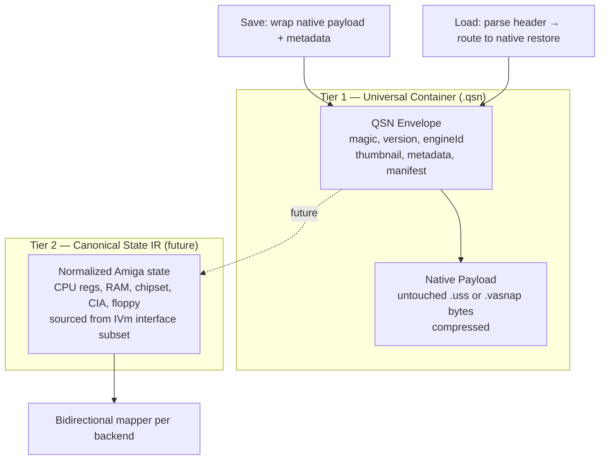
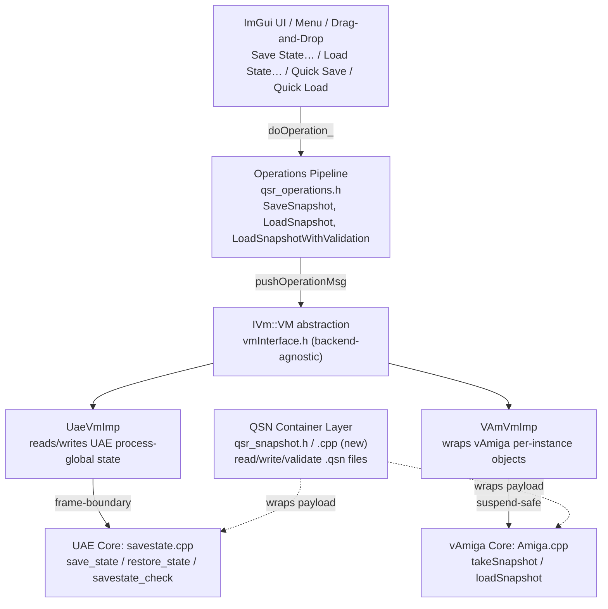
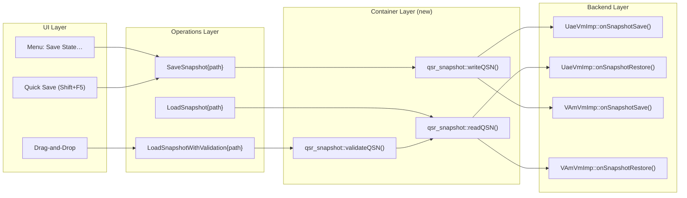
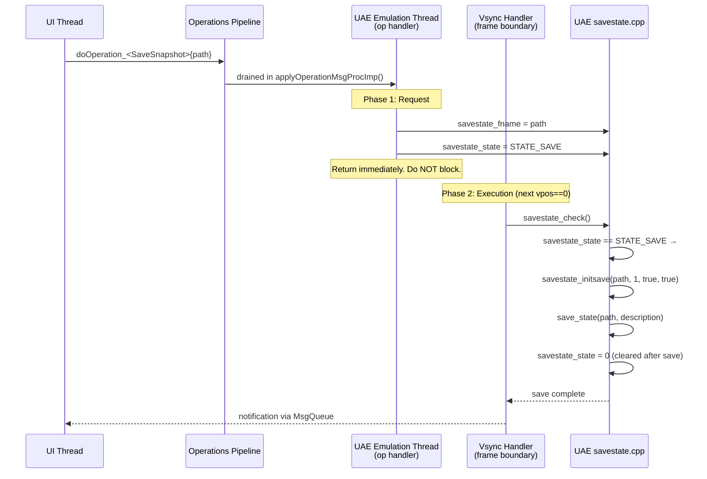
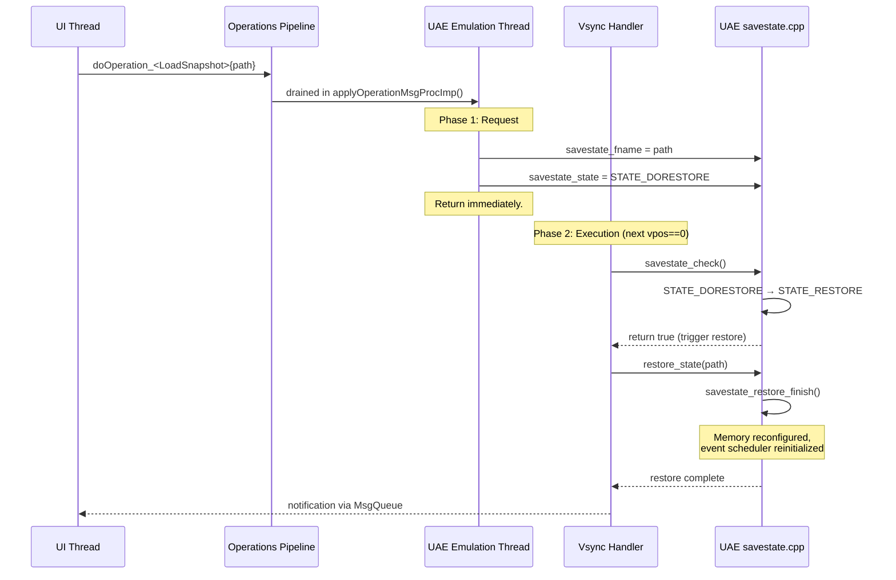
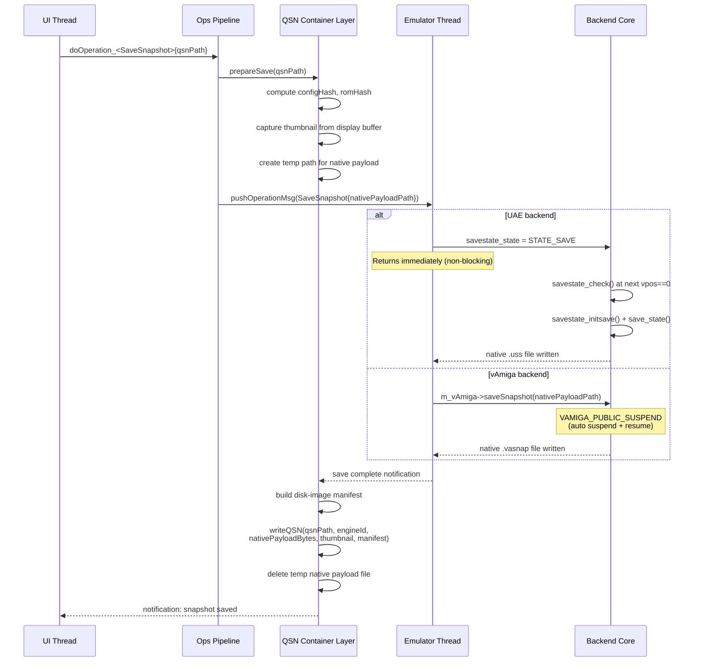
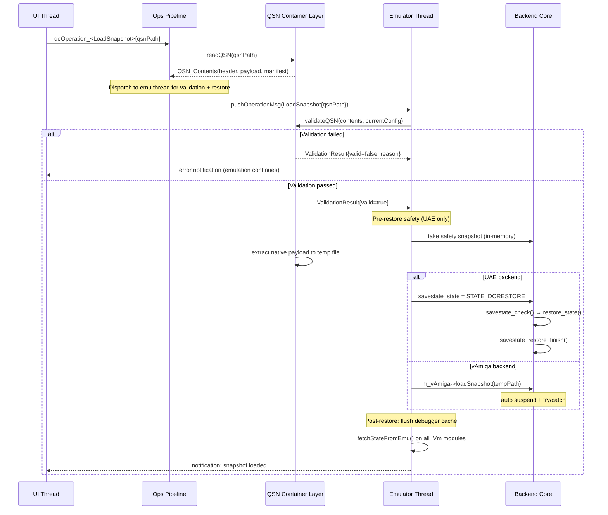
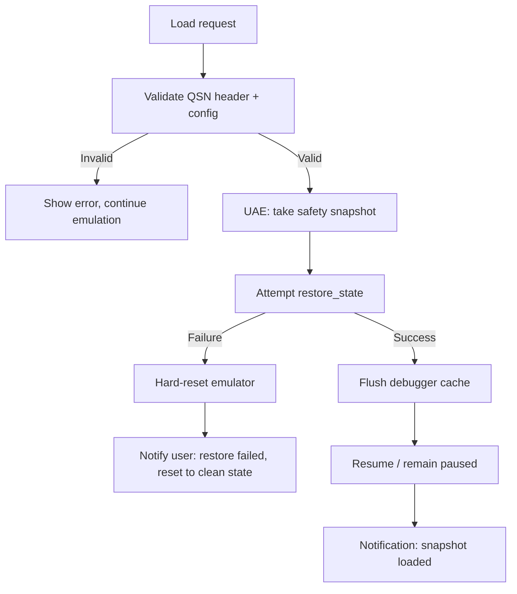
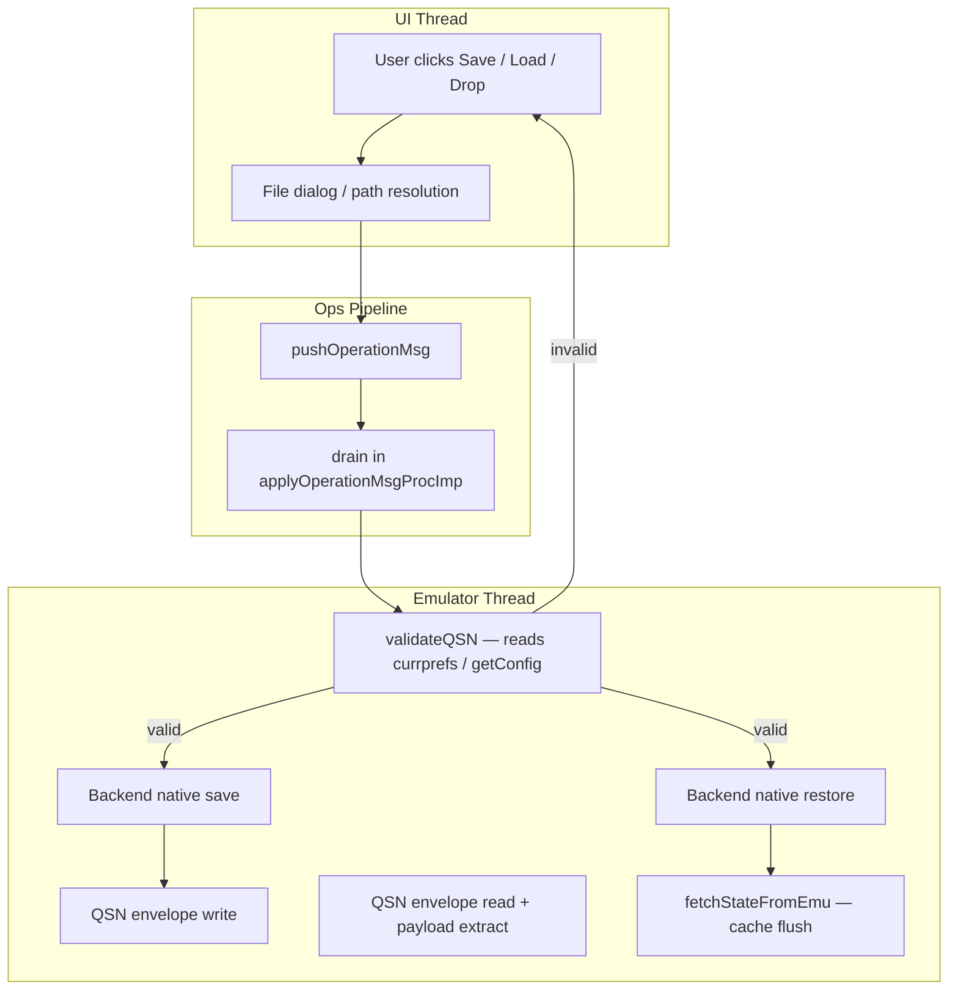
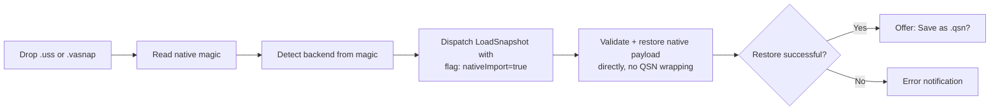

# Universal Snapshot Design for Quaesar-NG

**Status:** Design specification
**Scope:** Define a unified snapshot system that wraps both WinUAE (`uae_lib`) and vAmiga backends under a single Quaesar-owned container format, with a path toward cross-engine state portability.

---

## 1. Goals and Non-Goals

### 1.1 Goals

| # | Goal | Priority |
|---|------|----------|
| G1 | **One file, one extension.** Users save and load snapshots via a single `.qsn` file regardless of which backend is active. | Must |
| G2 | **Engine-agnostic UI.** The ImGui menu, drag-and-drop, and quick-save slots are identical for both backends. | Must |
| G3 | **Pre-restore validation.** Before any emulator state is touched, a snapshot is checked for format integrity, version compatibility, and configuration match. | Must |
| G4 | **Frame-boundary consistency.** All saves capture state at a stable frame boundary so restoration is cycle-reproducible. | Must |
| G5 | **Debugger cache coherence.** After restore, the debugger's cached `IVm` view is flushed and re-fetched so widgets display the restored state, not stale pre-restore values. | Must |
| G6 | **Graceful failure.** A corrupted or incompatible snapshot never leaves the emulator in an inconsistent state. | Must |
| G7 | **Metadata-rich container.** Each snapshot carries a thumbnail screenshot, timestamp, ROM hash, config hash, and disk-image manifest for gallery-style browsing and portability. | Should |
| G8 | **Cross-engine portability roadmap.** A canonical intermediate representation (IR) is defined for the common Amiga state subset, enabling future UAE↔vAmiga snapshot migration. | Future |

### 1.2 Non-Goals

- Replacing either backend's native serialization engine. Both are mature and production-grade.
- Supporting snapshots from upstream WinUAE or vAmiga GUI releases directly (those are handled as import, not native load).
- Network/cloud sync of snapshots.
- Time-travel / rewind UI (the infrastructure is noted but not designed here).

---

## 2. Two-Tier Architecture

The design is structured in two tiers. **Tier 1 is the deliverable; Tier 2 is the forward path.**



### 2.1 Tier 1 — Universal Container (`.qsn`)

The **pragmatic, ship-now layer**. Quaesar wraps each backend's existing native snapshot inside a lightweight metadata envelope. The native payload bytes are untouched — Quaesar never reinterprets them.

**Benefits delivered immediately:**

- One extension (`.qsn`) for both engines; the active backend is recorded inside.
- Drag-and-drop just works: the header's `engineId` field routes the file to the correct backend.
- Portability across machines: the disk-image manifest enables path remapping.
- Gallery browsing: the embedded thumbnail and metadata enable a save-state gallery UI.
- Future-proofing: the container is versioned, so Tier-2 IR data can be added later without breaking older files.

### 2.2 Tier 2 — Canonical State IR (future)

The **cross-engine-portable layer**. A normalized schema for the common Amiga state subset (the portion already exposed by the `IVm` interface). Each backend provides a bidirectional mapper: native state ↔ IR.

**What Tier 2 enables:**

- UAE → vAmiga and vAmiga → UAE snapshot migration.
- Engine-agnostic auto-snapshot and rewind.
- Snapshot diffing and state inspection tools.

State that falls outside the common subset (UAE's Picasso96/RTG, FPU/MMU internals, vAmiga's strict-version fields) is marked **non-portable** and remains carried only in the Tier-1 native payload.

> **Scope note:** This document fully specifies Tier 1. Tier 2 is described architecturally (Section 14) to ensure Tier 1 decisions don't foreclose it, but its detailed schema is deferred to a separate design document.

---

## 3. QSN Container Format

### 3.1 Design principles

- **Never reinterpret native bytes.** The QSN envelope wraps, never parses or transforms, the backend payload.
- **Header-first.** All metadata needed for routing, validation, and gallery display is in the first 512 bytes. The payload can be streamed or skipped.
- **Versioned.** A `containerVersion` field allows future format evolution.
- **Aligned.** All multi-byte header fields are 8-byte aligned for direct `mmap` access.

### 3.2 Binary layout

```
┌───────────────────────────────────────────────────────────────┐
│                      QSN File Layout                          │
├───────────────────────────────────────────────────────────────┤
│                                                               │
│  ┌───────────────────────────────────┐  Offset 0              │
│  │         QSN Header (512 bytes)    │                        │
│  │                                   │                        │
│  │  magic[8]       = "QUASAR01"      │  +0                    │
│  │  containerVer   = u16  (1)        │  +8                    │
│  │  engineId       = u8              │  +10                   │
│  │    0 = UAE, 1 = vAmiga            │                        │
│  │  payloadCompress= u8              │  +11                   │
│  │    0 = none, 1 = zlib             │                        │
│  │  reserved       = u16[2]          │  +12 (set to 0)        │
│  │  payloadOffset  = u64             │  +16                   │
│  │  payloadSize    = u64             │  +24                   │
│  │  timestamp      = u64 (Unix epoch)│  +32                   │
│  │  romHash        = u64 (FNV-1a)    │  +40                   │
│  │  configHash     = u64 (FNV-1a)    │  +48                   │
│  │  thumbnailFmt   = u8              │  +56                   │
│  │    0 = none, 1 = PNG, 2 = JPEG    │                        │
│  │  thumbnailW     = u16             │  +57                   │
│  │  thumbnailH     = u16             │  +59                   │
│  │  thumbnailSize  = u32             │  +61                   │
│  │  thumbnailOffset= u64             │  +65                   │
│  │  manifestSize   = u32             │  +73                   │
│  │  reserved2      = u8[431]         │  +77 (pad to 508)      │
│  │  headerChecksum = u32 (CRC32)     │  +508                  │
│  └───────────────────────────────────┘                        │
│                                                               │
│  ┌──────────────────────────────────┐  Offset 512             │
│  │     Thumbnail Image (optional)   │  size = thumbnailSize   │
│  │     PNG or JPEG, max 320×200     │                         │
│  └──────────────────────────────────┘                         │
│                                                               │
│  ┌──────────────────────────────────┐  Offset thumbnailOffset │
│  │  Disk-Image Manifest (JSON, opt) │  + manifestSize         │
│  │                                  │                         │
│  │  {                               │                         │
│  │    "floppies": [                 │                         │
│  │      {"drive":0, "path":".."},   │                         │
│  │      ...                         │                         │
│  │    ],                            │                         │
│  │    "hardfiles": [ ... ],         │                         │
│  │    "cdroms": [ ... ]             │                         │
│  │  }                               │                         │
│  └──────────────────────────────────┘                         │
│                                                               │
│  ┌──────────────────────────────────┐  Offset payloadOffset   │
│  │     Native Payload               │  size = payloadSize     │
│  │                                  │                         │
│  │  If engineId=0 (UAE):            │                         │
│  │    Raw .uss chunk stream         │                         │
│  │    (optionally zlib-compressed)  │                         │
│  │                                  │                         │
│  │  If engineId=1 (vAmiga):         │                         │
│  │    Raw .vasnap file bytes        │                         │
│  │    (compression handled inside   │                         │
│  │     the .vasnap format itself)   │                         │
│  └──────────────────────────────────┘                         │
│                                                               │
└───────────────────────────────────────────────────────────────┘
```

### 3.3 Field semantics

| Field | Type | Description |
|-------|------|-------------|
| `magic` | `char[8]` | Always `"QUASAR01"`. Authoritative format identifier for drag-and-drop detection. |
| `containerVer` | `u16` | Container format version. Current: `1`. Reader rejects unknown major versions. |
| `engineId` | `u8` | `0` = WinUAE (`.uss` payload), `1` = vAmiga (`.vasnap` payload). Determines routing on load. |
| `payloadCompress` | `u8` | `0` = payload stored uncompressed, `1` = zlib-compressed. For vAmiga, set to `0` (`.vasnap` has its own internal compression). |
| `payloadOffset` | `u64` | Byte offset of the native payload from file start. Always ≥ 512 + thumbnailSize + manifestSize. |
| `payloadSize` | `u64` | Size of the (possibly compressed) native payload in bytes. |
| `timestamp` | `u64` | Unix epoch seconds at save time. For gallery sorting. |
| `romHash` | `u64` | FNV-1a 64-bit hash of the Kickstart ROM. Enables "ROM mismatch" warnings before restore. |
| `configHash` | `u64` | FNV-1a hash of the backend configuration that produced this snapshot (CPU model, chipset mask, memory layout). |
| `thumbnailFmt` | `u8` | `0` = no thumbnail, `1` = PNG, `2` = JPEG. |
| `thumbnailOffset` | `u64` | Byte offset of thumbnail image data. `0` if `thumbnailFmt == 0`. |
| `manifestSize` | `u32` | Size of JSON disk-image manifest in bytes. `0` if absent. |
| `headerChecksum` | `u32` | CRC32 over bytes 0–507. Validates header integrity before any payload I/O. |

### 3.4 Disk-image manifest

The optional JSON manifest records external media references found in the native payload. On load, Quaesar checks each path for existence and warns the user if any are missing.

```json
{
  "floppies": [
    { "drive": 0, "path": "games/superfrog.adf", "writeProtect": false },
    { "drive": 1, "path": "games/superfrog_disk2.adf", "writeProtect": true }
  ],
  "hardfiles": [
    { "device": "DH0", "path": "hd/system.hdf", "size": 134217728 }
  ],
  "cdroms": []
}
```

Paths are stored **relative to the snapshot file's directory** when possible, falling back to absolute paths. This enables snapshots to be moved between machines alongside their media.

> **Note:** vAmiga embeds disk data inside `.vasnap`, so the manifest is informational only for that backend. UAE's `.uss` references external files, making the manifest essential.

### 3.5 Container read/write pseudocode

**Write (save):**

```
function writeQSN(path, engineId, nativePayloadBytes, screenshot):
    header = QSN_Header()
    header.magic = "QUASAR01"
    header.containerVer = 1
    header.engineId = engineId
    header.timestamp = unixNow()
    header.romHash = computeRomHash()
    header.configHash = computeConfigHash()

    thumbnailPng = encodePNG(screenshot, maxW=320, maxH=200)
    header.thumbnailFmt = PNG
    header.thumbnailSize = len(thumbnailPng)
    header.thumbnailOffset = 512

    manifestJson = buildDiskManifest()
    header.manifestSize = len(manifestJson)
    payloadOffset = 512 + header.thumbnailSize + header.manifestSize

    header.payloadOffset = payloadOffset
    header.payloadSize = len(nativePayloadBytes)
    header.headerChecksum = crc32(header bytes [0..507])

    file.write(header)              // 512 bytes
    file.write(thumbnailPng)
    file.write(manifestJson)
    file.write(nativePayloadBytes)
```

**Read (load):**

```
function readQSN(path) -> QSN_Contents:
    header = readFirst512Bytes(path)
    if header.magic != "QUASAR01":
        return Error("Not a Quaesar snapshot")
    if crc32(header[0..507]) != header.headerChecksum:
        return Error("QSN header corrupted")

    thumbnail = readBytes(path, header.thumbnailOffset, header.thumbnailSize)
    manifest  = readBytes(path, 512 + header.thumbnailSize, header.manifestSize)
    payload   = readBytes(path, header.payloadOffset, header.payloadSize)

    return QSN_Contents(header, thumbnail, manifest, payload)
```

---

## 4. Architecture Context

### 4.1 Layer diagram

The snapshot feature routes through the same layers as every other emulator operation:



### 4.2 Key constraints

| Constraint | Impact on snapshot design |
|------------|--------------------------|
| UAE uses **process-global singletons** (`::regs`, `savestate_state`, `::currprefs`, event queue, memory banks) | Save, restore, *and validation that reads `currprefs`* must all execute **on the UAE emulation thread**. |
| vAmiga uses **per-instance C++ objects** with auto-suspend | Save and restore are safe from any thread via the public `VAmiga` API. |
| The `IVm` interface is **backend-agnostic** | Snapshot operations are declared in `qsr_operations.h` and dispatched uniformly. |
| Operations are **queued** to the emulator thread | Snapshot ops follow the same `pushOperationMsg` → drain path as Pause/Step. |
| `IVm` modules cache state in `fetch()` | After restore, `fetchStateFromEmu()` must be triggered to flush stale debugger caches. |
| UAE's native save protocol uses a **state-machine gate** (`STATE_DOSAVE` → `savestate_check()` at `vpos==0`) | Quaesar must set the DOSAVE flag and let the vsync handler perform the save, not call `save_state()` directly. |

### 4.3 The snapshot seam

The QSN container layer is the **single entry point** for all snapshot I/O. Neither the UI nor the operations pipeline ever touches `.uss` or `.vasnap` bytes directly:



---

## 5. WinUAE Backend (`uae_lib`)

### 5.1 Existing infrastructure

UAE's save/restore system is defined in `libs/uae_lib/include/savestate.h` and implemented in `libs/uae_lib/savestate.cpp`. It is a **chunk-based binary format** where each subsystem serializes itself independently.

**Entry points:**

| Function | Purpose |
|---|---|
| `savestate_initsave(filename, mode, nodialogs, save)` | Initialize a save operation; sets `savestate_fname`, compression mode |
| `save_state(filename, description)` | Serialize all subsystems to a `.uss` file |
| `restore_state(filename)` | Deserialize from a `.uss` file; sets `savestate_state = STATE_RESTORE` |
| `savestate_restore_finish()` | Post-restore hooks: memory reconfiguration, event scheduler reinit |
| `savestate_quick(slot, save)` | Quick-save/load to a numbered slot |
| `savestate_check()` | Called from vsync handler; performs the actual save/restore at `vpos==0` |

**State machine flags** (`savestate_state`):

```
STATE_SAVE       = 1    // actively saving
STATE_RESTORE    = 2    // actively restoring
STATE_DOSAVE     = 4    // save requested, pending execution (awaiting vpos==0)
STATE_DORESTORE  = 8    // restore requested, pending execution
STATE_REWIND     = 16   // rewind (state-capture buffer)
STATE_DOREWIND   = 32   // rewind requested
```

### 5.2 The save protocol — frame-boundary gating

> **This is the critical correctness requirement.** The previous design called `save_state()` directly from the operation handler, bypassing UAE's frame-boundary gate. This produced inconsistent snapshots with mid-frame chipset and event-queue state.

UAE's intended save protocol uses a **two-phase state machine**:

1. **Request phase** (from operation handler): Set `savestate_state = STATE_DOSAVE` and populate `savestate_fname`. Return immediately.
2. **Execution phase** (from vsync handler): `savestate_check()` runs at the top of every vsync. When it sees `STATE_DOSAVE` and `vpos == 0`, it calls `savestate_initsave()` + `save_state()` at a stable frame boundary.

The `savestate_check()` function at `savestate.cpp:1330` makes this explicit:

```c
bool savestate_check(void)
{
    if (vpos == 0 && !savestate_state) {
        if (hsync_counter == 0 && input_play == INPREC_PLAY_NORMAL)
            savestate_memorysave();
        savestate_capture(0);
    }
    if (savestate_state == STATE_DORESTORE) {
        savestate_state = STATE_RESTORE;
        return true;
    } else if (savestate_state == STATE_DOREWIND) {
        savestate_state = STATE_REWIND;
        return true;
    } else if (savestate_state == STATE_SAVE) {
        savestate_initsave(savestate_fname, 1, true, true);
        save_state(savestate_fname, STATE_SAVE_DESCRIPTION);
        return false;
    }
    return false;
}
```

> **Note:** `STATE_DOSAVE` (4) is not checked directly in `savestate_check()`. The protocol is: set `savestate_state = STATE_SAVE` (1) — not `STATE_DOSAVE` (4) — and the vsync handler picks it up on the next `vpos == 0`. The `STATE_DOSAVE` flag is set internally by `save_state()` during its own lifecycle. The request flag the caller sets is `STATE_SAVE`.

### 5.3 Corrected save sequence



### 5.4 Corrected restore sequence

Restore follows the same two-phase pattern. The operation handler sets `STATE_DORESTORE`; the vsync handler transitions it to `STATE_RESTORE` and returns `true`, which tells the caller (`custom.c`) to execute the restore on the next cycle.



### 5.5 What needs to be added to `UaeVmImp`

In `src/quasar_app/uae_imp/uae_vm_imp.cpp`, the operation handler for `SaveSnapshot` sets the state-machine flag — it does **not** call `save_state()` directly:

```cpp
} else if (args->cast_<qsr::operations::SaveSnapshot>()) {
    r = true;
    auto* op = args->cast_<qsr::operations::SaveSnapshot>();
    // Phase 1: Set the DOSAVE flag. The vsync handler performs
    // the actual save at the next frame boundary (vpos==0).
    // See savestate_check() in savestate.cpp:1330.
    _tcscpy(savestate_fname, op->path.c_str());
    savestate_state = STATE_SAVE;
    // Completion is signaled via the next MsgQueue poll.

} else if (args->cast_<qsr::operations::LoadSnapshot>()) {
    r = true;
    auto* op = args->cast_<qsr::operations::LoadSnapshot>();
    // Phase 1: Set the DORESTORE flag. The vsync handler
    // transitions to STATE_RESTORE and triggers restore_state().
    _tcscpy(savestate_fname, op->path.c_str());
    savestate_state = STATE_DORESTORE;
    // savestate_restore_finish() is called internally by UAE
    // after restore_state() completes.
}
```

### 5.6 UAE chunk catalog

Every subsystem writes a named 4-byte chunk. The `save_state_internal()` function orchestrates all chunks in order:

| Chunk | Content | Source |
|---|---|---|
| `ASF ` | Header: emulator name, version, description | `savestate.cpp` |
| `CYCS` | Cycle counters, hsync/vsync counters | `save_cycles()` |
| `CPU ` | D0–D7, A0–A6, PC, USP, ISP, SR, SFC/DFC, VBR, CACR, MSP | `save_cpu()` |
| `CPUX` | CPU extra: stopped state, speed, throttle, cpu_freq, fpu_revision | `save_cpu_extra()` |
| `CPUT` | CPU trace / debug state | `save_cpu_trace()` |
| `FPU ` | FPU registers (FP0–FP7, FPCR, FPSR, FPIAR) | `save_fpu()` |
| `MMU ` | MMU descriptor tables (68030/68040) | `save_mmu()` |
| `DSKx` | Floppy x: current track, motor state, head position, disk image path | `save_disk(i)` |
| `DSDx` | Floppy raw disk data (sector bitstream, compressed) | `save_disk2(i)` |
| `DISK` | Disk controller: DMA state, DSKPT, DSKLEN, DSKSYNC, DSKBYTR | `save_floppy()` |
| `CHIP` | Custom chipset registers (INTENA, INTREQ, BPLCONx, DIWSTRT/STOP, etc.) | `save_custom()` |
| `CHPX` | Custom chipset extra (event delay, copper state, scanline counters) | `save_custom_extra()` |
| `CHPD` | Event delay timing state | `save_custom_event_delay()` |
| `BLTX` | Blitter (new format): BLTCONx, BLTAFWM, source/dest addresses, line draw state | `save_blitter_new()` |
| `BLIT` | Blitter (legacy format, for backward compatibility) | `save_blitter()` |
| `CHSL` | Custom register slots (write-queued register values) | `save_custom_slots()` |
| `CINP` | Input state: joystick, mouse, keyboard serial | `save_input()` |
| `AGAC` | AGA color table (if AGA chipset) | `save_custom_agacolors()` |
| `SPRx` | Sprite x: position, control, data, pointer | `save_custom_sprite(i)` |
| `AUDx` | Audio channel x: volume, period, length, data | `save_audio(i)` |
| `CIAA` | CIA A: timers, I/O ports, interrupt mask, TOD counter | `save_cia(0)` |
| `CIAB` | CIA B: timers, I/O ports, interrupt mask, TOD counter | `save_cia(1)` |
| `KEYB` | Keyboard state: queue, scan code buffer | `save_keyboard()` |
| `CRAM` | Chip RAM dump (compressed if enabled) | `save_cram()` |
| `BRAM` | Bogo (slow) RAM dump | `save_bram()` |
| `FRAM` | Fast RAM dump (per board) | `save_fram(i)` |
| `ZRAM` | Zorro III RAM dump (per board) | `save_zram(i)` |
| `ZCRM` | Zorro III combined RAM | `save_zram(-1)` |
| `BORO` | Boot ROM (A1000 bootstrap) | `save_bootrom()` |
| `PRAM` | Picasso96/RTG framebuffer RAM | `save_pram()` |
| `A3K1` | A3000 slow RAM | `save_a3003lram()` |
| `A3K2` | A3000 high RAM | `save_a3003hram()` |
| `ROM ` | Kickstart ROM dump (for verification) | `save_rom()` |
| `EXPB` | Expansion board state (CPU boards, RAM expansions) | `save_expansion_boards(i)` |
| `GAYL` | Gayle (A600/A1200 IDE interface, PCMCIA) | `save_gayle()` |
| `IDE ` | Gayle IDE drive state | `save_gayle_ide(i)` |
| `SCSD` | SCSI device state | `save_scsidev()` |
| `CDUx` | CD unit x state | `save_cd(i)` |
| `CONF` | Full UAE configuration (currprefs) | `save_configuration()` |
| `END ` | End marker | — |

### 5.7 What `save_cpu()` captures

`save_cpu()` serializes every internal CPU state needed for cycle-exact resumption:

- **Model** and **address-space flags** (24-bit vs 32-bit)
- `regs.regs[0..14]` — D0–D7, A0–A6
- `m68k_getpc()` — program counter
- `regs.irc`, `regs.ir` — prefetch registers
- USP, ISP, SR (status register with CCR flags)
- Stopped/halt flags
- For 68010+: DFC, SFC, VBR
- For 68020+: CAAR, CACR, MSP
- For 68030+: MMU descriptors (CRP, SRP, TT0, TT1, TC, MMUSR)
- For 68040+: ITT0, ITT1, DTT0, DTT1, TCR, URP, SRP
- For 68060+: BUSCR, PCR
- CPU clock rate in kHz
- Instruction/data cache contents (020/030/040/060 cache lines)
- Pipeline / prefetch state

This is **far more complete** than the `IVm::Cpu` snapshot (which covers D0–D7, A0–A6, PC, flags, interrupt mask — the debugger display subset). The full `save_cpu()` captures every internal pipeline state needed for cycle-exact resumption.

### 5.8 UAE memory save details

The `save_rams()` function iterates all memory banks:

| Bank | Variable | Save function | Typical size |
|---|---|---|---|
| Chip RAM | `chipmem_bank` | `save_cram()` | 512 KB – 2 MB |
| Bogo (slow) RAM | `bogomem_bank` | `save_bram()` | 0 – 1.75 MB |
| Fast RAM (board *i*) | `fastmem[i]` | `save_fram(i)` | 0 – 8 MB each |
| Zorro III RAM (board *i*) | `z3fastmem[i]` | `save_zram(i)` | 0 – 512 MB each |
| A3000 slow RAM | — | `save_a3003lram()` | 0 – 8 MB |
| A3000 high RAM | — | `save_a3003hram()` | 0 – 8 MB |
| Boot ROM (A1000) | — | `save_bootrom()` | 8 KB |
| Picasso96 VRAM | — | `save_pram()` | 0 – 8 MB |

RAM is optionally zlib-compressed via `zfile_zcompress()`. The `mode` parameter to `savestate_initsave()` controls this:
- `mode=1`: compressed
- `mode=2`: uncompressed
- `mode=3`: full RAM dump (no incremental)

For a **full snapshot**, all banks are saved. The total uncompressed size for a 2MB-chip + 8MB-fast configuration is ~10 MB plus CPU/chipset overhead (~50 KB).

### 5.9 UAE edge cases

| Edge case | Mitigation |
|---|---|
| **Config mismatch** | `is_savestate_incompatible()` checks whether `currprefs` (CPU model, chipset, memory) match the snapshot. Quaesar calls this before restore. |
| **Missing disk paths** | UAE stores disk paths in `DSKx` chunks. `restore_path_func()` resolves relative + absolute paths. Quaesar's manifest provides path remapping. |
| **Input recording** | If active, `inprec_close()` flushes the recording during save. On restore, `inprec_setposition()` rewinds. |
| **State capture / rewind buffer** | `savestate_capture()` is a separate lightweight in-memory buffer, not the file save path. Must not be confused with `.uss`/`.qsn`. |
| **Feature flags** | `is_savestate_incompatible()` flags `socket_emu`, `uaeserial`, `scsi`, `catweasel`, RTG boards, and PPC — features that may not survive save/restore. |

---

## 6. vAmiga Backend

### 6.1 Existing infrastructure

vAmiga has a **first-class snapshot system** built on a `CoreComponent` serialization framework. Unlike UAE's chunk-based format, vAmiga uses a **recursive component tree** where every chip implements `operator<<` for five serialization visitors: `SerCounter`, `SerChecker`, `SerResetter`, `SerReader`, `SerWriter`.

**Entry points** (from `VAmiga.h` / `Amiga.h`):

| Function | Purpose |
|---|---|
| `VAmiga::saveSnapshot(path)` | Serialize to a `.vasnap` file |
| `VAmiga::loadSnapshot(path)` | Deserialize from a `.vasnap` file |
| `AmigaAPI::takeSnapshot()` | Returns an in-memory `MediaFile` (Snapshot) object |
| `AmigaAPI::loadSnapshot(const MediaFile&)` | Restore from an in-memory snapshot |

The public API (`VAmiga.h`) is annotated with `VAMIGA_PUBLIC_SUSPEND`, which means it **automatically suspends the emulator thread** before touching state. This makes vAmiga snapshots safe to trigger from any thread — a significant advantage over UAE's thread-affine protocol.

### 6.2 Snapshot save/restore safety

vAmiga's `loadSnapshot()` wraps the restore in a try/catch with a **built-in hard-reset safety net** (`VAmiga.cpp:2342-2357`):

```cpp
void AmigaAPI::loadSnapshot(const MediaFile &snapshot)
{
    VAMIGA_PUBLIC_SUSPEND   // auto suspend + resume
    
    emu->markAsDirty();
    
    try {
        amiga->loadSnapshot(snapshot);
    } catch (AppError &) {
        // Emulator is in an inconsistent state due to corrupted data.
        // Hard-reset to eliminate the inconsistency rather than crash.
        emu->put(Cmd::HARD_RESET);
        throw;
    }
}
```

This is a **safety mechanism UAE lacks**. If a vAmiga snapshot is corrupted mid-restore, the emulator hard-resets instead of continuing in an inconsistent state. Quaesar's design must provide an equivalent safety net for UAE (Section 8.4).

### 6.3 The component tree

When `Amiga::save(buffer)` is called, it performs a **postorder walk** of the entire component tree. Each component's `operator<<(SerWriter&)` serializes its state, preceded by a size word and an FNV checksum. The tree structure:

```
Amiga (root)
├── host
├── agnus
│   ├── sequencer
│   ├── copper
│   ├── blitter
│   └── dmaDebugger
├── audioPort
├── videoPort
├── rtc
├── denise
├── paula
│   ├── channel0
│   ├── channel1
│   ├── channel2
│   ├── channel3
│   ├── diskController
│   └── uart
├── zorro (ZorroManager)
├── controlPort1
├── controlPort2
├── serialPort
├── monitor
├── keyboard
├── df0 / df1 / df2 / df3  (FloppyDrive)
├── hd0 / hd1 / hd2 / hd3  (HardDrive)
├── hd0con / hd1con / hd2con / hd3con  (HdController)
├── ramExpansion
├── diagBoard
├── ciaA
├── ciaB
├── mem  (Memory)
├── cpu  (CPU)
├── logicAnalyzer
├── retroShell
├── remoteManager
├── osDebugger
└── regressionTester
```

Every node in this tree is visited, and its full internal state is serialized. The framework guarantees integrity: each component writes its computed size and FNV checksum, and on load, any mismatch throws `AppError(Fault::SNAP_CORRUPTED)`.

The serialization core (`CoreComponent.cpp:284-316`) verifies byte counts on write:

```cpp
CoreComponent::save(u8 *buffer)
{
    isize result = 0;
    postorderWalk([this, buffer, &result](CoreComponent *c) {
        u8 *ptr = buffer + result;
        write64(ptr, c->size(false));       // size
        write64(ptr, c->checksum(false));   // FNV checksum
        SerWriter writer(ptr); *c << writer;
        isize count = (isize)(writer.ptr - (buffer + result));
        if (count != c->size(false))
            throw AppError(Fault::SNAP_CORRUPTED);
        result += count;
    });
    return result;
}
```

### 6.4 What each component captures

| Component | State captured |
|---|---|
| `CPU` | All D/A registers, PC, SR/CCR, USP/ISP/MSP, VBR, SFC/DFC, CACR, CAAR, instruction pipeline, stopped state, cycle counter |
| `Memory` | Chip RAM, slow RAM, fast RAM, ROM bank, RTC RAM, CIA RAM, expansion memory — full bank table with contents |
| `Agnus` | Event scheduler queue (all pending events), DMA state, copper/blitter trigger positions, beam position (v/h pos), frame counter, PAL/NTSC mode |
| `Agnus::Copper` | Copper instruction pointer, copper list registers, first/second word state |
| `Agnus::Blitter` | BLTCONx, masks, source/dest addresses, line-draw state, busy flag, fill carry |
| `Denise` | Bitplane registers, color registers, sprite registers, playfield scroll, collision detection state, pixel engine texture |
| `Paula` | INTENA/INTREQ, ADKCON, disk controller DMA state, audio channels (period/volume/data) |
| `Paula::channelN` | Audio DMA pointer, length, period, volume, envelope state |
| `Paula::diskController` | DSKPT, DSKLEN, DSKSYNC, DSKBYTR, FIFO state |
| `CIA A/B` | Timer A/B (count, latch, running mode), TOD counter, I/O port data/direction, interrupt mask/flag, serial shift register |
| `FloppyDrive` | Motor state, current track, head position, disk image data, spinning direction |
| `HardDrive` | Geometry, partition table, raw disk image data |
| `Keyboard` | Key queue, shift register, state machine |
| `RTC` | Clock registers, battery-backed RAM |
| `ZorroManager` | Autoconfig state, board enumeration |
| `ControlPort` | Joystick/mouse button state, direction register |
| `SerialPort` | UART registers, baud rate, transmit/receive state |

### 6.5 Snapshot file format (`.vasnap`)

```
┌──────────────────────────────┐
│      SnapshotHeader           │
│  magic: "VASNAP"              │
│  major/minor/subminor/beta    │  ← version must match exactly
│  compressor: NONE/GZIP/       │
│              LZ4/RLE2/RLE3    │
│  rawSize: uncompressed        │
│  Thumbnail screenshot         │  ← preview image embedded
├──────────────────────────────┤
│   Component data              │
│   (per-component blocks:      │
│    size | checksum | data)    │
│   postorder walk of tree      │
│  ...                          │
│  [optionally compressed]      │
└──────────────────────────────┘
```

Compression is applied after serialization, skipping the header. Supported: GZIP, LZ4, RLE2, RLE3. Configured via `Opt::AMIGA_SNAP_COMPRESSOR`.

### 6.6 What needs to be added to `VAmVmImp`

In `libs/vAmiga_imp_lib/src/qvAmigaImp/va_vm_imp.cpp`, add handlers in `applyOperationMsgProcImp()`:

```cpp
} else if (args->cast_<qsr::operations::SaveSnapshot>()) {
    r = true;
    auto* op = args->cast_<qsr::operations::SaveSnapshot>();
    // VAmiga API handles suspend/resume internally.
    // The path points to the native .vasnap temp file.
    // QSN wrapping happens after this returns.
    m_vAmiga->saveSnapshot(op->nativePayloadPath);

} else if (args->cast_<qsr::operations::LoadSnapshot>()) {
    r = true;
    auto* op = args->cast_<qsr::operations::LoadSnapshot>();
    // loadSnapshot performs suspend, uncompress, restore, resume.
    // On corruption, it auto-hard-resets (VAmiga.cpp:2355).
    // The nativePayloadPath is extracted from the .qsn by the container layer.
    m_vAmiga->loadSnapshot(op->nativePayloadPath);
}
```

### 6.7 vAmiga auto-snapshot

vAmiga already supports **automatic periodic snapshots** via:
- `Opt::AMIGA_SNAP_AUTO` — enable/disable
- `Opt::AMIGA_SNAP_DELAY` — seconds between snapshots
- `Opt::AMIGA_SNAP_COMPRESSOR` — compression method

When enabled, `Amiga::serviceSnpEvent()` takes a snapshot on each timer event and posts it to the GUI via `Msg::SNAPSHOT_TAKEN`. This can be used for a **rewind/history feature** without additional implementation.

### 6.8 vAmiga edge cases

| Edge case | Mitigation |
|---|---|
| **Version strictness** | A snapshot taken with vAmiga v2.x cannot be loaded by v3.x. The `isTooOld()` check throws `SNAP_TOO_OLD` immediately. Quaesar's validation catches this pre-restore. |
| **Run-ahead instance** | Loading a snapshot into the main instance requires the run-ahead instance to be rebuilt. vAmiga handles this via `emu->markAsDirty()`. |
| **Embedded disk media** | vAmiga embeds floppy/hard drive image data in the snapshot. Loading replaces current disk contents. User warned about unsaved changes. |

---

## 7. Cross-Backend Comparison

| Aspect | WinUAE (`uae_lib`) | vAmiga |
|---|---|---|
| **Native format** | Chunk-based `.uss` (binary, custom IFF-like) | `.vasnap` (header + serialized component tree) |
| **Serialization** | Manual `save_*()` / `restore_*()` per subsystem | Automatic `operator<<` visitor pattern on `CoreComponent` tree |
| **Integrity check** | None (format relies on chunk sizes) | Per-component FNV32 checksum + size verification |
| **Compression** | zlib via `zfile_zcompress()` | GZIP / LZ4 / RLE2 / RLE3 (selectable) |
| **Thumbnail** | Optional screenshot chunk (`PIC0`) | Embedded in `SnapshotHeader::Thumbnail` |
| **Thread safety** | Must run on UAE thread (global singletons) | Safe from any thread (auto suspend/resume) |
| **Save trigger** | State-machine gate: `STATE_SAVE` → `savestate_check()` at `vpos==0` | Direct API call (suspend completes current frame) |
| **Restore safety** | No automatic rollback on failure — Quaesar adds pre-restore safety snapshot | Auto hard-reset on corruption |
| **Granularity** | Frame-boundary save (vpos==0) | Frame-boundary (suspend completes current frame) |
| **Config in snapshot** | `CONF` chunk stores full `currprefs` | Component configs serialized inline |
| **Auto-snapshot** | `savestate_capture()` (rewind buffer, in-memory) | `serviceSnpEvent()` with configurable interval |
| **Version compat** | Backward compatible (unknown chunks skipped) | Strict version match (`isTooOld` / `isTooNew`) |
| **Disk media** | External file references (paths in `DSKx` chunks) | Embedded in snapshot data |
| **QSN wrapping** | Payload = raw `.uss` bytes | Payload = raw `.vasnap` bytes |

---

## 8. Complete State Coverage Checklist

This checklist verifies that every piece of state required for exact restoration is captured by each backend's native snapshot format.

### 8.1 CPU

| State | UAE chunk | vAmiga component | Notes |
|---|---|---|---|
| D0–D7, A0–A6 | `CPU ` | `CPU` | |
| PC | `CPU ` | `CPU` | UAE uses `m68k_getpc()` |
| SR / CCR | `CPU ` | `CPU` | Includes Z/C/V/N/X flags |
| USP / ISP | `CPU ` | `CPU` | |
| Prefetch (irc/ir) | `CPU ` | `CPU` pipeline state | |
| Stopped/halt | `CPU ` | `CPU` | |
| SFC/DFC/VBR (68010+) | `CPU ` | `CPU` | |
| CACR/CAAR/MSP (68020+) | `CPU ` | `CPU` | |
| MMU tables (68030) | `MMU ` / `CPU ` | `CPU` | CRP/SRP/TT0/TT1/TC/MMUSR |
| MMU tables (68040/060) | `CPU ` | `CPU` | ITT/DTT/TCR/URP/SRP |
| BUSCR/PCR (68060) | `CPU ` | `CPU` | |
| Instruction cache | `CPU ` | `CPU` | Cache line contents |
| Pipeline state | `CPU ` | `CPU` | Prefetch FIFO |
| FPU FP0–FP7 | `FPU ` | `CPU` (if FPU model) | |
| FPCR/FPSR/FPIAR | `FPU ` | `CPU` | |
| Cycle counter | `CYCS` | `CPU` / `Agnus` clock | For cycle-exact resume |

### 8.2 Memory

| State | UAE chunk | vAmiga component | Notes |
|---|---|---|---|
| Chip RAM | `CRAM` | `Memory` | Up to 2 MB |
| Slow/Bogo RAM | `BRAM` | `Memory` | Up to 1.75 MB |
| Fast RAM | `FRAM` (per board) | `Memory` | Per-board |
| Zorro III RAM | `ZRAM` (per board) | `Memory` | Per-board |
| A3000 RAM | `A3K1`/`A3K2` | `Memory` | |
| Boot ROM | `BORO` | `Memory` | A1000 only |
| Kickstart ROM | `ROM ` | `Memory` | For verification |
| RTC battery RAM | (in RTC chip) | `RTC` | |
| RTG/Picasso VRAM | `PRAM` | — (vAmiga has no RTG) | UAE only |

### 8.3 Custom Chips

| State | UAE chunk | vAmiga component | Notes |
|---|---|---|---|
| INTENA/INTREQ | `CHIP` | `Paula` | Interrupt enable/request |
| ADKCON | `CHIP` | `Paula` | Disk/audio control |
| BPLCON0/1/2/3 | `CHIP` | `Denise` | Bitplane control |
| DIWSTRT/STOP/SIZE | `CHIP` | `Denise` | Display window |
| DDFSTRT/STOP | `CHIP` | `Denise` | Data fetch start/stop |
| Color registers | `CHIP` / `AGAC` | `Denise` | 32 (OCS) or 256 (AGA) |
| Sprites (0–7) | `SPR0`–`SPR7` | `Denise` | Pos/control/data/pt |
| Audio (0–3) | `AUD0`–`AUD3` | `Paula::channelN` | |
| Copper state | `CHPX` | `Agnus::Copper` | |
| Copper list ptr | `CHIP` | `Agnus::Copper` | COP1LCH/L, COP2LCH/L |
| Blitter | `BLTX` / `BLIT` | `Agnus::Blitter` | |
| CIA A/B timers | `CIAA` / `CIAB` | `ciaA` / `ciaB` | |
| CIA I/O ports | `CIAA` / `CIAB` | `ciaA` / `ciaB` | |
| Event queue | `CHPD` / `CHSL` | `Agnus` (scheduler) | Pending DMA/events |
| Beam position | `CYCS` | `Agnus::pos` | v/h pos at snapshot time |

### 8.4 Peripherals

| State | UAE chunk | vAmiga component | Notes |
|---|---|---|---|
| Floppy motor/track | `DSKx` | `FloppyDrive` | |
| Floppy raw data | `DSDx` | `FloppyDrive` | Sector bitstream |
| Disk controller | `DISK` | `Paula::diskController` | DMA state |
| Keyboard | `KEYB` | `Keyboard` | |
| Mouse/joystick | `CINP` | `ControlPort` | |
| Gayle/IDE | `GAYL` / `IDE ` | — (vAmiga: limited) | UAE only |
| Expansion boards | `EXPB` | `RamExpansion` / `DiagBoard` | |

### 8.5 Host/Config

| State | UAE chunk | vAmiga component | Notes |
|---|---|---|---|
| Configuration | `CONF` | Component configs | currprefs / AmigaConfig |
| Filesystem mounts | `FSYP`/`FSYC`/`FSYS` | (separate workspace) | UAE only |
| Input recording | (inprec) | — | UAE only, for rerecording |

### 8.6 Quaesar-side state (not in native payloads)

The following Quaesar-layer state is **not** captured by either backend's native snapshot but must be managed by the container layer:

| State | Stored in QSN | Notes |
|---|---|---|
| Engine identity | `engineId` field | UAE vs vAmiga |
| Save timestamp | `timestamp` field | For gallery sorting |
| ROM identity | `romHash` field | Pre-restore mismatch warning |
| Config identity | `configHash` field | Pre-restore mismatch warning |
| Thumbnail | `thumbnailOffset/Size` | For gallery preview |
| Disk-image paths | `manifest` (JSON) | Path remapping for portability |
| Quaesar container version | `containerVer` | Forward compatibility |

---

## 9. Snapshot Lifecycle

### 9.1 Save flow (end-to-end)

The complete save flow from user action to `.qsn` file on disk. The key insight is that QSN wrapping happens **after** the native backend has written its payload to a temporary file.



### 9.2 Load flow (end-to-end with validation)

The complete load flow. Validation runs **on the emulator thread** to safely access `currprefs` (UAE) or `getConfig()` (vAmiga). If validation fails, no state is touched.



### 9.3 Pre-restore safety snapshot (UAE)

> **Resolves the restore-safety gap.** UAE has no built-in rollback. If `restore_state()` partially succeeds then fails, the emulator is in an inconsistent state.

Before attempting a UAE restore, Quaesar takes an **in-memory safety snapshot** using `savestate_capture()`. If the restore fails or produces a corrupt state:

1. Quaesar detects the failure via UAE's error reporting.
2. The emulator is hard-reset (equivalent to vAmiga's `Cmd::HARD_RESET`).
3. The user is informed: "Restore failed. The emulator has been reset to a clean state."

This matches vAmiga's behavior and ensures **no partial-restore inconsistency**.



---

## 10. Threading Model

### 10.1 Thread affinity rules

The snapshot system inherits the threading constraints of each backend. The QSN container layer itself is **thread-agnostic** — it does pure file I/O — but the backend calls it triggers are not.

| Operation | UAE | vAmiga | QSN Container |
|---|---|---|---|
| Read `.qsn` header | Any thread | Any thread | Any thread (pure file I/O) |
| Validate config match | **Emu thread only** (reads `currprefs` global) | Any thread (reads `getConfig()`, auto-suspend) | N/A (delegates to backend) |
| Execute native save | **Emu thread only** (sets `savestate_state`, writes globals) | Any thread (auto-suspend) | N/A (delegates to backend) |
| Execute native restore | **Emu thread only** (mutates globals, memory banks) | Any thread (auto-suspend) | N/A (delegates to backend) |
| Write `.qsn` envelope | Any thread | Any thread | Any thread (pure file I/O) |
| Capture thumbnail | **Emu thread** (reads display buffer) | **Emu thread** (reads video buffer) | N/A |

### 10.2 Recommended execution model

For simplicity and safety, Quaesar routes **all** snapshot operations through the emulator thread via the operations pipeline, even for vAmiga (where it's not strictly required). This avoids subtle races with the display buffer (for thumbnails) and provides uniform error handling.



### 10.3 Non-blocking save for UAE

Because UAE's save is state-machine-gated, the operation handler returns immediately after setting `STATE_SAVE`. The actual save happens on the next vsync. This means:

- The UI does **not** freeze during save.
- A completion notification is posted via `MsgQueue` when the save finishes.
- If the user requests another save before the first completes, the second request is coalesced or rejected (the `savestate_fname` is updated).

---

## 11. Validation

### 11.1 Design principle

> **Validation must be safe to run.** It never touches emulator state. If validation fails, emulation continues uninterrupted.

Validation is split into two phases:
1. **Format validation** (any thread): QSN header checksum, magic bytes, container version, payload existence.
2. **Compatibility validation** (emulator thread): version match, CPU/chipset/memory config match, disk-path existence, ROM hash match.

### 11.2 Why compatibility validation must run on the emulator thread (UAE)

> **Resolves the thread-safety contradiction from the original design.**

The original design proposed running all validation on the UI thread, including checks that compare the snapshot against `currprefs` (CPU model, chipset mask, memory layout). But `currprefs` is a **UAE process-global singleton** — reading it from the UI thread is a data race with the emulator thread that writes it.

**Solution:** All compatibility validation is dispatched to the emulator thread via the operations pipeline. This is the same thread that owns `currprefs`, so reads are safe. The validation result is posted back to the UI thread via `MsgQueue`.

For vAmiga, `getConfig()` is auto-suspended and can be called from any thread, but routing through the emulator thread is still preferred for uniformity.

### 11.3 Validation checks

#### 11.3.1 Format checks (both backends)

| Check | Description |
|---|---|
| Magic signature | First 8 bytes are `"QUASAR01"` |
| Header CRC32 | `crc32(header[0..507]) == header.headerChecksum` |
| Container version | `containerVer` is within supported range |
| Payload existence | `payloadOffset + payloadSize ≤ fileSize` |
| Engine match | `engineId` matches the currently active backend |

#### 11.3.2 UAE compatibility checks (emulator thread)

| Check | Source | How to validate |
|---|---|---|
| Version compatibility | Native `.uss` `ASF ` chunk | Parse version string; verify within supported range |
| CPU model matches | `CPU ` chunk: first u32 | Compare against `currprefs.cpu_model` |
| Chipset mask matches | `CONF` chunk flags | Compare `CSMASK_AGA` / `CSMASK_ECS_*` against `currprefs.chipset_mask` |
| Memory layout matches | `CRAM`/`BRAM`/`FRAM`/`ZRAM` chunk sizes | Compare against configured chip/bogo/fast/z3 sizes |
| Feature flags | `CONF` chunk | `is_savestate_incompatible()` checks `socket_emu`, `uaeserial`, `scsi`, RTG, PPC |
| Disk image paths exist | QSN manifest JSON | Check `my_isfile()` on each path; warn if missing |
| ROM hash matches | QSN `romHash` | Compare against hash of active Kickstart ROM |

#### 11.3.3 vAmiga compatibility checks (emulator thread)

| Check | Source | How to validate |
|---|---|---|
| Version compatibility | `.vasnap` header: major/minor/subminor/beta | `Snapshot::isTooOld()` / `isTooNew()` / `isBeta()` |
| Checksum integrity | Per-component FNV32 + size | Verified during `loadSnapshot()`; throws `SNAP_CORRUPTED` on mismatch |
| Compression supported | `.vasnap` header: `compressor` | Verify compressor is compiled in (all are by default) |
| Config hash matches | QSN `configHash` | Compare against hash of active vAmiga config |

### 11.4 Validation result structure

```cpp
struct ValidationResult {
    bool valid = false;

    // Backend detected from QSN header
    enum class Backend { UAE, VAmiga, Unknown } backend = Backend::Unknown;

    // Failure details (populated when valid == false)
    qtd::string errorMessage;
    enum class Severity { Error, Warning } severity = Severity::Error;

    // Metadata (populated on success)
    int cpuModel = 0;
    int chipsetMask = 0;

    // Disk-image path warnings (populated when some paths are missing)
    struct DiskWarning {
        qtd::string path;
        int drive;
    };
    qtd::vector<DiskWarning> missingDiskImages;
};
```

### 11.5 Error messages

| Failure | Severity | Example message |
|---|---|---|
| Unknown format | Error | "File 'game.qsn' is not a Quaesar snapshot" |
| Header CRC mismatch | Error | "Snapshot header is corrupted" |
| Wrong backend | Error | "This snapshot was saved with the UAE core but the vAmiga core is active" |
| Version too old (vAmiga) | Error | "Snapshot requires vAmiga v3.2+. Current: v2.5." |
| CPU mismatch | Error | "Snapshot requires CPU 68020 (current: 68000). Reconfigure first." |
| Chipset mismatch | Error | "Snapshot requires AGA chipset (current: OCS)." |
| ROM hash mismatch | Warning | "Snapshot was saved with a different Kickstart ROM. Results may differ." |
| Disk image missing | Warning | "Snapshot references 'DF0:game.adf' which was not found. Drive will be ejected." |
| Corrupted payload | Error | "Snapshot data is corrupted (checksum mismatch)" |

Disk-image-missing is a **warning, not a hard failure**. The user may continue; the drive will be ejected after restore.

---

## 12. Drag-and-Drop Snapshot Loading

### 12.1 Overview

In addition to the menu-driven Save/Load flow, snapshots should be loadable by **dragging a `.qsn` file onto the main emulator window**. This requires adding `SDL_DROPFILE` handling to the event loop.

The sequence is: **detect drop → read QSN header → dispatch validated load → restore → resume**.

### 12.2 SDL event handling

The main window's event handler is `QsrMainClientWndApp::onSdlEventProc()` in `src/quasar_app/qsr_main_wnd_client_app.cpp`. A new `SDL_DROPFILE` case must be added:

```cpp
case SDL_DROPFILE: {
    if (event.drop.windowID != uaeWndId)
        break;

    // Take ownership of the file path — SDL allocates it, we must free it
    char* droppedPath = event.drop.file;
    std::string path(droppedPath);
    SDL_free(droppedPath);

    // Dispatch through the operations pipeline.
    // The QSN header is read on the UI thread (pure file I/O, no emulator state).
    // Compatibility validation + restore run on the emulator thread.
    doOperation_<qsr::operations::LoadSnapshot>(
        qsr::operations::LoadSnapshot{ path });

    return qd::EFlow::STOP;
} break;
```

This is purely a UI-layer concern — the event is received on the UI thread, and the operation is queued to the emulator thread via the existing pipeline. No SDL event reaches the emulator core.

### 12.3 File-type routing

The `SDL_DROPFILE` handler must distinguish snapshot files from disk images:

| Extension / Magic | Action |
|---|---|
| `.qsn` (magic `QUASAR01`) | Snapshot → read header → dispatch `LoadSnapshot` |
| `.uss` (magic `ASF `) | Legacy UAE snapshot → offer to wrap in `.qsn` or import directly |
| `.vasnap` (magic `VASNAP`) | Legacy vAmiga snapshot → offer to wrap in `.qsn` or import directly |
| `.adf` | Disk image → insert into DF0 (or next free drive) |
| `.hdf` | Hardfile → mount as hard drive |
| `.iso` | CD image → insert into CD drive |

**Priority:** magic bytes are authoritative. A file named `game.adf` with `QUASAR01` magic is treated as a snapshot, not a disk image. The extension is only a hint for files without recognized magic.

### 12.4 Legacy format import

For backward compatibility, Quaesar accepts bare `.uss` and `.vasnap` files (from upstream WinUAE/vAmiga or the old design). These follow an **import path**:



### 12.5 UX considerations

- **Visual feedback on drop:** When a file is dragged over the window, `SDL_DROPBEGIN`/`SDL_DROPCOMPLETE` events bracket the drop. These can trigger a "drop here" overlay rendered by the ImGui layer.
- **Pause during validation:** Format validation is sub-millisecond. Compatibility validation runs on the emu thread but is also fast (header parse + config compare). No perceptible pause occurs.
- **Unsaved state warning:** If the emulator has unsaved floppy writes (dirty disk buffer), the user is warned before restoring. UAE tracks this; vAmiga embeds disk data so there's no data loss.
- **Auto-resume:** After a successful restore, the emulator resumes if it was running before the drop. If paused, it remains paused.
- **Thumbnail gallery:** The QSN header's thumbnail enables a future gallery view where users browse snapshots visually.
