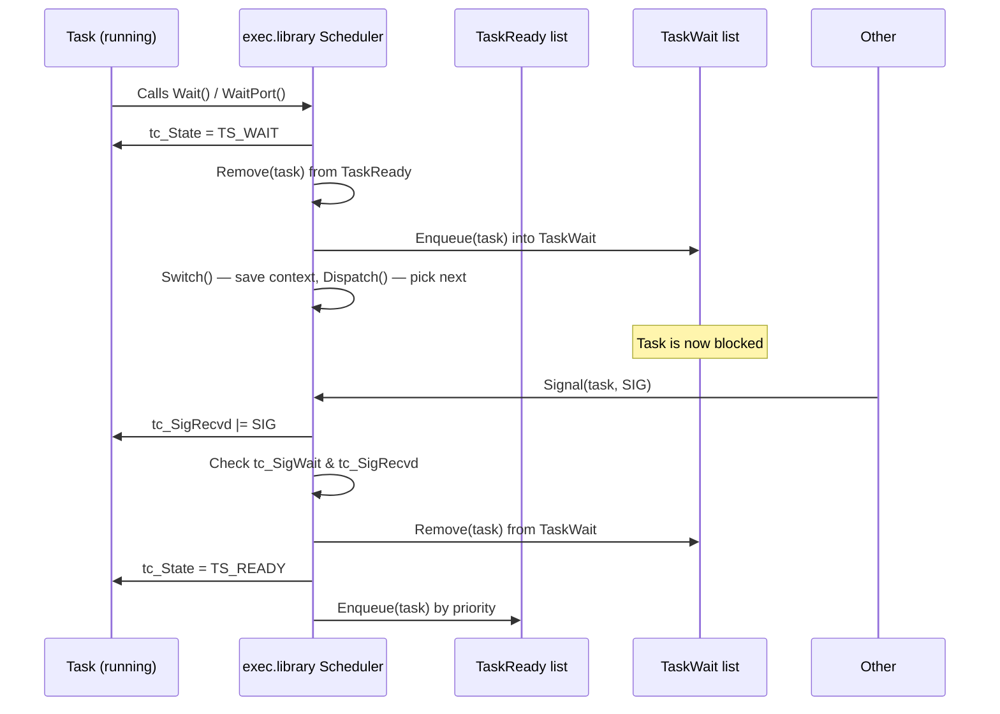
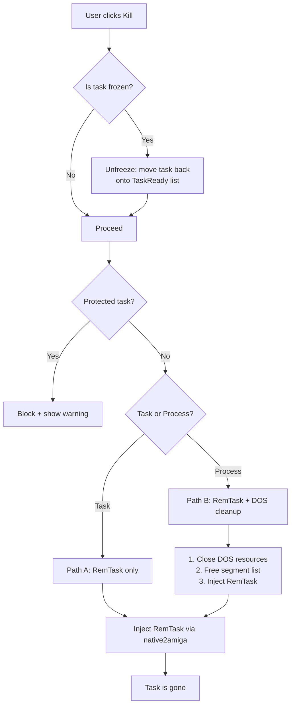
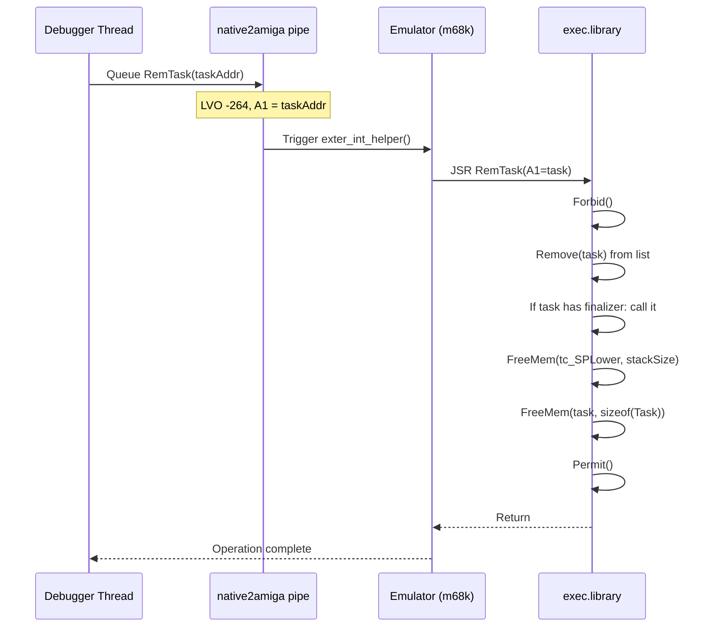
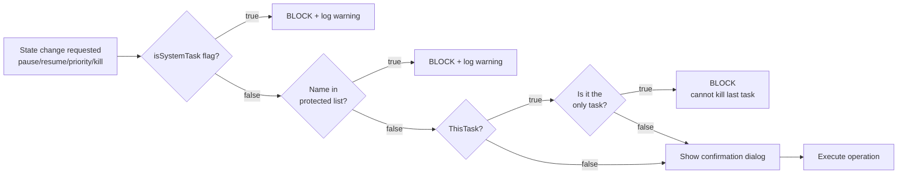
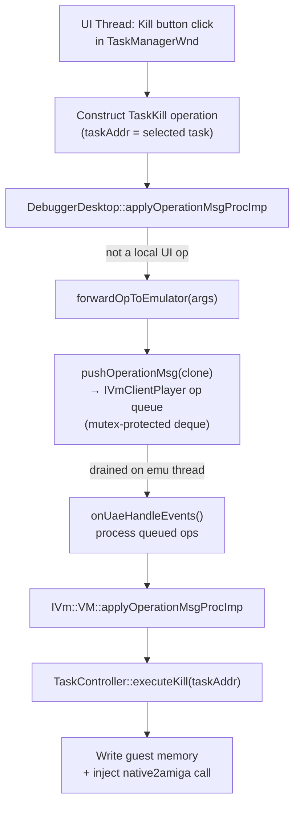
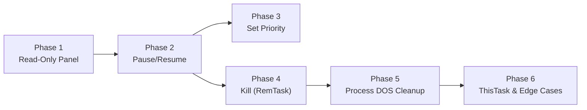

# AmigaOS Task Control Panel Design

Design for a debugger panel that lists all AmigaOS tasks/processes in real-time and provides **active control**: pause (suspend), resume, priority change, and kill (with proper de-initialization).

This extends the existing [OsIntrospector](file:///Volumes/TB4-4Tb/Projects/emulators/github/quaesar-ng/libs/amDebugger/src/amDebugger/os/os_introspector.h) (read-only introspection, already implemented for the OS Modules Panel) into the **write/control** domain. Task control requires writing guest memory structures and calling exec.library functions — a fundamentally more dangerous operation than read-only introspection.

---

## Table of Contents

- [1. AmigaOS Task Lifecycle & Scheduler Internals](#1-amigaos-task-lifecycle--scheduler-internals)
- [2. Requirements & Use Cases](#2-requirements--use-cases)
- [3. Task Scanning (Read Path)](#3-task-scanning-read-path)
- [4. Task Control Operations (Write Path)](#4-task-control-operations-write-path)
  - [4.1 Pause (Suspend)](#41-pause-suspend)
  - [4.2 Resume](#42-resume)
  - [4.3 Set Priority](#43-set-priority)
  - [4.4 Kill (RemTask)](#44-kill-remtask)
- [5. Kill Strategy: Safe De-initialization](#5-kill-strategy-safe-de-initialization)
- [6. Safety Analysis & Risk Mitigation](#6-safety-analysis--risk-mitigation)
- [7. Threading & Operation Model](#7-threading--operation-model)
- [8. New Debugger Operations](#8-new-debugger-operations)
- [9. UI Layout](#9-ui-layout)
- [10. Module Placement & Code Skeletons](#10-module-placement--code-skeletons)
- [11. Implementation Phases](#11-implementation-phases)

---

## 1. AmigaOS Task Lifecycle & Scheduler Internals

To safely control tasks, we must understand exactly how the exec scheduler manages them. A mistake here corrupts the guest's linked lists and crashes AmigaOS.

### 1.1 The Three Task Lists

ExecBase maintains three references to tasks:

| Field | Offset in ExecBase | Contents |
|---|---|---|
| `ThisTask` | `0x0114` (276) | Pointer to the **currently running** task's `struct Task` |
| `TaskReady` | `0x0196` (406) | Linked list head: tasks with state `TS_READY` (runnable, waiting for CPU) |
| `TaskWait` | `0x01A4` (420) | Linked list head: tasks with state `TS_WAIT` (blocked, not schedulable) |

A task is on **exactly one** of these at any time — `ThisTask` is not on either list.

### 1.2 Task States

```c
#define TS_INVALID  0
#define TS_ADDED    1   // Added via AddTask but never run
#define TS_RUN      2   // Currently executing (ThisTask)
#define TS_READY    3   // On TaskReady list, waiting for CPU
#define TS_WAIT     4   // On TaskWait list, blocked on signal/semaphore
#define TS_EXCEPT   5   // Exception pending (transient)
#define TS_REMOVED  6   // Being removed (transient)
```

The state byte is at offset `tc_State` in `struct Task`. From the Amiga NDK `exec/tasks.h`:

```c
struct Task {
    struct Node tc_Node;        // ln_Type, ln_Pri, ln_Name  (offset 0)
    UBYTE       tc_State;       // offset 0x2C (44)... but actual offset varies
    // ...
};
```

The exact offset of `tc_State` varies slightly by structure version, but for all Kickstart 1.2–3.2 it is at **offset 0x2C (decimal 44)** from the start of the `Task` struct. This is because the `Node` is 12 bytes, followed by fixed fields up to `tc_State`.

### 1.3 Task Structure Offsets

For KS 1.2–3.2 (the struct is stable):

| Offset | Field | Size | Meaning |
|---|---|---|---|
| `+0` | `tc_Node.ln_Type` | BYTE | `NT_TASK` (1) or `NT_PROCESS` (7) |
| `+1` | `tc_Node.ln_Pri` | BYTE | Scheduling priority (-128 to +127) |
| `+4` | `tc_Node.ln_Name` | APTR | Pointer to name string |
| `+12` (`0x0C`) | `tc_Flags` | ULONG | Task flags (`TF_EXCEPT`, `TF_SWITCH`, etc.) |
| `+16` (`0x10`) | `tc_ExceptData` | APTR | Exception data |
| `+20` (`0x14`) | `tc_ExceptCode` | APTR | Exception handler code |
| `+24` (`0x18`) | `tc_SigAlloc` | ULONG | Allocated signal mask |
| `+28` (`0x1C`) | `tc_SigWait` | ULONG | Signals waiting for |
| `+32` (`0x20`) | `tc_SigRecvd` | ULONG | Received signals |
| `+36` (`0x24`) | `tc_SigExcept` | ULONG | Exception signals |
| `+40` (`0x28`) | `tc_TrapAlloc` | ULONG | Allocated traps |
| `+44` (`0x2C`) | `tc_TrapExcept` | ULONG | Exception traps |
| `+48` (`0x30`) | `tc_State` | UBYTE | Task state (TS_*) |

> **Note:** The classic NDK `exec/tasks.h` has a different ordering. The offsets above follow the **actual runtime layout** used by KS 1.2–3.2 which has been verified by the Amiga community through decades of debugging tools (SnoopDOS, Scout, TaskMaster). The design uses a field-offset table (like `ks_offsets.h`) to allow correction if a KS version deviates.

### 1.4 How Scheduling Works



**Key insight:** Moving a task between lists requires three operations:
1. `Remove(node)` from the current list (updates `ln_Pred->ln_Succ` and `ln_Succ->ln_Pred`)
2. Update `tc_State` to the new value
3. `Enqueue(list, node)` or `AddTail(list, node)` to add to the target list

These operations are **not atomic** — they must be done under `Forbid()/Permit()` (which disables task switching) to prevent the scheduler from seeing a half-updated list.

---

## 2. Requirements & Use Cases

### 2.1 Functional Requirements

| # | Requirement |
|---|---|
| R1 | **List tasks:** Display all AmigaOS tasks (ThisTask + TaskReady + TaskWait) with name, state, priority, type (task/process), stack range, and signals. |
| R2 | **Pause (suspend) task:** Remove a task from the TaskReady list and place it on a "frozen" pseudo-list so the scheduler never dispatches it. The task keeps its memory and state. |
| R3 | **Resume task:** Move a frozen task back to the TaskReady list (if it was READY) or TaskWait (if it was WAIT). |
| R4 | **Set priority:** Change `tc_Node.ln_Pri` and re-enqueue the task in the correct priority position. |
| R5 | **Kill task:** Call `RemTask()` to properly remove the task, free its stack, and clean up exec-side resources. For processes, attempt DOS-level cleanup (close files, free seglist). |
| R6 | **Protected tasks:** System-critical tasks (`exec.library` internal tasks, `input.device`, `timer.device`, `AmigaOS` task) cannot be killed, paused, resumed, or have their priority changed. The UI disables all state change controls for these tasks and shows protection info in a tooltip on hover. |
| R7 | **Confirmation dialog:** Kill and pause operations require explicit confirmation. |
| R8 | **Real-time refresh:** Task list refreshes at ~15Hz (matching the existing debugger refresh cadence). |

### 2.2 Use Cases

```mermaid
graph TB
    subgraph "Developer debugging a runaway task"
        D1["Task list shows<br/>myprogram is RUN<br/>consuming 100% CPU"] --> D2["Click Pause<br/>to suspend it"]
        D2 --> D3["Inspect its registers/memory<br/>in other debugger panels"]
        D3 --> D4["Kill it<br/>when done analyzing"]
    end

    subgraph "Cleaning up after crash"
        C1["Program crashed but<br/>left orphan tasks"] --> C2["Task panel shows<br/>zombie tasks in WAIT state"]
        C2 --> C3["Kill each orphan<br/>to free memory"]
    end

    subgraph "Priority debugging"
        P1["Task starvation suspected"] --> P2["Temporarily boost<br/>a task's priority<br/>to test hypothesis"]
    end
```



### 2.3 Non-Goals

- **NOT** a process creation mechanism (that's the hunk launcher).
- **NOT** a full AmigaOS process debugger (no single-stepping of guest tasks — that requires the CPU-level breakpoint system).
- **NOT** a replacement for the CPU-level pause/resume (which pauses the entire emulator).
- **NOT** a file/resource leak detector (though the task panel will *display* open file handles for processes — closing them is a future feature).

---

## 3. Task Scanning (Read Path)

Task scanning is the read-only part — it walks the three exec lists and builds a snapshot. This reuses the existing `OsIntrospector` infrastructure (same pattern as `scanLibraries()`).

### 3.1 TaskInfo Data Model

```cpp
// In os_introspector.h or a new os_task_info.h

enum class TaskState : uint8_t {
    Invalid = 0,
    Added   = 1,
    Run     = 2,
    Ready   = 3,
    Wait    = 4,
    Except  = 5,
    Removed = 6,
    // Custom states used by the task controller:
    Frozen  = 0xFE,  // Paused by the debugger — not on any exec list
};

enum class TaskType : uint8_t {
    Task    = 1,   // NT_TASK
    Process = 7,   // NT_PROCESS
};

struct TaskInfo {
    uint32_t    taskAddr;       // Address of the Task struct in guest memory
    std::string name;
    TaskType    type;
    int8_t      priority;       // tc_Node.ln_Pri
    TaskState   state;
    uint32_t    flags;          // tc_Flags
    uint32_t    sigAlloc;       // tc_SigAlloc
    uint32_t    sigWait;        // tc_SigWait
    uint32_t    sigRecvd;       // tc_SigRecvd
    uint32_t    sigExcept;      // tc_SigExcept
    uint32_t    lowerSP;        // tc_SPLower (stack lower bound)
    uint32_t    upperSP;        // tc_SPUpper (stack upper bound)
    uint32_t    stackSize;      // upperSP - lowerSP
    // Process-specific (only valid if type == Process):
    uint32_t    cliAddr;        // pr_CLI — CLI structure pointer (0 if not a CLI process)
    uint32_t    segList;        // pr_SegList — segment list handle
    uint32_t    dirEntry;       // pr_HomeDir — lock on current directory
    bool        isSystemTask;   // True if name is in the protected list
};
```

### 3.2 Scanning Algorithm

```cpp
std::vector<TaskInfo> OsIntrospector::scanTasks() {
    std::vector<TaskInfo> tasks;
    if (!isOsBooted()) return tasks;

    const auto* off = m_offsets;
    uint32_t execBase = m_cachedKs.execBase;

    // 1. ThisTask (always one)
    uint32_t thisTask = readU32(execBase + off->thisTaskOffset);
    if (thisTask != 0) {
        TaskInfo ti = readTaskStruct(thisTask);
        ti.state = TaskState::Run;  // Override — ThisTask is always RUN
        tasks.push_back(ti);
    }

    // 2. TaskReady list
    walkTaskList(execBase + off->taskReadyOffset, TaskState::Ready, tasks);

    // 3. TaskWait list
    walkTaskList(execBase + off->taskWaitOffset, TaskState::Wait, tasks);

    // 4. Frozen tasks (managed by the controller, not on exec lists — see §4.1)
    // These are merged in by the TaskController, not by the scanner itself.

    // Mark system tasks
    markProtectedTasks(tasks);

    return tasks;
}
```

### 3.3 Walking a List

Exec lists are doubly-linked via `struct List` (lh_Head, lh_Tail, lh_TailPred) and each node has `ln_Succ`/`ln_Pred` at the first 8 bytes.

```cpp
void OsIntrospector::walkTaskList(uint32_t listAddr, TaskState listState,
                                   std::vector<TaskInfo>& out) {
    // struct List:
    //   +0  lh_Head    (APTR — first node, or &lh_Tail if empty)
    //   +4  lh_Tail    (always 0, used as sentinel)
    //   +8  lh_TailPred(APTR — last node, or &lh_Head if empty)

    uint32_t head = readU32(listAddr + 0);
    uint32_t tailPred = readU32(listAddr + 8);

    if (head == 0 || head == (listAddr + 4)) return;  // Empty list

    uint32_t node = head;
    int maxIter = 512;  // Safety guard against corrupted lists
    while (node != (listAddr + 4) && node != 0 && maxIter-- > 0) {
        TaskInfo ti = readTaskStruct(node);
        ti.state = listState;  // Trust list membership over stored state
        out.push_back(ti);
        node = readU32(node + 0);  // ln_Succ
    }
}
```

> **Guard:** The `maxIter = 512` safety limit prevents infinite loops if guest memory is corrupted (e.g., a broken `ln_Succ` pointer). If the limit is hit, the scan returns what it has and logs a warning. A real AmigaOS rarely has more than ~50 tasks.

### 3.4 Reading a Task Struct

```cpp
TaskInfo OsIntrospector::readTaskStruct(uint32_t taskAddr) {
    TaskInfo ti{};
    ti.taskAddr = taskAddr;

    // struct Node (offsets within Task):
    uint8_t lnType = readU8(taskAddr + 0);
    ti.type = (lnType == 7) ? TaskType::Process : TaskType::Task;
    ti.priority = (int8_t)readU8(taskAddr + 1);

    uint32_t namePtr = readU32(taskAddr + 4);
    ti.name = readCString(namePtr, 64);

    // Fixed offsets (stable across KS 1.2-3.2):
    ti.flags     = readU32(taskAddr + 0x0C);
    ti.sigAlloc  = readU32(taskAddr + 0x18);
    ti.sigWait   = readU32(taskAddr + 0x1C);
    ti.sigRecvd  = readU32(taskAddr + 0x20);
    ti.sigExcept = readU32(taskAddr + 0x24);

    // Stack bounds — these are at tc_SPLower/tc_SPUpper
    // In the exec Task struct, these follow tc_State:
    //   tc_State   at +0x2C... but we need the real layout.
    // Verified offsets for tc_SPLower/tc_SPUpper:
    //   tc_SPLower at +0x3C
    //   tc_SPUpper at +0x40
    ti.lowerSP   = readU32(taskAddr + 0x3C);
    ti.upperSP   = readU32(taskAddr + 0x40);
    ti.stackSize = ti.upperSP - ti.lowerSP;

    // Process-specific fields (read only if NT_PROCESS)
    if (ti.type == TaskType::Process) {
        // struct Process extends Task. pr_CLI is at a deeper offset.
        // For KS 2.0+ the Process struct has pr_CLI at offset ~0xAC from
        // the Task base. This varies by version and is resolved via
        // the offset table.
        // Phase 1: skip process details. Phase 2: fill them in.
    }

    return ti;
}
```

### 3.5 Protected Task Detection

Tasks whose killing would crash the system are flagged. The detection is name-based:

```cpp
static const std::array<const char*, 8> kProtectedTasks = {
    "exec",              // ExecBase internal task (shouldn't appear but guard anyway)
    "AmigaOS",           // KS 3.x bootstrap task
    "input.device",      // Input handler
    "timer.device",      // Timer server
    "Keyboard",          // Keyboard interrupt task
    "VBlank",            // Vertical blank handler
    "CDROM Handler",     // CD daemon (if present)
    "Port audio driver", // Audio daemon
};

void OsIntrospector::markProtectedTasks(std::vector<TaskInfo>& tasks) {
    for (auto& t : tasks) {
        for (const char* proto : kProtectedTasks) {
            if (t.name == proto) {
                t.isSystemTask = true;
                break;
            }
        }
    }
}
```

> The list is intentionally conservative. Even if a protected task *could* be killed in some edge cases, the default is to block it — a false "protected" label only annoys the developer, while a false "killable" label can crash AmigaOS.

### 3.6 Refresh Cadence

The UI panel calls `scanTasks()` at ~15 Hz (every ~66ms), matching the existing OS Modules panel. This is fast enough for responsive debugging without overloading the guest memory read path.

---

## 4. Task Control Operations (Write Path)

This is the core new functionality. Unlike scanning (read-only), these operations **mutate guest memory structures** and **call exec.library functions** inside the emulator.

All write-path operations share a common pattern:
1. The emulator **must be paused** at the CPU level (entire VM frozen) — the debugger already enforces this.
2. The operation is submitted as a **Debugger Operation** (see §7-8) and executed on the emulator thread.
3. Inside the operation, guest memory writes use `IVm::Memory::setU32()` / `setU8()`.
4. For operations that need to call exec.library (like RemTask), we use the `native2amiga` pipe mechanism to inject a guest-side function call.

### 4.1 Pause (Suspend)

**Goal:** Stop a task from being scheduled without killing it.

AmigaOS has no native "suspend" API — a task is either on a list (schedulable) or removed (effectively dead). We implement pause by **removing the task from its exec list** and storing it in our own private "frozen list" managed by the debugger.

```
┌─────────────────────────────────────────────────────┐
│  PAUSE ALGORITHM                                     │
│                                                       │
│  1. Forbid()  — disable task switching               │
│  2. Remove(task) from TaskReady or TaskWait          │
│  3. tc_State = TS_INVALID (marker — task is off-list)│
│  4. Permit()  — re-enable scheduling                 │
│  5. Add task to debugger's frozen list               │
│     (store original state for resume)                │
└─────────────────────────────────────────────────────┘
```

**Implementation (memory writes):**

```cpp
void TaskController::pauseTask(uint32_t taskAddr) {
    auto* mem = m_vm->getMemory();
    uint32_t execBase = m_intro->readU32(0x00000004);
    const auto* off = m_intro->getOffsets();

    // Determine which list the task is on
    uint8_t state = mem->getU8(taskAddr + 0x2C);

    TaskState origState;
    if (state == 3) origState = TaskState::Ready;
    else if (state == 4) origState = TaskState::Wait;
    else return;  // Can't pause RUN/invalid tasks this way

    // Remove from list: update neighbor pointers
    uint32_t succ = mem->getU32(taskAddr + 0);      // ln_Succ
    uint32_t pred = mem->getU32(taskAddr + 4);      // ln_Pred
    mem->setU32(pred + 0, succ);   // pred->ln_Succ = succ
    mem->setU32(succ + 4, pred);   // succ->ln_Pred = pred

    // Clear the node's own pointers (mark as unlinked)
    mem->setU32(taskAddr + 0, 0);
    mem->setU32(taskAddr + 4, 0);

    // Set state to a marker
    mem->setU8(taskAddr + 0x2C, (uint8_t)TaskState::Frozen);

    // Store in frozen map for later resume
    m_frozenTasks[taskAddr] = { origState, state };
}
```

> **Why not Forbid()/Permit()?** Since the emulator is already paused at the CPU level (the entire VM is frozen), task switching is inherently stopped. No guest code runs between our memory writes. The Forbid/Permit call would be redundant. However, when we later support "live mode" operations (Section 7.3), Forbid/Permit via `native2amiga` becomes necessary.

### 4.2 Resume

**Goal:** Put a frozen task back into scheduling.

```
┌─────────────────────────────────────────────────────┐
│  RESUME ALGORITHM                                    │
│                                                       │
│  1. Look up frozen entry (origState)                  │
│  2. Forbid()                                         │
│  3. If origState was READY:                          │
│       Enqueue(TaskReady, task) — insert by priority   │
│  4. If origState was WAIT:                           │
│       AddTail(TaskWait, task)                        │
│  5. tc_State = origState                              │
│  6. Permit()                                         │
│  7. Remove from frozen list                          │
└─────────────────────────────────────────────────────┘
```

**Implementation:**

```cpp
void TaskController::resumeTask(uint32_t taskAddr) {
    auto it = m_frozenTasks.find(taskAddr);
    if (it == m_frozenTasks.end()) return;  // Not frozen

    TaskState origState = it->second.originalState;
    uint32_t execBase = m_intro->readU32(0x00000004);
    const auto* off = m_intro->getOffsets();

    uint32_t listAddr = (origState == TaskState::Ready)
        ? (execBase + off->taskReadyOffset)
        : (execBase + off->taskWaitOffset);

    if (origState == TaskState::Ready) {
        // Enqueue by priority — walk the list to find insertion point
        enqueueByPriority(listAddr, taskAddr);
    } else {
        // AddTail — simple append to end of list
        addTail(listAddr, taskAddr);
    }

    // Restore state byte
    m_vm->getMemory()->setU8(taskAddr + 0x2C, (uint8_t)origState);

    m_frozenTasks.erase(it);
}
```

### 4.3 Set Priority

**Goal:** Change a task's priority and re-sort it within the TaskReady list.

```
┌─────────────────────────────────────────────────────────────┐
│  SET PRIORITY ALGORITHM                                     │
│                                                             │
│  1. tc_Node.ln_Pri = newPriority                            │
│  2. If task is on TaskReady:                                │
│       Remove(task) from TaskReady                           │
│       Enqueue(TaskReady, task) — re-insert by pri           │
│  3. If task is frozen or on TaskWait:                       │
│       Just update ln_Pri (no re-sort needed)                │
│  4. If task is ThisTask (RUN):                              │
│       Just update ln_Pri (will take effect next Reschedule) │
└─────────────────────────────────────────────────────────────┘
```

### 4.4 Kill (RemTask)

Killing a task is the most complex operation — it must free resources owned by the task. The cleanest approach is to call the real `RemTask()` exec function, which does this internally:

1. Remove the task from all exec lists.
2. Call the task's finalization function (if `tc_Flags & TF_STACKCHK` — no; if `tc_Flags` has cleanup bit — run it).
3. Free the task's stack memory (`FreeMem(tc_SPLower, stackSize)`).
4. Free the task struct itself if it was allocated with `AllocMem`.

Because `RemTask()` is a complex exec.library function that expects to run in guest context (m68k), we **cannot** just write memory — we must inject a function call.

**Two kill strategies:**

| Strategy | Method | When to use |
|---|---|---|
| **A: Guest call** | Use `native2amiga` pipe to inject a `RemTask(task)` call into the guest | Default — safest, uses real exec logic |
| **B: Manual cleanup** | Memory-write the list removal + stack free ourselves | Fallback if guest call fails or emulator can't run guest code |

**Strategy A (preferred):**

```cpp
void TaskController::killTask(uint32_t taskAddr) {
    // Use native2amiga pipe to call RemTask(taskAddr)
    // RemTask is LVO -264 in exec.library
    //
    // The pipe sends a request that is drained by exter_int_helper()
    // on the next emulator iteration. It sets up:
    //   A6 = ExecBase
    //   A1 = taskAddr
    //   JSR [ExecBase - 264]  (RemTask)
    //
    // After the call completes, the task is fully cleaned up by exec.
    m_pendingKillRequests.push(taskAddr);

    // Unfreeze if frozen (move back to a list first so RemTask finds it)
    auto it = m_frozenTasks.find(taskAddr);
    if (it != m_frozenTasks.end()) {
        resumeTask(taskAddr);  // Put back on list before killing
    }
}
```

The detailed kill flow, including process-specific DOS cleanup and the native2amiga call sequence, is covered in **Section 5**.


---

## 5. Kill Strategy: Safe De-initialization

Killing a task safely is the hardest operation. AmigaOS tasks own resources: memory (stack, task struct), signals, open file handles (for processes), message ports, and locks. A naive "remove from list + free stack" leaves dangling references.

### 5.1 The Two Kill Paths



### 5.2 Path A: Simple Task Kill (RemTask)

For a bare `struct Task` (not a process), `RemTask()` does everything needed:



The `native2amiga` pipe mechanism (already used by `uae_ShellExecute()` and `uae_AllocMem()` in `native2amiga.cpp`) handles this:

1. The debugger queues a message on the `native2amiga_pending` smp_comm_pipe.
2. On the next emulator iteration, `exter_int_helper()` in `filesys.cpp` drains the pipe.
3. The guest executes `CallLib(ctx, execBase, -264)` with `A1 = taskAddr`.
4. `RemTask()` runs in full guest context, performing all cleanup.

### 5.3 Path B: Process Kill (DOS + RemTask)

A `struct Process` extends `struct Task` with DOS-level state. `RemTask()` alone won't close DOS resources. We need a layered cleanup:

| Layer | What to clean | How |
|---|---|---|
| **DOS** | Open files (`pr_FileHandles`), current directory lock (`pr_HomeDir`), CLI structure (`pr_CLI`), segment list (`pr_SegList`) | Inject calls to `Close()`, `UnLock()`, `FreeDosObject()`, `UnLoadSeg()` |
| **Exec** | Task struct, stack, signals, message ports | `RemTask()` as in Path A |

**DOS cleanup sequence (injected via native2amiga):**

```
1. Forbid()
2. Walk pr_FileHandles list — Close() each handle
3. If pr_HomeDir != NULL — UnLock(pr_HomeDir)
4. If pr_CLI != NULL — FreeDosObject(DOS_CLI, pr_CLI)
5. If pr_SegList != NULL — UnLoadSeg(pr_SegList)
6. Permit()
7. RemTask(NULL)   // NULL = remove ThisTask (the process)
```

> **Important:** `RemTask(NULL)` removes the current task. But if we're injecting from outside, the target task is NOT `ThisTask`. We must pass the task pointer explicitly: `RemTask(taskAddr)`. However, RemTask's DOS-aware behavior differs — it checks if the task is `ThisTask` and handles some fields differently. For externally-removed processes, we must do the DOS cleanup manually BEFORE calling RemTask.

### 5.4 Handling the Currently-Running Task (ThisTask)

Killing `ThisTask` is special — it's the task currently executing. `RemTask(ThisTask)` works in guest context (it switches to another task after cleanup), but when injecting from the debugger:

- The emulator is **paused** — no guest code is running.
- We can't call `RemTask(ThisTask)` directly because there's no "current task" context to switch away from.

**Solution:** If the target is `ThisTask`, we:
1. Set a **pending kill flag** on the task.
2. Inject a small guest trampoline that calls `RemTask(FindTask(NULL))` — this runs in the context of the target task itself.
3. When the emulator is un-paused, the trampoline executes, the task removes itself, and exec switches to the next task.

### 5.5 Kill Timeout & Failure Handling

| Scenario | Detection | Recovery |
|---|---|---|
| native2amiga pipe full | `write_msg()` returns error | Retry 3×, then abort with error message |
| Task struct corrupted | `RemTask()` crashes inside guest | Catch via CPU exception handler, log error, perform manual memory cleanup |
| Task not found on any list | Address mismatch during scan | Log warning, remove from frozen list if present |
| Process has open system resources | DOS cleanup fails | Log which resources couldn't be closed, proceed with RemTask anyway |

---

## 6. Safety Analysis & Risk Mitigation

Task control operates on live AmigaOS data structures. Any corruption can crash the guest OS. This section catalogues the risks and their mitigations.

### 6.1 Risk Matrix

| Risk | Severity | Probability | Mitigation |
|---|---|---|---|
| **Corrupted linked list** — wrong pointer write breaks TaskReady/TaskWait chain | Critical — crashes guest OS | Medium — pointer arithmetic is error-prone | Validate all list operations with read-back checks; use Forbid/Permit in live mode; max 512 iteration guard |
| **Killing a system task** — removes a task exec depends on (e.g., input.device) | Critical — guest freezes or crashes | Low — UI blocks it | Protected task list (§3.5); UI disables Kill button; confirmation dialog |
| **Double-free** — killing a task that's already being removed by exec | High — memory corruption | Low — unlikely with debugger paused | Track killed task addresses; check before kill; clear frozen entries |
| **Stale frozen list** — frozen tasks survive a guest reset/reboot | Medium — zombie entries in debugger | High — frozen list is debugger-side, not cleared on reset | Clear frozen list on emulator reset/reboot event |
| **Process with active I/O** — killing a task mid-file-write | Medium — file corruption on guest | Medium — common use case | Display open file count in UI; warn before kill; phase 2: close files gracefully |
| **Stack pointer in use** — reading SP of a running task gives stale value | Low — cosmetic | High — by definition | Display SP as informational only; don't act on it |
| **Signal mask misinterpretation** — misreading tc_SigWait as tc_SigRecvd | Low — cosmetic | Low | Use the verified offset table; unit test against known task dumps |

### 6.2 Memory Access Safety

All guest memory accesses go through `IVm::Memory`. The emulator's memory layer provides:

- **Bounds checking:** Reads/writes outside valid memory ranges return 0 / are ignored.
- **No guest crash:** A bad pointer read can't crash the emulator host — only return garbage data.
- **No half-states:** Since all operations happen while the VM is paused, there's no race between our writes and guest execution.

The one dangerous operation is **writing** to guest memory — a bad write to a linked list pointer can corrupt the guest. Mitigations:

```cpp
// Safe linked-list removal with validation
bool safeRemoveNode(IVm::Memory* mem, uint32_t nodeAddr) {
    uint32_t succ = mem->getU32(nodeAddr + 0);  // ln_Succ
    uint32_t pred = mem->getU32(nodeAddr + 4);  // ln_Pred

    // Validate: succ's predecessor should point back to us
    if (mem->getU32(succ + 4) != nodeAddr) return false;  // Corrupted
    // Validate: pred's successor should point back to us
    if (mem->getU32(pred + 0) != nodeAddr) return false;  // Corrupted

    // Safe to unlink
    mem->setU32(pred + 0, succ);
    mem->setU32(succ + 4, pred);
    mem->setU32(nodeAddr + 0, 0);
    mem->setU32(nodeAddr + 4, 0);
    return true;
}
```

### 6.3 Undo / Rollback Strategy

For pause/resume operations, a rollback is always possible:

| Operation | Rollback |
|---|---|
| Pause | Resume re-adds the task to its original list |
| Resume | Pause removes it again (net effect: no-op) |
| Set priority | Store old priority, restore on "undo" |
| Kill | **No rollback** — the task and its memory are freed. This is why Kill requires confirmation. |

### 6.4 Protected Task Enforcement

**UI layer (first line of defense):** When a protected task is selected, all state change controls (Pause/Resume, Set Priority, Kill) are disabled. The task row shows a `⚠` indicator and a tooltip on hover explains why the task is protected:

> **Protected System Task**
> `timer.device` is essential for AmigaOS operation.
> Modifying or killing it will crash the system.

**Operation layer (defense in depth):** Even if a control is somehow invoked, each operation independently checks the `isSystemTask` flag and rejects the request:



> The dual-layer approach ensures that both a UI bug (accidentally enabling a button) and a programmatic invocation (e.g., from a script) are caught. The UI layer provides good UX (user sees disabled buttons + tooltip); the operation layer provides safety (no mutation ever reaches guest memory for protected tasks).

---

## 7. Threading & Operation Model

Task control operations originate in the UI thread (ImGui button click) but must execute on the **emulator thread** where guest memory access is safe. This follows the project's established operation dispatch architecture.

### 7.1 The Dispatch Chain for Task Control



This is the same path used by all debugger operations (pause, step, breakpoint toggle). The key properties:

1. **Thread-safe:** The UI thread never touches guest memory directly. All mutations happen on the emulator thread.
2. **Works while paused:** The emulator thread drains queued operations even while the CPU is paused (see `uae_server_thread.cpp` lines 267-277 — it wakes every 50ms to process the queue).
3. **Ordered:** Operations are serialized through the deque — no two task-control ops can race.

### 7.2 Two Execution Contexts

| Context | When | How guest memory is accessed |
|---|---|---|
| **Paused** (VM frozen) | Default — all read-path scans and write-path ops | Direct `getU32()`/`setU32()` on `IVm::Memory`. Safe — no guest code runs between accesses. |
| **Live** (VM running) | Phase 2 — future "pause task without freezing VM" | Requires Forbid/Permit injection via native2amiga. The guest must be running for the Forbid call to execute. |

**Phase 1 (this design):** All task control operations require the emulator to be paused at the CPU level. This simplifies the implementation — no Forbid/Permit needed because the scheduler isn't running. The task panel is most useful during paused debugging anyway.

### 7.3 Frozen Task Lifecycle Across Emulator State Changes

| Event | Frozen Tasks Action |
|---|---|
| Emulator paused | No action — frozen tasks stay frozen |
| Emulator resumed (run) | No action — frozen tasks remain off-list, scheduler ignores them |
| Emulator reset | **Clear all frozen tasks** — guest memory is reset, task addresses are invalid |
| Emulator reboot (new floppy/ADF) | **Clear all frozen tasks** — same reason |
| Snapshot loaded | **Clear all frozen tasks** — addresses may differ in new state |

The `TaskController` listens for emulator reset/reboot events and clears `m_frozenTasks` accordingly. If it doesn't, a "resume" after reset would write to random memory addresses, corrupting the fresh state.

### 7.4 The TaskController Class

```cpp
class TaskController {
public:
    explicit TaskController(os::OsIntrospector* intro, IVm::VM* vm);

    // Read path (callable from UI thread, reads cached snapshot)
    std::vector<TaskInfo> getTaskSnapshot() const { return m_cachedTasks; }
    void refreshSnapshot();  // Called at 15Hz — scans exec lists + merges frozen

    // Write path (must be called on emulator thread via operations)
    bool pauseTask(uint32_t taskAddr);
    bool resumeTask(uint32_t taskAddr);
    bool setPriority(uint32_t taskAddr, int8_t newPri);
    bool killTask(uint32_t taskAddr);

    // State queries
    bool isFrozen(uint32_t taskAddr) const;
    size_t frozenCount() const { return m_frozenTasks.size(); }

    // Called on emulator reset/reboot
    void onEmulatorReset();

private:
    struct FrozenEntry {
        TaskState originalState;
        uint8_t  originalStateByte;
    };

    os::OsIntrospector* m_intro;
    IVm::VM* m_vm;
    std::vector<TaskInfo> m_cachedTasks;
    std::unordered_map<uint32_t, FrozenEntry> m_frozenTasks;
};
```

---

## 8. New Debugger Operations

Task control needs four new operation types, following the existing `OperationArgs` pattern from [debuggerOps.h](file:///Volumes/TB4-4Tb/Projects/emulators/github/quaesar-ng/libs/amDebugger/src/amDebugger/debuggerOps.h) and [qsr_operations.h](file:///Volumes/TB4-4Tb/Projects/emulators/github/quaesar-ng/src/quasar_app/qsr_operations.h).

### 8.1 Operation Declarations

```cpp
// In debuggerOps.h (alongside DisasmToggleBreakpoint etc.)

struct TaskPause : public amD::operation::OperationArgs {
    DECLARE_OPERATION_1(amD::operation::TaskPause);
    static void setup(qd::operation::OpDesc& d) { d.m_name = "Pause Task"; }
    uint32_t taskAddr = 0;
};

struct TaskResume : public amD::operation::OperationArgs {
    DECLARE_OPERATION_1(amD::operation::TaskResume);
    static void setup(qd::operation::OpDesc& d) { d.m_name = "Resume Task"; }
    uint32_t taskAddr = 0;
};

struct TaskSetPriority : public amD::operation::OperationArgs {
    DECLARE_OPERATION_1(amD::operation::TaskSetPriority);
    static void setup(qd::operation::OpDesc& d) { d.m_name = "Set Task Priority"; }
    uint32_t taskAddr = 0;
    int8_t   priority = 0;
};

struct TaskKill : public amD::operation::OperationArgs {
    DECLARE_OPERATION_1(amD::operation::TaskKill);
    static void setup(qd::operation::OpDesc& d) { d.m_name = "Kill Task"; }
    uint32_t taskAddr = 0;
};
```

### 8.2 Operation Handler

The operations are handled in `Debugger::applyOperationMsgProcImp()` (or the VM layer's override), where they forward to `TaskController`:

```cpp
// In debugger.cpp or the VM implementation's applyOperationMsgProcImp()

qd::EFlow Debugger::applyOperationMsgProcImp(qd::operation::BaseOpArgs* args) {
    if (auto* op = args->cast_<amD::operation::TaskPause>()) {
        m_taskController.pauseTask(op->taskAddr);
        return EFlow::STOP;
    }
    if (auto* op = args->cast_<amD::operation::TaskResume>()) {
        m_taskController.resumeTask(op->taskAddr);
        return EFlow::STOP;
    }
    if (auto* op = args->cast_<amD::operation::TaskSetPriority>()) {
        m_taskController.setPriority(op->taskAddr, op->priority);
        return EFlow::STOP;
    }
    if (auto* op = args->cast_<amD::operation::TaskKill>()) {
        m_taskController.killTask(op->taskAddr);
        return EFlow::STOP;
    }
    // ... existing operations
    return m_pVm->applyOperationMsgProcImp(args);
}
```

### 8.3 UI-Side Invocation Pattern

From the ImGui panel, operations are dispatched the same way as existing buttons:

```cpp
// In task_manager_wnd.cpp
if (ImGui::Button("Kill")) {
    amD::operation::TaskKill op;
    op.taskAddr = m_selectedTaskAddr;
    getDbg()->applyOperationMsgProc(&op);
}
```

This flows through the dispatch chain (DebuggerDesktop → forwardOpToEmulator → queue → emulator thread), ensuring the actual kill runs on the right thread.

---

## 9. UI Layout

A new debugger panel, separate from the existing OS Modules panel, dedicated to task monitoring and control.

### 9.1 WndId Registration

Add `TaskManager` to the [WndId enum](file:///Volumes/TB4-4Tb/Projects/emulators/github/quaesar-ng/libs/amDebugger/src/amDebugger/ui/uiDefs.h):

```cpp
enum class WndId {
    MemoryView,
    CopperDbgWnd,
    Disassembly,
    Registers,
    Console,
    Screen,
    Colors,
    MemoryGraph,
    CustomRegsWnd,
    BlitterWnd,
    OsModules,
    TaskManager,    // <-- NEW
    ImGuiDemo,
    MostCommonCount,
};
```

### 9.2 Panel Layout

```
┌──────────────────────────────────────────────────────────────────┐
│  OS Tasks                                                         │
│  Kickstart: 3.1  ExecBase: $0060F264                               │
│  ──────────────────────────────────────────────────────────────   │
│                                                                   │
│  ┌─ Toolbar ────────────────────────────────────────────────────┐ │
│  │ [Refresh] [Pause All Frozen] [Resume All]    Frozen: 2       │ │
│  └──────────────────────────────────────────────────────────────┘ │
│                                                                   │
│  ┌─ Task List ──────────────────────────────────────────────────┐ │
│  │ ●  Name           Type      State    Pri   Sig Wait   Stack  │ │
│  │ ───────────────────────────────────────────────────────────  │ │
│  │ ▸  input.device   Task      READY    10    0001     4KB    │ │
│  │    myprogram      Process   RUN       0    0000    64KB  ◄ │ │
│  │    Workbench      Process   WAIT      0    8000   128KB    │ │
│  │ ❄  background     Task      FROZEN    0    0000     8KB    │ │
│  │    Shell Process  Process   READY     0    0000    32KB    │ │
│  │ ⚠  timer.device¹  Task      READY    10    0001     4KB    │ │
│  └──────────────────────────────────────────────────────────────┘ │
│                                                                   │
│  ┌─ Selected Task Detail ───────────────────────────────────────┐ │
│  │ myprogram (Process) at $00123456                              │ │
│  │ State: RUNNING   Priority: 0   Flags: $0000                   │ │
│  │ Stack: $00200000-$00210000 (64KB)                             │ │
│  │ Signals: Alloc=$0003 Wait=$0000 Recvd=$0000 Except=$0000     │ │
│  │                                                                │ │
│  │  [Pause]  [Set Priority...]  [Kill...]                        │ │
│  │   ↑ All three disabled when a protected task is selected      │ │
│  └──────────────────────────────────────────────────────────────┘ │
│                                                                   │
│  ¹ Hover shows tooltip: Protected system task — controls disabled │
│                                                                   │
│  ─────────────────────────────────────────────────────────────   │
│  6 tasks (1 running, 3 ready, 1 waiting, 1 frozen) — 15Hz scan   │
└──────────────────────────────────────────────────────────────────┘
```

### 9.3 Visual Cues

| Indicator | Meaning |
|---|---|
| `▸` arrow | Currently selected task |
| `●` (green dot) | Currently running task (`ThisTask`) |
| `❄` snowflake | Frozen (paused by debugger) |
| `⚠` warning | Protected system task — **all state change controls disabled**. Hover shows a tooltip explaining why (e.g., *timer.device is essential for AmigaOS operation*) |

> When a protected task is selected, the detail panel's [Pause], [Set Priority...], and [Kill...] buttons are all rendered as disabled (`ImGui::BeginDisabled()` / `ImGui::EndDisabled()`). The tooltip on the `⚠` icon in the task list row provides the reason.
| State text color | Green=RUN, Yellow=READY, Blue=WAIT, Cyan=FROZEN, Red=EXCEPT |

### 9.4 Context Menu (Right-Click)

Right-clicking a task row opens a context menu:

```
┌──────────────────────┐
│ Pause / Resume       │  ← toggles based on frozen state
│ Set Priority...      │  ← opens input dialog (-128 to +127)
│ ──────────────────── │
│ Kill...              │  ← disabled if protected
│                      │
│ NOTE: ALL items disabled for protected tasks.
│ Hover a protected row for tooltip with reason.
└──────────────────────┘
```

### 9.5 Kill Confirmation Dialog

```
┌─────────────────────────────────────────────────┐
│  Kill Task Confirmation                          │
├─────────────────────────────────────────────────┤
│                                                   │
│  Are you sure you want to kill:                   │
│                                                   │
│    "myprogram" (Process) at $00123456             │
│    Priority: 0   Stack: 64KB                      │
│    Type: Process (DOS resources will be freed)    │
│                                                   │
│  ⚠ This action cannot be undone.                  │
│  ⚠ If the task owns system resources,             │
│    AmigaOS may become unstable.                   │
│                                                   │
│         [ Cancel ]      [ Kill Task ]             │
└─────────────────────────────────────────────────┘
```

### 9.6 Set Priority Dialog

```
┌─────────────────────────────────────────────────┐
│  Set Task Priority                               │
├─────────────────────────────────────────────────┤
│                                                   │
│  Task: "myprogram"                                │
│  Current priority: 0                              │
│                                                   │
│  New priority: [-128 ────●── +127]               │
│                          0                        │
│                                                   │
│         [ Cancel ]      [ Apply ]                 │
└─────────────────────────────────────────────────┘
```

### 9.7 Refresh Strategy

The panel follows the same pattern as [os_modules_wnd.cpp](file:///Volumes/TB4-4Tb/Projects/emulators/github/quaesar-ng/libs/amDebugger/src/amDebugger/window/os_modules_wnd.cpp):

```cpp
void TaskManagerWnd::drawContentImp() {
    Debugger* dbg = getDbg();
    if (!dbg) return;

    os::OsIntrospector* intro = dbg->getOsIntro();
    if (!intro || !intro->isOsBooted()) {
        ImGui::TextColored(ImVec4(1,0,0,1), "AmigaOS not booted.");
        return;
    }

    // Refresh at 15Hz
    double now = ImGui::GetTime();
    if (now - m_lastScanTime >= (1.0 / 15.0)) {
        m_taskController->refreshSnapshot();
        m_lastScanTime = now;
    }

    // Draw toolbar
    drawToolbar();

    // Draw task list table
    drawTaskTable();

    // Draw selected task detail
    drawDetailPanel();

    // Status bar
    drawStatusBar();
}
```


---

## 10. Module Placement & Code Skeletons

### 10.1 File Inventory

| File | Action | Purpose |
|---|---|---|
| `libs/amDebugger/src/amDebugger/os/task_info.h` | **New** | `TaskInfo`, `TaskState`, `TaskType` data model |
| `libs/amDebugger/src/amDebugger/os/task_controller.h` | **New** | `TaskController` class declaration |
| `libs/amDebugger/src/amDebugger/os/task_controller.cpp` | **New** | `TaskController` implementation (pause/resume/kill/priority) |
| `libs/amDebugger/src/amDebugger/os/os_introspector.h` | **Modify** | Add `scanTasks()`, `walkTaskList()`, `readTaskStruct()` |
| `libs/amDebugger/src/amDebugger/os/os_introspector.cpp` | **Modify** | Implement task scanning methods |
| `libs/amDebugger/src/amDebugger/window/task_manager_wnd.h` | **New** | `TaskManagerWnd` ImGui window declaration |
| `libs/amDebugger/src/amDebugger/window/task_manager_wnd.cpp` | **New** | `TaskManagerWnd` implementation (follows `os_modules_wnd.cpp` pattern) |
| `libs/amDebugger/src/amDebugger/ui/uiDefs.h` | **Modify** | Add `TaskManager` to `WndId` enum |
| `libs/amDebugger/src/amDebugger/debuggerOps.h` | **Modify** | Add `TaskPause`, `TaskResume`, `TaskSetPriority`, `TaskKill` operations |
| `libs/amDebugger/src/amDebugger/debugger.h` | **Modify** | Add `m_taskController` member, getter |
| `libs/amDebugger/src/amDebugger/debugger.cpp` | **Modify** | Handle new operations in `applyOperationMsgProcImp()` |
| Window registration (desktop/menu) | **Modify** | Register `TaskManagerWnd` in the debugger desktop factory |

### 10.2 TaskInfo Header Skeleton

```cpp
// task_info.h
#pragma once
#include <string>
#include <cstdint>

namespace amD::os {

enum class TaskState : uint8_t {
    Invalid = 0, Added = 1, Run = 2, Ready = 3,
    Wait = 4, Except = 5, Removed = 6,
    Frozen = 0xFE,  // Custom: paused by debugger
};

enum class TaskType : uint8_t {
    Task    = 1,   // NT_TASK
    Process = 7,   // NT_PROCESS
};

struct TaskInfo {
    uint32_t    taskAddr = 0;
    std::string name;
    TaskType    type = TaskType::Task;
    int8_t      priority = 0;
    TaskState   state = TaskState::Invalid;
    uint32_t    flags = 0;
    uint32_t    sigAlloc = 0, sigWait = 0, sigRecvd = 0, sigExcept = 0;
    uint32_t    lowerSP = 0, upperSP = 0, stackSize = 0;
    uint32_t    cliAddr = 0, segList = 0;
    bool        isSystemTask = false;
};

inline const char* taskStateString(TaskState s) {
    switch (s) {
        case TaskState::Invalid: return "INVALID";
        case TaskState::Added:   return "ADDED";
        case TaskState::Run:     return "RUN";
        case TaskState::Ready:   return "READY";
        case TaskState::Wait:    return "WAIT";
        case TaskState::Except:  return "EXCEPT";
        case TaskState::Removed: return "REMOVED";
        case TaskState::Frozen:  return "FROZEN";
    }
    return "?";
}

} // namespace amD::os
```

### 10.3 Window Class Skeleton

```cpp
// task_manager_wnd.h
#pragma once
#include "amDebugger/window/amDbgWindow.h"
#include "amDebugger/os/task_info.h"
#include <vector>
#include <string>

namespace amD::window {

class TaskManagerWnd : public AmDbgWindow {
    TS_REFLECT_CLASS(TaskManagerWnd, AmDbgWindow);
public:
    void onCreate(UiViewCreateCtx* cp) override;
protected:
    void drawContentImp() override;
private:
    void drawToolbar();
    void drawTaskTable();
    void drawDetailPanel();
    void drawStatusBar();

    double   m_lastScanTime = 0.0;
    uint32_t m_selectedTaskAddr = 0;
    bool     m_showKillConfirm = false;
    bool     m_showPriorityDialog = false;
    int      m_priorityInput = 0;
};

} // namespace amD::window
```

### 10.4 Integration with Debugger

The `Debugger` class already owns an `OsIntrospector`. We add a `TaskController` alongside it:

```cpp
// debugger.h additions
class Debugger {
    // ...
    os::OsIntrospector* getOsIntro() { return m_pOsIntro; }
    os::TaskController* getTaskController() { return m_pTaskController; }

private:
    os::OsIntrospector*  m_pOsIntro = nullptr;
    os::TaskController*  m_pTaskController = nullptr;  // NEW
};
```

The `TaskController` is constructed with the same `OsIntrospector` and `IVm::VM*` — it uses the introspector for reading task lists and the VM for writing memory.

---

## 11. Implementation Phases

### Phase 1: Read-Only Task Panel (Safe, No Write Path)

**Goal:** A task list panel that shows all tasks — no control operations yet.

| Step | Description |
|---|---|
| 1.1 | Create `task_info.h` with the data model |
| 1.2 | Add `scanTasks()`, `walkTaskList()`, `readTaskStruct()` to `OsIntrospector` |
| 1.3 | Create `task_manager_wnd.h/.cpp` — display only (table, state colors, detail panel) |
| 1.4 | Register `TaskManager` in `WndId` and the debugger desktop |
| 1.5 | Test against known AmigaOS states (idle Workbench, running a program) |

**Deliverable:** A task panel that refreshes at 15Hz, showing all tasks with names, states, priorities, and stack info.

### Phase 2: Pause / Resume (Memory-Write Path)

**Goal:** Ability to freeze and unfreeze tasks.

| Step | Description |
|---|---|
| 2.1 | Create `task_controller.h/.cpp` with `pauseTask()` / `resumeTask()` using `setU32()`/`setU8()` |
| 2.2 | Add `TaskPause` / `TaskResume` operations to `debuggerOps.h` |
| 2.3 | Wire operations through `Debugger::applyOperationMsgProcImp()` |
| 2.4 | Add Pause/Resume buttons to the UI with frozen-state indicators |
| 2.5 | Implement frozen-task merge in `refreshSnapshot()` (merge frozen list into scan results) |
| 2.6 | Add reset/reboot listener to clear frozen list |
| 2.7 | Test: pause a task, verify it stops running, resume, verify it resumes |

**Deliverable:** Working pause/resume on any non-protected task while the emulator is paused.

### Phase 3: Set Priority

**Goal:** Change task priority and re-sort lists.

| Step | Description |
|---|---|
| 3.1 | Implement `setPriority()` in `TaskController` (update `ln_Pri`, re-enqueue if on TaskReady) |
| 3.2 | Add `TaskSetPriority` operation |
| 3.3 | Add priority dialog UI |
| 3.4 | Test: boost/lower priority, verify re-ordering in exec lists |

### Phase 4: Kill (native2amiga Path)

**Goal:** Kill tasks with proper exec-level cleanup.

| Step | Description |
|---|---|
| 4.1 | Implement `killTask()` using `safeRemoveNode()` + manual stack/struct free (fallback strategy) |
| 4.2 | Test manual kill on a simple task (bare `struct Task`, not a process) |
| 4.3 | Add native2amiga pipe support for `RemTask()` injection (preferred strategy) |
| 4.4 | Test RemTask injection — verify guest cleanup is complete |
| 4.5 | Add kill confirmation dialog |
| 4.6 | Add protected-task enforcement in the kill path |
| 4.7 | Test: kill a user task, verify exec stability (run other tasks afterward) |

### Phase 5: Process Kill (DOS Cleanup)

**Goal:** Kill processes with full DOS-level de-initialization.

| Step | Description |
|---|---|
| 5.1 | Read `Process` struct fields (`pr_FileHandles`, `pr_HomeDir`, `pr_CLI`, `pr_SegList`) |
| 5.2 | Implement DOS cleanup injection (Close/UnLock/FreeDosObject/UnLoadSeg via native2amiga) |
| 5.3 | Test: kill a process with open files, verify file handles are freed |
| 5.4 | Test: kill a CLI process, verify CLI structure is freed |

### Phase 6: ThisTask Kill & Edge Cases

| Step | Description |
|---|---|
| 6.1 | Implement trampoline injection for killing `ThisTask` |
| 6.2 | Handle "only task" edge case |
| 6.3 | Handle process with active I/O warnings |
| 6.4 | Comprehensive testing across KS versions (1.3, 2.0, 3.1, 3.2) |

### Phase Summary



Each phase is independently shippable. Phase 1 alone is immediately useful as a task monitor. Phase 2 adds the first control capability. Phases 4-6 progressively make the kill feature safer and more complete.
