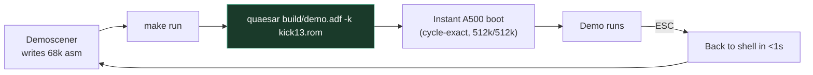
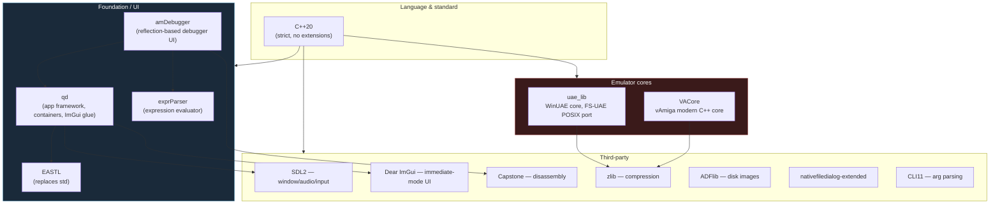
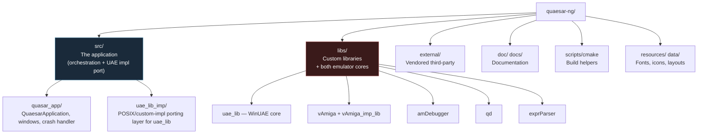

# 1 — Project Overview

← [Index](index.md) · → [System Architecture](02-system-architecture.md)

## What is Quaesar-NG?

Quaesar-NG is a **cross-platform Amiga emulator aimed at demosceners** —
developers who write 68000 assembly, copper lists, and blitter tricks, and who
iterate on the same build hundreds of times a day.

It is explicitly **not** a WinUAE/FS-UAE replacement. It is a *distillation*:
WinUAE's rock-solid cycle-accurate core, re-hosted behind a frictionless,
**CLI-first** workflow with a built-in debugger UI.

## Design philosophy

| Principle | What it means in practice |
|-----------|---------------------------|
| **CLI-first** | `quaesar file.adf`. No configuration GUI. Every option is a `-s key=value` passthrough to the UAE config parser. |
| **Zero-config startup** | Defaults to a pristine, cycle-exact A500 (512 KB Chip / 512 KB Slow RAM, OCS, Kickstart 1.3). |
| **Built-in debugger** | A separate ImGui debugger window with disassembly, memory, registers, custom-chip, copper and console views — see [amDebugger](08-libs-modules.md). |
| **Warp mode** | Fast-boot until user code, then drop to accurate timing. |
| **Cross-platform purity** | Identical behavior on macOS, Linux, and Windows. |
| **Scene-focused** | A500(+)/A600, A1200, A1230, A1260. RTG / Picasso96 deliberately removed to keep the core lean. |
| **ESC-to-exit** | One keystroke tears the whole emulator down and returns to the shell. |

## Target machines

- **A500 / A500+** (default), **A600** — OCS/ECS, 68000.
- **A1200 / A1230 / A1260** — AGA, 68020/030/060 with optional FPU.
- **A4000** — high-end 68040/060 configurations.
- Cycle-exact floppy, blitter, and CPU timing for trackmo / custom-loader work.

See the end-user [`doc/user_guide.md`](../doc/user_guide.md) for the full `-s`
flag glossary (CPU, FPU, chipset, memory, floppy, audio, filesystem).

## Technology stack

### Why two emulator cores?

Quaesar-NG ships **two interchangeable emulator backends** behind a single
abstraction (the [`IVm::VM`](03-vm-abstraction-boundary.md) interface):

1. **`uae_lib`** — the mature, compatibility-focused WinUAE core, ported to
   POSIX via the FS-UAE layer. The default.
2. **`VACore` (vAmiga)** — a clean, modern, fully object-oriented C++ rewrite.
   Enabled via the `VAMIGA` CMake option; used as an alternative/verification core.

Both are reached through the same debugger and the same operations pipeline —
this is the central architectural decision of the project, covered in
[doc 03](03-vm-abstraction-boundary.md) and [doc 04](04-operation-dispatch.md).

## Repository layout at a glance

| Path | Role | Doc |
|------|------|-----|
| `src/quasar_app/` | App entry, `QuaesarApplication`, VM-player window, crash handler, UAE backend glue | [02](02-system-architecture.md), [05](05-backend-uae.md) |
| `src/uae_lib_imp/` | The platform adaptation layer UAE calls into (`custom.cpp`, sound, threads, sysconfig) | [05](05-backend-uae.md) |
| `libs/uae_lib/` | The WinUAE emulator core (C/C++) | [05](05-backend-uae.md) |
| `libs/vAmiga/` | The vAmiga `VACore` library | [06](06-backend-vamiga.md) |
| `libs/vAmiga_imp_lib/` | vAmiga backend glue (`VAmVmImp`, `VAmServerThread`) | [06](06-backend-vamiga.md) |
| `libs/amDebugger/` | The reflection-based debugger UI + VM interface | [08](08-libs-modules.md) |
| `libs/qd/` | Foundation: app framework, containers, ImGui backend, operations | [08](08-libs-modules.md) |
| `libs/exprParser/` | Expression lexer/parser for the debugger console | [08](08-libs-modules.md) |
| `external/` | Vendored SDL2, EASTL, ImGui, Capstone, zlib, ADFlib, nfd, cli11, nlohmann | [07](07-external-dependencies.md) |

## Platform & toolchain

- **Windows**: MSVC with static CRT (`/MT[d]`).
- **Linux**: GCC/Clang, links `dl`, SDL2.
- **macOS**: Clang, uses `-force_load` to retain amDebugger's static auto-registration.
- **CI**: GitHub Actions (`.github/workflows/`).

Build details: [Build System](09-build-system.md).

---

← [Index](index.md) · → [System Architecture](02-system-architecture.md)
