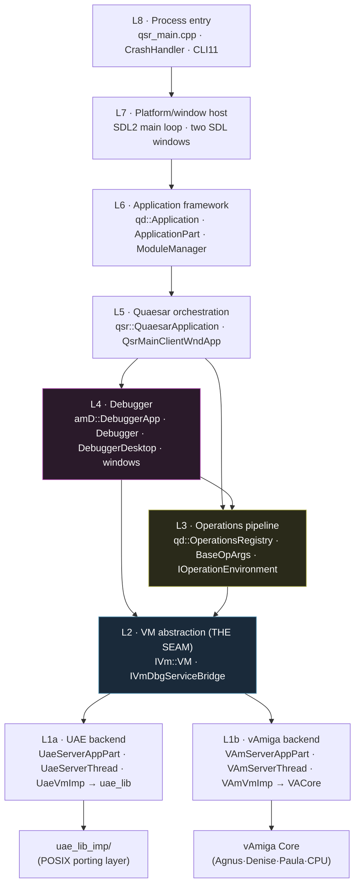
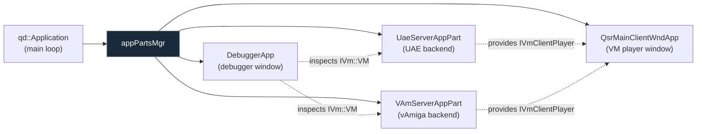
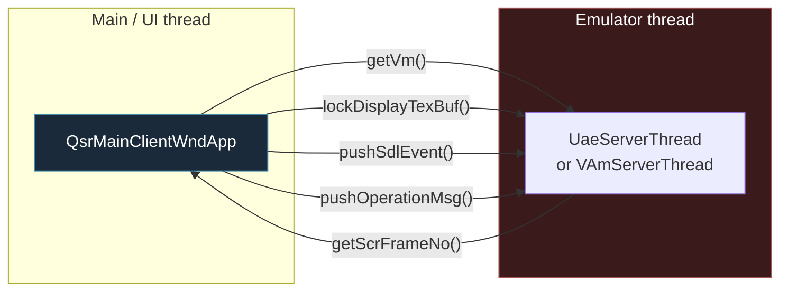
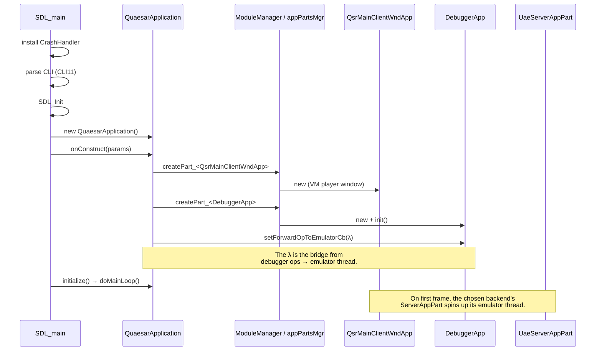
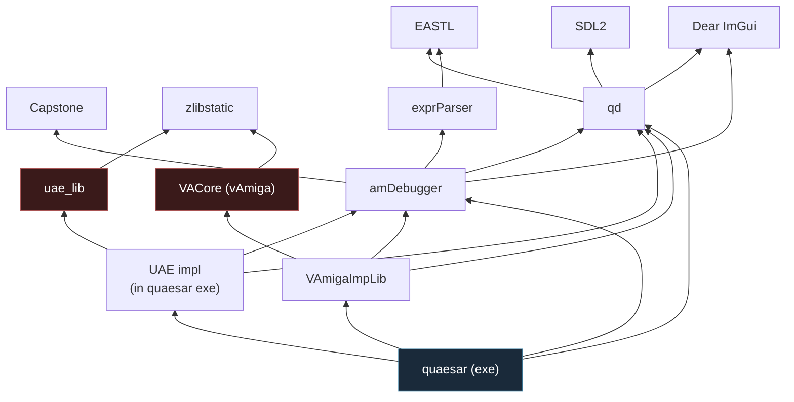

# 2 — System Architecture

← [Overview](01-overview.md) · [Index](index.md) · → [The `IVm` Boundary](03-vm-abstraction-boundary.md)

This document describes the **layers** of Quaesar-NG and the **seams** between
them. The goal is to explain *where* code belongs and *why* the boundaries are
drawn where they are.

## The layer cake

The application is organized as eight horizontal layers. Each layer only talks
**downward** (to the layer directly beneath it) or **sideways** (to a utility
library), never upward — with the single exception of callbacks wired at startup.

### Layer responsibilities

| Layer | Lives in | Owns / does |
|-------|----------|-------------|
| **L8 — Process entry** | `src/quasar_app/qsr_main.cpp` | `SDL_main`, installs `CrashHandler`, parses CLI (CLI11), creates `QuaesarApplication`, runs main loop. |
| **L7 — Window host** | SDL2 + `qd` ImGui backends | Two SDL windows: the **VM player** (Amiga screen) and the **debugger**. Event pump. |
| **L6 — App framework** | `libs/qd/app/` | `qd::Application` (main loop owner), `ApplicationPart` (pluggable subsystems), `ModuleManager` (singletons). |
| **L5 — Orchestration** | `src/quasar_app/` | `QuaesarApplication` wires the parts together and installs the **operation-forwarding callback** that bridges the debugger to the real emulator. |
| **L4 — Debugger** | `libs/amDebugger/` | The entire inspector UI plus the `Debugger` engine. Knows nothing about UAE or vAmiga specifically. |
| **L3 — Operations** | `qd/qui/` + `amDebugger/debuggerOps.h` | The typed command bus: `PauseEmulation`, `DebugTraceContinue`, `DisasmToggleBreakpoint`, ... |
| **L2 — VM abstraction** | `amDebugger/vm/vmInterface.h` | The `IVm::VM` interface — a read/write snapshot of the machine. **The seam.** |
| **L1 — Backend** | `src/.../uae_imp/`, `libs/vAmiga_imp_lib/` | The concrete emulator adapters. Each runs its core on a dedicated thread. |

## The four key boundaries

Most of the complexity (and most of the bugs) live at four seams. Each has its
own document.

### Boundary A — `qd::ApplicationPart` (plugin composition)

The app is not a monolith. It is a set of **`ApplicationPart`s** registered
through a reflection system (`TS_BEGIN_REFLECT_CLASS`) and instantiated by the
`ModuleManager` / `appPartsMgr`.

Backends are registered via `IAppPartServerProviderFactory` /
`plugin_api::RegOnLoadAppPartServerFactory`, so a backend can be selected at
runtime (`CfgQsrMain::vmPlayerId` defaults to `"uae"`).

### Boundary B — `qsr::IVmClientPlayer` (client ↔ server thread)

The UI window (main thread) and the emulator core (its own thread) communicate
through a narrow interface:

Defined in `src/quasar_app/qsr_app_interfaces.h`. All calls cross a thread
boundary, so they are backed by mutexes / atomics / queues — see
[Threading Model](11-threading-model.md).

### Boundary C — `IVm::VM` (the snapshot seam)

The debugger never touches emulator internals directly. It works against an
`IVm::VM` — an abstract, **snapshot-style** view of the machine (CPU regs,
memory banks, custom registers, copper, blitter, floppies). This is the single
most important interface in the codebase.

→ Full treatment in [doc 03](03-vm-abstraction-boundary.md).

### Boundary D — the Operations pipeline (command bus)

User intent (a clicked button, a keyboard shortcut, a menu item) is encoded as a
**typed `BaseOpArgs`** and funneled through one dispatch chain, regardless of
origin. This is how "Pause" reaches the CPU.

→ Full treatment in [doc 04](04-operation-dispatch.md).

## Startup wiring (who creates whom)

The crucial line is `setForwardOpToEmulatorCb(λ)` — that lambda
(`src/quasar_app/qsr_application.cpp`) is the **only** place that knows how to
route debugger commands into the real, running emulator. Everything else is
polymorphic.

## Dependency direction (compile-time)

Note that `amDebugger` does **not** depend on either emulator core — it only
depends on the abstract `IVm` interface it itself defines. That is what keeps
the backend swappable. (CMake-level detail: [Build System](09-build-system.md).)

## Where to put new code

| You are adding... | It belongs in... |
|-------------------|------------------|
| A new debugger window/panel | `libs/amDebugger/src/amDebugger/window/` (auto-registered via reflection) |
| A new user command/shortcut | `amDebugger/debuggerOps.h` + a shortcut in `shortcutsList.h` |
| Emulator-agnostic VM query | the relevant `IVm::*` submodule + both backends' impls |
| A UAE-specific behavior | `src/quasar_app/uae_imp/` or `src/uae_lib_imp/` |
| A vAmiga-specific behavior | `libs/vAmiga_imp_lib/` |
| A core emulation feature | `libs/uae_lib/` (UAE) or `libs/vAmiga/Core/` (vAmiga) |
| A foundation utility | `libs/qd/` |

---

← [Overview](01-overview.md) · [Index](index.md) · → [The `IVm` Boundary](03-vm-abstraction-boundary.md)
