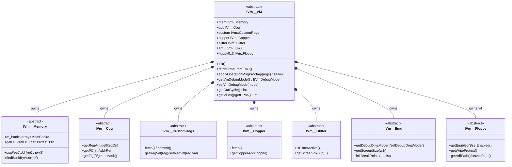
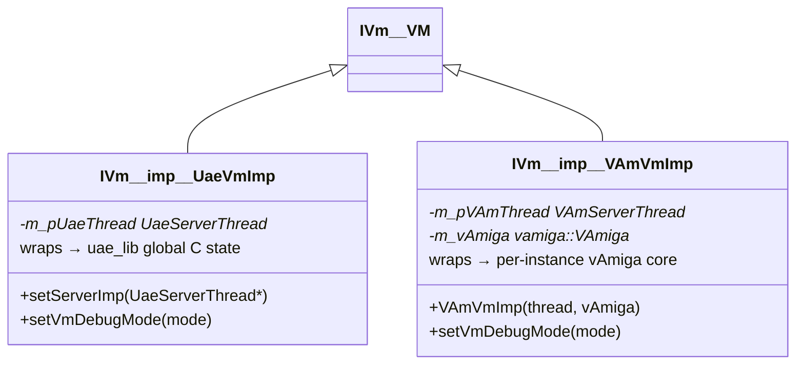
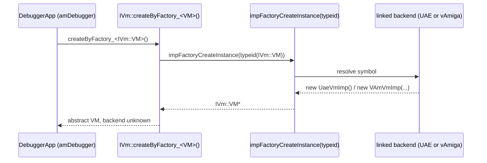
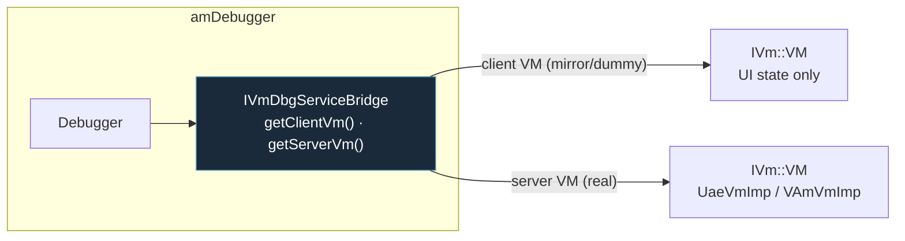
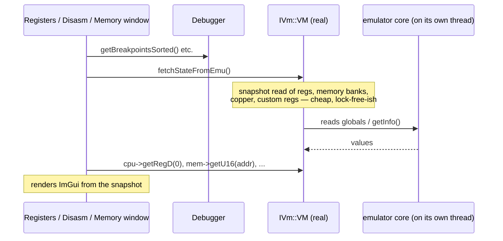

# 3 — The `IVm` Abstraction Boundary

← [System Architecture](02-system-architecture.md) · [Index](index.md) · → [Operation Dispatch](04-operation-dispatch.md)

> **This is the most important interface in the codebase.**
> Everything above it is emulator-agnostic; everything below it is backend-specific.

The debugger UI, the operations pipeline, and the inspector windows never touch
UAE globals or vAmiga objects. They talk to an `IVm::VM` — an abstract,
**snapshot-style** view of the machine. Two concrete implementations exist; one
is chosen at runtime.

## The interface hierarchy

Defined in [`libs/amDebugger/src/amDebugger/vm/vmInterface.h`](../libs/amDebugger/src/amDebugger/vm/vmInterface.h).

The key idea: `IVm::VM` is a **composite** of sub-interfaces, each covering one
aspect of the Amiga. A debugger window that wants to draw registers only needs
`IVm::Cpu`; one that draws the copper list only needs `IVm::Copper`. No window
ever depends on a concrete backend type.

## The two implementations

| | `UaeVmImp` | `VAmVmImp` |
|---|------------|------------|
| Lives in | `src/quasar_app/uae_imp/uae_vm_imp.h` | `libs/vAmiga_imp_lib/.../va_vm_imp.h` |
| Underlying core | `uae_lib` (WinUAE, FS-UAE port) | `VACore` (vAmiga) |
| State model | **Process-global C singletons** (`regs`, `debugger_active`, ...) | **Per-instance C++ objects** |
| `setVmDebugMode(Break)` | flips UAE globals / console-debugger queue | calls `vAmiga->pause()`/`run()` via command queue |
| `fetch()` reads from | UAE globals directly | `vAmiga->cpu.getInfo()` etc. |

> The UAE-vs-vAmiga state-model difference is the root cause of the historical
> pause race documented in [`doc/pause_bug_analysis.md`](../doc/pause_bug_analysis.md).
> See [UAE Backend](05-backend-uae.md) and [vAmiga Backend](06-backend-vamiga.md).

## Factory: how a concrete `IVm::VM` is created without `amDebugger` knowing the type

`amDebugger` cannot `#include` either backend (it doesn't depend on them). So
creation goes through a **type-info factory** resolved by whichever backend is linked:

`createByFactory_<T>()` is a small template in `vmInterface.h`. The backend
supplies `impFactoryCreateInstance()` so the debugger stays decoupled.

## The debugger's VM connection: `IVmDbgServiceBridge`

The debugger doesn't get a raw `IVm::VM`; it gets a **bridge** that can hand out
both a *client* VM (the UI mirror) and a *server* VM (the real one):

Two factories build bridges (in `dbgConnection.h`):

| Factory | Client VM | Server VM | Used when |
|---------|-----------|-----------|-----------|
| `create_dummy_connection()` | a fresh VM via the factory | (same object) | No emulator attached yet — keeps the debugger UI alive with placeholder state. |
| `create_uae_shared_connection(name)` | shares the real VM | the real VM | A real backend is running. |

> **Historical caveat (UAE only):** because UAE's state is process-global, a
> "dummy" `UaeVmImp` and the "real" `UaeVmImp` historically wrapped the *same*
> globals, so the dummy was not actually isolated. The current
> `QuaesarApplication` forwarding callback deliberately keeps the mirror call
> side-effect-free (see [doc 04](04-operation-dispatch.md)).

## How the debugger uses the VM

A typical "render a frame" pass:

Writes (e.g. editing a register, toggling a breakpoint) go back through
`commit()` / breakpoint lists — and control commands (pause, step) go through
the [Operations pipeline](04-operation-dispatch.md), **never** by directly
mutating the snapshot.

## Summary

- `IVm::VM` is a **read-mostly snapshot** composite, defined in `amDebugger`.
- Two concrete impls (`UaeVmImp`, `VAmVmImp`), chosen at runtime via a factory.
- `amDebugger` has **zero** compile-time knowledge of either backend.
- The debugger gets its VM through an `IVmDbgServiceBridge` (client vs server VM).
- Mutating the machine happens via **operations**, not via the snapshot interface.

---

← [System Architecture](02-system-architecture.md) · [Index](index.md) · → [Operation Dispatch](04-operation-dispatch.md)
