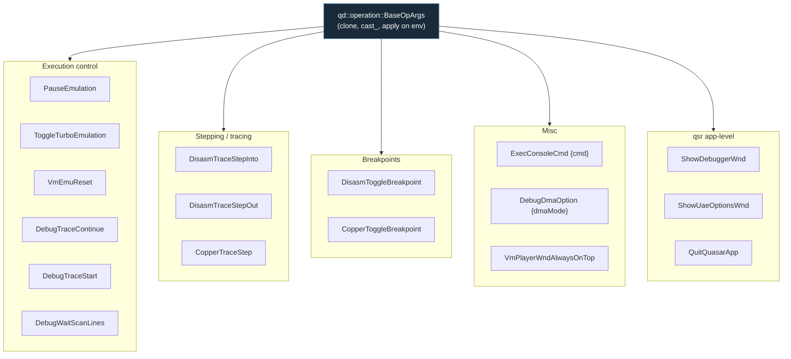
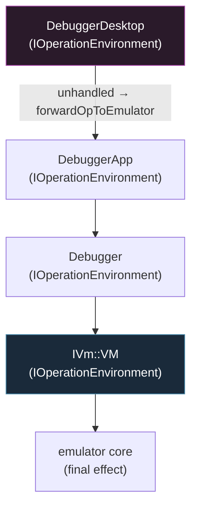

# 4 — Operation Dispatch

← [The `IVm` Boundary](03-vm-abstraction-boundary.md) · [Index](index.md) · → [UAE Backend](05-backend-uae.md)

User intent — a clicked toolbar button, a menu item, a keyboard shortcut — is
encoded as a **typed operation** and funneled through **one** dispatch chain.
This document traces that chain end to end. It is the single most important
dataflow to understand.

## The operation catalog

All commands are structs deriving from `amD::operation::OperationArgs`, which in
turn derives from `qd::operation::BaseOpArgs`. Defined in
[`libs/amDebugger/src/amDebugger/debuggerOps.h`](../libs/amDebugger/src/amDebugger/debuggerOps.h)
and `src/quasar_app/qsr_operations.h`.



Each operation declares an id, a display name, and a keyboard-shortcut binding
(`addShortcut(amD::shortcut::EId::...)`). Operations carry their own payload
(e.g. `ExecConsoleCmd::cmd`, `DisasmToggleBreakpoint::address`).

## The dispatch chain

Operations are **typed values**, not strings. They flow through a chain of
`IOperationEnvironment::applyOperationMsgProcImp()` overrides, each of which can
consume, forward, or ignore the op.

```mermaid
graph TB
    SRC1["Toolbar button<br/>(DebuggerDesktop)"]
    SRC2["Menu item"]
    SRC3["Keyboard shortcut"]
    SRC4["Console input"]

    SRC1 & SRC2 & SRC3 & SRC4 --> DO["doOperation_&lt;X&gt;()"]

    DO --> DESK["DebuggerDesktop::applyOperationMsgProcImp"]
    DESK -->|"local UI ops (ShowWnd, ...)"| SELF["handled in-process"]
    DESK -->|"emulator-relevant ops"| FWD["DebuggerApp::forwardOpToEmulator(args)"]

    FWD --> CB["ForwardOpToEmulatorCb λ<br/>(set in QuaesarApplication)"]

    CB --> MIRROR["1) mirror to Debugger's VM<br/>for UI enable/disable state"]
    CB --> ROUTE["2) route to real emulator"]

    ROUTE -->|"UAE + debugger_active<br/>(console REPL blocked)"| EXEC["execConsoleCmd('t'/'z'/'ot'/'g')"]
    ROUTE -->|"otherwise"| PUSH["pushOperationMsg(clone)"]

    PUSH --> QUEUE["IVmClientPlayer op queue<br/>(mutex-protected deque)"]
    QUEUE -->|"drained on emu thread"| ONHANDLE["onUaeHandleEvents() /<br/>onVAmHandleEvents()"]
    ONHANDLE -> APPOP["IVm::VM::applyOperationMsgProcImp"]
    APPOP --> BACKEND["backend-specific effect<br/>(activate_debugger / pause() / step / ...)"]

    style CB fill:#2a2a1a,stroke:#aa4,color:#fff
    style QUEUE fill:#3a1a1a,stroke:#a55,color:#fff
```

### The forwarding callback (the bridge)

The only place that knows how to reach the *real* emulator is the lambda
installed in [`src/quasar_app/qsr_application.cpp`](../src/quasar_app/qsr_application.cpp)
(`QuaesarApplication::onConstruct`). Pseudocode of its current logic:

```
forwardOpToEmulatorCb(args):
    # (1) UI-state mirror only — NO call into the real engine.
    if args is PauseEmulation or DebugTraceStart: dbg.setDebugMode(Break)
    elif args is DebugTraceContinue:               dbg.setDebugMode(Live)

    # (2) Reach the real player.
    player = mainWndAppPart.getVmProvider()
    uae    = dynamic_cast<UaeServerThread*>(player)

    if uae and debugger_active:        # UAE console REPL is blocking the queue
        map step/continue/copper → uae.execConsoleCmd("t"/"z"/"ot"/"g")
    else:
        player.pushOperationMsg(args.clone())   # normal queued path
```

The two branches exist because UAE's legacy console debugger (`debug_1()`)
**blocks** the operations queue while paused, so step/continue must be injected
as console *commands* (`"t"`, `"g"`, ...) rather than queued ops. vAmiga has no
such blocking REPL and always uses the queued path. See
[UAE Backend](05-backend-uae.md) and [vAmiga Backend](06-backend-vamiga.md).

## Sequence: clicking "Step Into" (UAE, already paused)

```mermaid
sequenceDiagram
    autonumber
    participant UI as DebuggerDesktop<br/>(UI thread)
    participant DbgApp as DebuggerApp
    participant Cb as forwardOpToEmulatorCb
    participant Uae as UaeServerThread
    participant Core as UAE core<br/>(emu thread, blocked in debug_1)

    UI->>UI: doOperation_<DisasmTraceStepInto>()
    UI->>DbgApp: forwardOpToEmulator(args)
    DbgApp->>Cb: λ(args)
    Cb->>Cb: mirror setDebugMode(Break)  [UI state only]
    Cb->>Uae: dynamic_cast ok; debugger_active == true
    Note over Cb,Uae: queue is stuck in debug_1(),<br/>so inject a console command instead.
    Cb->>Uae: execConsoleCmd("t")
    Uae->>Core: releases console wait with "t"
    Core->>Core: executes one instruction
    Core->>Core: re-enters debug_1() (still paused)
    Note over UI: next render: fetchStateFromEmu() snapshot → new PC shown
```

## Sequence: clicking "Pause" (normal path)

```mermaid
sequenceDiagram
    autonumber
    participant UI as DebuggerDesktop<br/>(UI thread)
    participant Cb as forwardOpToEmulatorCb
    participant Player as IVmClientPlayer
    participant Emu as emulator thread
    participant VM as IVm::VM::applyOperationMsgProcImp

    UI->>Cb: PauseEmulation
    Cb->>Cb: setDebugMode(Break) [UI mirror only]
    Cb->>Player: pushOperationMsg(clone)
    Note over Player,Emu: op sits in mutex-protected queue<br/>until the emu thread pumps events
    Emu->>Player: onUaeHandleEvents() / onVAmHandleEvents()
    Player->>VM: applyOperationMsgProcImp(PauseEmulation)
    VM->>Emu: backend pause (UAE: activate_debugger;<br/>vAmiga: vAmiga->pause())
    Note over Emu: emulation halts; screen redraw continues
```

> Why a *single* path matters: the original pause bug (see
> [`doc/pause_bug_analysis.md`](../doc/pause_bug_analysis.md)) was caused by
> **two** unsynchronized paths reaching UAE's global state. The current callback
> deliberately routes everything through the queue (or the console-command
> escape hatch) so the emulator mutates its own state on its own thread.

## The operation environment chain (compile-time)

`applyOperationMsgProcImp` is virtual and overridden at each layer, forming a
chain of responsibility. Each layer handles what it understands and lets the
rest fall through to its parent/child environment.



`QsrMainClientWndApp` (the VM-player window) is *also* an `IVmOperationsHandler`,
so app-level operations like `ShowDebuggerWnd` / `ShowUaeOptionsWnd` /
`QuitQuasarApp` (from `qsr_operations.h`) are handled there rather than in the
debugger.

## Key takeaways

1. **One typed command bus** for all user intent — regardless of origin.
2. The **`forwardOpToEmulatorCb` lambda** is the single bridge from the
   debugger to the live emulator; it is the only place that "knows" the backend.
3. Two delivery sub-paths: **queued ops** (normal) and **console commands**
   (UAE-only, when the legacy REPL is blocking).
4. State is mutated **on the emulator thread**, never from the UI thread.

---

← [The `IVm` Boundary](03-vm-abstraction-boundary.md) · [Index](index.md) · → [UAE Backend](05-backend-uae.md)
