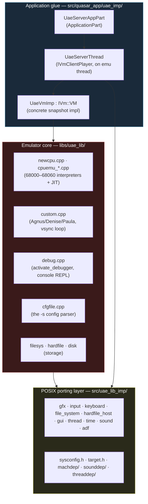
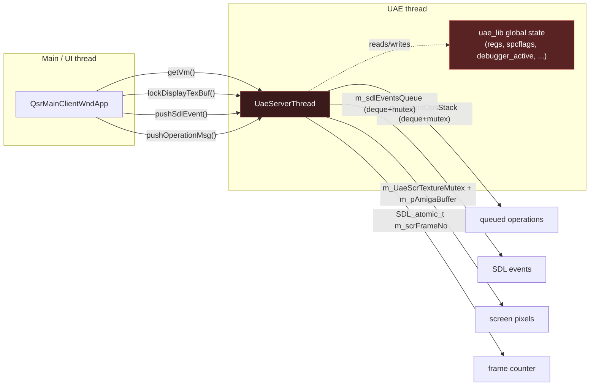
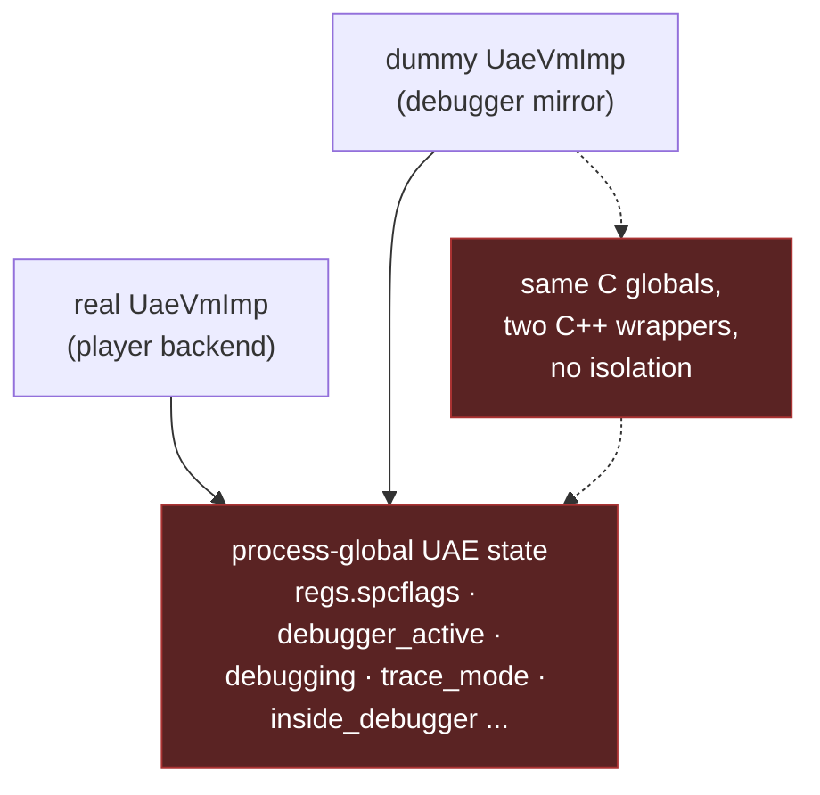
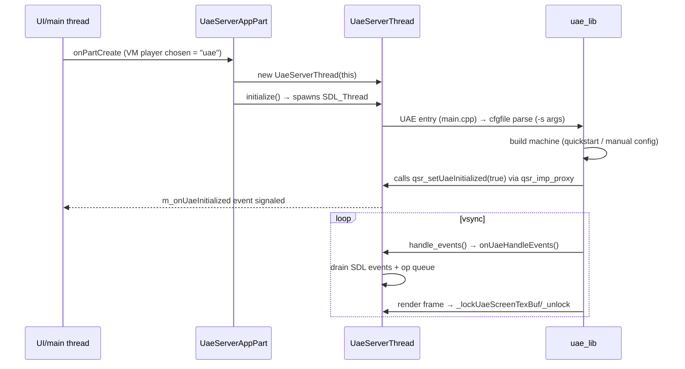

# 5 — UAE Backend

← [Operation Dispatch](04-operation-dispatch.md) · [Index](index.md) · → [vAmiga Backend](06-backend-vamiga.md)

The UAE backend is the **default and primary** emulator core. It is the mature
WinUAE engine, re-hosted on POSIX platforms via the FS-UAE adaptation layer.
This document maps its three sub-layers and the all-important **global-state
caveat**.

## The three sub-layers

| Layer | Location | Role |
|-------|----------|------|
| **Application glue** | `src/quasar_app/uae_imp/` | Spins up the UAE thread, owns the `IVm::VM` impl, bridges SDL events & operations. |
| **Porting layer** | `src/uae_lib_imp/` | The platform functions UAE *calls into*. UAE is written to call `custom.cpp`, `sound.cpp`, etc.; Quaesar provides these here. `UAE_CUSTOM_IMPL_DIR` points CMake here. |
| **Core** | `libs/uae_lib/` | The actual emulation: CPU interpreters, custom chips, debugger, config parser, filesystems. |

## The `UaeServerThread` — the thread boundary

`UaeServerThread` implements `qsr::IVmClientPlayer` and **lives on the UAE
emulation thread** (not the UI thread). It is the surface the UI window talks to.

Cross-thread state is deliberately narrow and explicitly synchronized:

| Member | Type | Purpose |
|--------|------|---------|
| `m_eventMutex` + `m_sdlEventsQueue` | deque + mutex | host→emu input events |
| `m_pClientOpsStack` + (deque) | deque + mutex | queued `BaseOpArgs` ops |
| `m_UaeScrTextureMutex` + `m_pAmigaBuffer` | mutex + pixel buf | emu→host screen frame |
| `m_scrFrameNo` | `SDL_atomic_t` | cheap "new frame?" check |
| `m_pConsoleQueue` | custom queue | console-debugger command/response |
| `m_pauseEvent` | `ThreadEvent` | (legacy pause mechanism — see below) |

See [Threading Model](11-threading-model.md) for the full concurrency picture.

## The global-state caveat (read this twice)

**UAE has no concept of "instances".** There is one interpreter, one set of
globals. Any `UaeVmImp` object — whether the "real" one attached to the player,
or a "dummy" mirror the debugger creates — commands the *same* process-global
engine.

### Why this caused the pause bug

When `PauseEmulation` was delivered **twice** — once inline on the UI thread via
the dummy mirror, once queued on the emu thread — both calls raced on the
non-atomic `regs.spcflags` and on `activate_debugger()`'s reentrancy guard
(`if (debugger_active) return;`). `SPCFLAG_BRK` could be silently lost.

→ Full root-cause: [`doc/pause_bug_analysis.md`](../doc/pause_bug_analysis.md).

### How it's handled now

The `QuaesarApplication` forwarding callback (see [doc 04](04-operation-dispatch.md))
keeps the UI-thread mirror call **side-effect-free** — it only updates the
`Debugger`'s local UI state, never the engine. The actual pause/step/continue is
applied **exactly once**, on the emu thread, via either:

- the queued operations path (`pushOperationMsg`), or
- the **console-command escape hatch** (`execConsoleCmd("t"/"z"/"ot"/"g")`),
  needed because UAE's legacy console debugger (`debug_1()` in `debug.cpp`)
  blocks the operations queue while paused.

## The legacy console debugger

UAE ships its own text debugger (`debug.cpp`). When paused, `debug_1()` blocks
on a console-command queue. Quaesar reuses this for step/trace/continue by
injecting single-letter commands:

| Quaesar operation | Console command | Effect |
|-------------------|-----------------|--------|
| `DisasmTraceStepInto` | `t` | trace one instruction |
| `DisasmTraceStepOut` | `z` | step out |
| `CopperTraceStep` | `ot` | one copper step |
| `DebugTraceContinue` | `g` | go (resume) |

`UaeServerThread::execConsoleCmd()` and `uaeWaitConsoleCmdImpl()` are the two
ends of this queue (the latter is what UAE's `debug_1()` calls to read input).

## Boot sequence (UAE)

The proxy functions in `src/quasar_app/uae_imp/qsr_imp_proxy.cpp`
(`qsr_lockUaeScreenTexBuf`, `qsr_onUaeHandleEvents`, `qsr_waitConsoleCmd`, ...)
are the C-callable entry points UAE invokes back into Quaesar's `UaeServerThread`
singleton.

## When to touch what (UAE)

| Task | Edit |
|------|------|
| New `-s` config key | nothing — `cfgfile.cpp` already parses free-form keys |
| Platform port fix | `src/uae_lib_imp/` (sound/thread/gfx) |
| New debug command behavior | `debug.cpp` + map an op in the forwarding callback |
| Core emulation bug | `libs/uae_lib/` (but prefer the vAmiga core as a reference) |

---

← [Operation Dispatch](04-operation-dispatch.md) · [Index](index.md) · → [vAmiga Backend](06-backend-vamiga.md)
