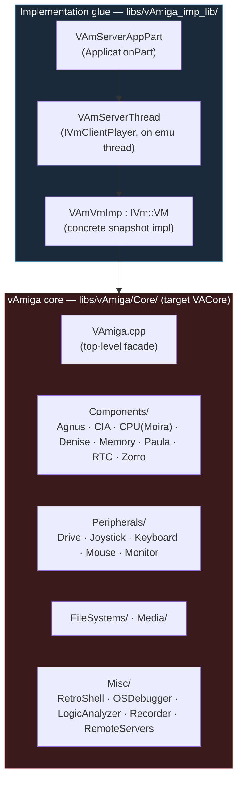
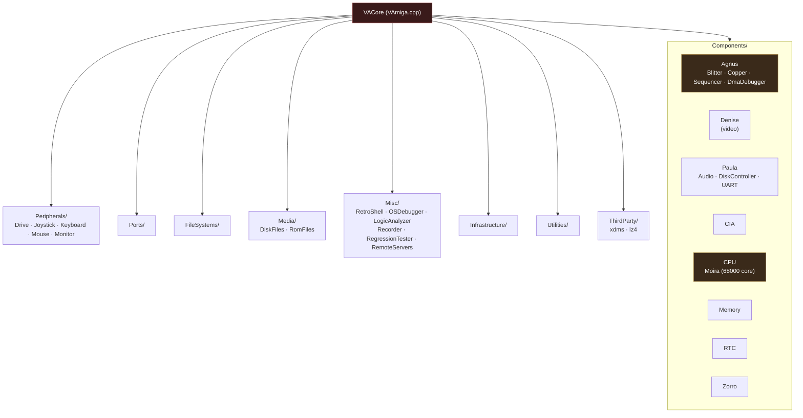
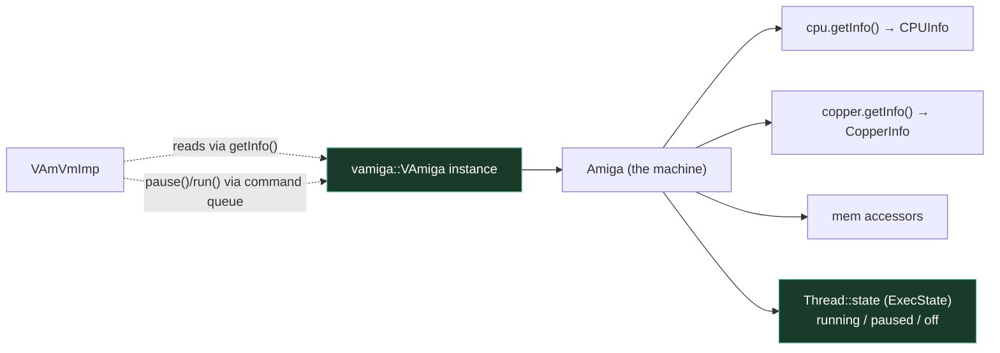

# 6 — vAmiga Backend

← [UAE Backend](05-backend-uae.md) · [Index](index.md) · → [External Dependencies](07-external-dependencies.md)

The vAmiga backend is the **alternative** emulator core — a clean, modern,
fully object-oriented C++ rewrite of the Amiga. It is enabled with the `VAMIGA`
CMake option and is reached through the **same** `IVm::VM` abstraction and the
**same** operations pipeline as UAE. This document explains how it differs from
the UAE backend and why those differences matter.

## The two sub-layers



There is **no separate POSIX porting layer** here — unlike UAE, vAmiga is native
C++ with its own clean `Thread`, `Message` and I/O abstractions, so it needs no
`*_imp` port shim. The glue lives entirely in `libs/vAmiga_imp_lib/`.

## The `VACore` component tree

vAmiga is organized as a textbook component architecture. Each chip is its own
subdirectory and CMake target:



`VACore` links `xdms` (DMS unpacking), `lz4` (state compression), `Threads`, and
optionally `zlibstatic`.

## Per-instance model (the key difference from UAE)

Where UAE is a sea of process-global C variables, **vAmiga is fully
instance-based**. A `vamiga::VAmiga` object *is* the machine. You can have more
than one in principle, and pausing one never touches another.



Consequences:

- **No dummy-VM race.** A "mirror" `VAmVmImp` would wrap a different instance
  (or none); it cannot accidentally mutate the live machine. The entire class of
  bug described in [`doc/pause_bug_analysis.md`](../doc/pause_bug_analysis.md)
  is UAE-specific.
- **Pause/resume is a first-class command**, not a global flag flip.
  `setVmDebugMode(Break)` calls `vAmiga->pause()`/`run()` through vAmiga's own
  thread-safe command queue (`Thread::switchState`). See
  `libs/vAmiga_imp_lib/.../va_vm_imp.cpp`.

## How `VAmVmImp` reads the machine

vAmiga exposes **snapshot `getInfo()`** accessors rather than raw globals.
`VAmVmImp` calls these during `fetch()`:

| `IVm` submodule | vAmiga source |
|-----------------|---------------|
| `Cpu` | `m_pVAmiga->cpu.getInfo()` → `CPUInfo` (regs d[], a[], pc0, sr) |
| `Copper` | `m_pVAmiga->copper` → `CopperInfo` |
| `Memory` | `m_vAmiga` memory accessors |
| `CustomRegs` | mapped custom-register reads |
| `Blitter` | blitter state + screen pixel buffer |
| `Floppy` | drive enable / write-protect / ADF path |

`VAmVmImp::getScreenSize()` returns vAmiga's native `HPIXELS`/`VPIXELS`
(912×313), whereas UAE returns 754×576 — an example of backend-specific
geometry surfaced through the same interface.

## `VAmServerThread` vs `UaeServerThread`

The two threads are near-structural twins (same `IVmClientPlayer` surface, same
mutexed queues for events/ops/screen), but differ in how the core is driven:

| Aspect | `UaeServerThread` | `VAmServerThread` |
|--------|-------------------|-------------------|
| Core API style | C globals + callbacks via `qsr_imp_proxy` | C++ objects, direct calls |
| Pause while stepping | console-command escape hatch (`"t"`, `"g"`, ...) | native `pause()`/`run()` + step commands |
| Frame production | `_lockUaeScreenTexBuf` callback from core | `fetchScreenBufferToTexture` pulled by thread |
| Message bus | none (legacy) | `vAmigaMsgQueueProc(MessageFwd)` — structured log/event stream |

`onVAmHandleEvents()` is the vAmiga analogue of `onUaeHandleEvents()` — the
on-thread pump that drains the op/event queues.

## Boot sequence (vAmiga)

```mermaid
sequenceDiagram
    participant Main as UI/main thread
    participant Part as VAmServerAppPart
    participant TH as VAmServerThread
    participant VA as vamiga::VAmiga

    Main->>Part: onPartCreate (VM player chosen = vamiga)
    Part->>TH: new VAmServerThread(this)
    Part->>TH: initialize() → spawns SDL_Thread
    TH->>TH: onVAmigaThreadMain()
    TH->>VA: new vamiga::VAmiga; config from CLI
    VA->>VA: power on; launch ROM
    TH-->>Main: m_onVAmInitialized signaled
    loop frame
        TH->>VA: run/poll
        VA-->>TH: messages via MessageFwd
        TH->>TH: onVAmHandleEvents() drains queues
        TH->>TH: fetchScreenBufferToTexture()
    end
```

## When to use vAmiga vs UAE

| You want... | Use |
|-------------|-----|
| Maximum software compatibility / the "known-good" core | **UAE** (default) |
| A clean reference to compare against when debugging the core | **vAmiga** |
| Modern, hackable C++ to extend the chipset itself | **vAmiga** |
| Battle-tested JIT, CD32, arcane edge cases | **UAE** |

Both are reached identically from the debugger, so switching backends at runtime
(`CfgQsrMain::vmPlayerId`) is a configuration concern, not a code concern.

---

← [UAE Backend](05-backend-uae.md) · [Index](index.md) · → [External Dependencies](07-external-dependencies.md)
