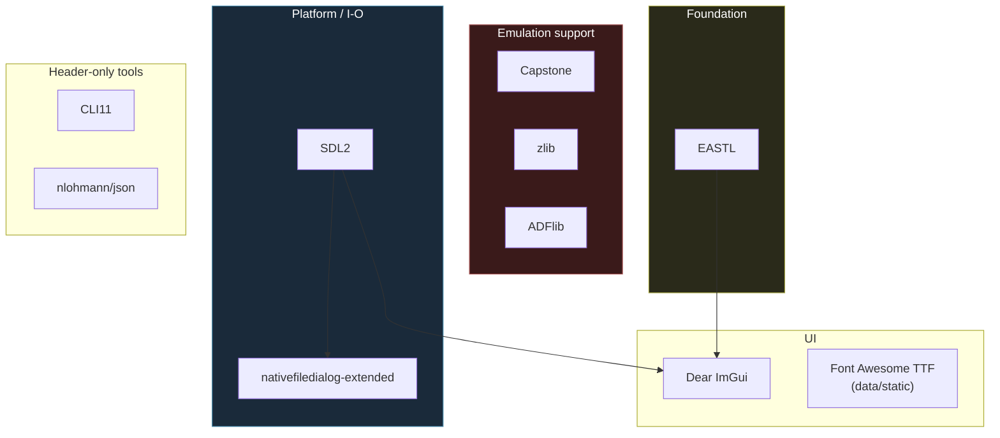
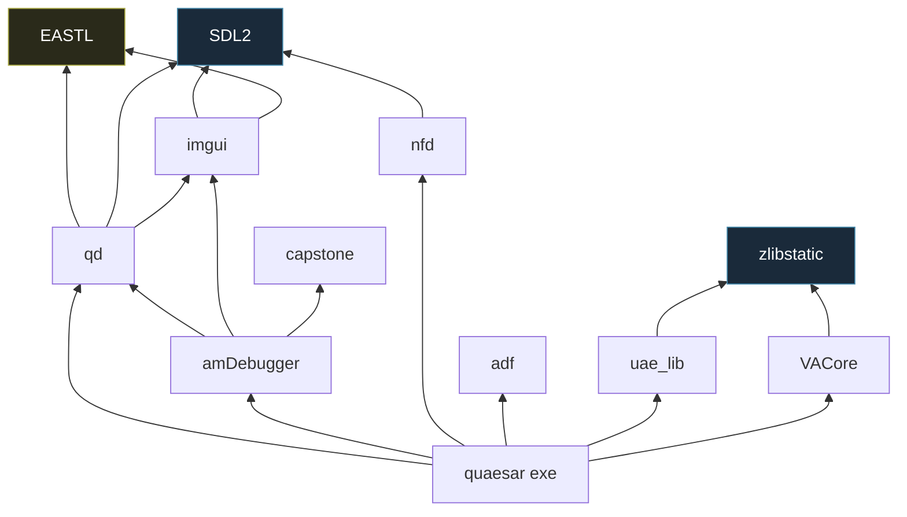

# 7 — External Dependencies

← [vAmiga Backend](06-backend-vamiga.md) · [Index](index.md) · → [Custom Libraries](08-libs-modules.md)

Everything under `external/` is a **vendored third-party** dependency. This is a
quick-reference card for each one: what it is, the CMake target it produces, and
where Quaesar uses it.

## At a glance

## Reference table

| Folder | What | CMake target | Consumed by | License |
|--------|------|--------------|-------------|---------|
| `external/sdl2/` | Windowing, audio, input, threads | (system / static `.lib` on Win) | everyone | zlib |
| `external/EASTL/` | EA Standard Template Library — **replaces `std`** | `EASTL` | qd, amDebugger, both backends | BSD-3 |
| `external/dear_imgui/` | Immediate-mode GUI | `imgui` | qd (backend), amDebugger | MIT |
| `external/capstone/` | Multi-arch disassembler (M68K enabled) | `capstone` | amDebugger (disasm window) | BSD-3 |
| `external/zlib/` | DEFLATE compression | `zlibstatic` | uae_lib, VACore, ADFlib | zlib |
| `external/ADFlib/` | Amiga filesystem / `.adf` parsing | `adf` | disk handling | GPL/LGPL |
| `external/nativefiledialog-extended/` | Native OS open/save dialogs | `nfd` | app (ROM/ADF pickers) | Zlib |
| `external/cli11/` | Command-line parser (single header) | header-only | `qsr_main.cpp` | BSD-3 |
| `external/nlohmann/` | JSON for C++ (single header) | header-only | configs | MIT |

> Note: SDL2 is special — on POSIX it is `find_package`'d
> (`external/sdl2/sdl2.cmake`); on Windows the project links the prebuilt
> `.lib`/`SDL2main.lib` under `external/sdl2/x64/` (or `win32/`).

## Per-dependency notes

### SDL2 — the platform substrate
- Provides the **main loop**, the **two windows** (VM player + debugger),
  **audio**, **input events**, and the **thread primitives** (`SDL_Thread`,
  `SDL_atomic_t`) the backends build on.
- ImGui's SDL2/SDLRenderer backends are vendored under
  `libs/qd/imGui/backends/sdl2/` (not the upstream `imgui/backends/`).

### EASTL — the container layer
- Quaesar **uses EASTL instead of `std`** for containers in hot paths
  (`eastl::array`, `eastl::fixed_vector`, `eastl::span`, ...).
- `qd` wraps EASTL into `qtd::*` aliases (`qtd::string`, `qtd::vector`,
  `qtd::unique_ptr`, `qtd::span`, ...) so the rest of the codebase is insulated
  from the EASTL header names directly.
- Windows debug builds ship an EASTL `.natvis` for nice debugger visualization.

> Pitfall: EASTL's `fixed_string` / `fixed_vector` use inline stack buffers; be
> careful that VM pointers stored near them don't alias — see the disassembly
> crash note in [Key Dataflows](10-key-dataflows.md).

### Dear ImGui — the UI
- One ImGui context per window, managed by `qd::ImGuiContextManager`.
- Font atlas is built in `DebuggerApp::initImGui()` — it merges the Source Code
  Pro family and Font Awesome (`data/static/fa-solid-900.ttf`) so toolbar icons
  are glyph-based. See the [Glossary](12-glossary.md) "Font Awesome" entry.

### Capstone — disassembly
- Built with `CAPSTONE_M68K_SUPPORT=ON` (forced in the root `CMakeLists.txt`).
- Used by the amDebugger disassembly/code-analysis windows to decode 68000 opcodes.

### zlib — compression
- Static target `zlibstatic`, shared by UAE, vAmiga, and ADFlib.
- Compresses save-states, archives, and disk images.

### ADFlib — Amiga disk images
- Pure-C library parsing the Amiga OFS/FFS filesystem inside `.adf` images.
- Target `adf`; headers under `external/ADFlib/src/`.

### nativefiledialog-extended (nfd) — OS file dialogs
- Used in `qsr_main.cpp` (`NFD_Init`/`NFD_Quit`) and wherever the user must pick
  a Kickstart ROM or ADF without a config GUI.
- Cross-platform: Win32 / macOS / Linux backends auto-selected.

### CLI11 — argument parsing
- Single header `cli11/CLI11.hpp`, included by `qsr_main.cpp`.
- Parses the positional `input`, `-k/--kickstart`, `--serial_port`, and the
  repeatable `-s` (WinUAE config passthrough). Unknown args are allowed through
  (`allow_extras()`) so they can be forwarded.

### nlohmann/json — JSON
- Single-header JSON; used for lightweight config/serialization.

## Dependency direction (who needs what)

## Adding a new external dependency

1. Vendor it under `external/<name>/`.
2. `add_subdirectory(external/<name>)` in the root `CMakeLists.txt`.
3. If it needs to link into the final `quaesar` exe from a child scope, register
   it via `quaesar_add_libs(<target>)` (see [Build System](09-build-system.md)).
4. Add a row to the table above.

---

← [vAmiga Backend](06-backend-vamiga.md) · [Index](index.md) · → [Custom Libraries](08-libs-modules.md)
