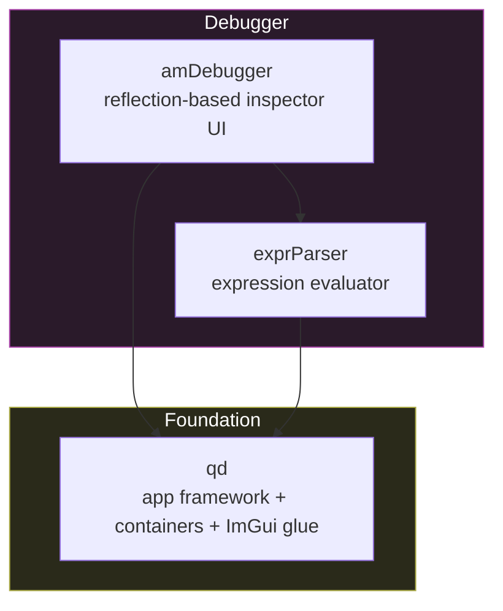
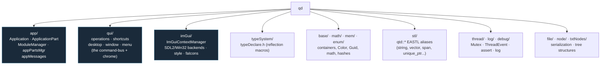
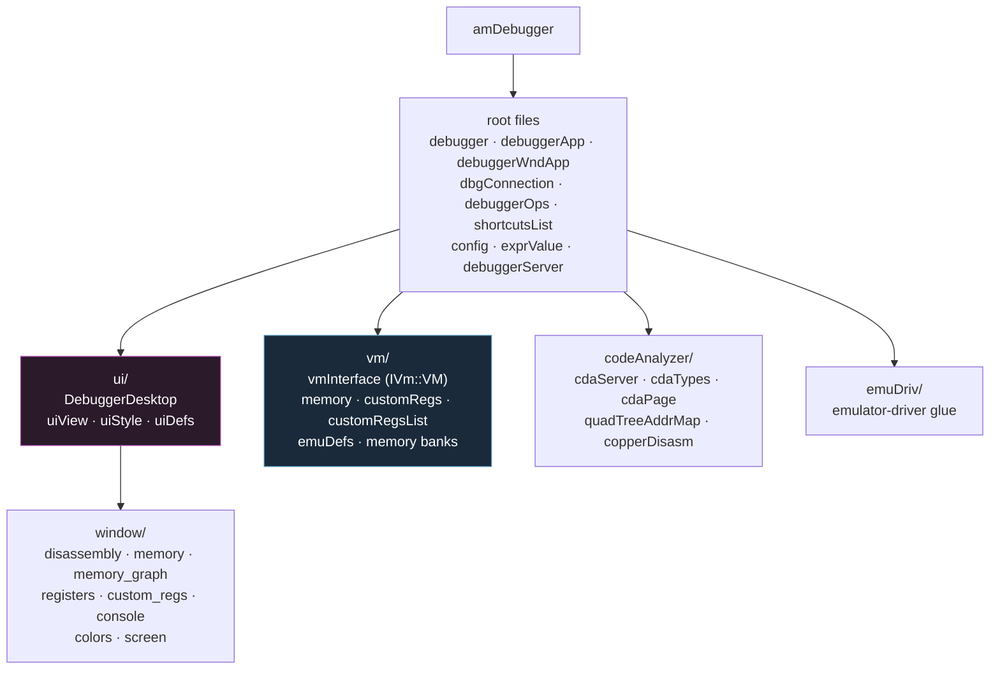
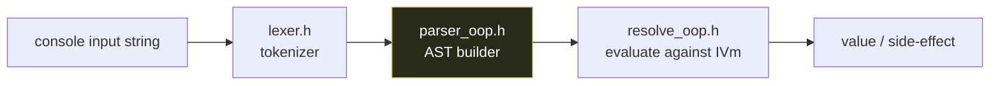

# 8 — Custom Libraries

← [External Dependencies](07-external-dependencies.md) · [Index](index.md) · → [Build System](09-build-system.md)

`libs/` holds Quaesar's **own** code (the emulator cores live here too, but are
documented in [05](05-backend-uae.md)/[06](06-backend-vamiga.md)). This document
covers the three shared libraries that are *not* emulator backends:



---

## `qd` — the foundation library

`qd` ("Quaesar Dice" / the engine core) is a general-purpose C++ foundation. It
is what makes the rest of the codebase look like a coherent framework rather
than a pile of files. Selected via `QD_USE="EASTL;SDL2;IMGUI"`.



| Subsystem | Key types | Why it matters |
|-----------|-----------|----------------|
| `app/` | `qd::Application`, `ApplicationPart`, `ModuleManager`, `appPartsMgr` | The plugin-composition backbone — every major subsystem is an `ApplicationPart`. |
| `qui/` | `OperationsRegistry`, `BaseOpArgs`, `IOperationEnvironment`, `shortcut`, `desktop`, `window`, `menuItemOperation` | The **operations pipeline** (see [doc 04](04-operation-dispatch.md)) and the window chrome. |
| `imGui/` | `QImGuiContext`, `ImGuiContextManager`, `faIcons`, SDL2/Win32 backends | Per-window ImGui contexts + Font Awesome icon glyphs. |
| `typeSystem/` | `typeDeclare.h` macros (`TS_BEGIN_REFLECT_CLASS`, `TS_ATTRIBUTE`, ...) | The reflection system that auto-registers `ApplicationPart`s and operations. |
| `stl/` | `qtd::string`, `qtd::vector`, `qtd::span`, `qtd::unique_ptr`, `qtd::array`, `qtd::fixed_vector`, `ref_ptr` | EASTL wrappers — **always prefer `qtd::*` over raw EASTL or `std`**. |
| `thread/` | `Mutex`, `ThreadEvent`, `Thread` | Cross-thread sync used by both backend server threads. |

### The reflection macros (used everywhere)

`qd` provides a small reflection system. You'll see these patterns all over:

```cpp
// Declare a pluggable app-part
class QsrMainClientWndApp : public qd::ApplicationPart {
    TS_BEGIN_REFLECT_CLASS(QsrMainClientWndApp, qd::ApplicationPart);
    TS_ATTRIBUTE(qd::tsAttr::Name("Main Quaesar VM player window"));
    TS_END();
    ...
};
```

`TS_BEGIN_REFLECT_CLASS` + static initializers cause **auto-registration**: the
`ModuleManager`/`appPartsMgr` can instantiate these by name. This is why the
final link uses `-force_load`/`--whole-archive`/`/WHOLEARCHIVE` on `amDebugger`
— without it, the linker strips the static registrars and windows silently
disappear from the binary. See [Build System](09-build-system.md).

---

## `amDebugger` — the debugger

`amDebugger` is the integrated Amiga debugger: disassembly, memory, registers,
custom chips, copper, console, breakpoints, code analysis. It is itself built on
`qd` + ImGui + Capstone + `exprParser`, and it **defines** the `IVm::VM`
abstraction (see [doc 03](03-vm-abstraction-boundary.md)).



| Subsystem | Role |
|-----------|------|
| `debuggerWndApp.h` | `DebuggerApp` — the `ApplicationPart` that owns the debugger window, its ImGui context, the `OperationsRegistry`, and the `forwardOpToEmulator` callback. |
| `debugger.h` | `Debugger` — the engine: holds the `IVmDbgServiceBridge`, fetches VM state, manages breakpoints. |
| `dbgConnection.h` | `IVmDbgServiceBridge` + the `create_dummy_connection` / `create_uae_shared_connection` factories. |
| `debuggerOps.h` | The operation catalog (`PauseEmulation`, `DisasmTraceStepInto`, ...). See [doc 04](04-operation-dispatch.md). |
| `ui/debuggerDesktop.*` | The top-level ImGui desktop: toolbar, dockspace, dispatches operations. |
| `window/*` | Individual inspector windows (auto-registered via reflection). |
| `vm/vmInterface.h` | **The `IVm::VM` seam.** |
| `codeAnalyzer/*` | Quad-tree address maps and copper disassembly for the code-analysis views. |

### Debugger windows are auto-registered

Each window class uses `TS_BEGIN_REFLECT_CLASS` so it registers itself at static
init. The desktop discovers and instantiates them — adding a new panel is just
"write the class in `window/`". This is why the CMake link must force-include
the whole `amDebugger` archive.

> Style note: the debugger UI uses a consistent indentation convention; keep new
> ImGui calls aligned with the existing `ui/` and `window/` files.

---

## `exprParser` — the expression evaluator

A small, self-contained lexer + parser used by the debugger console (e.g.
`d 1000`, `e d0 1234`, breakpoint address expressions).



Files: `libs/exprParser/parser/{common,lexer,parser_oop,resolve_oop}.{h,cpp}`.
Target `exprParser`; depends on nothing but EASTL (via `qd`). It has its own
`tests/` directory.

---

## Backend libraries (recap)

These live in `libs/` too, but are documented in the backend docs:

| Library | Doc |
|---------|-----|
| `libs/uae_lib/` (target `uae_lib`) | [05 — UAE Backend](05-backend-uae.md) |
| `libs/vAmiga/` (target `VACore`) | [06 — vAmiga Backend](06-backend-vamiga.md) |
| `libs/vAmiga_imp_lib/` (target `VAmigaImpLib`) | [06 — vAmiga Backend](06-backend-vamiga.md) |

The UAE *application glue* (`UaeServerAppPart`, `UaeServerThread`, `UaeVmImp`)
does **not** live in `libs/` — it is compiled straight into the `quaesar` exe
from `src/quasar_app/uae_imp/` (the `QUAESAR_SOURCES` glob). Only vAmiga's glue
is a separate library (`VAmigaImpLib`), gated behind the `VAMIGA` option.

---

← [External Dependencies](07-external-dependencies.md) · [Index](index.md) · → [Build System](09-build-system.md)
