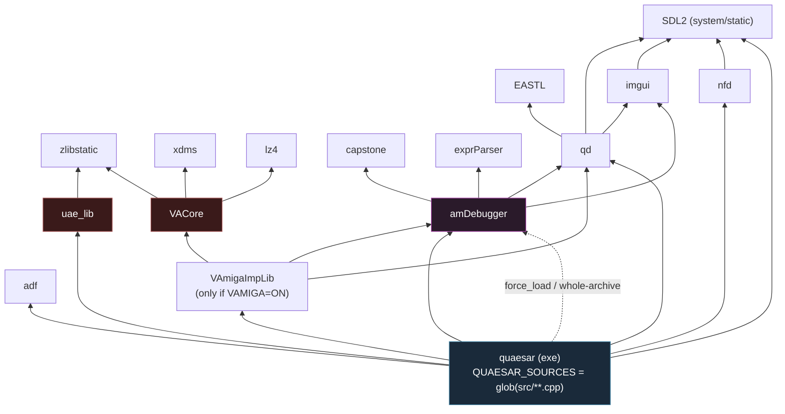
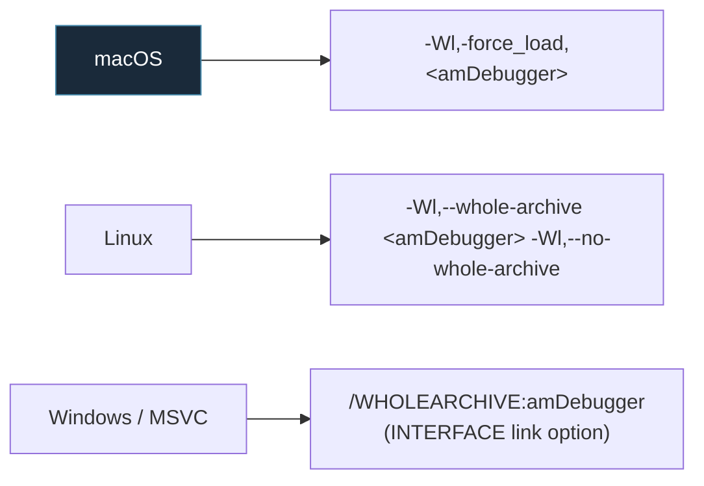

# 9 — Build System

← [Custom Libraries](08-libs-modules.md) · [Index](index.md) · → [Key Dataflows](10-key-dataflows.md)

Quaesar-NG builds with **CMake ≥ 3.16** and C++20. This document maps the target
graph, the platform-specific quirks, and the helper scripts under `scripts/cmake/`.

## The target graph

Every box is a CMake target; arrows are `target_link_libraries(... PRIVATE ...)`
dependencies (the direction the link flows).



### Key facts

- **`quaesar` is a single executable.** All of `src/**/*.cpp` is globbed into
  `QUAESAR_SOURCES` (`file(GLOB_RECURSE)`), including the UAE application glue
  (`src/quasar_app/uae_imp/`) and the porting layer (`src/uae_lib_imp/`).
- **`uae_lib` does not link `amDebugger`.** The dependency arrow is one-way:
  the app pulls both in and wires them. This keeps the UAE core ignorant of the
  debugger.
- **`amDebugger` has no emulator-core dependency at all** — only `qd`, `imgui`,
  `exprParser`, `capstone`. That is what makes the backend swappable.
- **vAmiga is optional.** `VAmigaLib.cmake` is only included when `option(VAMIGA)`
  is `ON`; it adds `VACore` + `VAmigaImpLib` and registers the latter into
  `QUAESAR_EXTRA_LIBS` via the `quaesar_add_libs()` helper.

## The `quaesar_add_libs()` indirection

Child CMake files can't easily append to the final exe's link line from a
different scope, so the root defines an accumulator:

```cmake
set(QUAESAR_EXTRA_LIBS "" CACHE INTERNAL "...")
function(quaesar_add_libs)
    foreach(lib IN LISTS ARGN)
        list(APPEND QUAESAR_EXTRA_LIBS "${lib}")
    endforeach()
    set(QUAESAR_EXTRA_LIBS "${QUAESAR_EXTRA_LIBS}" CACHE INTERNAL "" FORCE)
endfunction()
```

The final `target_link_libraries(quaesar ... ${QUAESAR_EXTRA_LIBS})` consumes it.
`VAmigaLib.cmake` calls `quaesar_add_libs(VAmigaImpLib)` — that's how the
optional vAmiga backend reaches the link line.

## The whole-archive dance (important)

`amDebugger` windows and app-parts self-register via `TS_BEGIN_REFLECT_CLASS`
static initializers (see [Custom Libraries](08-libs-modules.md)). A normal static
link would strip those object files because nothing references them by symbol.
So the build forces inclusion of the entire archive:



If you ever see a debugger window silently missing from a fresh build, this is
the first thing to check.

## Resource embedding (`bin2c`)

At **configure time**, `scripts/cmake/bin2c.cmake` converts every file under
`resources/*` into `resources_inc.cpp` / `resources_inc.h` (byte arrays). These
generated files are compiled into the exe, so icons/layouts/fonts are baked in —
no external file dependencies at runtime except the Font Awesome TTF under
`data/static/`.

The bundled `resources/default_layout.ini` is also copied next to the binary as
a POST_BUILD step so the debugger dockspace isn't empty on first launch.

## Platform link specifics

| Platform | Notable link flags / libs |
|----------|---------------------------|
| **Windows (MSVC)** | Static CRT (`/MT[d]` via `CMAKE_MSVC_RUNTIME_LIBRARY`); `Ws2_32 Winmm Version Imm32 Setupapi`; `/SUBSYSTEM:WINDOWS`; `quaesar` is the VS startup project; depends on `quaesar-clang-format`. |
| **Linux/Unix** | links `dl`; compile defs `-DUAE=1 -D_cdecl= -DOS_NAME="linux" -DFSUAE`. |
| **macOS** | `-Wno-macro-redefined -Wno-deprecated-declarations`; `-force_load` for amDebugger. |

`FSUAE` and `UAE=1` are the preprocessor switches that select the POSIX
(FS-UAE) code paths inside the UAE core instead of the Win32 ones.

## Compiler options & helpers

`scripts/cmake/`:

| File | Purpose |
|------|---------|
| `compile_options.cmake` | Shared warning levels + `add_option_edit_and_continue(<target>)` (edit-and-continue / fast-iterate linking for `quaesar`, `qd`, `amDebugger`). |
| `format_sources.cmake` | The `quaesar-clang-format` custom target (Windows) — runs `bin/win/clang-format.exe`. |
| `bin2c.cmake` | Resource → C array converter (see above). |

All `file(GLOB ...)` calls in the library CMakeLists use **`CONFIGURE_DEPENDS`**
so adding/removing a source file triggers a re-glob on the next build instead of
being silently missed.

## UAE code generation (optional, off by default)

`uae_lib/CMakeLists.txt` defines `build68k`, `gencpu`, `gencomp`, `genblitter`
helper executables, gated behind `option(ENABLE_CODE_GENERATION OFF)`. These
regenerate the CPU opcode tables (`cputbl.h`, `cpudefs.cpp`, `blit.h`, ...) from
`table68k`. Leave off for normal builds — the generated tables are checked in.

## Presets & directories

- `CMakePresets.json` — standard configure/build presets.
- Typical build dirs: `build/`, `cmake-build-debug/`, `cmake-build-release/`.
- Output exe lands at the **repo root** (`quaesar` / `quaesar-dbg`), not in the
  build dir, via `RUNTIME_OUTPUT_DIRECTORY`.

## Quick build (POSIX)

```bash
cmake -S . -B build -DCMAKE_BUILD_TYPE=Release
cmake --build build -j
# binary: ./quaesar
```

---

← [Custom Libraries](08-libs-modules.md) · [Index](index.md) · → [Key Dataflows](10-key-dataflows.md)
