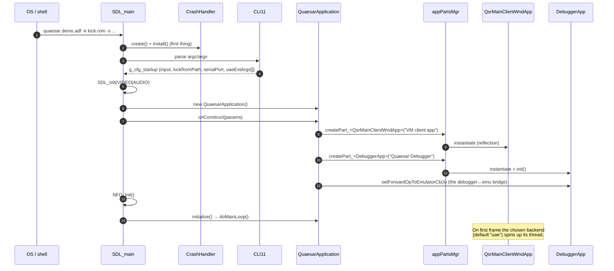
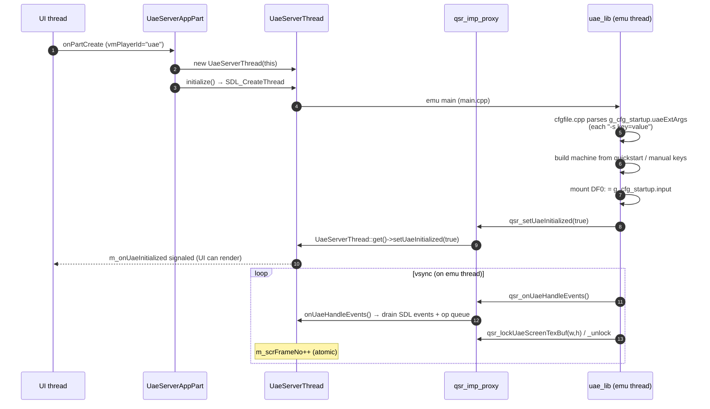
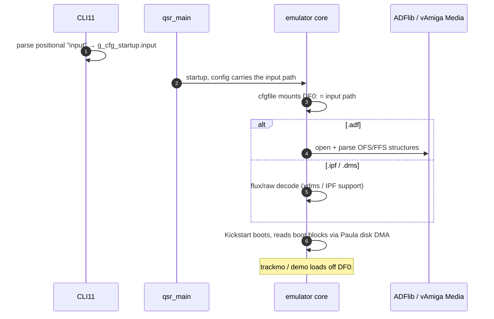
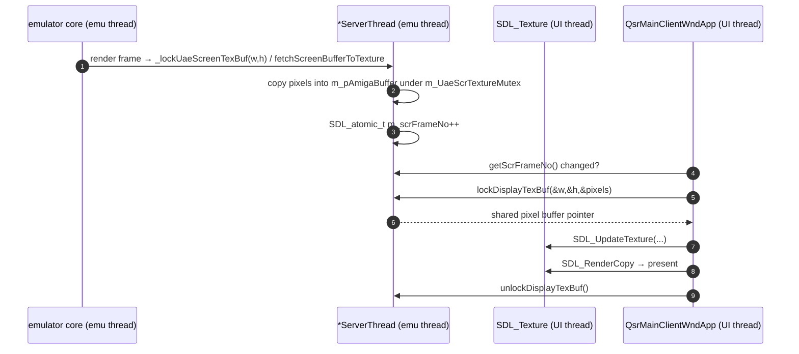
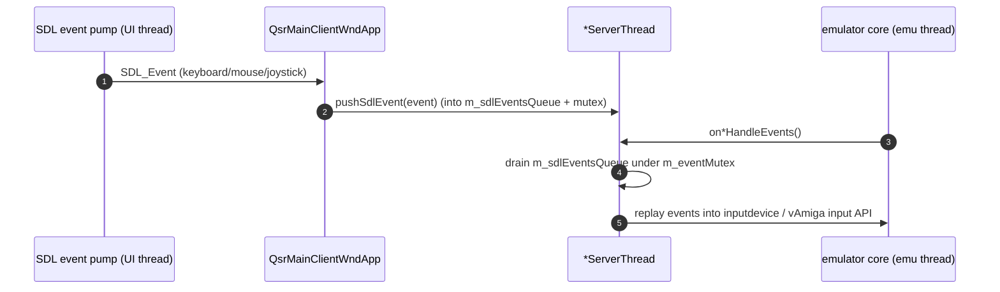
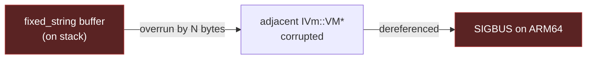

# 10 — Key Dataflows

← [Build System](09-build-system.md) · [Index](index.md) · → [Threading Model](11-threading-model.md)

This document collects the **sequence diagrams** for the flows that matter most.
Component-level dataflow is covered in [doc 04](04-operation-dispatch.md); here
we trace concrete scenarios end to end.

---

## 1. Process startup & wiring



---

## 2. Backend thread boot (UAE)



---

## 3. Render a debugger frame

The debugger window runs on the UI thread and throttles to ~15 FPS
(`DebuggerApp::kMinFrameIntervalMs = 66`).

```mermaid
sequenceDiagram
    autonumber
    participant Loop as qd::Application main loop (UI thread)
    participant Dbg as DebuggerApp
    participant Desktop as DebuggerDesktop
    participant Win as inspector windows
    participant VM as IVm::VM (snapshot)

    Loop->>Dbg: updateAppPart(dt, time)
    Dbg->>Dbg: throttle check (≥66ms since last)
    Loop->>Dbg: renderAppPart()
    Dbg->>VM: fetchStateFromEmu()   (snapshot CPU/mem/copper/custom)
    Dbg->>Desktop: render dockspace + toolbar
    Desktop->>Win: each registered window renders
    Win->>VM: cpu->getPC(), mem->getU16(addr), custom->getRegVal(...)
    Note over Win: pure read from the snapshot;<br/>no emulator mutation here
```

---

## 4. Pause / Resume (the canonical flow)

```mermaid
sequenceDiagram
    autonumber
    participant U as User
    participant UI as DebuggerDesktop (UI thread)
    participant Cb as forwardOpToEmulatorCb
    participant Player as IVmClientPlayer
    participant Emu as emulator thread
    participant VM as IVm::VM::applyOperationMsgProcImp
    participant Core as emulator core

    U->>UI: click Pause (Ctrl+F8)
    UI->>Cb: doOperation_<PauseEmulation>()
    Cb->>Cb: setDebugMode(Break)  [UI mirror only, no engine call]
    Cb->>Player: pushOperationMsg(clone)
    Note over Player,Emu: op waits in mutex-protected deque
    Emu->>Player: onUaeHandleEvents() / onVAmHandleEvents()
    Player->>VM: applyOperationMsgProcImp(PauseEmulation)
    alt UAE
        VM->>Core: activate_debugger() → SPCFLAG_BRK
        Core->>Core: interpreter loop sees BRK, enters debug_1() (blocks)
    else vAmiga
        VM->>Core: vAmiga->pause()  (ExecState ← paused)
    end
    Note over U: screen frozen; debugger shows current state
    U->>UI: click Continue
    UI->>Cb: DebugTraceContinue
    Cb->>Cb: setDebugMode(Live)  [mirror]
    Cb->>Emu: UAE: execConsoleCmd("g"); vAmiga: pushOperationMsg
    Note over Core: emulation resumes
```

> Historical bug context: the original implementation delivered Pause **twice**
> (UI-thread inline + queued), racing on UAE's non-atomic globals. The current
> single-path design fixes that — see
> [`doc/pause_bug_analysis.md`](../doc/pause_bug_analysis.md).

---

## 5. Step Into while paused (UAE console escape hatch)

When UAE's `debug_1()` is blocked waiting for console input, the operations
queue is stuck. Step/continue therefore bypass the queue and inject console
commands.

```mermaid
sequenceDiagram
    autonumber
    participant UI as DebuggerDesktop (UI thread)
    participant Cb as forwardOpToEmulatorCb
    participant Uae as UaeServerThread
    participant Q as console cmd queue
    participant Core as UAE core (blocked in debug_1)

    UI->>Cb: DisasmTraceStepInto
    Cb->>Cb: dynamic_cast<UaeServerThread*> ok; debugger_active==true
    Note over Cb: queue path won't work (debug_1 is blocking)
    Cb->>Uae: execConsoleCmd("t")
    Uae->>Q: push "t"
    Core->>Q: readLine() returns "t"   (unblocks)
    Core->>Core: trace one instruction → re-enter debug_1()
    Note over UI: next render shows advanced PC
```

vAmiga has no blocking console REPL, so stepping always uses the normal queued
operation path.

---

## 6. Disk / ADF load at startup



Disk swap is done by reconfiguring `floppy1`/`floppy2`/... on the command line
(multi-drive) — there is no runtime disk-swap GUI.

---

## 7. Screen frame transport (emu → UI texture)



The atomic frame counter is the cheap "is there a new frame?" signal; the mutex
guards only the actual pixel copy.

---

## 8. Input event transport (host → emu)



---

## 9. Known sharp edge: disassembly window stack-buffer aliasing

A historical SIGBUS on ARM64 came from an `EASTL fixed_string` (inline stack
buffer) placed adjacent to a VM pointer; a write overran into the pointer.



Lesson: when laying out locals in debugger windows, keep `fixed_string` /
`fixed_vector` buffers away from raw pointers, or prefer heap-backed
`qtd::string`/`qtd::vector` for anything that grows.

---

← [Build System](09-build-system.md) · [Index](index.md) · → [Threading Model](11-threading-model.md)
