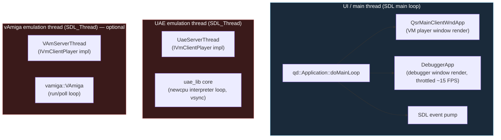
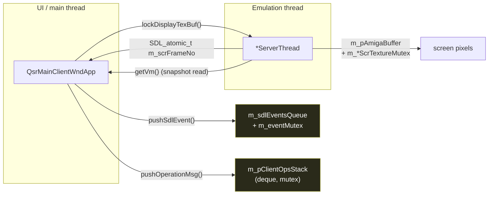
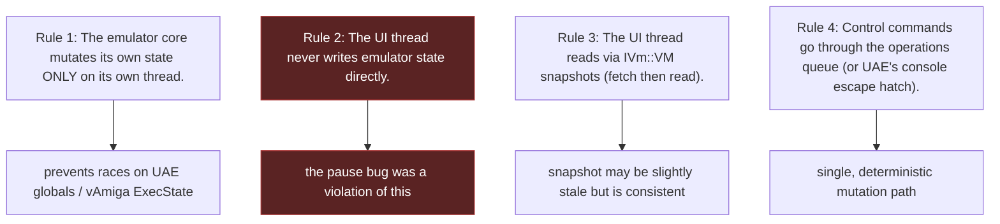

# 11 — Threading Model

← [Key Dataflows](10-key-dataflows.md) · [Index](index.md) · → [Glossary](12-glossary.md)

Quaesar-NG is a **multi-threaded** program. Getting the thread ownership and the
cross-thread channels right is essential — most of the tricky bugs (including the
historical pause race) were threading bugs. This document is the definitive map.

## The threads



- **Only one** emulation thread runs at a time. The active backend is chosen by
  `CfgQsrMain::vmPlayerId` (`"uae"` default, or `"vamiga"`). The other backend's
  app-part isn't created.
- The `*ServerThread` object **lives on the emulation thread**, not the UI
  thread — it is the in-thread facade the UI talks to via the
  `IVmClientPlayer` interface.

## Cross-thread channels

All UI↔emu communication goes through a small, explicitly-synchronized surface.
There is **no** raw shared mutable state beyond these channels.



| Channel | Direction | Guard | Carries |
|---------|-----------|-------|---------|
| `m_sdlEventsQueue` | UI → emu | `m_eventMutex` | host keyboard/mouse/joystick events |
| `m_pClientOpsStack` | UI → emu | (deque + mutex) | `BaseOpArgs` operations (pause, step, ...) |
| `m_pAmigaBuffer` + `m_*ScrTextureMutex` | emu → UI | texture mutex | rendered Amiga frame pixels |
| `m_scrFrameNo` (`SDL_atomic_t`) | emu → UI | atomic | "new frame ready" counter |
| `lockDisplayTexBuf()` | UI → emu | (same texture mutex) | hands UI a pointer to copy from |
| `getVm()` snapshot read | UI ← emu | lock-free-ish | `IVm::VM` snapshot of regs/mem/chips |
| `m_pConsoleQueue` (UAE) | UI → emu | custom queue | console-debugger commands (`t`,`g`,...) |
| `m_pauseEvent` (`ThreadEvent`, UAE) | — | event | legacy pause gate (currently unused) |

## Ownership rules



### The UAE console-REPL exception

UAE's legacy console debugger (`debug_1()` in `debug.cpp`) **blocks** the
operations queue while paused. To step/continue, the
`forwardOpToEmulatorCb` detects `debugger_active` and injects console commands
(`execConsoleCmd("t"/"z"/"ot"/"g")`) directly into the console queue instead of
the op queue. This is the **only** sanctioned way to "skip" the normal queue, and
only for UAE. vAmiga never needs it.

## Synchronization primitives (from `qd`)

| Primitive | Header | Use |
|-----------|--------|-----|
| `qd::Mutex` | `qd/thread/mutex.h` | guards every deque/buffer above |
| `qd::ThreadEvent` | `qd/thread/thread.h` | signaling init/pause (`m_onUaeInitialized`, `m_pauseEvent`) |
| `SDL_atomic_t` | SDL | `m_scrFrameNo` frame counter |
| `SDL_Thread` | SDL | the emulation thread itself |

> Gotcha: `ThreadEvent::wait(0)` is **non-blocking**. If you need to block until
> an event is signaled, call `wait()` with no argument (or a real timeout) — a
> zero-timeout wait will return immediately and silently do nothing. This bit
> the pause implementation before it was fixed.

## Lifecycle / shutdown

```mermaid
sequenceDiagram
    participant Main as UI thread
    participant Part as *ServerAppPart
    participant TH as *ServerThread
    participant Core as emulator core

    Main->>Part: app shutdown (ESC / Quit)
    Part->>TH: m_isDestroying = true
    TH->>Core: signal quit (UAE: uae_quit; vAmiga: power off / msg)
    Core->>Core: exit vsync loop
    TH->>TH: SDL_WaitThread joins
    Part->>Part: destroyImp()
    Main->>Main: QuaesarApplication::destroy()<br/>amD::uae::on_app_exit_debug / _drawing
```

`m_isDestroying` is checked inside `on*HandleEvents()` so the emulation thread
stops pumping and can unwind cleanly.

---

← [Key Dataflows](10-key-dataflows.md) · [Index](index.md) · → [Glossary](12-glossary.md)
