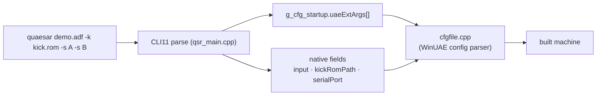

# 13 — CLI Reference

← [Glossary](12-glossary.md) · [Index](index.md)

Quaesar-NG is **CLI-first**: there is no configuration GUI. Everything the
machine will be is expressed on the command line. This is the developer-facing
reference for every flag. For the narrative, example-driven version, see
[`doc/user_guide.md`](../doc/user_guide.md).

> How it's wired: `src/quasar_app/qsr_main.cpp` parses the native flags with
> **CLI11** into `g_cfg_startup`, then forwards `uaeExtArgs[]` straight into
> UAE's `cfgfile.cpp` parser. That is why every `-s key=value` "just works"
> without Quaesar knowing about it.

## Native Quaesar arguments

| Argument | Shorthand | Type | Default | Description |
|----------|-----------|------|---------|-------------|
| `input` (positional) | — | path | — | Primary executable or image (`.adf`, `.dms`, `.ipf`, AmigaDOS exe). Auto-mounted into `DF0:`. |
| `--kickstart` | `-k` | path | *(required)* | Path to the Kickstart ROM (e.g. `kick13.rom`, `kick31.rom`). |
| `--serial_port` | — | path/device | off | Bridges the Amiga serial port (`kprintf` output) to a host file, pipe, or TTY. |
| `--uaeExtArgs` | `-s` | `key=value` (repeatable) | — | Pass-through to the WinUAE config parser. May be given many times. |



## The `-s` pass-through

Each `-s key=value` is fed verbatim to UAE's `cfgfile.cpp`. WinUAE's keyspace is
huge; the table below is the **demoscene-relevant subset** (the full glossary is
in [`doc/user_guide.md`](../doc/user_guide.md), Chapter 12).

> Defaults below are the UAE `default_prefs()` baseline from
> [`libs/uae_lib/cfgfile.cpp`](../libs/uae_lib/cfgfile.cpp). Quaesar-NG does not
> override these unless noted.

### Machine selection

| Key | Default | Values | Effect |
|-----|---------|--------|--------|
| `quickstart` | *(unset)* | `A500,0` / `A600,0` / `A1200,0` / `A4000,0` / `CD32,0` | Tear down and rebuild to a hardware template. The `,0` is the variant. Replaces almost every key below. |

### CPU / FPU

| Key | Default | Values | Effect |
|-----|---------|--------|--------|
| `cpu_model` | `68000` | `68000`…`68060` | CPU model. |
| `fpu_model` | `0` (none) | `68881`/`68882`/`68040`/`68060`/`0` | FPU model. |
| `cpu_speed` | `real` | `real` / `max` / `1`–`20` | `real`=approximate real-speed; `max`=host-speed warp; number=adjustable budget. |
| `cpu_cycle_exact` | `false` | `true`/`false` | Per-instruction bus-cycle exact CPU. Note: default is **off** — `cpu_compatible` is on instead. |
| `cpu_memory_cycle_exact` | `false` | `true`/`false` | Cycle-exact incl. DMA contention (implies `cpu_cycle_exact`). |
| `cpu_compatible` | `true` | `true`/`false` | Approximate 68000-compatible timing (the actual default timing model). |
| `fpu_strict` | `false` | `true`/`false` | Strict IEEE rounding. |

### Chipset

| Key | Default | Values | Effect |
|-----|---------|--------|--------|
| `chipset` | **ECS Agnus** (`CSMASK_ECS_AGNUS`) | `ocs`/`ecs`/`aga` | Chipset generation. Default is ECS Agnus — mostly OCS-compatible but with 1MB+ chip addressing. |
| `collision_level` | `2` | `0`–`3` | Sprite/playfield collision detail (cost scales up). |
| `ntsc` | `false` (PAL) | `true`/`false` | NTSC (60 Hz) vs PAL (50 Hz). |
| `immediate_blits` | `false` | `true`/`false` | Instant blits (skip blitter cycle timing). |

### Memory

| Key | Default | Values | Effect |
|-----|---------|--------|--------|
| `chipmem_size` | **512 KB** (`0x80000`) | `1`=512KB, `2`=1MB, `4`=2MB, `8`=4MB | Chip RAM. |
| `bogomem_size` | **512 KB** (`0x80000`) | `0`/`1` | Slow (trapdoor) RAM at `$C00000`. |
| `fastmem_size` | **0** | MB | Zorro II Fast RAM. |
| `z3fastmem_size` | **0** | MB | Zorro III Fast RAM (needs 68020+). |

### Floppy / storage

| Key | Default | Values | Effect |
|-----|---------|--------|--------|
| `floppy0`..`floppy3` | *(empty)* | path | Disk image for `DF0:`–`DF3:`. `floppy0` is auto-set to the positional `input`. |
| `floppy_speed` | `100` (real) | `100` accurate / `800` 8× turbo | Drive RPM multiplier. |
| `floppy0type` | `0` (DD) | `0`=DD / `1`=HD | Drive type. |
| `nr_floppies` | `2` | `0`–`4` | Active floppy drives. DF0 + DF1 enabled; DF2/DF3 = `DRV_NONE`. |

### Filesystem / hardfile

> **Warning — the `filesystem` vs `filesystem2` trap** (see
> [`doc/user_guide.md`](../doc/user_guide.md) Appendix B): the legacy
> `filesystem=` takes only `Volume:HostPath`; the modern `filesystem2=` needs
> the trailing boot-priority (`,0`) or UAE silently mounts the CWD as `RDH0`.

| Key | Default | Values | Effect |
|-----|---------|--------|--------|
| `filesystem2` | *(none mounted)* | `rw,DH1:HostDir:/path,0` | Mount a host dir as an Amiga volume. |
| `hardfile2` | *(none mounted)* | `rw,DH0:/path.vhd,0,0,0,512,0,,ide0` | Mount a raw hardfile image. |

### Audio

| Key | Default | Values | Effect |
|-----|---------|--------|--------|
| `sound_stereo_separation` | `7` | `0`–`7` | Harsh A500 panning (0) ↔ headphone-friendly (7). |
| `sound_filter` | *(hardware-controlled)* | `off`/`on`/`auto` | Hardware audio filter. |
| `sound_frequency` | `44100` Hz | Hz | Audio sample rate. |
| `sound_max_buff` | `16384` bytes | bytes | Audio buffer size. |
| `produce_sound` | `3` (exact) | `0`–`3` | Sound emulation detail (0=off, 3=best). |

### Display

| Key | Default | Values | Effect |
|-----|---------|--------|--------|
| `gfx_width` / `gfx_height` | `720` × `568` (windowed) | px | Window size. |
| `gfx_fullscreen_amiga` | `false` (window) | `true`/`false` | Fullscreen on launch. |
| `gfx_framerate` | `1` (every frame) | `1`=every / `2`=every other | Render cadence. |
| `gfx_overscanmode` | `3` | `0`–`3` | Overscan clip region. |
| `line_mode` | *(double, via `gfx_vresolution`)* | `0` single / `1` double | Scanline doubling. |

### Networking (disabled by default)

| Key | Default | Values | Effect |
|-----|---------|--------|--------|
| `bsdsocket_emu` | `false` | `true` | Enable `bsdsocket.library` host-network bridging. Requires the POSIX backend to be compiled in (`BSDSOCKET`) — see [`doc/bsdsocket_integration_plan.md`](../doc/bsdsocket_integration_plan.md) and [Feature Matrix](18-feature-matrix.md). |

## Default configuration

If you pass **only** `quaesar <input> -k <rom>`, you get the UAE `default_prefs()`
baseline, which is an **A500-class** machine:

| Aspect | Default value | Source |
|--------|---------------|--------|
| CPU | `68000`, `cpu_compatible=true` (approximate timing) | `cfgfile.cpp:8569,8581` |
| Cycle exact | **off** (`cpu_cycle_exact=false`, `cpu_memory_cycle_exact=false`) | `cfgfile.cpp:8583-8584` |
| FPU | none (`fpu_model=0`) | `cfgfile.cpp:8568` |
| Chipset | **ECS Agnus** (`CSMASK_ECS_AGNUS`) — OCS-compatible with 1MB+ chip addressing | `cfgfile.cpp:8586` |
| Video standard | PAL (`ntscmode=0`, 50 Hz) | `cfgfile.cpp:8593` |
| Chip RAM | **512 KB** (`chipmem.size=0x80000`) | `cfgfile.cpp:8599` |
| Slow RAM | **512 KB** (`bogomem.size=0x80000`) | `cfgfile.cpp:8601` |
| Fast RAM | 0 | zero-initialized |
| Floppies | DF0 + DF1 = `DRV_35_DD`; DF2/DF3 = `DRV_NONE`; `floppy_speed=100` | `cfgfile.cpp:8613-8619` |
| Collision | level 2 | `cfgfile.cpp:8459` |
| Blitter | `immediate_blits=false` | `cfgfile.cpp:8457` |
| Sound | stereo, sep=7, 44100 Hz, 16384-byte buffer, `produce_sound=3` (exact) | `cfgfile.cpp:8391-8396` |
| Display | 720×568 window, every frame, overscan=3, double-line | `cfgfile.cpp:8421-8455` |
| DF0: | the positional `input` argument | Quaesar `qsr_main.cpp` |

> **Corrections to earlier docs:** the baseline chipset is **ECS Agnus**, not
> pure OCS (though it's OCS-compatible for most demos). The CPU is **not**
> cycle-exact by default — it runs in `cpu_compatible` approximate-timing mode.

This zero-config default is intentional — see [Overview](01-overview.md).

## Interaction model (runtime, not CLI)

These are fixed behaviors, not flags, but worth knowing alongside the CLI:

| Action | Effect |
|--------|--------|
| Click inside Amiga screen | Capture host mouse → emulated mouse. |
| `ESC` | Release mouse grab / exit app (`CfgQsrMain::quitByEsc`). |
| `F12` | Open Quaesar config overlay (mouse released). |
| `Shift+F12` | Open/focus the integrated debugger. |

Shortcuts are enumerated in `amDebugger/shortcutsList.h` (see [Glossary](12-glossary.md)).

## Recipes

Quick reference for the most common demoscene setups:

```bash
# Pure A500 (the default)
quaesar build/intro.adf -k roms/kick13.rom

# Turbo floppy for fast iteration
quaesar build/intro.adf -k roms/kick13.rom -s floppy_speed=800

# AGA / A1200
quaesar build/aga.adf -k roms/kick31.rom -s quickstart=A1200,0

# Accelerated A1200 (68040 + Fast RAM)
quaesar build/aga.adf -k roms/kick31.rom -s quickstart=A1200,0 \
  -s cpu_model=68040 -s fastmem_size=8

# Host-dir as hard drive (no .adf round-trip)
quaesar -k roms/kick31.rom -s quickstart=A1200,0 -s filesystem2=rw,DH1:Work:./dist,0

# Serial debug output to a file
quaesar build/intro.adf -k roms/kick13.rom --serial_port debug.log

# Multi-disk trackmo
quaesar disk1.adf -k roms/kick13.rom -s floppy1=disk2.adf -s floppy2=disk3.adf
```

More recipes in [`doc/user_guide.md`](../doc/user_guide.md), Chapter 9.

---

← [Glossary](12-glossary.md) · [Index](index.md)
