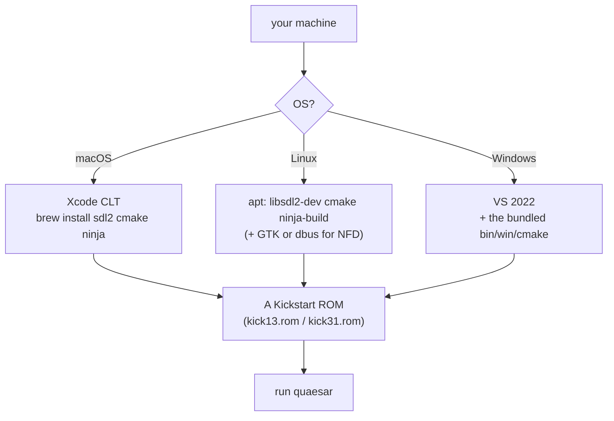
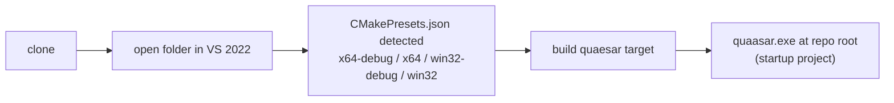

# 14 — Getting Started (Contributor Onboarding)

← [Index](index.md) · → [Debugger UI Guide](15-debugger-ui-guide.md)

This is the step-by-step path from a fresh clone to a running, debuggable
Quaesar-NG build. If you only want to *use* the emulator, jump to the
[CLI Reference](13-cli-reference.md) instead.

## Prerequisites



| Need | Notes |
|------|-------|
| **C++20 compiler** | GCC ≥ 11, Clang ≥ 12, or MSVC (VS 2022). |
| **CMake ≥ 3.16** | macOS/Linux: install via brew/apt. Windows: a CMake 3.28 is **bundled** under `bin/win/cmake/`. |
| **SDL2** | macOS: `brew install sdl2`. Linux: `libsdl2-dev`. Windows: prebuilt `.lib` vendored under `external/sdl2/`. |
| **Ninja** *(optional, recommended on POSIX)* | The CI uses Ninja; faster iterative builds. |
| **GTK3 or libdbus** *(Linux only)* | For native file dialogs — see NFD portal below. |
| **A Kickstart ROM** | Not vendored for legal reasons. You supply `kick13.rom` (A500) / `kick31.rom` (A1200). |

## Build on macOS / Linux

```bash
# from the repo root
cmake -S . -B build -G Ninja -DCMAKE_BUILD_TYPE=Debug
cmake --build build -j
# binary is placed at the repo root:
./quaesar-dbg   # (Debug)   or   ./quaesar   (Release)
```

The output executable lands at the **repository root** (not in `build/`), via
`RUNTIME_OUTPUT_DIRECTORY` — this is intentional so the binary sits next to
`resources/` and the bundled `default_layout.ini` (see [Build System](09-build-system.md)).

First run:

```bash
./quaesar-dbg path/to/intro.adf -k path/to/kick13.rom
```

## Build on Windows



The repository ships VS presets in `CMakePresets.json`. Open the folder in
Visual Studio 2022 and it auto-detects them; `quaesar` is the startup project.
From the CLI:

```powershell
cmake --preset x64-debug
cmake --build cmake-temp --config Debug
```

> The Windows toolchain uses the **bundled** CMake (`bin/win/cmake/bin/cmake.exe`)
> and links the **static MSVC runtime** (`/MT[d]`) — do not switch to a dynamic
> CRT or you will hit ABI mismatches with the vendored SDL2 libs.

## Common options

| Option | Default | Effect |
|--------|---------|--------|
| `VAMIGA` | `ON` | Build the vAmiga backend (`VACore` + `VAmigaImpLib`). Turn `OFF` to speed up builds if you only use UAE. |
| `ENABLE_CODE_GENERATION` | `OFF` | Regenerate UAE CPU/blitter tables from `table68k` (only needed when modifying opcodes). |
| `USE_STATIC_MSVC_RUNTIME` (Win) | `ON` | `/MT[d]` static CRT. |
| `NFD_PORTAL` (Linux) | `OFF` | Use the D-Bus portal backend for file dialogs instead of GTK. CI tests both. |

## Recommended IDE setup

- **VS 2022** (Windows): folder-open, presets auto-loaded, native
  Edit-and-Continue is enabled for `quaesar`, `qd`, `amDebugger`
  (`add_option_edit_and_continue`).
- **CLion / VS Code / Qt Creator** (POSIX): point at `CMakeLists.txt`; use the
  `build/` dir. The `.idea/` and `.vscode/` folders in the repo carry launch
  configs (`launch.json`) and editor settings.
- **Debugger layouts**: `debugger_layout.ini` and `default_layout.ini` at the
  repo root define the ImGui dockspace; `resources/default_layout.ini` is copied
  next to the binary on POST_BUILD so the debugger isn't an empty red dockspace
  on first launch.

## Where to look first (30-minute tour)

1. [System Architecture](02-system-architecture.md) — the 8 layers.
2. [`src/quasar_app/qsr_main.cpp`](../src/quasar_app/qsr_main.cpp) — entry point + CLI.
3. [`src/quasar_app/qsr_application.cpp`](../src/quasar_app/qsr_application.cpp) — the
   `forwardOpToEmulatorCb` lambda (the debugger↔emulator bridge).
4. [`libs/amDebugger/src/amDebugger/vm/vmInterface.h`](../libs/amDebugger/src/amDebugger/vm/vmInterface.h) —
   the `IVm::VM` seam.
5. [Operation Dispatch](04-operation-dispatch.md) — how a button click reaches the CPU.

## A note on the two backends

You can build either backend. `CfgQsrMain::vmPlayerId` (default `"uae"`) selects
which one runs; vAmiga is the modern C++ reference, UAE is the compatibility
default. See [UAE Backend](05-backend-uae.md) / [vAmiga Backend](06-backend-vamiga.md).

## Before you push

```bash
# POSIX: format check (matches the CI gate)
find src -regex '.*\.\(cpp\|hpp\|c\|h\)' | while read f; do
  clang-format -style=file "$f" | diff -u "$f" - || echo "MISSING FORMAT: $f"
done
```

Windows has a `quaesar-clang-format` custom target (uses the bundled
`bin/win/clang-format.exe`). See [Testing & CI](17-testing-and-ci.md) for the
full verification checklist.

## Troubleshooting

| Symptom | Likely cause / fix |
|---------|--------------------|
| Debugger window comes up empty / red dockspace | `default_layout.ini` not next to the exe — check the POST_BUILD copy step ran. |
| Missing debugger windows entirely | whole-archive link missing for `amDebugger` — see [Build System](09-build-system.md). |
| `getRealAddr` returns wrong/unmapped for ROM addresses | expected — use `IVm::Memory::getU16()` instead. See [Memory & Caching](16-memory-and-caching.md). |
| Pause "sometimes doesn't work" | reading old history — the pause race is fixed; if it recurs, start at [Threading Model](11-threading-model.md) and [`doc/pause_bug_analysis.md`](../doc/pause_bug_analysis.md). |

---

← [Index](index.md) · → [Debugger UI Guide](15-debugger-ui-guide.md)
