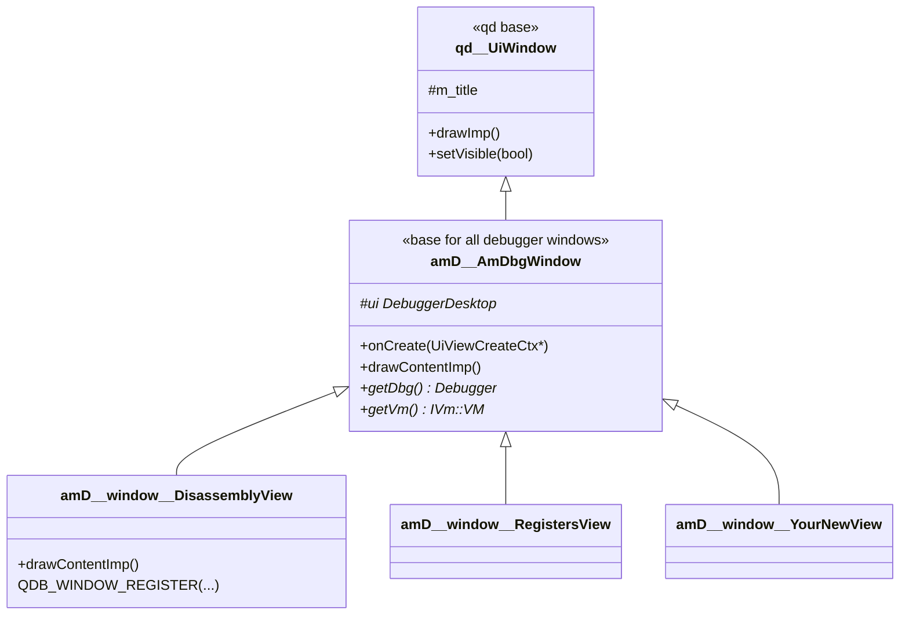
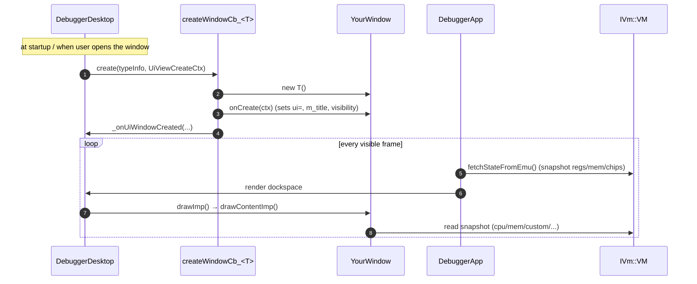
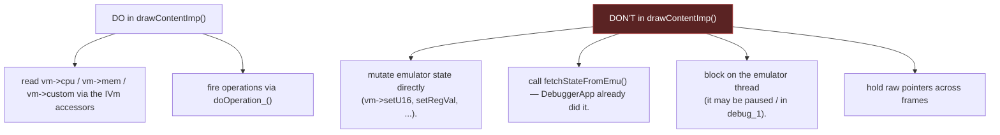

# 15 — Debugger UI Development Guide

← [Getting Started](14-getting-started.md) · [Index](index.md) · → [Memory & Caching](16-memory-and-caching.md)

How to add a new panel to the integrated debugger (e.g. a Blitter inspector, a
custom view), and the rules you must follow so it renders at 60 FPS without
racing the emulator.

## The window model in one diagram



All debugger windows derive from [`amD::AmDbgWindow`](../libs/amDebugger/src/amDebugger/ui/uiView.h)
(`qd::UiWindow` + `qd::IOperationEnvironment`). The desktop discovers and
instantiates them **automatically** via reflection — you do not register them by
hand anywhere.

## Adding a new window: the 4-step recipe

### 1. Pick a window id

Add an entry to the `WndId` enum in
[`amDebugger/ui/uiDefs.h`](../libs/amDebugger/src/amDebugger/ui/uiDefs.h):

```cpp
enum class WndId {
    ...
    BlitterWnd,
    MyNewView,        // <-- add here, before ImGuiDemo
    ImGuiDemo,
    MostCommonCount,
};
```

### 2. Write the class under `window/`

```cpp
// libs/amDebugger/src/amDebugger/window/my_new_view.h
#pragma once
#include "amDebugger/ui/uiView.h"

namespace amD::window {

class MyNewView : public amD::AmDbgWindow {
    QDB_WINDOW_REGISTER(WndId::MyNewView, amD::window::MyNewView, amD::AmDbgWindow);

public:
    virtual void onCreate(UiViewCreateCtx* cp) override {
        AmDbgWindow::onCreate(cp);
        m_title = "My View";
    }

    virtual void drawContentImp() override;
};

};  // namespace window
};  // namespace amD
```

That's the whole registration. `QDB_WINDOW_REGISTER` expands to a
`TS_BEGIN_REFLECT_CLASS` block with a `CustomClassId32` and a factory callback
(`createWindowCb_<MyNewView>`), so the desktop can build it on demand.

### 3. Implement `drawContentImp()`

```cpp
void MyNewView::drawContentImp() {
    IVm::VM* vm = getVm();          // never null inside draw
    IVm::Cpu* cpu = vm->cpu;

    // READ from the snapshot that DebuggerApp already fetched this frame:
    ImGui::Text("PC: %08X", cpu->getPC());

    if (ImGui::Button("Do thing")) {
        // COMMANDS go through operations, never direct mutation:
        doOperation_<amD::operation::ExecConsoleCmd>([&](auto* a){
            a->cmd = "r";           // example: UAE console command
        });
    }
}
```

### 4. Add it to the default layout (optional)

If you want it docked by default, reference its title in
`resources/default_layout.ini` (or `debugger_layout.ini`). Otherwise it appears
under the debugger's Window menu and the user docks it themselves.

## The `AmDbgWindow` lifecycle



Two things to internalize:

1. **The snapshot is pre-fetched.** `DebuggerApp` calls `fetchStateFromEmu()`
   once per frame *before* any window draws. Your `drawContentImp()` should only
   *read* `getVm()` — never call `fetchStateFromEmu()` yourself, and never write.
2. **Drawing is on the UI thread; the emulator is on its own thread.** Reads of
   the snapshot are safe; writes are not. See the rules below.

## Thread-safety rules (read this)



If you need to **change** the machine (set a register, edit memory, toggle a
breakpoint, pause/step), always go through the [operations pipeline](04-operation-dispatch.md).
The `forwardOpToEmulatorCb` ensures the mutation happens on the emulator thread.

The one narrow exception: `IVm::CustomRegs::commit()` writes back edited custom
registers, and is invoked from a controlled point — but new windows should still
prefer an operation if in doubt.

## Reading data the right way

| You want to... | Use | Why |
|----------------|-----|-----|
| Show registers | `vm->cpu->getRegD(i)`, `getPC()`, ... | pure snapshot reads |
| Show memory bytes | `vm->mem->getU16(addr)` / `getU32(addr)` | goes through full bank/mirror decode (works for mirrored ROM) |
| Show custom regs | `vm->custom->getRegVal(IVm::CustReg::...)` | snapshot |
| Show copper | `vm->copper->getCopperAddr(...)` | snapshot |
| Get a raw pointer for bulk reads | `vm->mem->getRealAddr(addr)` | **only for RAM**; see [Memory & Caching](16-memory-and-caching.md) — do **not** use for ROM (mirrors break it) |
| Disassemble | `amD::cda::M68CodeDisassembler::get().requestM68DisasmLines(...)` | uses Capstone + the anchoring logic; see [Memory & Caching](16-memory-and-caching.md) |

## Wiring keyboard shortcuts / menu items

1. Add an id to `amD::shortcut::EId` in `shortcutsList.h` and bind a key.
2. Define an operation struct in `debuggerOps.h` (`DECLARE_OPERATION_1`, with
   `setup()` calling `d.addShortcut(...)`).
3. Handle it in your window's `applyOperationMsgProcImp()` (override), or let it
   fall through to `DebuggerApp` / the emulator via the forwarding callback.

See [Operation Dispatch](04-operation-dispatch.md) for the full chain.

## Gotchas

- **Whole-archive link.** If your new window silently doesn't appear in the
  binary, the linker stripped its static registrar. The build already force-loads
  all of `amDebugger` (`-force_load` / `--whole-archive` / `/WHOLEARCHIVE`) — so
  this only bites if you accidentally place the class somewhere outside the
  `amDebugger` glob. Keep new windows under `libs/amDebugger/src/amDebugger/window/`.
- **East stack buffers.** Avoid `eastl::fixed_string` / `fixed_vector` locals
  placed next to raw pointers — there have been stack-buffer-aliasing crashes
  (see [Key Dataflows §9](10-key-dataflows.md)). Prefer `qtd::string` /
  `qtd::vector` for anything that grows.
- **`getRealAddr` on ROM.** ROM is mirrored at multiple address ranges; a single
  named bank can't represent that, so `getRealAddr` may return an
  unmapped/wrong host pointer for currently-executing PC addresses. Use
  `getU16`/`getU32` instead (this was the root of a disassembler bug — see
  [Memory & Caching](16-memory-and-caching.md)).

---

← [Getting Started](14-getting-started.md) · [Index](index.md) · → [Memory & Caching](16-memory-and-caching.md)
