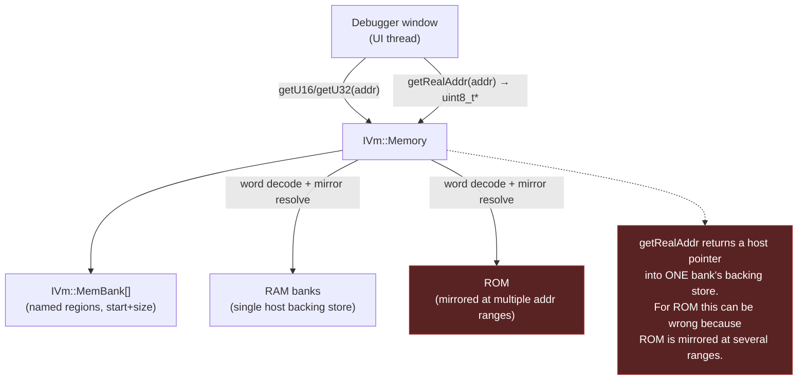
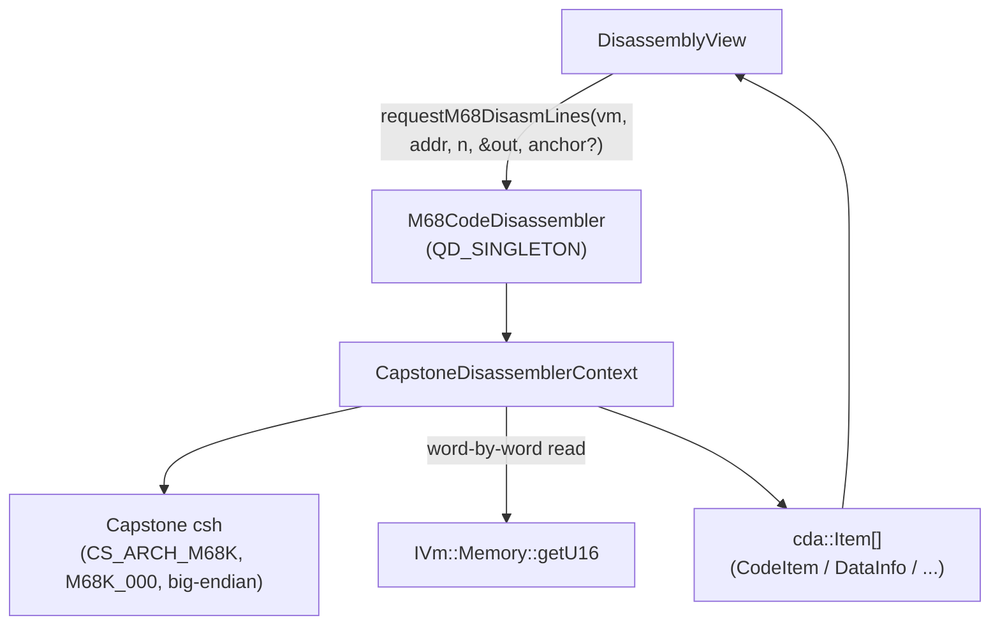
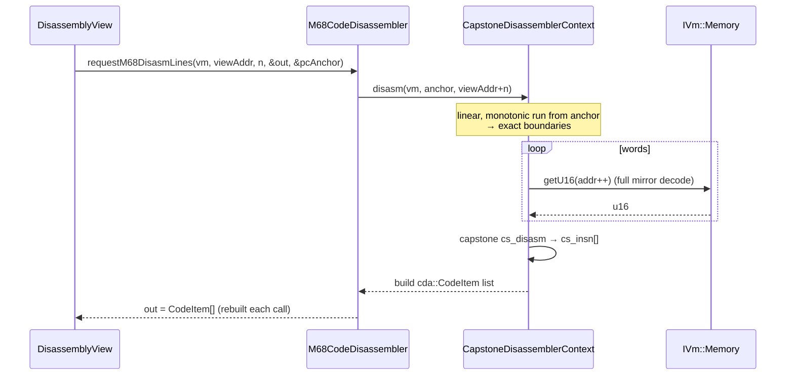
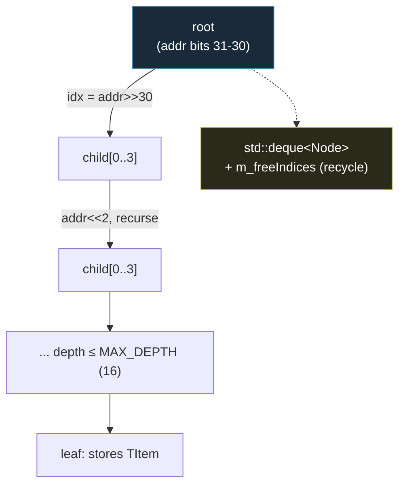
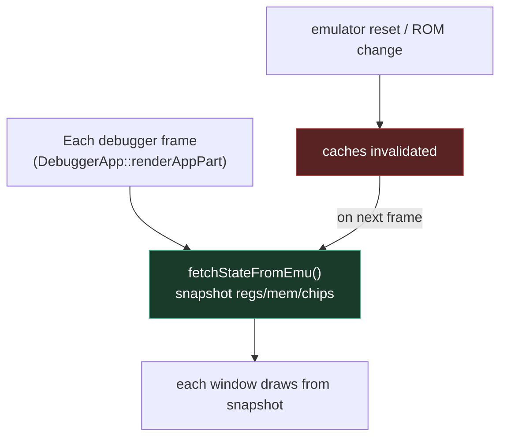

# 16 — Memory Access & Caching in the Debugger

← [Debugger UI Guide](15-debugger-ui-guide.md) · [Index](index.md) · → [Testing & CI](17-testing-and-ci.md)

The debugger must render 60 FPS of disassembly/memory/custom-chip views **without
blocking the emulator thread** and **without racing it**. This document explains
the safe memory-access model and the caching layer that makes that possible. It
also documents the bug classes that have historically bitten this area.

## The memory access model

### Two accessors, two purposes

| Accessor | What it does | Safe for |
|----------|--------------|----------|
| `IVm::Memory::getU16(addr)` / `getU32(addr)` / `getU16(addr, &out)` | Reads through the **full bank/mirror address decode** (UAE: `memory_get_word()`). Returns correct data for any address, including mirrored ROM. | **Everywhere.** Use this by default. |
| `IVm::Memory::getRealAddr(addr)` | Resolves `addr` to a raw host `uint8_t*` into a single bank's backing store. Fast bulk reads. | **RAM only.** Do **not** use for ROM: ROM is mirrored at multiple address ranges, so a single named bank's pointer makes currently-executing PC addresses look unmapped. |

> **Historical bug:** the disassembler used to grab a `getRealAddr` window and
> hand it to Capstone; PC addresses in mirrored ROM appeared unmapped and
> disassembly broke. The fix was to read **word-by-word via `getU16`** instead
> (see `cdaServer.cpp`'s `CapstoneDisassemblerContext::disasm()`). This is why
> the CDA layer never uses `getRealAddr`.

## The CDA (Code Disassembly & Analysis) layer

`libs/amDebugger/src/amDebugger/codeAnalyzer/` provides the disassembly engine
the Disassembly window uses.

### Anchored disassembly

M68k instructions are variable-length, so disassembling from a random address
desyncs immediately. `requestM68DisasmLines` takes an optional
`pProvedInstructionStart` — a **known-good instruction boundary** (typically the
current PC) at or before the view's top address. It disassembles forward from
that anchor so every boundary between it and the visible window is exact, not
guessed.

Constants of interest (`cdaServer.h`):

| Constant | Value | Meaning |
|----------|-------|---------|
| `g_minOpSize` | 2 | smallest M68k instruction (one word) |
| `g_maxOpSize` | 24 | largest M68k instruction |
| `g_maxAnchorBackGap` | 4096 | how far behind the view's left edge we'll walk to find a real instruction boundary |

## The `QuadTreeAddrMap`

Breakpoints / annotations are keyed by address and need O(depth) lookup across
the full 32-bit address space without a giant hash table. `QuadTreeAddrMap`
(quad-ary radix trie on the address bits) provides it.

- 2 bits of address per level → 4 children per node → depth ≤ 16 covers 32 bits.
- Nodes live in a `std::deque<Node>` (stable addresses) with a free-list for
  reuse, so insert/remove doesn't churn the allocator.
- API: `insert(addr, item)`, `querySingle(addr, &out)`, `remove(addr, item)`,
  `clear()`.

## Cache invalidation & ownership

Rules:

1. **CDA items are rebuilt per `requestM68DisasmLines` call** (`m_curItems` is
   cleared and refilled) — there is no cross-frame disassembly cache to
   invalidate. This deliberately trades a little CPU for correctness (the
   underlying memory may have changed under us).
2. **`QuadTreeAddrMap` (breakpoints/annotations) persists across frames** and is
   only cleared on an explicit reset (`clear()`) or item remove. If you add a new
   address-keyed cache, mirror this: invalidate on emulator reset, not on a timer.
3. **The snapshot is fetched once per frame by `DebuggerApp`, before any window
   draws.** Windows read; they never call `fetchStateFromEmu()` themselves and
   never write. Writes go through [operations](04-operation-dispatch.md).
4. **No window holds a raw pointer into emulator memory across frames.**
   `getRealAddr` results are only valid for the immediate bulk read.

## Performance shape

The goal: the debugger window renders at ~15–60 FPS while the emulator runs at
full speed on its own thread. The combination that achieves this:

- one snapshot fetch/frame (cheap, lock-free-ish read of regs + active banks);
- word-decoded disassembly rebuilt only for the visible window (not the whole
  address space);
- O(log n) breakpoint lookups via the quad-tree;
- no mutex contention on the hot emulator path — all UI↔emu traffic goes through
  the narrow channels in [Threading Model](11-threading-model.md).

If a new window feels sluggish, the first suspect is calling `fetchStateFromEmu()`
per-window or scanning a large memory range every frame instead of caching by a
dirty flag.

## Known sharp edges (don't reintroduce these)

| Sharp edge | Symptom | Fix in place |
|-----------|---------|--------------|
| `getRealAddr` on ROM | disassembly of ROM code shows unmapped/garbage | CDA uses `getU16` word-read (see above) |
| EASTL `fixed_string`/`fixed_vector` adjacent to a VM pointer | stack-buffer overrun aliases the pointer → SIGBUS on ARM64 | prefer `qtd::string`/`qtd::vector` for growable locals (see [Key Dataflows §9](10-key-dataflows.md)) |
| Per-window `fetchStateFromEmu()` | double fetch / torn reads | fetch only in `DebuggerApp::renderAppPart` |

---

← [Debugger UI Guide](15-debugger-ui-guide.md) · [Index](index.md) · → [Testing & CI](17-testing-and-ci.md)
