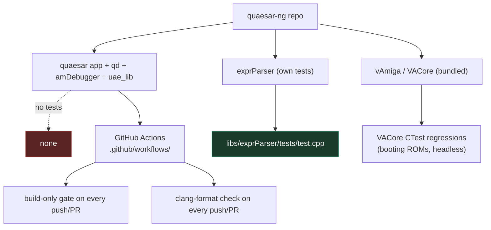
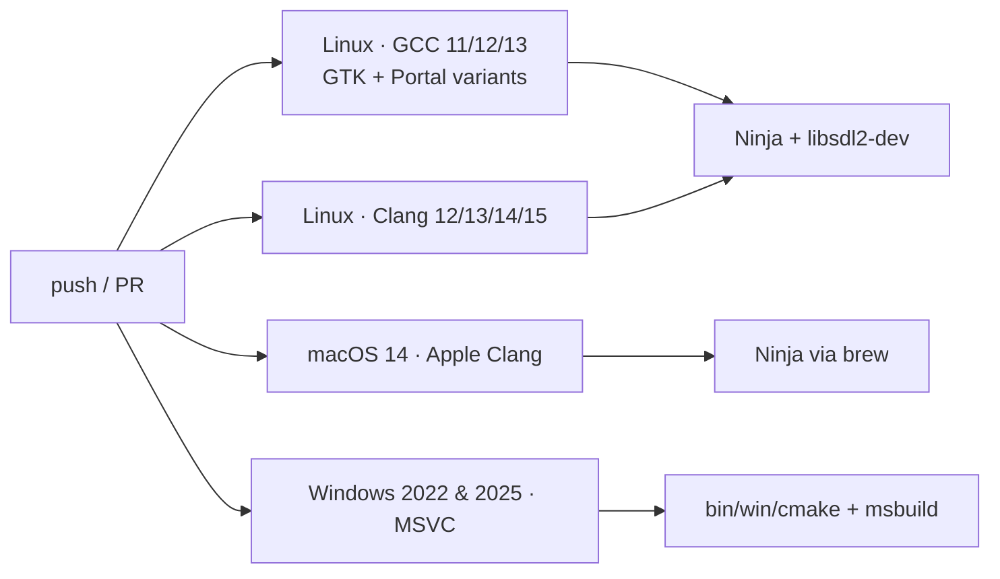
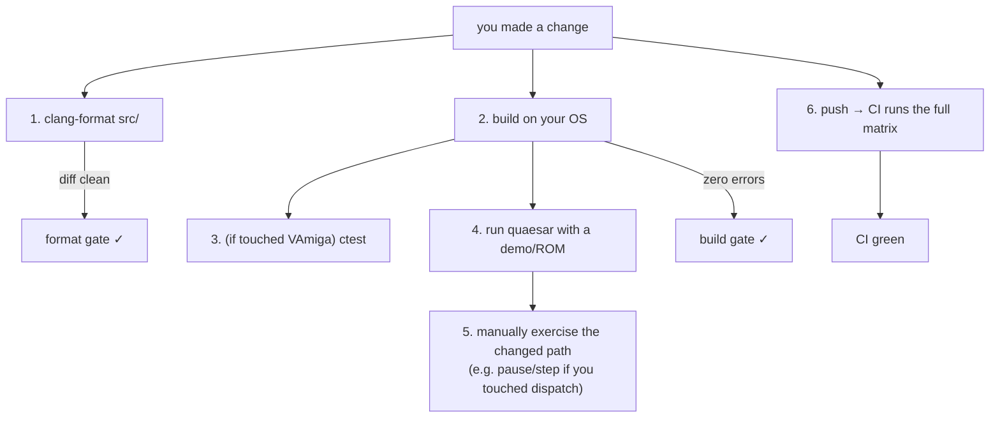

# 17 — Testing & CI

← [Memory & Caching](16-memory-and-caching.md) · [Index](index.md) · → [Feature Matrix](18-feature-matrix.md)

Honest answer first: **the Quaesar-NG application itself has no unit-test
suite.** What exists is (a) a focused unit test for the `exprParser` evaluator,
(b) CTest-based regression tests inside the bundled `VACore` (used by the vAmiga
backend), and (c) a thorough CI matrix that builds on every compiler/OS
combination. This doc maps what's actually verified and how to verify locally.

## What is tested



### Unit tests that exist

| Suite | Location | What it checks | Run |
|-------|----------|----------------|-----|
| `exprParser` | [`libs/exprParser/tests/test.cpp`](../libs/exprParser/tests/test.cpp) (+ `common.cpp/.h`) | Expression evaluator: tokenization, precedence, Amiga symbol/value parsing used by the debugger's watch/eval windows. | Run as a plain executable (see below). |
| `VACore` regressions | inside `libs/vAmiga` (VACore) | Boots reference ROMs headless and compares the resulting state snapshots. | `ctest` when `VAMIGA=ON` and VACore's test option is enabled. |

> Note: `exprParser`'s `test.cpp` is a hand-written `main()` assertion harness
> (no framework dependency) — see the file for how to add cases.

### What is NOT tested (by design)

- The `quaesar` application, `qd`, `amDebugger`, and `uae_lib` have **no
  automated tests**. They are validated manually via the debugger UI and the
  50/60 Hz on-screen output.
- The [pause/resume race](../doc/pause_bug_analysis.md) and the disassembler
  ROM-mirror bug (see [Memory & Caching](16-memory-and-caching.md)) were fixed
  by analysis, not by regression tests — treat changes to those areas as
  needing extra manual verification.

## The CI matrix

There are two workflows, both in [`.github/workflows/`](../.github/workflows/):

### `ci.yml` — build gate

Runs on **push** and **PR** to `main` and `debugger-start`.



| Job | Runner | Compiler(s) | Generator | Build config |
|-----|--------|-------------|-----------|--------------|
| `linux_ubuntu_22_04` | ubuntu-24.04 | GCC 11, 12, 13 | Ninja | default (NFD_PORTAL matrix ON/OFF) |
| `linux_clang` | ubuntu-22.04 | Clang 12, 13, 14, 15 | Ninja | default (NFD_PORTAL matrix ON/OFF) |
| `macos` | macos-14 | Apple Clang (via brew toolchain) | Ninja | default |
| `windows` | windows-2022, windows-2025 | MSVC (VS 2022 toolset) | VS (MSBuild) | `Debug`, `x64` |

The Linux jobs also matrix over **NFD_PORTAL** (`ON` → D-Bus portal,
`OFF` → GTK) for the native file-dialog library — that's why you'll see
`libgtk-3-dev` vs `libdbus-1-dev` in the install step.

### `format_check.yml` — clang-format gate

Runs on **every** push/PR. It formats everything under `src/` with
`clang-format -style=file` (driven by `src/.clang-format`) and fails the job if
any file differs. Note: it currently only scans `src/`, **not** `libs/` or
`external/`.

## How to verify your changes locally



### 1. Format check (matches the CI gate)

```bash
# POSIX
find src -regex '.*\.\(cpp\|hpp\|c\|h\)' | while read f; do
  clang-format -style=file "$f" | diff -u "$f" - || echo "NEEDS FORMAT: $f"
done
```

Windows has a built-in target that uses the bundled formatter:

```powershell
cmake --build cmake-temp --target quaesar-clang-format --config Debug
```

### 2. Build (matching CI)

```bash
# macOS / Linux (what the CI jobs do)
cmake -S . -B temp -G Ninja -DCMAKE_BUILD_TYPE=Debug
cmake --build temp -j
```

```powershell
# Windows
cmake --preset x64-debug
cmake --build cmake-temp --config Debug
```

### 3. Run the `exprParser` tests (if you touched it)

```bash
# build its test target then run the resulting exe (see libs/exprParser/tests/)
cmake --build temp --target ExprParser_test   # target name per its CMakeLists
./temp/.../ExprParser_test
```

### 4. Run VACore ctest (if you touched the vAmiga backend)

```bash
cmake -S . -B build -G Ninja -DVAMIGA=ON -DVACORE_BUILD_TESTS=ON
cmake --build build -j
ctest --test-dir build --output-on-failure
```

> The exact CMake option name lives in `libs/vAmiga/CMakeLists.txt`; if it isn't
> exposed, VACore's tests can be invoked from its own build directory.

### 5. Manual smoke test

At minimum, before pushing:

```bash
./quaesar-dbg path/to/intro.adf -k path/to/kick13.rom
# then in the app:
#   - confirm it boots to a working screen at ~50 FPS
#   - Shift+F12 → open debugger → Disassembly/Memory/Registers populate
#   - Pause / Step-Into / Continue work
#   - resume returns to full-speed audio
```

If you touched the area around [Operation Dispatch](04-operation-dispatch.md) or
[Threading](11-threading-model.md), repeat the pause/step cycle several times —
that's where regressions hide.

## When you *should* add a test

There's no blanket requirement, but these cases are good candidates:

- Pure logic in `qd/`, `exprParser`, or the `cda` code-analyzer (no emulator
  dependency) → add a unit test next to the code.
- A bug that's hard to reproduce by hand (e.g. a race) → consider a focused
  regression test or at least a documented repro in the PR.

---

← [Memory & Caching](16-memory-and-caching.md) · [Index](index.md) · → [Feature Matrix](18-feature-matrix.md)
