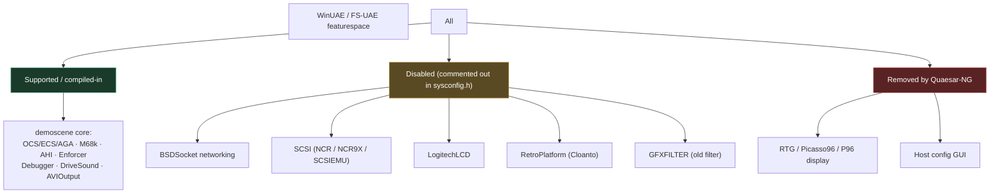
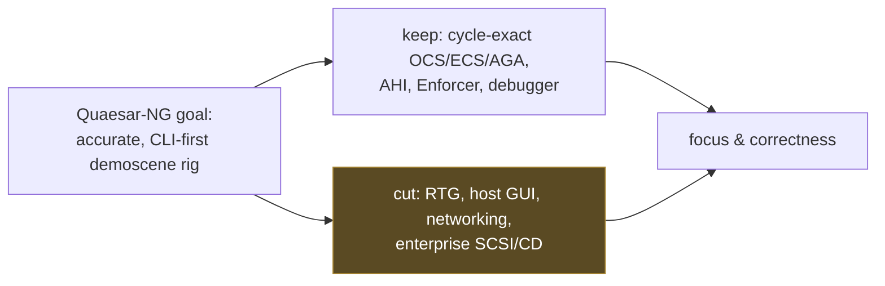

# 18 — Supported, Disabled & Removed Features

← [Testing & CI](17-testing-and-ci.md) · [Index](index.md) · → [Release & Packaging](19-release-packaging.md)

Quaesar-NG is built on WinUAE/FS-UAE cores, but it is deliberately scoped to the
**demoscene A500/A1200** experience. This is the definitive table of what works,
what's compiled-out, and what was removed — so users don't waste time enabling
features that don't exist.

> Authoritative sources: `src/uae_lib_imp/sysconfig.h` (compile switches),
> [`doc/user_guide.md`](../doc/user_guide.md) (narrative & FAQ).

## At a glance

## Feature matrix

### Compiled-in (`#define` in `sysconfig.h`)

| Feature | `sysconfig.h` switch | Status | Notes |
|---------|----------------------|--------|-------|
| Integrated debugger | `DEBUGGER` | ✅ on | WinUAE's built-in `debug()`/console is the escape hatch (see [UAE Backend](05-backend-uae.md)). |
| AHI audio emulation | `AHI` | ✅ on | Higher-quality sound. |
| UAE Enforcer | `ENFORCER` | ✅ on | Halts on illegal memory access with a stack dump — essential for catching bad pointers in demos. |
| AVIOutput | `AVIOUTPUT` | ✅ on | Capture video/audio to AVI. |
| Drive sound | `DRIVESOUND` | ✅ on | Mechanical floppy seek sounds. |

### Disabled (commented `// #define` in `sysconfig.h`)

These exist in the source but are compiled out. Re-enabling requires editing
`sysconfig.h` and rebuilding.

| Feature | Switch | Default | Notes |
|---------|--------|---------|-------|
| BSDSocket networking | `BSDSOCKET` | ❌ off | `bsdsocket.library` host-network bridge. Off by default; see [`doc/bsdsocket_integration_plan.md`](../doc/bsdsocket_integration_plan.md). Use `-s bsdsocket_emu=true` only after enabling it at build time. |
| SCSI device emulation | `SCSIEMU` | ❌ off | uaescsi.device. |
| NCR 53C710/53C770 SCSI | `NCR` | ❌ off | A4000T / A4091. |
| NCR 53C9X SCSI | `NCR9X` | ❌ off | 53C9X-family SCSI. |
| Logitech G15 LCD | `LOGITECHLCD` | ❌ off | Status display for the old G15 keyboard. |
| Cloanto RetroPlayer | `RETROPLATFORM` | ❌ off | Cloanto-specific hooks. |
| GFX filter | `GFXFILTER` | ❌ off | Legacy scaling-filter path. |

### Removed / out of scope (Quaesar-NG design choices)

| Area | Removed? | Why |
|------|----------|-----|
| RTG / Picasso96 / P96 graphics | Removed | Out of scope — demoscene is native chipset. (Documented in [`doc/user_guide.md`](../doc/user_guide.md) FAQ.) |
| Host configuration GUI | Removed | Quaesar-NG is CLI-first; configuration is via `-s` (see [CLI Reference](13-cli-reference.md)). |
| JIT (dynarec) on non-x86 | Not enabled on ARM64 macOS | Cycle-exact M68k is the priority for demoscene accuracy. |

## Machine / chipset coverage

| Target | Default config? | Quality |
|--------|-----------------|---------|
| **A500** (OCS, 68000, 512K chip + 512K slow) | ✅ the zero-config default | First-class |
| A500+ / A600 (ECS) | via `-s chipset=ecs` or `quickstart=A600,0` | Supported |
| **A1200** (AGA, 68020) | via `-s quickstart=A1200,0` | First-class |
| A4000 (68040, Zorro III) | via `-s quickstart=A4000,0` | Best-effort |
| CD32 | via `-s quickstart=CD32,0` | Best-effort |

See [CLI Reference § Recipes](13-cli-reference.md#recipes) for exact invocations.

## Why the scope exists

The cuts are deliberate: every removed feature is one less source of timing
jitter and one less surface to maintain. If you need Picasso96 RTG or full SCSI,
upstream WinUAE/FS-UAE is the right tool.

---

← [Testing & CI](17-testing-and-ci.md) · [Index](index.md) · → [Release & Packaging](19-release-packaging.md)
