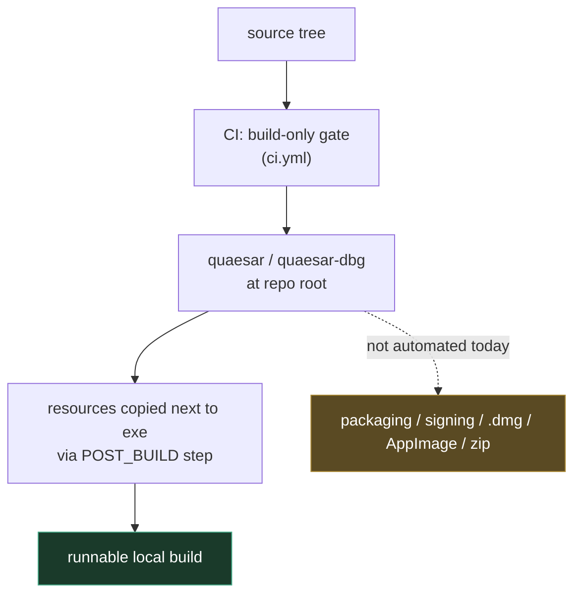
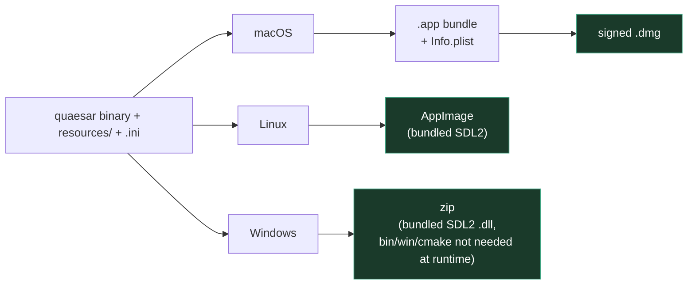
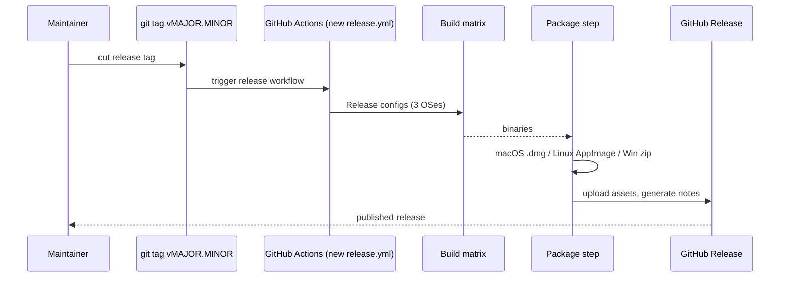

# 19 — Release & Packaging

← [Feature Matrix](18-feature-matrix.md) · [Index](index.md)

What "a release" currently means in Quaesar-NG, and what a packaged, distributable
build entails. This is the most **forward-looking** doc in the set: parts of it
describe what *should* exist rather than what's fully automated today.

## Current state

Key facts (sourced from the [Build System](09-build-system.md) and the CI workflows):

- **CI is a build gate, not a release pipeline.** [.github/workflows/ci.yml](../.github/workflows/ci.yml)
  compiles the full matrix but does **not** produce or upload artifacts.
- **The binary is emitted at the repository root**, not inside `build/`, via
  `RUNTIME_OUTPUT_DIRECTORY`. This is so it sits next to `resources/` and the
  `.ini` layout files.
- **A POST_BUILD step** copies `resources/default_layout.ini` (and embedded
  assets) next to the executable — see the [Build System](09-build-system.md)
  resource-embedding section.
- **Resources are embedded into the binary** at configure time via
  `scripts/cmake/bin2c.cmake` (fonts, icons → byte arrays), so the binary is
  largely self-contained for *assets*.
- **Kickstart ROMs are never bundled** (legal), so a release can never be
  "double-click and it runs" — the user always supplies `-k`.

## What a distributable build needs

| Component | Source | Where it must live |
|-----------|--------|--------------------|
| Executable | build output (`quaesar` / `quaesar.exe`) | root of the bundle |
| ImGui dock layout | `default_layout.ini`, `debugger_layout.ini` (repo root) | next to the exe |
| Bundled resources | embedded via `bin2c.cmake` (fonts, icon, `fa-solid`) | inside the binary |
| Crash handler | built-in (`crashhandler/`) | inside the binary |
| Kickstart ROM | **user-provided** | user's path, passed via `-k` |
| Demo / disk image | **user-provided** | positional arg |

## Per-platform packaging

### macOS

- SDL2 is linked dynamically by default on macOS (`brew install sdl2`). For a
  distributable `.app`, SDL2 must be **bundled inside the Frameworks** dir and
  its install names rewritten (`@rpath/SDL2.framework/...`) with
  `install_name_tool`, or the framework embedded.
- Produce a signed/notarized `.dmg`. There is currently **no signing config** in
  the repo, so this is a manual (or CI-secret) step to add.
- Strip debug symbols for the distribution binary:
  `strip -x quaesar` (keep a `.dSYM` for crash symbolication — the crash handler
  can emit a backtrace).

### Linux

- SDL2 is a shared lib; an AppImage should **bundle SDL2** (or document the
  `libsdl2` dependency) so it runs on minimal distros.
- Build with `-DCMAKE_BUILD_TYPE=Release` (or `RelWithDebInfo` + a separate
  debug-symbol package).
- AppImage via `linuxdeploy` + AppImage plugin is the common path; there is no
  existing recipe in the repo.

### Windows

- SDL2 is **statically vendored** under `external/sdl2/`, and the runtime is
  `/MT` (static CRT) — so the Windows build is already self-contained: no
  redistributable DLLs are needed alongside `quaesar.exe`.
- A `.zip` of `quaesar.exe` + the `.ini` files is sufficient. Optionally add an
  installer (e.g. Inno Setup / WiX) — not present today.

## Suggested release process (if/when automated)

A `release.yml` would (a) trigger on tags, (b) build `Release`/`RelWithDebInfo`
for all three OSes, (c) run the per-platform packaging steps above, (d) upload
the artifacts to a GitHub Release. None of this exists yet — it's the natural
next step once a release is planned.

## Versioning & metadata

- There is **no version macro or generated version header** today. A release
  process should inject `QUAESAR_VERSION` from the git tag (e.g. via
  `configure_file` of a `version.h.in`) so the binary and crash reports can
  report it.
- The app icon (`bin/quaesar.png`) and embedded assets are the only branding
  present; no About-box metadata is wired up yet.

## Checklist before publishing a release

- [ ] All CI jobs green on the release commit (full matrix — see [Testing & CI](17-testing-and-ci.md)).
- [ ] Built and smoke-tested `Release` on macOS, Linux, and Windows.
- [ ] Pause/step/resume and debugger open/close exercised manually on each.
- [ ] `default_layout.ini` present next to the exe (dockspace not empty on first run).
- [ ] SDL2 bundled (macOS/Linux) or statically linked (Windows).
- [ ] Debug symbols archived separately (for crash backtrace symbolication).
- [ ] README / release notes state the Kickstart-ROM requirement and a CLI
      example (point users at the [CLI Reference](13-cli-reference.md)).

---

← [Feature Matrix](18-feature-matrix.md) · [Index](index.md)
